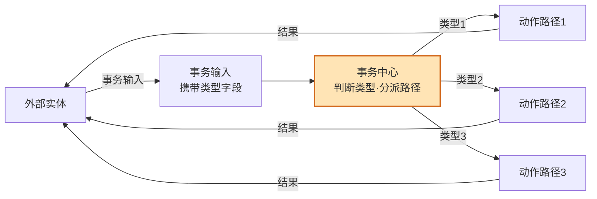
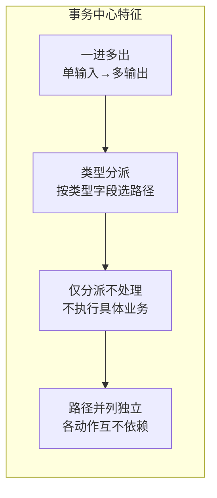
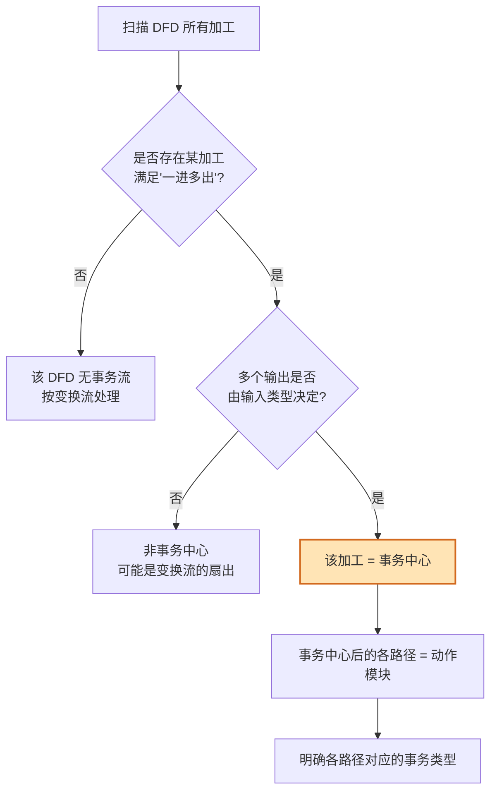
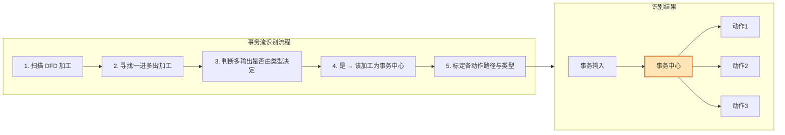
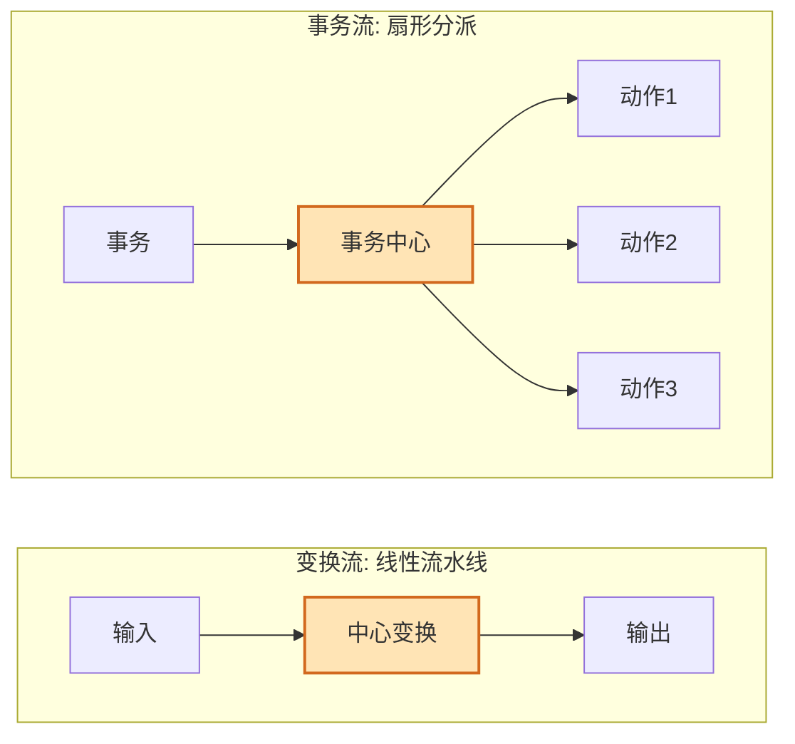

# 5.1 事务流识别与事务中心确定

事务流是结构化设计中与 [[4.1 变换流识别与变换中心确定|变换流]]并列的两种信息流类型。准确识别事务流及其事务中心，是运用 [[5.2 事务流映射步骤与SC生成|事务分析三步法]]生成扇形 SC 的前提。本节深入讲解事务流的定义、事务中心的特征与识别方法，以及事务流与变换流的本质区别。

## 事务流的定义

> [!definition] 事务流
> 事务流（Transaction Flow）是一个事务进入系统后，由事务中心根据事务类型分派到多条不同处理路径的"一进多出"扇形数据流。它由事务输入、事务中心、多条动作路径三部分组成。

事务流的三个组成部分：

| 部分 | 作用 | 特征 |
| --- | --- | --- |
| 事务输入 | 携带事务类型字段的外部输入 | 包含决定路径选择的"类型"信息 |
| 事务中心 | 根据类型字段分派到对应路径 | 一进多出，执行分派逻辑 |
| 动作路径 | 每种类型对应的处理流程 | 多条并列，相互独立 |

> [!note] 事务流的典型场景
> 事务流常见于交互系统、菜单系统、命令处理系统：菜单系统（选择菜单项→分派到对应功能）、命令处理（输入命令→分派到对应处理器）、交易系统（输入交易类型→分派到存款/取款/查询）、权限控制（输入用户角色→分派到不同操作集）。

## 事务中心的特征

> [!definition] 事务中心
> 事务中心（Transaction Center）是事务流中根据输入数据的类型字段，将数据流分派到多条不同动作路径的加工。它是事务流的核心，决定事务流的形态。

事务中心具有以下关键特征：

1. **一进多出**：接收单一输入数据流，产生多个输出数据流。
2. **类型分派**：选择哪条输出路径由输入数据中的"类型"字段决定。
3. **分派逻辑**：事务中心本身只做判断与分派，不执行具体业务处理。
4. **路径独立**：各动作路径相互并列，彼此独立。

> [!tip] 事务中心的判定信号
> 当看到一个加工满足"接收一个输入，却产生多个输出，且选哪条输出由输入的类型决定"时，即可判定为事务中心。其形态像"扇形分派器"或"多路开关"，与变换流的线性流水线明显不同。

## 事务中心识别方法

事务中心的识别比 [[4.1 变换流识别与变换中心确定|变换中心]]更直接——寻找那个根据类型分派的加工：

> [!example] 识别示例：ATM 系统
> 某 ATM 系统 DFD：`输入交易请求 → 交易调度 → [存款/取款/查询/转账]`
> - `交易调度` 接收一个请求，根据 `交易类型` 字段分派到四条路径 → `交易调度` 是事务中心；
> - 动作路径 = `存款`、`取款`、`查询`、`转账`；
> - 事务类型 = 存款、取款、查询、转账。

> [!warning] 区分"事务中心分派"与"变换流扇出"
> 变换流的中心变换有时也会产生多个输出（如一个变换同时产出报表和台账），但这不是"根据类型分派"，而是同一变换的多个结果输出。事务中心的关键在于**根据输入类型选择路径**，每条路径只对应该类型的一种处理。若多个输出并非由类型选择决定，则不是事务中心。

## 事务流识别示意图

将事务流的完整识别过程整合：

## 事务流与变换流的区别

事务流与变换流在形态、识别、映射上有本质区别，识别时需对照判断以选择正确的映射方法：

| 比较维度 | 变换流 | 事务流 |
| --- | --- | --- |
| 数据流形态 | 线性流水线（一进一出） | 一进多出（扇形分派） |
| 核心加工 | 中心变换（实质业务处理） | 事务中心（类型分派） |
| 加工职责 | 执行核心变换 | 仅做判断与分派 |
| 识别方法 | 双向追踪确定边界 | 寻找类型分派加工 |
| 映射方法 | 变换分析（四步法） | 事务分析（三步法） |
| SC 形态 | 三叉树 | 扇形 |
| 典型系统 | 数据处理、统计、转换 | 菜单、命令、交易调度 |

## 小结

事务流呈"事务输入→事务中心→多条动作路径"的"一进多出"扇形分派结构。事务中心的特征是：接收单一输入，根据输入数据的类型字段分派到多条路径，自身仅做判断分派不执行业务处理。识别方法：扫描 DFD 寻找满足"一进多出+类型分派"的加工即为事务中心，其后的各路径为动作模块。事务流与变换流的本质区别在于形态——变换流是线性流水线、事务流是扇形分派，决定了前者用变换分析、后者用事务分析。

## 关联

- 上一级：[[MOC - 第5章]]
- 下一节：[[5.2 事务流映射步骤与SC生成]]
- 关联概念：[[4.1 变换流识别与变换中心确定]]（变换流对照）、[[3.2 变换流识别与事务流识别]]（识别基础）、[[3.1 DFD到SC的映射原理]]（映射总原理）
