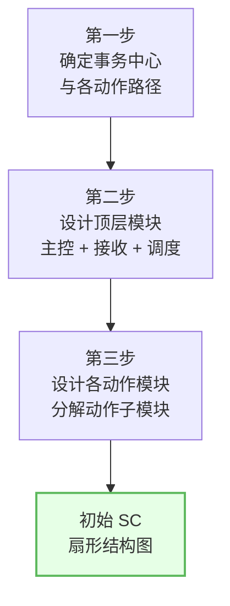
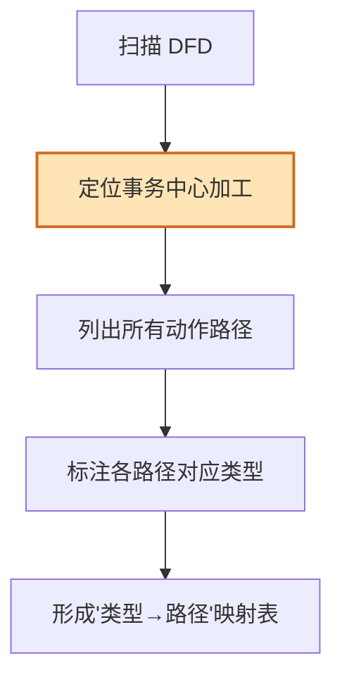
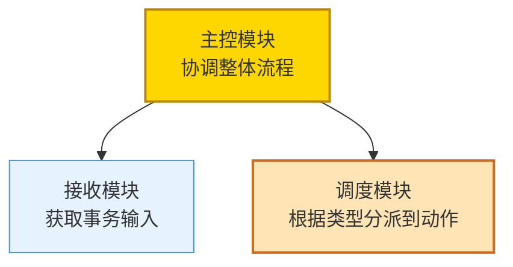
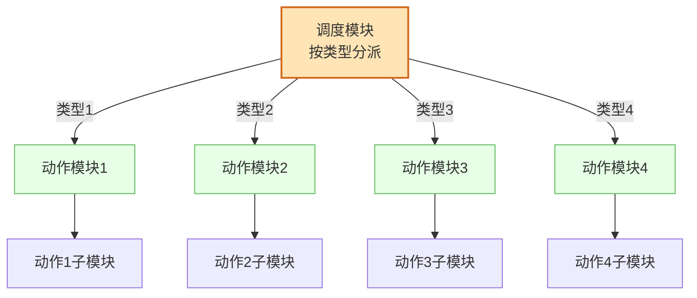
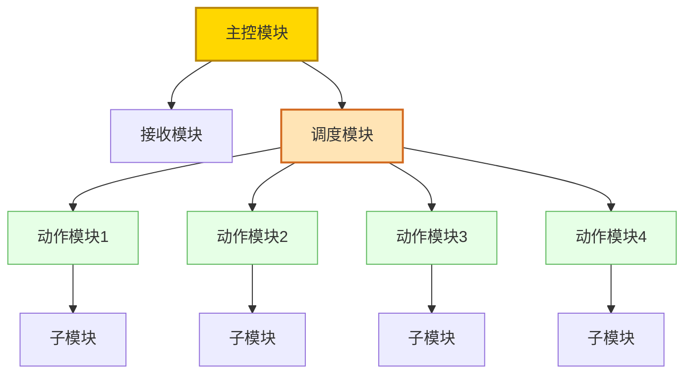
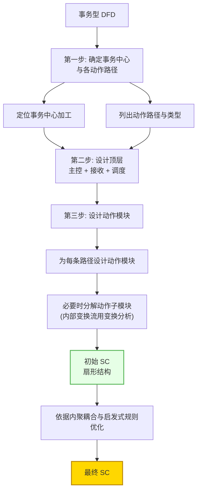

# 5.2 事务流映射步骤与SC生成

在 [[5.1 事务流识别与事务中心确定|识别事务中心与动作路径]]后，需将事务型 DFD 映射为软件结构图（SC）。本节阐述事务分析三步法——从确定事务中心，到设计调度顶层模块，再到分解各动作模块，最终导出扇形初始 SC。与 [[4.2 变换流映射步骤与SC生成|变换分析四步法]]对照，事务分析更简洁但形态不同。

## 事务分析三步法概述

> [!definition] 事务分析
> 事务分析（Transaction Analysis）是把事务型 DFD 映射为事务型软件结构图的方法。它通过三步操作，将事务中心映射为调度模块，将各动作路径映射为并列的动作模块，形成以主控模块为根、调度模块分发到各动作的扇形层次结构。

## 第一步：确定事务中心和各动作路径

运用 [[5.1 事务流识别与事务中心确定|事务中心识别方法]]，明确以下要素：

1. **定位事务中心**：找到根据类型分派的加工。
2. **明确动作路径**：列出事务中心分派的所有路径。
3. **对应事务类型**：每条路径对应的事务类型字段值。

> [!example] 类型→路径映射表
> ATM 系统的事务中心为 `交易调度`，其类型→路径映射：
> | 交易类型 | 动作路径 |
> | --- | --- |
> | 存款 | 存款处理 |
> | 取款 | 取款处理 |
> | 查询 | 余额查询 |
> | 转账 | 转账处理 |

## 第二步：设计顶层模块

顶层模块包含主控模块及其直接下属——接收模块与调度模块：

| 顶层模块 | 职责 | 对应 DFD 部分 |
| --- | --- | --- |
| 主控模块 | 协调接收与调度，控制整体流程 | 整个事务流 |
| 接收模块 | 获取并传递事务输入 | 事务输入路径 |
| 调度模块 | 根据类型分派到对应动作模块 | 事务中心 |

> [!note] 主控、接收、调度的关系
> 接收模块获取事务输入并传给主控，主控传给调度模块；调度模块根据类型字段判断，调用对应的动作模块；动作模块处理完成后将结果回传，最终经主控输出。调度模块是事务型 SC 的核心，体现"分派"逻辑。

## 第三步：设计中下层动作模块

为每条动作路径设计一个动作模块，必要时分解为子模块：

> [!tip] 动作模块的分解原则
> 每个动作模块应对应一条完整的动作路径。若动作路径内部仍含变换流（线性流水线），可对该动作模块内部用 [[4.2 变换流映射步骤与SC生成|变换分析]]进一步细化为输入-变换-输出三叉树；若内部又含事务流，可递归使用事务分析。这就是 [[3.2 变换流识别与事务流识别|混合型 DFD]]"局部定细节"的体现。

## 完整 SC 结构图生成

将三步整合，得到事务型 SC 的扇形完整结构：

> [!definition] 扇形结构
> 事务型 SC 的特征形态：主控模块下含接收与调度模块，调度模块向下分发到多个并列的动作模块，整体呈"一调度、多动作"的扇形展开，称为扇形结构。

## 事务流映射完整步骤图

将三步法与 SC 生成整合为完整流程：

## 与变换分析的比较

事务分析与变换分析在步骤数、形态和适用场景上不同：

| 比较维度 | 变换分析 | 事务分析 |
| --- | --- | --- |
| 步骤数 | 四步法 | 三步法 |
| 核心操作 | 确定逻辑输入/输出边界 | 确定事务中心与动作路径 |
| 顶层模块 | 主控+输入+变换+输出 | 主控+接收+调度 |
| SC 形态 | 三叉树 | 扇形 |
| 适用 DFD | 线性流水线 | 一进多出分派 |

> [!warning] 初始 SC 需优化
> 与变换分析相同，事务分析得到的也是**初始** SC。调度模块若动作过多会导致扇出过大，动作模块间可能有公共子操作需提取。必须依据 [[6.1 模块分解与合并原则|模块分解原则]]与 [[6.2 结构图优化策略|优化策略]]改进。

## 小结

事务分析三步法将事务型 DFD 映射为扇形 SC：①确定事务中心与各动作路径，明确类型→路径映射；②设计顶层模块——主控模块下分接收模块与调度模块；③为每条动作路径设计动作模块，必要时分解子模块（内部含变换流时用变换分析细化）。所得初始 SC 呈"一调度、多动作"的扇形形态，需再经内聚耦合与启发式规则优化。

## 关联

- 上一级：[[MOC - 第5章]]
- 上一节：[[5.1 事务流识别与事务中心确定]]
- 下一节：[[5.3 事务流设计案例与实践]]
- 关联概念：[[4.2 变换流映射步骤与SC生成]]（变换分析对照）、[[3.1 DFD到SC的映射原理]]（映射总原理）、[[6.1 模块分解与合并原则]]（初始 SC 优化）
