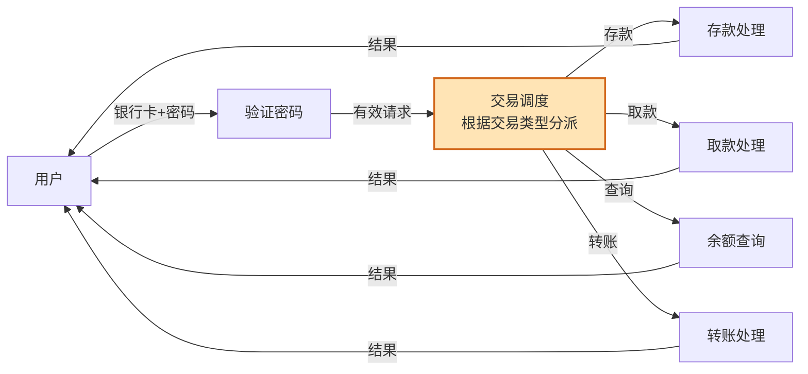
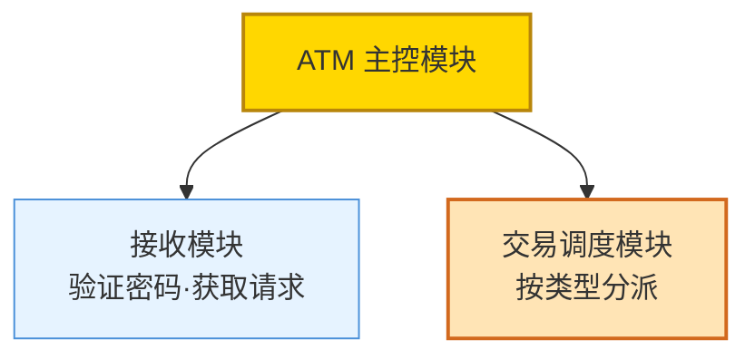
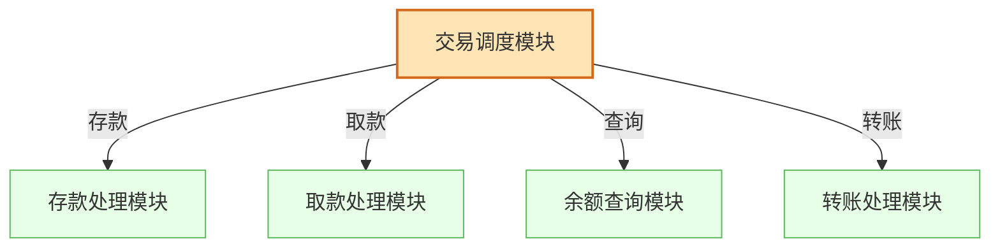
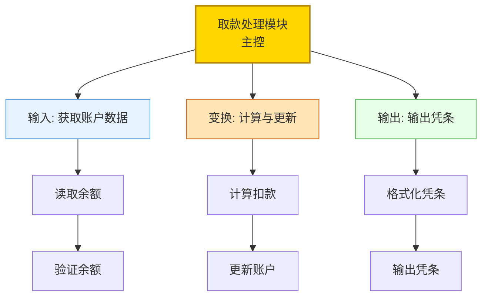
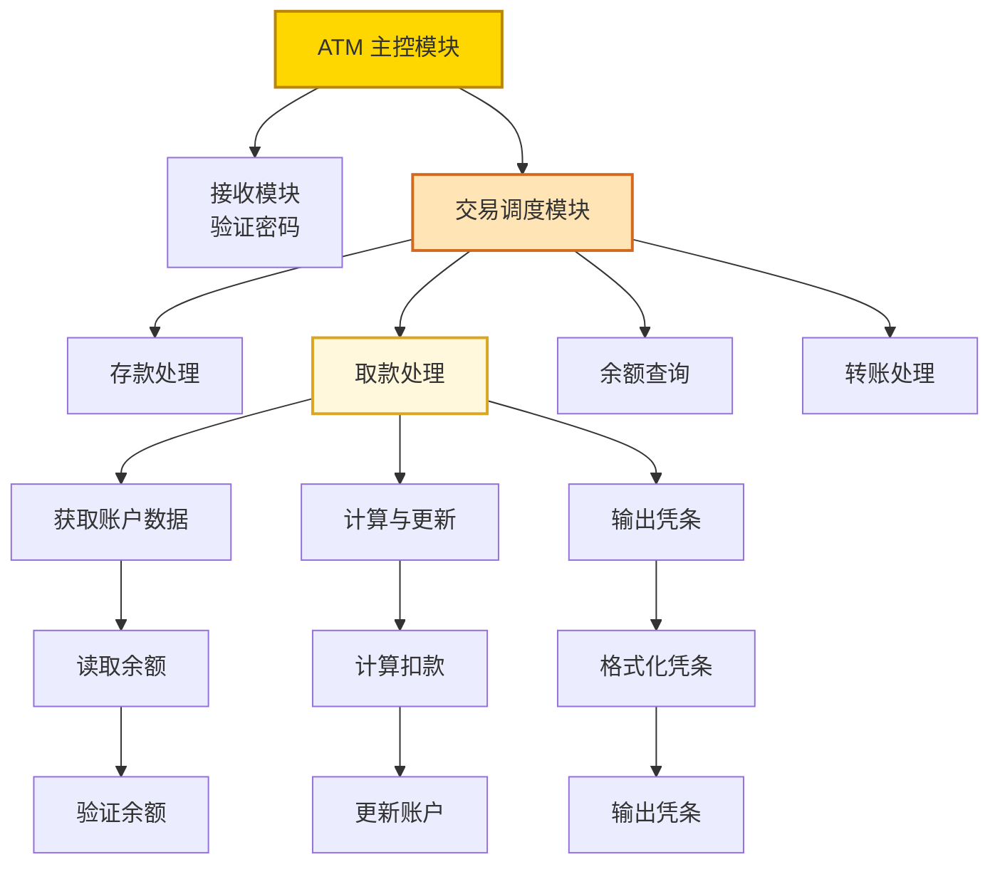
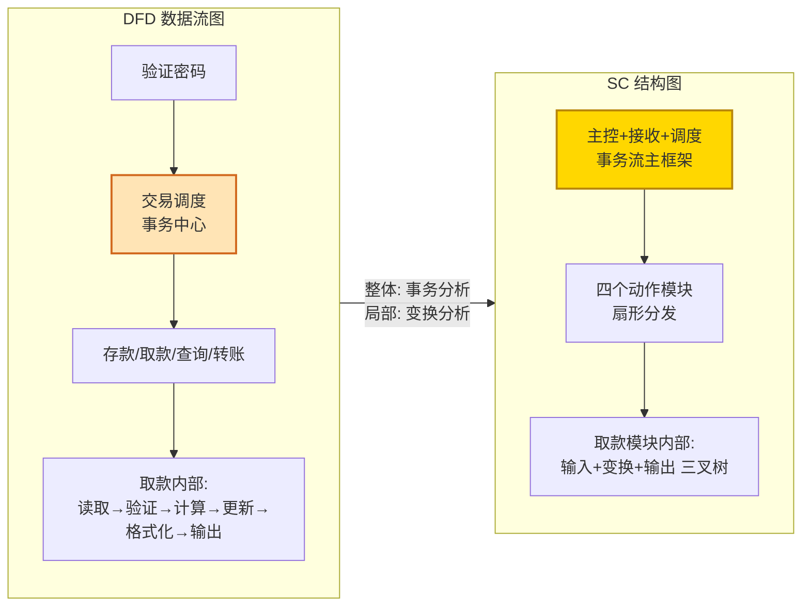

# 5.3 事务流设计案例与实践

本节通过 ATM 取款系统的完整案例，演练事务流设计全流程，并重点处理事务流与变换流组合的混合型 DFD。案例覆盖 [[5.1 事务流识别与事务中心确定|事务中心识别]]、[[5.2 事务流映射步骤与SC生成|三步法映射]]、混合型 DFD 的"整体定框架、局部定细节"处理，是对本章知识的综合应用。

## 案例背景

> [!example] ATM 取款系统
> 某 ATM 系统：用户插入银行卡并输入密码验证后，选择交易类型（存款/取款/查询/转账）。系统根据交易类型分派到对应处理流程。其中"取款"处理流程为：读取账户余额→计算取款（验证余额、扣减余额）→更新账户→输出凭条，呈线性流水线。

该系统整体为事务流（交易调度分派），其中取款路径内部为变换流，是典型的混合型 DFD。

## 第一步：DFD 分析与事务中心识别

### 系统 DFD

### 事务中心识别

运用 [[5.1 事务流识别与事务中心确定|事务中心识别方法]]：

- `交易调度` 接收一个有效请求，根据 `交易类型` 分派到四条路径 → `交易调度` 是事务中心；
- 动作路径 = `存款处理`、`取款处理`、`余额查询`、`转账处理`；
- 事务类型 = 存款、取款、查询、转账。

| 交易类型 | 动作路径 |
| --- | --- |
| 存款 | 存款处理 |
| 取款 | 取款处理 |
| 查询 | 余额查询 |
| 转账 | 转账处理 |

## 第二步：设计顶层模块

整体为事务流，用事务分析建立主框架——主控模块下分接收模块与调度模块：

## 第三步：设计各动作模块

调度模块分发到四个动作模块：

## 混合型 DFD 处理：取款路径的变换流细化

取款路径内部呈"输入→变换→输出"线性流水线，需用 [[4.2 变换流映射步骤与SC生成|变换分析]]对该动作模块内部细化。这是"整体定框架（事务流）、局部定细节（变换流）"的体现。

### 取款路径 DFD 分析

### 取款路径三段识别

运用 [[4.1 变换流识别与变换中心确定|双向追踪法]]：

| 段 | 加工 | 判定依据 |
| --- | --- | --- |
| 传入路径 | 读取账户余额、验证余额 | 纯输入：读取与校验 |
| 中心变换 | 计算扣款、更新账户 | 实质变换：扣减与更新 |
| 传出路径 | 格式化凭条、输出凭条 | 纯输出：格式化与输出 |

- 逻辑输入 = 有效数据（验证后的账户数据）；
- 逻辑输出 = 新余额（更新后的取款信息）；
- 变换中心 = `计算扣款` + `更新账户`。

### 取款模块内部 SC 细化

将取款处理模块用变换分析展开为三叉树：

## 完整 SC 结构图

将事务流主框架与取款路径变换流细化合并，得到 ATM 系统完整 SC：

> [!note] 混合型 DFD 的处理策略
> 本案例整体为事务流，用事务分析建立主框架（调度-多动作扇形）；取款动作内部为变换流，用变换分析细化（输入-变换-输出三叉树）。这正是"整体定框架、局部定细节"原则的应用：先按整体形态建主结构，再对各局部按其实际流类型分别细化。

## DFD→SC 完整转换图集

## 设计验证

> [!check] 验证检查清单
> 1. **事务中心正确**：`交易调度` 满足"一进多出+类型分派"，确为事务中心。✓
> 2. **动作路径完整**：四条路径覆盖存款、取款、查询、转账全部类型。✓
> 3. **混合处理正确**：整体用事务分析建框架，取款局部用变换分析细化，符合"整体定框架、局部定细节"。✓
> 4. **变换中心边界**：取款路径逻辑输入为"有效数据"、逻辑输出为"新余额"，变换中心为计算扣款+更新账户。✓
> 5. **模块独立性**：各动作模块功能单一；取款内部三分支内聚度高、耦合度低。✓

> [!warning] 待优化项
> - 调度模块扇出为 4（四个动作），若动作类型更多需考虑分组以控制扇出。
> - 存款、转账路径内部可能也含变换流，应同样细化。
> - 各动作可能有公共子操作（如"更新账户"在存款、取款、转账中都出现），可提取为公共模块提高扇入。这些优化属 [[MOC - 第6章|第6章]]范畴。

## 小结

ATM 取款系统案例完整演练了事务流设计及混合型 DFD 处理：整体识别为事务流（交易调度为事务中心，分派到存款/取款/查询/转账四条动作路径），用事务分析三步法建立扇形主框架；取款动作内部呈变换流线性流水线，用变换分析四步法细化为输入-变换-输出三叉树。案例体现了"整体定框架、局部定细节"的混合型 DFD 处理原则，所得初始 SC 经验证后可进入优化阶段。

## 关联

- 上一级：[[MOC - 第5章]]
- 上一节：[[5.2 事务流映射步骤与SC生成]]
- 关联概念：[[5.1 事务流识别与事务中心确定]]（识别方法）、[[4.3 变换流设计案例与实践]]（变换流案例对照）、[[3.2 变换流识别与事务流识别]]（混合型 DFD 基础）、[[6.1 模块分解与合并原则]]（后续优化）
