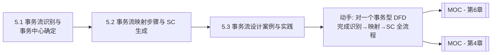

# MOC - 第5章 事务流设计方法

> [!info] 本章定位
> 第5章深入展开结构化设计中的第二种映射方法——事务分析。与 [[MOC - 第4章|第4章变换流]]的线性流水线不同，事务流呈"一进多出"的分派结构。本章在 [[3.2 变换流识别与事务流识别|事务流识别]]基础上，系统讲解事务中心的识别、事务分析三步法（确定事务中心→设计调度顶层→分解动作模块），并通过 ATM 取款系统案例演练含混合型 DFD（事务流+变换流组合）的完整设计。所得初始 SC 同样需依据 [[MOC - 第6章|第6章优化原则]]改进。

## 学习路线图

## 知识点导航

| 节 | 主题 | 核心要点 | 入口 |
| --- | --- | --- | --- |
| 5.1 | 事务流识别与事务中心确定 | 事务流定义、事务中心特征与识别、与变换流区别 | [[5.1 事务流识别与事务中心确定]] |
| 5.2 | 事务流映射步骤与 SC 生成 | 事务分析三步法、调度模块分发、扇形 SC 生成 | [[5.2 事务流映射步骤与SC生成]] |
| 5.3 | 事务流设计案例与实践 | ATM 取款系统 DFD 分析、混合型 DFD 处理、SC 生成 | [[5.3 事务流设计案例与实践]] |

## 核心考点

> [!warning] 重点掌握
> 1. 事务流的定义：事务输入→事务中心→多条动作路径的"一进多出"分派结构。
> 2. 事务中心的特征：根据输入值的类型选择执行路径，表现为"一进多出+类型分派"。
> 3. 事务中心识别方法：寻找根据输入类型将数据流分派到多条路径的加工。
> 4. 事务分析三步法：①确定事务中心和各动作路径；②设计顶层模块（主控+接收+调度）；③设计各动作模块。
> 5. 事务型 SC 的扇形形态：调度模块分发到各并列动作模块。
> 6. 混合型 DFD 的处理：事务流+变换流组合时"整体定框架、局部定细节"。

## 自测题

> [!question] 题1
> 什么是事务流？事务中心有什么特征？如何识别事务中心？
> > [!check]- 参考答案
> > 事务流（Transaction Flow）是一个事务进入系统后，由事务中心根据事务类型分派到多条不同处理路径的"一进多出"扇形数据流。事务中心的特征是：接收一个输入数据流，根据输入数据中的"类型"字段选择执行路径，产生多个输出数据流，表现为"一进多出+类型分派"。识别方法：扫描 DFD 所有加工，寻找满足"一进多出+类型分派"特征的加工——即一个加工接收单一输入，却根据输入类型产生多个不同输出路径，该加工即为事务中心，其后的各路径即为动作模块。

> [!question] 题2
> 简述事务分析三步法，并说明事务型 SC 的形态特征。
> > [!check]- 参考答案
> > 事务分析三步法：①**确定事务中心和各动作路径**——识别事务中心，明确它分派的所有动作路径及对应事务类型；②**设计顶层模块**——建立主控模块，其下包含接收模块（获取并传递事务输入）与调度模块（根据事务类型分派到对应动作模块）；③**设计中下层动作模块**——为每条动作路径设计一个动作模块，必要时分解为子模块。事务型 SC 的形态呈扇形：调度模块位于中心，向下分发到多个并列的动作模块，每个动作模块对应一种事务类型的处理路径。

> [!question] 题3
> 对比变换流与事务流在数据流形态、映射方法和 SC 结构上的差异。
> > [!check]- 参考答案
> > ①数据流形态：变换流是"输入→变换→输出"的线性流水线（一进一出）；事务流是"事务→事务中心→多动作"的分派结构（一进多出）。②映射方法：变换流用变换分析（四步法，确定逻辑输入/输出边界）；事务流用事务分析（三步法，确定事务中心与动作路径）。③SC 结构：变换型呈三叉树（主控下分输入、变换、输出三分支）；事务型呈扇形（调度模块下并列多个动作模块）。④典型系统：变换流适于数据处理、统计；事务流适于菜单、命令、交易调度。

> [!question] 题4
> 一个系统的 DFD 同时包含事务流和变换流，应如何映射？
> > [!check]- 参考答案
> > 对混合型 DFD 遵循"整体定框架、局部定细节"原则：先识别整体形态——若整体为事务流（存在明显的事务中心分派），则用事务分析建立主框架（调度-多动作扇形），对其中的变换流局部（某动作路径内部呈线性流水线）用变换分析细化（将该动作模块内部展开为输入-变换-输出三叉树）；若整体为变换流，则用变换分析建框架，对局部事务流用事务分析细化。原则是对不同部分分别采用对应映射方法，最后统一优化初始 SC。详见 [[3.2 变换流识别与事务流识别|混合型 DFD 处理]]。

## 章节导航

- 上一级：[[MOC - 结构化软件设计]]
- 上一章：[[MOC - 第4章]]（变换流设计方法）
- 下一章：[[MOC - 第6章]]（软件结构图优化原则）
- 关联：[[3.2 变换流识别与事务流识别]]（事务流识别基础）、[[MOC - 第4章]]（变换流对照）
