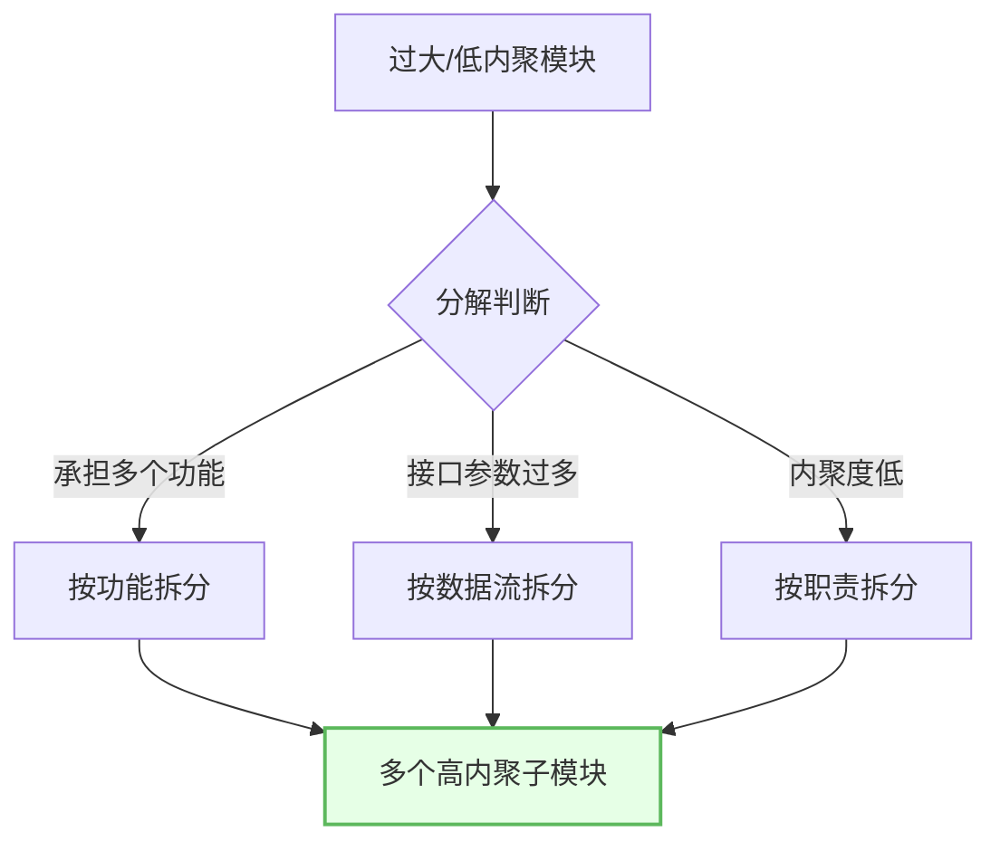
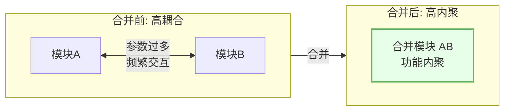
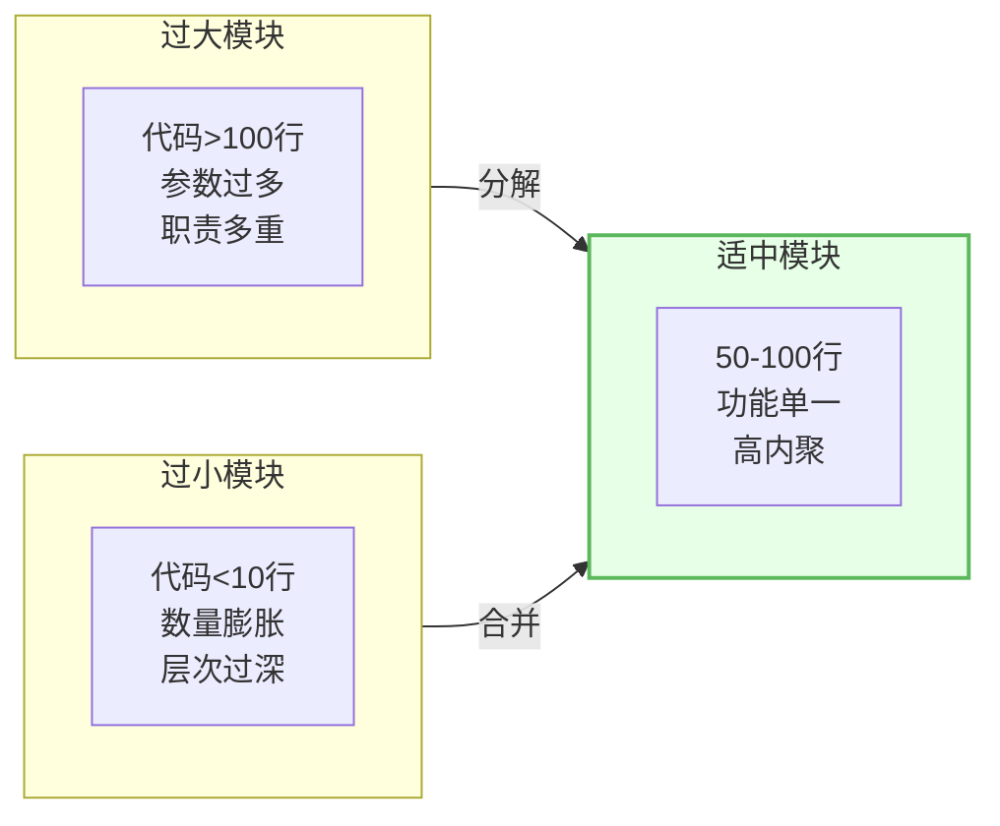
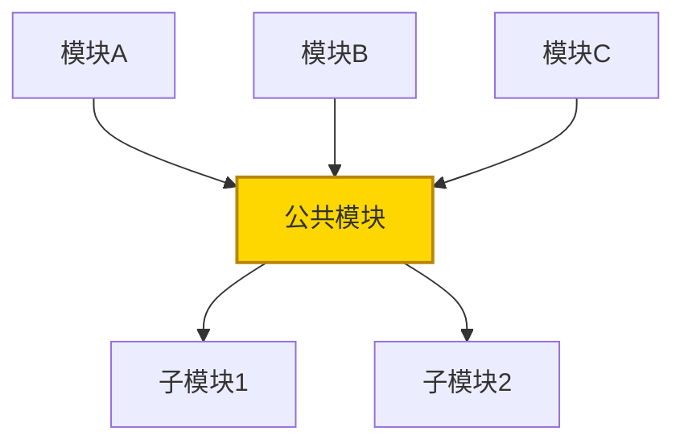
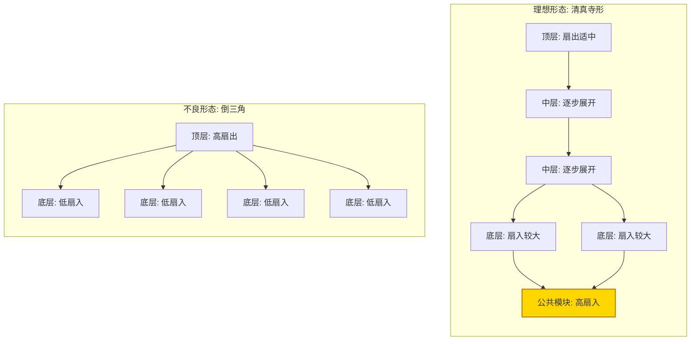
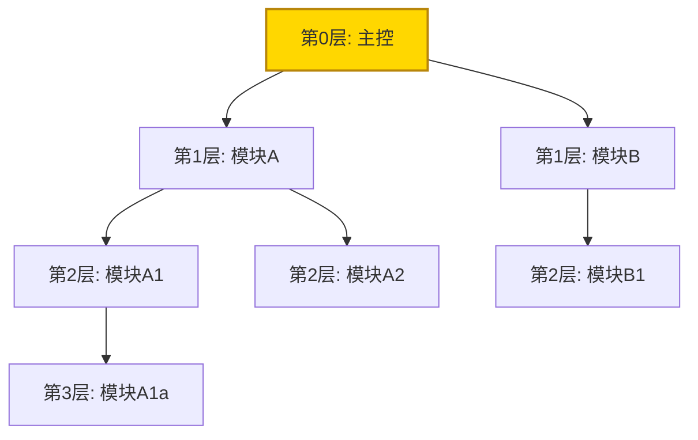
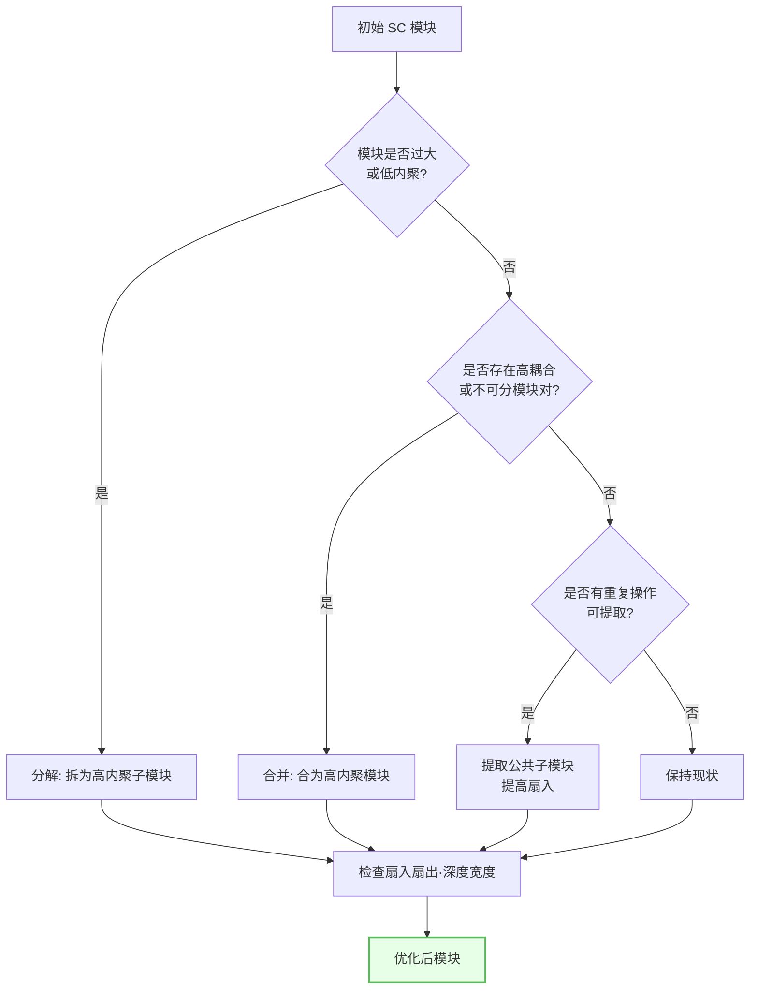

# 6.1 模块分解与合并原则

从 [[MOC - 第4章|变换流]]和 [[MOC - 第5章|事务流]]映射得到的初始 SC，需依据 [[MOC - 第2章|高内聚低耦合准则]]进行模块分解与合并优化。本节讲解模块分解原则、模块大小控制、扇入扇出调节、深度宽度平衡等结构图优化的基础原则，为 [[6.2 结构图优化策略|优化策略]]提供判据。

## 模块分解原则

> [!definition] 模块分解
> 模块分解是把一个过大或低内聚的模块拆分为多个较小、功能单一的子模块的过程，目标是使每个模块完成一个明确功能、达到高内聚，并简化模块间接口。

模块分解遵循以下原则：

1. **功能分解**：按功能职责划分，每个子模块完成一个明确功能。
2. **接口简化**：分解后子模块间接口应清晰、参数少、数据耦合为主。
3. **保持内聚**：分解后每个子模块应达到功能内聚或顺序内聚，避免偶然内聚。
4. **降低耦合**：分解不应引入新的高耦合（如控制耦合、公共耦合）。

> [!tip] 分解的判据
> 当一个模块满足以下任一条件时应考虑分解：①代码过长（超过 50-100 行参考）；②承担多个不相关功能（低内聚）；③接口参数过多（超过 5 个参考）；④圈复杂度过高。分解的终点是每个模块"完成一个且仅一个明确功能"。

## 模块合并原则

> [!definition] 模块合并
> 模块合并是把两个或多个耦合过强或功能紧密相关的模块合并为一个模块的过程，目标是减少模块间过度交互、消除碎片化结构。

模块合并遵循以下原则：

1. **高耦合合并**：两模块间数据耦合参数过多或频繁交互，合并可提高内聚。
2. **功能紧密相关**：两模块功能不可分割（如"读取"与"校验"总是成对出现），合并合理。
3. **消除冗余调用**：合并后减少不必要的调用层次。
4. **保持单一职责**：合并后模块仍应保持合理的内聚度，不可为合并而合并。

> [!warning] 合并的边界
> 合并不可滥用——只有当两模块确实耦合过强或功能不可分割时才合并。若两模块功能独立、耦合适中，强行合并反而降低内聚、增大模块体积。

## 模块大小控制

模块大小是结构图质量的重要指标：

| 指标 | 参考范围 | 说明 |
| --- | --- | --- |
| 代码行数 | 50-100 行 | 单模块代码不宜过长，亦不宜过短 |
| 圈复杂度 | ≤10 | 模块内分支/循环复杂度 |
| 接口参数 | ≤5 | 参数过多表明职责过重 |

> [!note] 大小控制的平衡
> 模块过大导致理解、测试、维护困难；模块过小导致数量膨胀、调用开销增大、结构碎片化。控制大小的本质是"功能完整与体积适中"的平衡，而非机械套用行数指标。

## 模块扇入与扇出

> [!definition] 扇入与扇出
> - **扇入（Fan-in）**：一个模块被多少个上级模块调用。扇入大表示该模块被多处复用，复用性好。
> - **扇出（Fan-out）**：一个模块调用多少个下级模块。扇出小表示控制范围合理、模块不过于复杂。

> [!note] 上图中
> `公共模块` 的扇入 = 3（被 A、B、C 三个模块调用），复用性好；扇出 = 2（调用 S1、S2），控制范围合理。

扇入扇出的设计原则：

| 原则 | 说明 | 理由 |
| --- | --- | --- |
| 增大底层扇入 | 公共操作提取为高扇入模块 | 提高复用、消除重复 |
| 控制顶层扇出 | 顶层扇出适中（一般≤7） | 避免控制过宽、模块过复杂 |
| 避免高扇出低扇入 | 顶层扇出大、底层扇入小 | 不良结构，难维护 |
| 适当中间层扇出 | 中间层逐步展开 | 形成清真寺形 |

## 模块深度与宽度

> [!definition] 深度与宽度
> - **深度（Depth）**：SC 中模块层次的层数，从主控模块到最底层模块的层数。
> - **宽度（Width）**：SC 中同一层次模块数的最大值。

> [!note] 上图中
> 深度 = 4（第0到第3层）；宽度 = 3（第2层有 A1、A2、B1 三个模块，为最大值）。

深度与宽度的设计原则：

| 原则 | 说明 | 理由 |
| --- | --- | --- |
| 层次不宜过深 | 深度过大需过多调用，效率低、理解难 | 调用链长、维护困难 |
| 宽度不宜过大 | 宽度过大表明同层模块过多 | 可能扇出过大、结构松散 |
| 深宽协调 | 深度与宽度应协调 | 形成"金字塔"或"清真寺"形 |

> [!tip] 作用范围与控制范围
> 模块的**作用范围**指受该模块内判定影响的模块集合；**控制范围**指该模块及其所有下属模块。设计原则：作用范围应是控制范围的子集，且受判定影响的模块尽量靠近判定模块，避免控制耦合跨层传递。

## 模块分解与合并示意图

将分解与合并整合为完整决策流程：

## 小结

模块分解与合并是结构图优化的基础：分解针对过大或低内聚模块，按功能拆分为高内聚子模块并简化接口；合并针对高耦合或功能不可分的模块对，合为高内聚模块减少过度交互。模块大小控制在 50-100 行参考。扇入大表示复用好、扇出小表示控制合理，理想形态是"顶层扇出适中、底层扇入较大"的清真寺形。深度不宜过深、宽度不宜过大，且作用范围应是控制范围的子集。这些原则为 [[6.2 结构图优化策略|具体优化策略]]提供判据。

## 关联

- 上一级：[[MOC - 第6章]]
- 下一节：[[6.2 结构图优化策略]]
- 关联概念：[[2.3 内聚耦合综合判定与设计实践]]（内聚耦合判定的理论依据）、[[4.2 变换流映射步骤与SC生成]]（初始 SC 来源）、[[5.2 事务流映射步骤与SC生成]]（初始 SC 来源）
