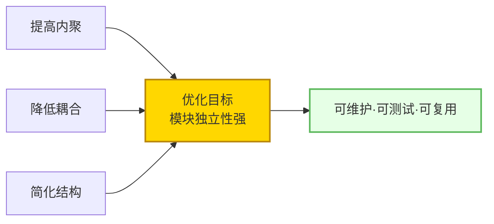
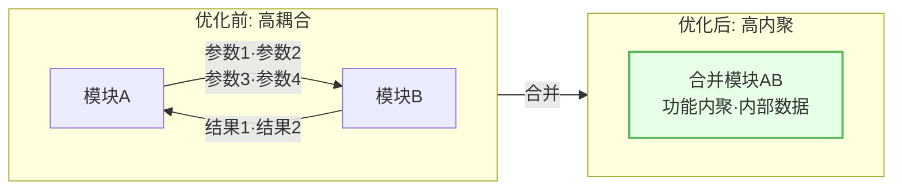
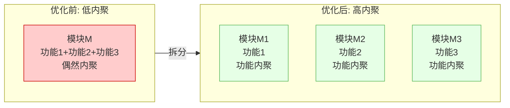
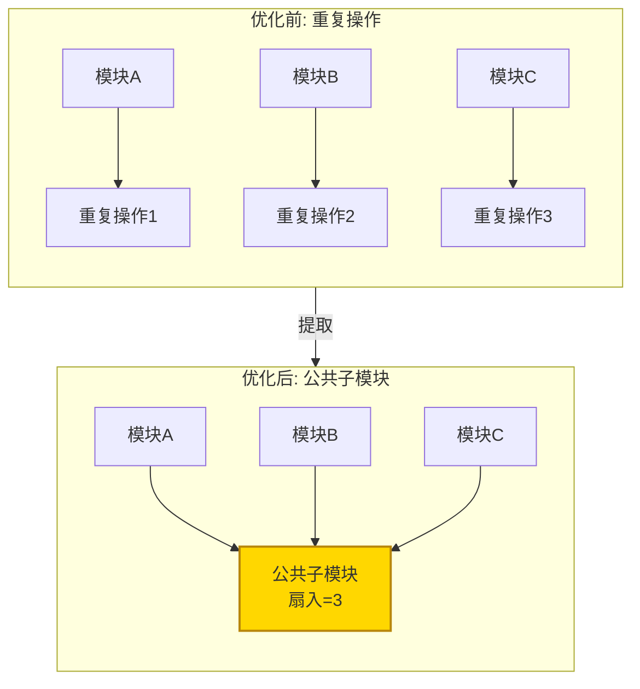
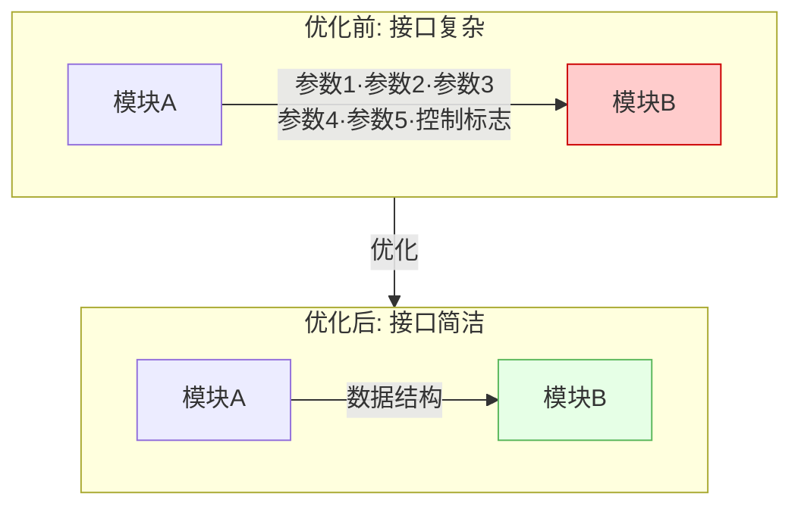
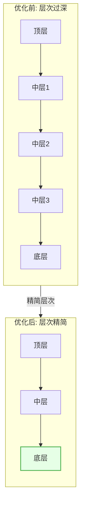
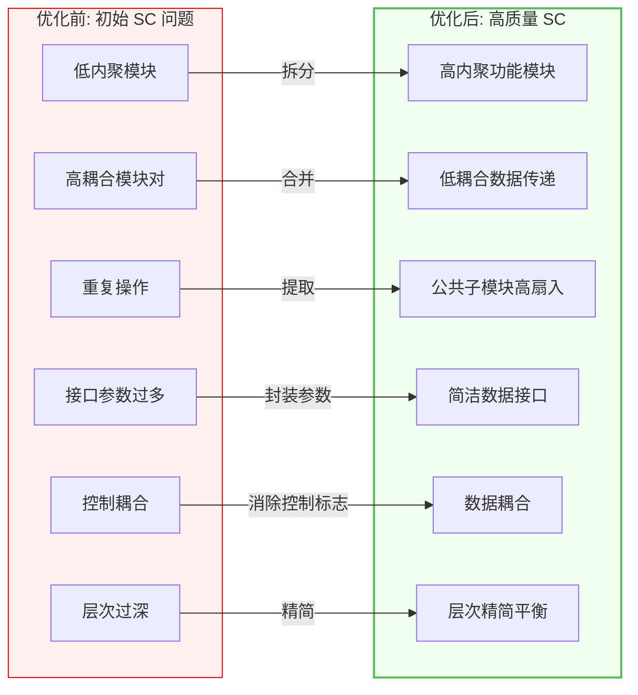
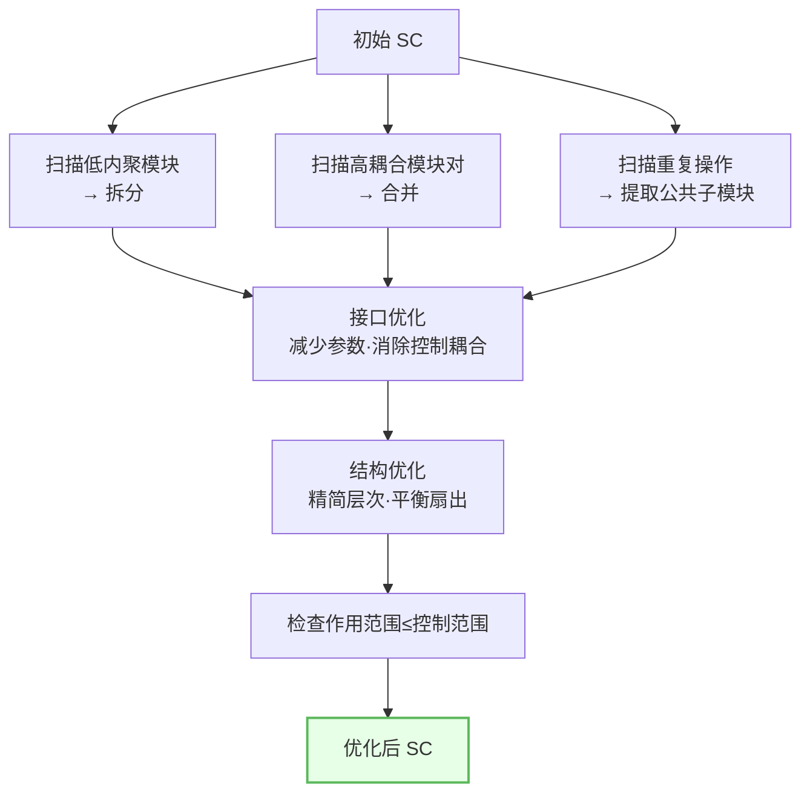

# 6.2 结构图优化策略

在 [[6.1 模块分解与合并原则|分解合并原则]]的指导下，本节阐述结构图的具体优化策略：合并高耦合模块、拆分低内聚模块、提取公共子模块、接口优化与结构优化。目标是提高内聚、降低耦合、简化结构，把 [[MOC - 第4章|变换流]]和 [[MOC - 第5章|事务流]]得到的初始 SC 改进为高质量模块结构。

## 优化目标

> [!definition] 结构图优化目标
> 结构图优化的核心目标是提高内聚、降低耦合、简化结构，使每个模块独立性最强、整体结构最清晰。具体体现为：模块功能单一（高内聚）、模块间依赖最弱（低耦合）、层次与扇出合理、接口简洁。

| 优化维度 | 目标 | 手段 |
| --- | --- | --- |
| 内聚 | 提高到功能内聚 | 拆分低内聚模块 |
| 耦合 | 降到数据耦合 | 消除控制/公共耦合 |
| 接口 | 参数少而清晰 | 减少参数、消除控制标志 |
| 结构 | 层次扇出合理 | 减少层次、平衡扇出 |

## 优化手法

### 合并高耦合模块

当两模块间数据耦合参数过多或频繁交互时，合并为一个高内聚模块：

> [!tip] 合并判据
> 当两模块间传递的参数超过 5 个、或存在双向频繁数据交换、或总是成对调用不可分离时，合并为单一模块通常能提高内聚并消除接口复杂度。

### 拆分低内聚模块

当一个模块承担多个不相关功能（偶然内聚或逻辑内聚）时，拆分为多个功能内聚模块：

### 提取公共子模块

多个模块中存在重复操作时，提取为公共子模块以提高扇入与复用：

> [!example] 提取示例
> 在 [[5.3 事务流设计案例与实践|ATM 案例]]中，存款、取款、转账都需"更新账户"操作，可提取为公共子模块 `更新账户`，扇入为 3，消除三处重复实现。

## 接口优化

接口优化降低模块间耦合强度：

接口优化要点：

| 优化项 | 方法 | 效果 |
| --- | --- | --- |
| 减少参数数量 | 将相关参数封装为数据结构 | 接口简洁 |
| 消除控制耦合 | 将控制标志改为数据传递 | 降到数据耦合 |
| 消除冗余参数 | 删除未使用或可推导的参数 | 接口清晰 |
| 统一数据格式 | 参数采用系统内部标准格式 | 减少格式转换 |

> [!warning] 控制耦合的危害
> 控制耦合指一个模块通过参数传递控制标志（如"标志位=1 执行 A，=2 执行 B"）影响另一模块的执行逻辑。它使被调用模块依赖于调用者的决策，违反模块独立性，应消除——将控制逻辑移入被调用模块内部，或拆分为独立模块。

## 结构优化

结构优化调整整体层次与扇出：

结构优化要点：

1. **减少层次**：合并仅做中转的"透传"模块，缩短调用链。
2. **平衡扇出**：扇出过大的模块分组为子树，扇出过小的合并。
3. **调整作用范围**：使受判定影响的模块靠近判定模块。
4. **增加底层扇入**：提取公共操作提高复用。

## 优化前后对比图

将各类优化整合为完整对比：

## 优化流程

## 小结

结构图优化以提高内聚、降低耦合、简化结构为目标。主要手法：合并高耦合模块为高内聚模块、拆分低内聚模块为功能内聚模块、提取重复操作为高扇入公共子模块；接口优化通过减少参数、消除控制耦合降到数据耦合；结构优化通过精简层次、平衡扇出、调整作用范围改善整体形态。优化后模块独立性强、结构清晰，经 [[6.3 设计评审与质量度量|设计评审]]验证方可定稿。

## 关联

- 上一级：[[MOC - 第6章]]
- 上一节：[[6.1 模块分解与合并原则]]
- 下一节：[[6.3 设计评审与质量度量]]
- 关联概念：[[2.1 内聚类型详解（弱到强）]]（内聚判定）、[[2.2 耦合类型详解（强到弱）]]（耦合判定）、[[4.3 变换流设计案例与实践]]（初始 SC 优化对象）、[[5.3 事务流设计案例与实践]]（初始 SC 优化对象）
