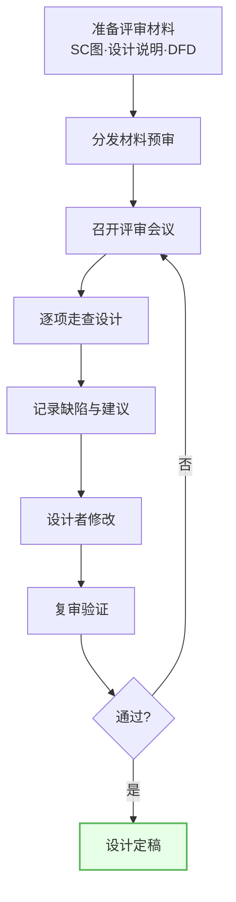
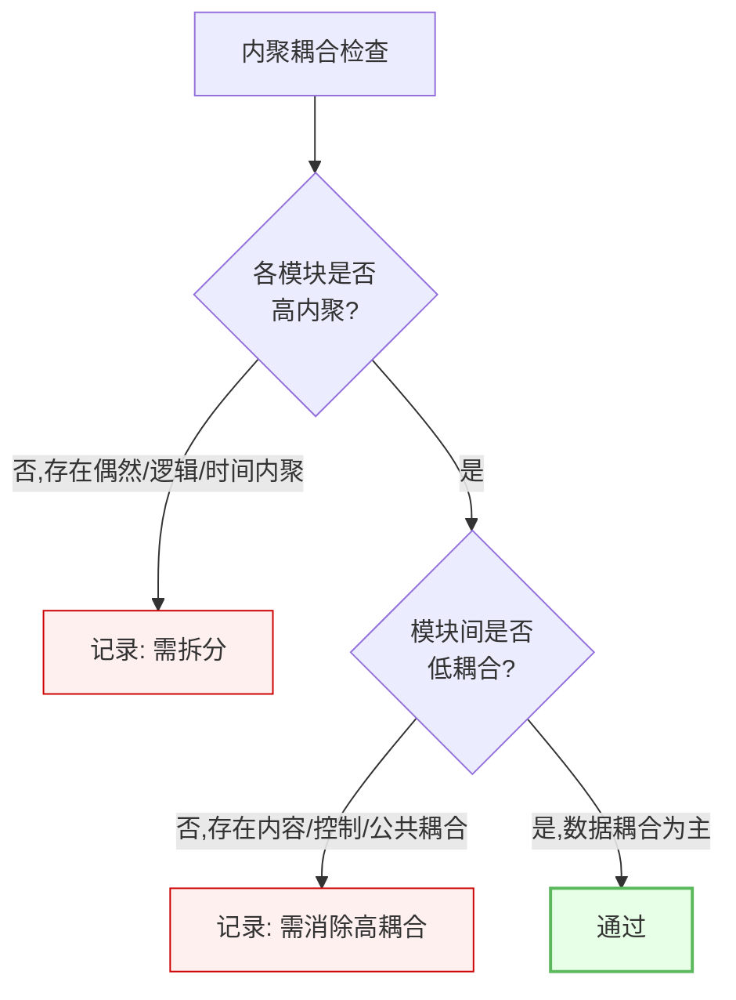
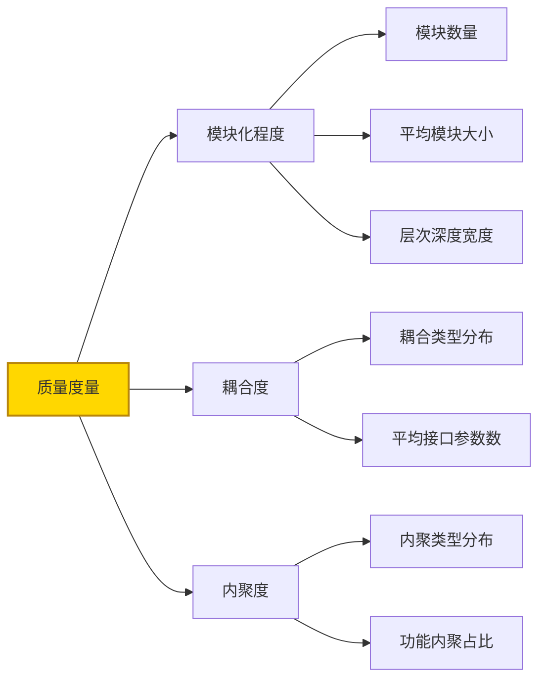
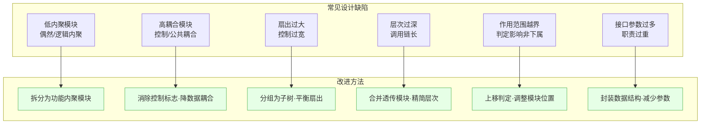
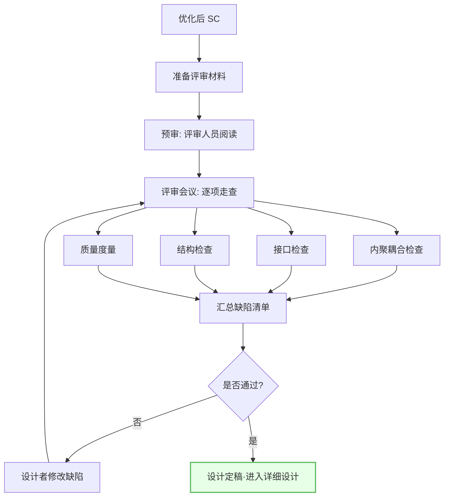

# 6.3 设计评审与质量度量

经过 [[6.1 模块分解与合并原则|分解合并]]与 [[6.2 结构图优化策略|优化策略]]改进的 SC，需通过设计评审验证质量并发现遗留缺陷。本节阐述设计评审的目的与流程、评审检查清单、质量度量指标，以及常见设计缺陷与改进方法，是结构化设计质量保证的收尾环节。

## 设计评审的目的与流程

> [!definition] 设计评审
> 设计评审（Design Review）是由设计人员、评审人员（含开发、测试、需求方代表）对软件设计成果进行结构化审查的活动，目的是在设计阶段尽早发现缺陷、验证设计满足需求、评估设计质量，避免缺陷流入后续阶段造成更大返工成本。

评审流程的关键步骤：

| 步骤 | 内容 | 产出 |
| --- | --- | --- |
| 准备 | 整理 SC、设计说明、DFD 等材料 | 评审包 |
| 预审 | 评审人员提前阅读材料 | 预审意见 |
| 走查 | 会议中逐模块、逐接口检查 | 缺陷记录 |
| 修改 | 设计者按意见修改 | 修改后设计 |
| 复审 | 验证修改是否到位 | 评审结论 |

> [!note] 评审的价值
> 设计阶段发现缺陷的修复成本远低于编码、测试阶段。评审能在投入编码前验证结构合理性、接口一致性、需求覆盖度，是质量前移的关键实践。

## 评审检查清单

评审检查清单是走查的依据，覆盖内聚耦合、接口、结构三个维度：

### 内聚耦合检查

### 接口检查

| 检查项 | 标准 | 缺陷示例 |
| --- | --- | --- |
| 参数数量 | ≤5 个 | 模块传递 8 个参数 |
| 参数类型 | 数据为主 | 传递控制标志 |
| 数据流一致 | 与 DFD 一致 | SC 数据流与 DFD 不符 |
| 冗余参数 | 无未使用参数 | 传递了可推导的参数 |

### 结构检查

| 检查项 | 标准 | 缺陷示例 |
| --- | --- | --- |
| 扇出 | 顶层≤7 | 顶层扇出 12 |
| 层次深度 | 不宜过深 | 深度达 8 层 |
| 扇入 | 底层充分利用 | 公共操作未提取 |
| 作用范围 | ≤控制范围 | 判定影响非下属模块 |

> [!tip] 检查清单使用
> 评审时逐项对照检查清单，对每个模块、每个接口、每层结构打勾或记录缺陷。清单使评审系统化、避免遗漏，是设计质量保证的有效工具。

## 质量度量指标

> [!definition] 质量度量指标
> 设计质量度量是用量化指标评估结构图质量的方法，主要包括模块化程度、耦合度、内聚度三类指标，为设计评审提供客观依据。

| 度量维度 | 指标 | 理想值 |
| --- | --- | --- |
| 模块化程度 | 模块数量、平均大小、深度宽度 | 适中、50-100行、深宽协调 |
| 耦合度 | 耦合类型分布、平均参数数 | 数据耦合为主、参数≤5 |
| 内聚度 | 内聚类型分布、功能内聚占比 | 功能内聚占多数 |

> [!note] 度量的作用
> 度量指标将"设计好不好"从主观判断转为客观量化。例如功能内聚占比低于 50% 表明多数模块内聚偏低需优化；平均接口参数超过 5 表明接口普遍复杂需封装。度量与检查清单配合使用，使评审更系统。

## 常见设计缺陷与改进

> [!example] 缺陷改进示例
> 某 SC 顶层模块扇出 10，且存在控制耦合（传递"操作类型"标志给下层）。
> - **扇出过大**：将 10 个下属模块按业务分组为 3 个子树，顶层扇出降为 3；
> - **控制耦合**：将"操作类型"判定逻辑移入调度模块内部，调用对应动作模块，消除控制标志传递，降为数据耦合。

## 设计评审流程图

## 小结

设计评审通过结构化走查在编码前验证设计质量，流程包括准备材料、预审、会议走查、记录缺陷、修改与复审。评审检查清单覆盖内聚耦合、接口、结构三维度，质量度量用模块化程度、耦合度、内聚度等指标量化评估。常见设计缺陷（低内聚、高耦合、扇出过大、层次过深、作用范围越界、接口参数过多）均有对应改进方法。评审通过后设计定稿，方可进入详细设计阶段。

## 关联

- 上一级：[[MOC - 第6章]]
- 上一节：[[6.2 结构图优化策略]]
- 关联概念：[[2.3 内聚耦合综合判定与设计实践]]（内聚耦合判定的依据）、[[1.2 软件设计分层：概要设计与详细设计]]（评审后进入详细设计）、[[6.1 模块分解与合并原则]]（缺陷改进依据）
