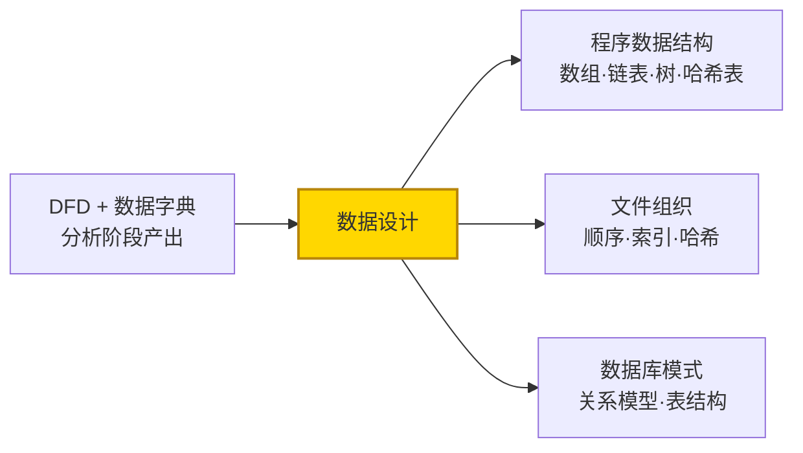
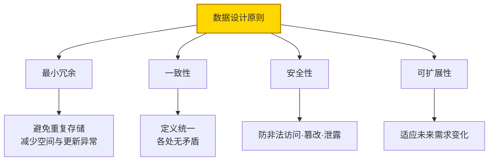
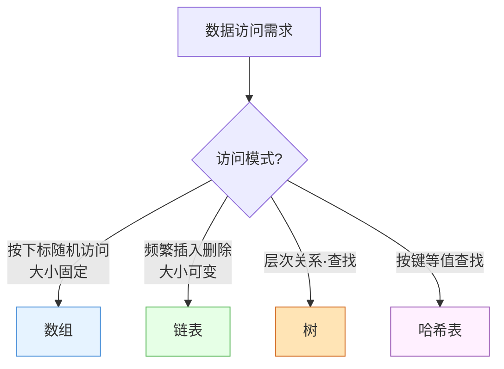
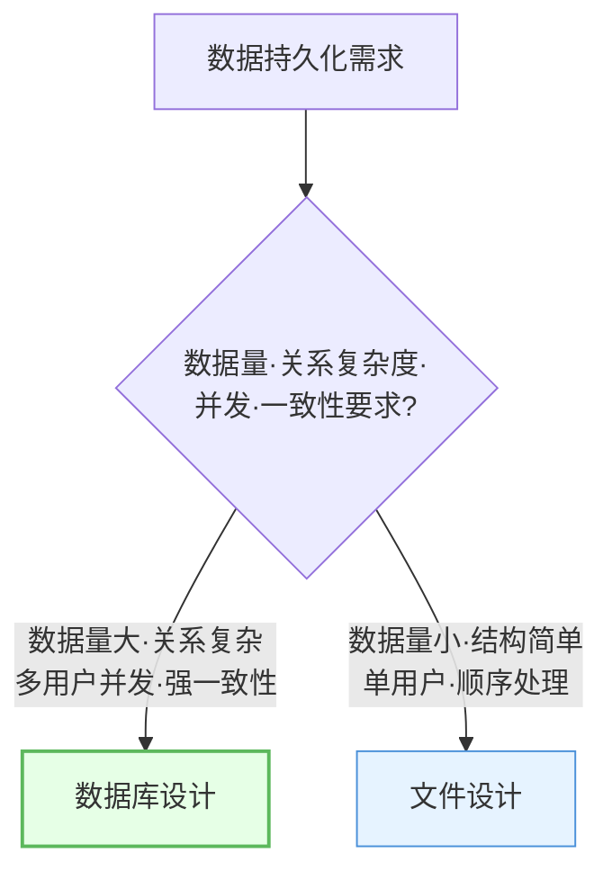
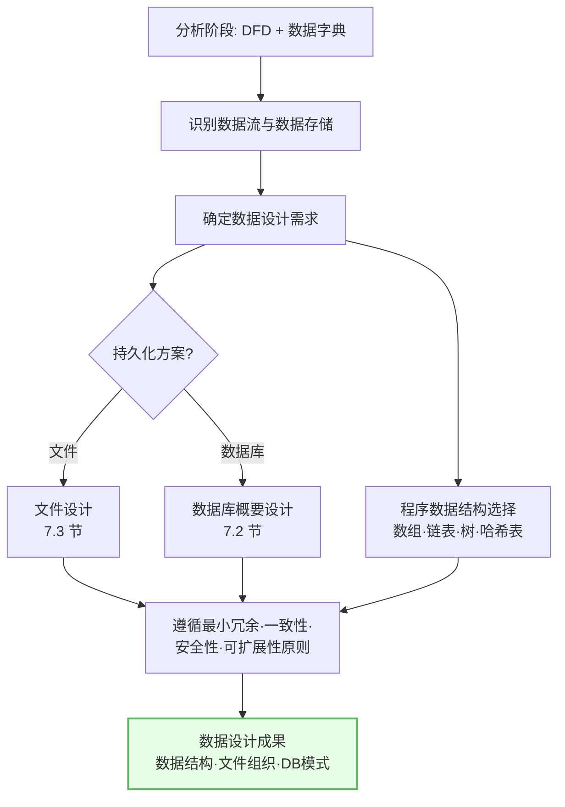

# 7.1 数据设计原则与方法

数据设计是概要设计中与模块设计并列的重要维度。在 [[MOC - 第3章|DFD 映射]]产出模块结构后，需确定软件中使用的数据结构，为模块提供数据层面的支撑。本节阐述数据设计的定义、设计原则、数据结构选择方法，以及文件设计与数据库设计的区别。

## 数据设计的定义

> [!definition] 数据设计
> 数据设计是确定软件系统中使用的数据结构的过程，是概要设计的重要组成部分。它将需求分析与结构化分析阶段（[[3.1 DFD到SC的映射原理|DFD、数据字典]]）得到的数据信息，转化为软件中具体的数据组织形式，包括程序内部数据结构、文件组织与数据库模式。

> [!note] 数据设计的位置
> 数据设计与模块设计（SC）并行展开：模块设计解决"程序怎么组织"，数据设计解决"数据怎么组织"。二者通过数据字典衔接——数据字典定义的数据流与数据存储，是数据设计的直接输入。

## 数据设计原则

> [!definition] 数据设计原则
> 数据设计应遵循最小冗余、一致性、安全性、可扩展性四项核心原则，保证数据结构的合理性与可维护性。

| 原则 | 要求 | 违反后果 |
| --- | --- | --- |
| 最小冗余 | 避免数据重复存储 | 浪费空间、更新异常（一改多处） |
| 一致性 | 数据定义统一、无矛盾 | 数据冲突、逻辑错误 |
| 安全性 | 防止非法访问、篡改、泄露 | 数据泄露、破坏 |
| 可扩展性 | 适应未来需求变化 | 难以维护、重构成本高 |

> [!tip] 最小冗余与一致性的关系
> 最小冗余是一致性的基础——若同一数据多处冗余存储，更新时易遗漏某处导致不一致。规范化（见 [[7.2 数据库概要设计|7.2 节]]）正是通过消除冗余来保证一致性。

## 数据结构选择

不同数据结构有各自的适用场景与复杂度特征，需根据访问模式选择：

| 数据结构 | 适用场景 | 查找复杂度 | 插入删除复杂度 | 特点 |
| --- | --- | --- | --- | --- |
| 数组 | 大小固定、按下标随机访问 | $O(1)$ 按下标 / $O(n)$ 按值 | $O(n)$ | 连续存储、随机访问快 |
| 链表 | 频繁插入删除、大小可变 | $O(n)$ | $O(1)$ 定位后 | 动态分配、插入删除快 |
| 树 | 层次关系、有序查找 | $O(\log n)$ 平衡 | $O(\log n)$ 平衡 | 有序、范围查询 |
| 哈希表 | 按键等值查找 | $O(1)$ 平均 | $O(1)$ 平均 | 极快等值查找、无序 |

> [!example] 数据结构选择示例
> - **学生成绩按学号查询**：学号唯一且需等值查找 → 哈希表；
> - **课程先修关系**：课程间有层次依赖 → 树（或图）；
> - **待处理任务队列**：频繁增删、按顺序处理 → 链表（或队列）；
> - **月份天数表**：大小固定、按下标访问 → 数组。

## 文件设计 vs 数据库设计

数据持久化存储有文件与数据库两种方案，适用场景不同：

| 比较维度 | 文件设计 | 数据库设计 |
| --- | --- | --- |
| 数据量 | 较小、结构简单 | 较大、关系复杂 |
| 数据关系 | 单一文件、少关联 | 多表关联、关系丰富 |
| 并发访问 | 单用户或少量 | 多用户并发 |
| 一致性 | 程序自行保证 | DBMS 事务保证 |
| 查询能力 | 顺序或简单索引 | SQL 复杂查询 |
| 安全性 | 文件系统权限 | DBMS 权限与加密 |
| 适用场景 | 配置文件、日志、批量处理 | 业务系统、信息系统 |

> [!note] 选型建议
> 当数据量大、关系复杂、需多用户并发访问与强一致性保障时，选择数据库设计（详见 [[7.2 数据库概要设计|7.2 节]]）；当数据量小、结构简单、以顺序处理为主时，选择文件设计（详见 [[7.3 数据存储与文件设计|7.3 节]]）。实际系统常二者结合——业务数据入数据库，日志/配置用文件。

## 数据设计流程图

## 小结

数据设计是确定软件中使用的数据结构的过程，是概要设计的重要维度，与模块设计并行展开。数据设计遵循最小冗余、一致性、安全性、可扩展性四项原则。数据结构选择依据访问模式：数组适按下标随机访问、链表适频繁插入删除、树适层次有序查找、哈希表适等值查找。文件设计适数据量小结构简单的场景，数据库设计适数据量大关系复杂多用户并发的场景，二者常结合使用。

## 关联

- 上一级：[[MOC - 第7章]]
- 下一节：[[7.2 数据库概要设计]]
- 关联概念：[[3.1 DFD到SC的映射原理]]（数据字典是数据设计输入）、[[7.3 数据存储与文件设计]]（文件设计深入）、[[1.2 软件设计分层：概要设计与详细设计]]（数据设计属概要设计）
