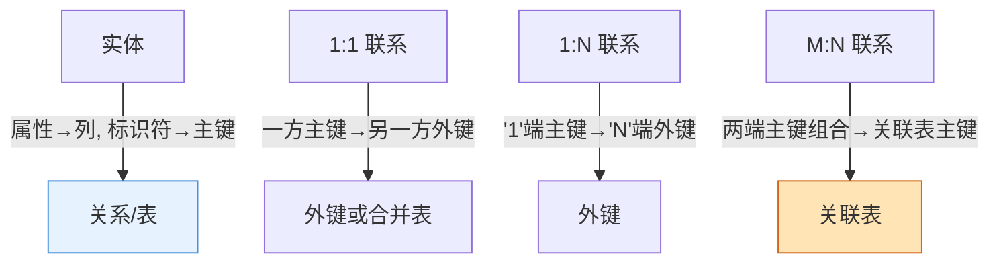
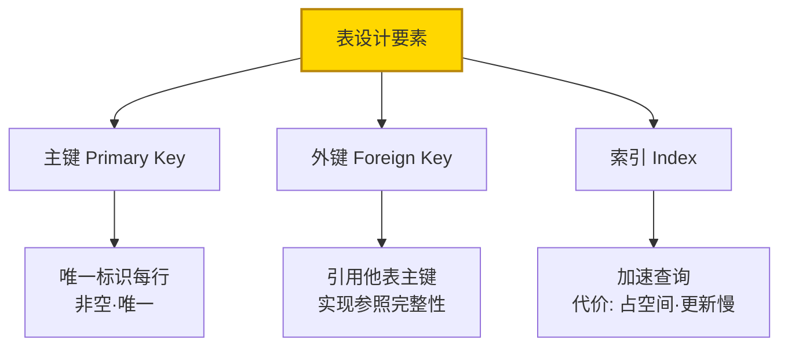
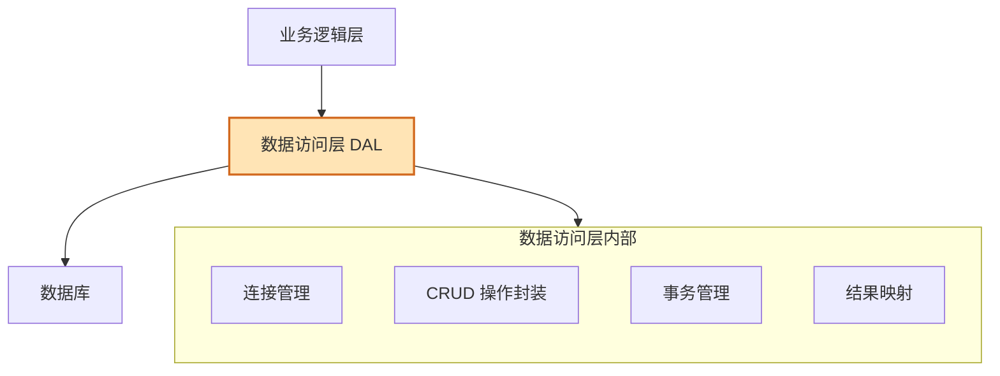
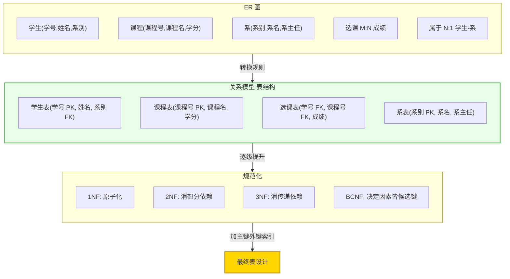

# 7.2 数据库概要设计

在 [[7.1 数据设计原则与方法|数据设计原则]]指导下，当选择数据库方案时，需完成数据库概要设计。本节阐述从 ER 图到关系模型的转换、关系模式规范化（1NF→BCNF）、数据库表设计（主键、外键、索引）与数据库访问层设计，是数据设计的核心内容。

## 从 ER 图到关系模型转换

> [!definition] ER 图转关系模型
> 将需求分析阶段得到的实体关系图（ER 图）转换为关系数据库可接受的关系模式（表结构）的过程。转换规则将实体、属性、联系分别映射为关系、列、外键或关联表。


### 转换规则

| ER 元素 | 转换规则 | 示例 |
| --- | --- | --- |
| 实体 | 转为关系（表），属性转为列，标识符转主键 | 学生 → 学生表(学号, 姓名) |
| 1:1 联系 | 一方主键作另一方外键，或合并为一表 | 经理↔部门：部门表加经理号外键 |
| 1:N 联系 | "1"端主键作"N"端外键 | 班级↔学生：学生表加班级号外键 |
| M:N 联系 | 建立关联表，主键为两端主键组合 | 学生↔课程：选课表(学号,课程号,成绩) |



> [!example] 学生选课系统转换
> ER 图含学生实体（学号、姓名、专业）、课程实体（课程号、课程名、学分）、选课联系（M:N，含成绩属性）。
> - 学生 → `学生表(学号 PK, 姓名, 专业)`；
> - 课程 → `课程表(课程号 PK, 课程名, 学分)`；
> - 选课(M:N) → `选课表(学号 FK, 课程号 FK, 成绩)`，主键为 `(学号, 课程号)`。

## 关系模式规范化

> [!definition] 规范化
> 规范化（Normalization）是通过分解关系模式消除数据冗余和更新异常（插入、删除、修改异常）的过程，逐级提升范式级别，使每个关系只描述一个实体或联系。


| 范式 | 要求 | 消除的异常 | 口诀 |
| --- | --- | --- | --- |
| 1NF | 属性不可再分（原子性） | 重复组 | 字段原子化 |
| 2NF | 非主属性完全依赖主键 | 部分依赖 | 消除部分依赖 |
| 3NF | 非主属性不传递依赖主键 | 传递依赖 | 消除传递依赖 |
| BCNF | 每一决定因素都是候选键 | 主属性部分/传递依赖 | 决定因素皆候选键 |

> [!example] 规范化示例
> 某未规范化关系：`选课(学号, 姓名, 课程号, 课程名, 学分, 成绩, 系别, 系主任)`
> - **1NF**：所有属性原子化（已是）；
> - **2NF**：消除部分依赖——(学号,课程号)→成绩，但姓名只依赖学号、课程名只依赖课程号。分解为：`选课(学号,课程号,成绩)`、`学生(学号,姓名,系别,系主任)`、`课程(课程号,课程名,学分)`；
> - **3NF**：消除传递依赖——学号→系别→系主任（系主任传递依赖学号）。分解为：`学生(学号,姓名,系别)`、`系(系别,系主任)`。

## 数据库表设计

### 主键、外键、索引



| 要素 | 作用 | 设计要点 |
| --- | --- | --- |
| 主键 | 唯一标识表中每行 | 非空、唯一、稳定（不常变） |
| 外键 | 引用他表主键，建立表间关联 | 保证参照完整性、级联策略 |
| 索引 | 加速查询的数据结构 | 查询频繁的列建索引、避免过度索引 |

> [!tip] 索引设计原则
> 在 WHERE 条件、JOIN 关联、ORDER BY 排序频繁的列上建索引；避免在小表或更新极频繁的列上建索引（索引维护开销）；复合索引注意列顺序（等值查询列在前）。

### 表设计示例

以学生选课系统为例：

```text
学生表(学号 PK, 姓名, 性别, 入学日期, 系别 FK)
课程表(课程号 PK, 课程名, 学分, 先修课程 FK)
选课表(学号 FK, 课程号 FK, 成绩, 学期)  -- PK: (学号, 课程号, 学期)
系表(系别 PK, 系名, 系主任)
```

## 数据库访问层设计

> [!definition] 数据库访问层
> 数据库访问层是应用程序中专门负责与数据库交互的模块层次，封装数据增删改查操作，隔离业务逻辑与数据存储细节，提供统一的数据访问接口。



数据库访问层的设计要点：

1. **封装 CRUD**：增删改查操作集中管理，业务层不直接写 SQL。
2. **连接管理**：统一管理数据库连接、连接池。
3. **事务管理**：保证多操作原子性、一致性。
4. **结果映射**：将查询结果集映射为程序对象。
5. **隔离变化**：数据库变更不影响业务逻辑层。

> [!note] 访问层与模块设计的关系
> 数据库访问层是 [[MOC - 第3章|SC 结构图]]中的一个特殊模块层次，可视为变换流或事务流中"数据存储"动作的具体实现。它对应 [[3.1 DFD到SC的映射原理|DFD]] 中的数据存储，是模块设计与数据设计的交汇点。

## ER 图转关系模型示例

完整转换流程整合：



## 小结

数据库概要设计将 ER 图转换为关系模型：实体转表、属性转列、标识符转主键；1:1 与 1:N 联系用外键、M:N 联系建关联表。关系模式规范化通过逐级提升范式（1NF→2NF→3NF→BCNF）消除数据冗余与更新异常——1NF 保证原子性、2NF 消除部分依赖、3NF 消除传递依赖、BCNF 要求决定因素皆为候选键。表设计需确定主键（唯一标识）、外键（参照完整性）、索引（加速查询）。数据库访问层封装 CRUD 与事务，隔离业务逻辑与存储细节，是模块设计与数据设计的交汇点。

## 关联

- 上一级：[[MOC - 第7章]]
- 上一节：[[7.1 数据设计原则与方法]]
- 下一节：[[7.3 数据存储与文件设计]]
- 关联概念：[[3.1 DFD到SC的映射原理]]（数据存储与访问层的衔接）、[[7.1 数据设计原则与方法]]（数据设计原则）、[[1.2 软件设计分层：概要设计与详细设计]]（数据库概要设计属概要设计）
