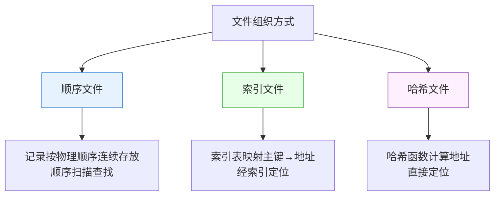
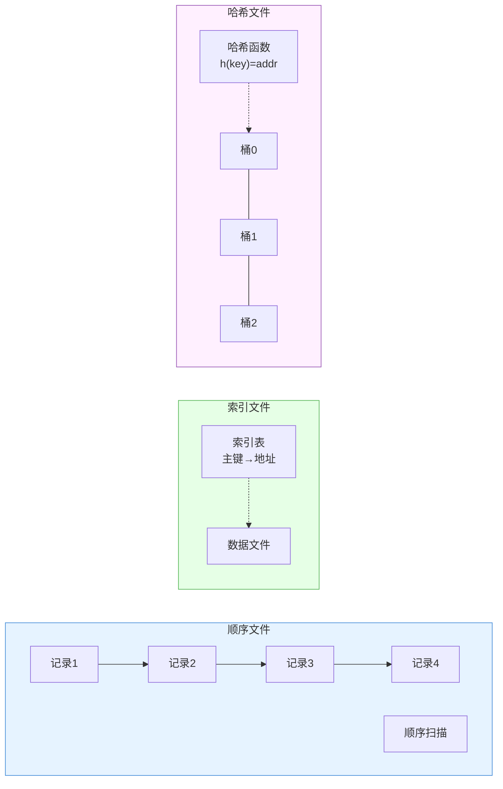
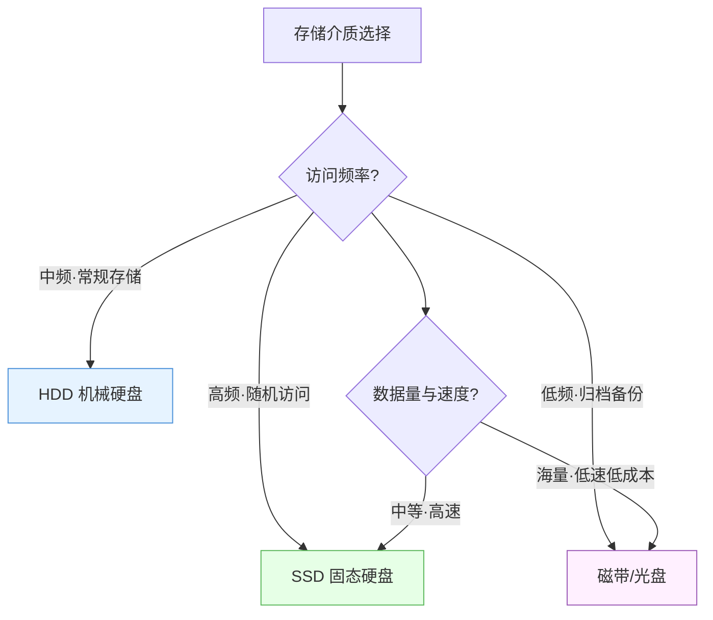
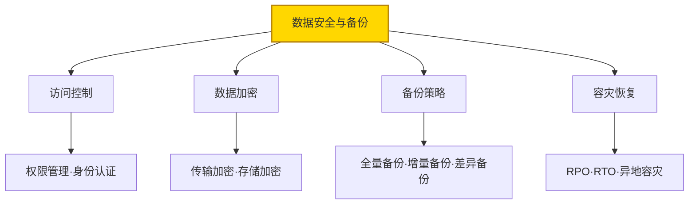

# 7.3 数据存储与文件设计

当 [[7.1 数据设计原则与方法|数据设计]]选择文件方案时，需完成文件组织方式、存储介质、缓存与安全备份的设计。本节阐述顺序文件、索引文件、哈希文件的组织方式与适用场景，存储介质选择，数据缓存设计，以及数据安全与备份策略。

## 文件组织方式

> [!definition] 文件组织方式
> 文件组织方式是文件中记录的物理存储与逻辑访问方式，决定记录如何存放与查找。主要有顺序文件、索引文件、哈希文件三种。

### 顺序文件

记录按物理顺序连续存放，查找需从文件头顺序扫描。

| 特性 | 说明 |
| --- | --- |
| 组织方式 | 记录连续存放，可按主键排序或按写入顺序 |
| 查找方式 | 顺序扫描，$O(n)$ |
| 插入删除 | 需移动记录，$O(n)$ |
| 优点 | 存储利用率高、实现简单、批量处理高效 |
| 缺点 | 随机查找慢、插入删除代价大 |
| 适用场景 | 日志文件、批处理报表、数据量小或按顺序访问 |

### 索引文件

建立索引表记录主键与物理地址的映射，查找通过索引定位记录。

| 特性 | 说明 |
| --- | --- |
| 组织方式 | 数据文件 + 索引表（主键→地址） |
| 查找方式 | 索引查找后定位，$O(\log n)$ 或 $O(1)$ |
| 插入删除 | 需同时更新索引 |
| 优点 | 查找快、支持范围查询 |
| 缺点 | 索引占额外空间、更新需维护索引 |
| 适用场景 | 主数据查询、需频繁随机查找 |

### 哈希文件

通过哈希函数计算记录地址直接定位。

| 特性 | 说明 |
| --- | --- |
| 组织方式 | 哈希函数映射主键→存储地址 |
| 查找方式 | 哈希计算直接定位，$O(1)$ 平均 |
| 插入删除 | 哈希计算定位后操作 |
| 优点 | 等值查找极快 |
| 缺点 | 不支持范围查询、存在哈希冲突 |
| 适用场景 | 键值查找、等值查询为主 |

## 文件组织方式对比图

| 比较维度 | 顺序文件 | 索引文件 | 哈希文件 |
| --- | --- | --- | --- |
| 查找复杂度 | $O(n)$ | $O(\log n)$ | $O(1)$ 平均 |
| 范围查询 | 支持（顺序） | 支持（索引） | 不支持 |
| 等值查询 | 慢 | 较快 | 极快 |
| 空间开销 | 无额外 | 索引占空间 | 无额外（冲突除外） |
| 更新代价 | 高（移动） | 中（维护索引） | 低 |
| 适用场景 | 批量顺序处理 | 随机查找+范围查询 | 等值查找为主 |

## 文件存储介质选择

| 介质 | 速度 | 容量 | 成本 | 适用场景 |
| --- | --- | --- | --- | --- |
| SSD 固态硬盘 | 极快 | 中 | 高 | 高频随机访问、在线业务数据 |
| HDD 机械硬盘 | 中 | 大 | 中 | 常规存储、批量数据 |
| 磁带/光盘 | 慢 | 极大 | 低 | 归档备份、冷数据 |

> [!tip] 介质选型建议
> 在线业务数据用 SSD 保证响应速度；历史数据、批量处理用 HDD 平衡成本与容量；长期归档与冷备份用磁带或光盘降低成本。实际系统常分层存储——热数据在 SSD、温数据在 HDD、冷数据在磁带。

## 数据缓存设计

> [!definition] 数据缓存
> 数据缓存是在内存中暂存高频访问数据的机制，减少对慢速存储（磁盘/数据库）的访问次数，提高读取性能。

缓存设计要点：

| 设计项 | 说明 |
| --- | --- |
| 缓存策略 | 全缓存/部分缓存，按访问频率选择 |
| 替换算法 | LRU（最近最少使用）、LFU（最不常用）、FIFO |
| 一致性保证 | 写穿（Write-through）、写回（Write-back）、过期失效 |
| 容量控制 | 限制缓存大小，防止内存溢出 |

> [!warning] 缓存一致性
> 缓存与原始数据可能不一致——更新原始数据时若未同步更新缓存，读到的是过期数据。常用策略：写穿（同时更新缓存与原始数据，强一致但慢）、写回（先更新缓存异步写原始数据，快但短暂不一致）、设置过期时间（容忍最终一致）。

## 数据安全与备份策略

| 安全措施 | 方法 | 作用 |
| --- | --- | --- |
| 访问控制 | 权限管理、身份认证、审计日志 | 防非法访问 |
| 数据加密 | 传输加密（TLS）、存储加密 | 防窃取泄露 |
| 备份策略 | 全量+增量+差异备份 | 防数据丢失 |
| 容灾恢复 | 异地容灾、RPO/RTO 规划 | 防灾难性故障 |

### 备份策略对比

| 备份类型 | 内容 | 速度 | 恢复速度 | 空间 | 频率 |
| --- | --- | --- | --- | --- | --- |
| 全量备份 | 全部数据 | 慢 | 快 | 大 | 低（如每周） |
| 增量备份 | 自上次任意备份后变化 | 快 | 慢（需全量+各增量） | 小 | 高（如每天） |
| 差异备份 | 自上次全量后变化 | 中 | 中（需全量+最近差异） | 中 | 中（如每天） |

> [!example] 备份策略组合
> 典型组合：每周日全量备份，周一至周六差异备份。恢复时只需最近的全量备份 + 最近的差异备份，平衡备份速度与恢复速度。

## 小结

数据存储与文件设计选择合适的文件组织方式：顺序文件适合批量顺序处理（存储利用率高但随机查找慢）、索引文件适合随机查找与范围查询（查找快但索引占空间）、哈希文件适合等值查找（极快但不支持范围查询）。存储介质按访问频率分层：热数据用 SSD、温数据用 HDD、冷数据用磁带。数据缓存通过内存暂存高频数据提升性能，需处理一致性（写穿/写回/过期）。数据安全通过访问控制、加密、备份与容灾保障，备份策略常用全量+差异/增量组合。

## 关联

- 上一级：[[MOC - 第7章]]
- 上一节：[[7.2 数据库概要设计]]
- 关联概念：[[7.1 数据设计原则与方法]]（文件vs数据库选型）、[[3.1 DFD到SC的映射原理]]（数据存储是 DFD 的重要元素）、[[6.3 设计评审与质量度量]]（数据设计也需评审）
