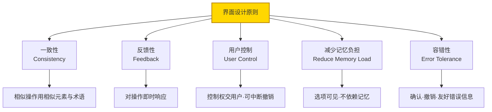
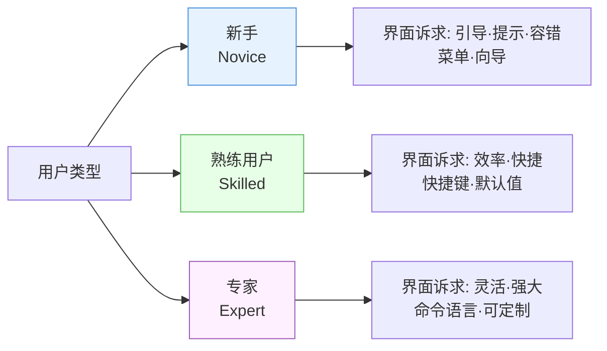
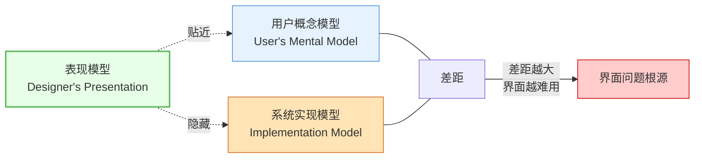
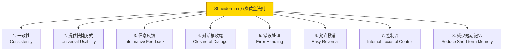
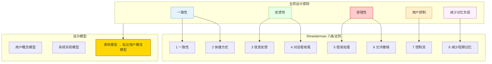

# 8.1 人机界面设计原则与模型

人机界面（Human-Computer Interface, HCI）是用户与系统交互的桥梁。在 [[MOC - 第3章|DFD 映射]]得到模块结构后，需为这些功能配上可用界面。本节阐述界面设计的基本原则、用户类型分析、界面设计模型，以及 Shneiderman 提出的八条黄金法则，是界面概要设计的理论基础。

## 人机界面设计原则

> [!definition] 界面设计原则
> 人机界面设计应遵循一致性、反馈性、用户控制、减少记忆负担、容错性五项核心原则，目标是让界面易学、高效、容错、令用户满意。

| 原则 | 要求 | 落实方式 | 违反后果 |
| --- | --- | --- | --- |
| 一致性 | 相似操作用相似界面元素与术语 | 统一术语、统一按钮样式、统一快捷键 | 用户需反复学习、易混淆 |
| 反馈性 | 对用户操作即时响应 | 进度条、状态提示、操作确认 | 用户不知操作是否生效、重复点击 |
| 用户控制 | 把控制权交给用户 | 允许中断、撤销、自定义 | 用户被系统"裹挟"、体验差 |
| 减少记忆负担 | 选项可见、不依赖记忆 | 菜单列出选项、默认值合理 | 用户需记忆命令、易遗忘出错 |
| 容错性 | 对误操作宽容 | 删除确认、撤销、错误提示 | 误操作导致数据丢失或崩溃 |

> [!tip] 一致性与容错性的关系
> 一致性是容错性的基础——若相似操作界面一致，用户已养成的操作习惯不易误触；同时容错性为一致性失误兜底，提供撤销与确认机制。二者配合显著降低操作错误率。

## 用户类型分析

不同用户对界面有不同诉求，界面设计需识别目标用户类型：

| 用户类型 | 特点 | 界面诉求 | 适用界面 |
| --- | --- | --- | --- |
| 新手 | 不熟悉系统与任务 | 引导、提示、容错、低学习成本 | 菜单驱动、向导式 |
| 熟练用户 | 熟悉常用功能 | 效率高、快捷操作、合理默认值 | 表单填写、快捷键、直接操纵 |
| 专家 | 深入理解系统与任务 | 灵活、强大、可定制、批处理 | 命令语言、脚本、可配置界面 |

> [!example] 用户类型差异
> 同一文件管理操作：新手用菜单"编辑→复制→粘贴"；熟练用户用 Ctrl+C/Ctrl+V 快捷键；专家可能用命令行 `cp` 批量复制。优秀界面应同时满足三类用户——提供菜单引导新手、快捷键服务熟练用户、命令接口满足专家。

## 界面设计模型

> [!definition] 界面设计模型
> 界面设计涉及三种模型：**用户概念模型**（用户对系统的心智模型）、**系统实现模型**（系统内部结构与机制）、**表现模型**（界面呈现给用户的形象）。设计目标是让表现模型尽量贴近用户概念模型，隐藏实现细节。

| 模型 | 主体 | 内容 | 关注点 |
| --- | --- | --- | --- |
| 用户概念模型 | 用户 | 对系统"是什么、如何工作"的心智认知 | 业务对象、任务流程 |
| 系统实现模型 | 设计者/实现者 | 系统内部数据结构、算法、模块调用 | 数据结构、算法、性能 |
| 表现模型 | 界面设计 | 界面呈现给用户的形象与行为 | 交互方式、视觉反馈 |

> [!note] 模型差距的意义
> 用户概念模型与系统实现模型的差距是界面问题的根源。若界面（表现模型）直接暴露实现细节（如要求用户理解数据库表结构），用户难以将心智模型映射到操作。优秀界面构造的表现模型贴近用户概念模型，让用户用熟悉的业务概念操作，背后由实现模型支撑而不暴露。

## Shneiderman 八条黄金法则

Ben Shneiderman 提出界面设计八条黄金法则（Eight Golden Rules），是对设计原则的细化：

| 序号 | 法则 | 含义 | 示例 |
| --- | --- | --- | --- |
| 1 | 一致性 | 相似操作用相似术语与界面元素 | 删除统一用红色按钮 |
| 2 | 提供快捷方式 | 为熟练用户提供高效操作路径 | 菜单项标注 Ctrl+S 快捷键 |
| 3 | 信息反馈 | 对用户操作给出可见响应 | 文件保存后显示"已保存" |
| 4 | 对话框收尾 | 操作序列有明确开始与结束反馈 | 完成向导后提示"操作完成" |
| 5 | 错误处理 | 预防错误、错误时给出可操作提示 | 表单字段校验并指明错误 |
| 6 | 允许撤销 | 让用户可撤销误操作 | 撤销删除、回收站恢复 |
| 7 | 控制流 | 用户主导操作节奏，不被系统打断 | 长任务可取消、不弹窗打断 |
| 8 | 减少短期记忆 | 信息显示在界面上，不要求用户记忆 | 显示当前选项、可见菜单 |

> [!tip] 八条法则与五原则的对应
> 八条法则可归入五原则：一致性（1、2）、反馈性（3、4）、容错性（5、6）、用户控制（7）、减少记忆负担（8）。八条法则更具体、更可操作，是五原则的实践细化。

## 界面设计原则关系图

## 小结

人机界面设计遵循一致性、反馈性、用户控制、减少记忆负担、容错性五项原则。用户分为新手、熟练用户、专家三类，分别诉求引导容错、效率快捷、灵活强大，界面应兼顾三类用户。界面设计涉及用户概念模型、系统实现模型与表现模型，表现模型应贴近用户概念模型以缩小认知鸿沟。Shneiderman 八条黄金法则将五原则细化为可操作条目：一致性、快捷方式、信息反馈、对话框收尾、错误处理、允许撤销、控制流、减少短期记忆。

## 关联

- 上一级：[[MOC - 第8章]]
- 下一节：[[8.2 界面类型与交互方式]]
- 关联概念：[[1.2 软件设计分层：概要设计与详细设计]]（界面设计属概要设计）、[[8.3 界面设计评估与可用性]]（原则是评估的启发式依据）
