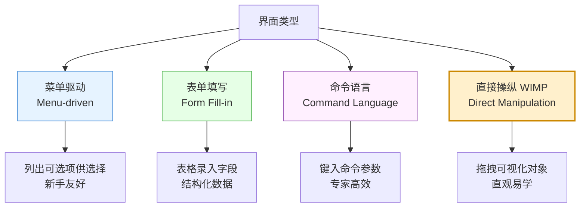
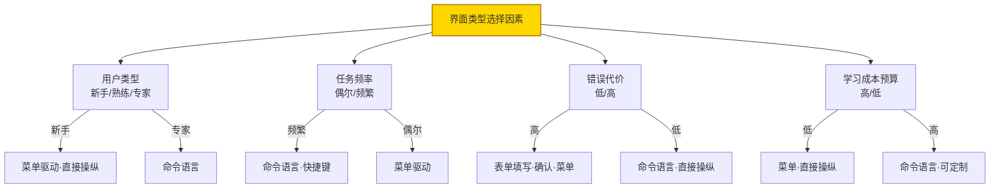
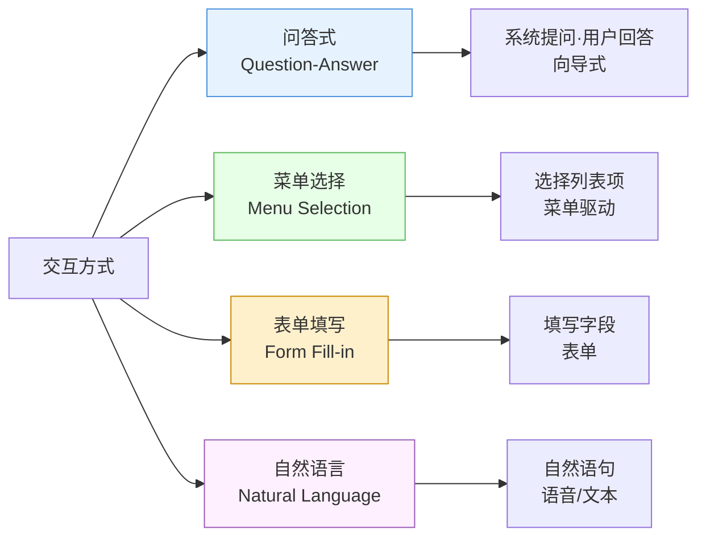
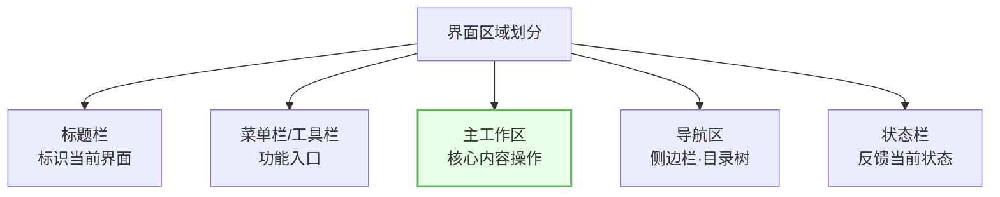
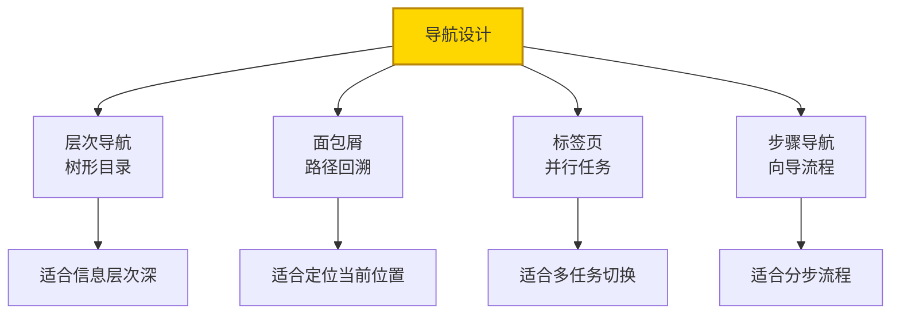
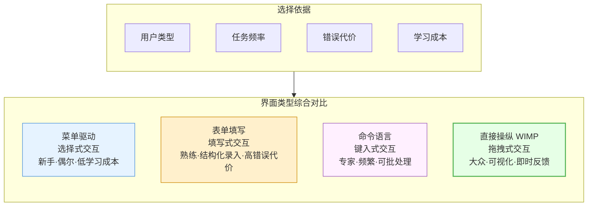

# 8.2 界面类型与交互方式

在 [[8.1 人机界面设计原则与模型|设计原则]]指导下，需选择合适的界面类型与交互方式。本节阐述四种主要界面类型（菜单驱动、表单填写、命令语言、直接操纵）、常见交互方式、界面类型选择因素，以及界面布局与导航设计，是界面概要设计的核心内容。

## 界面类型

> [!definition] 界面类型
> 界面类型是系统向用户呈现功能与接受操作的总体形式。常见的四种类型为菜单驱动、表单填写、命令语言、直接操纵（WIMP），各有优缺点与适用场景。

### 四种界面类型对比

| 界面类型 | 工作方式 | 优点 | 缺点 | 适用场景 | 适用户 |
| --- | --- | --- | --- | --- | --- |
| 菜单驱动 | 列出可选项供选择 | 学习成本低、引导性强、不易出错 | 选项多时层级深、效率低 | 功能浏览、偶尔使用 | 新手 |
| 表单填写 | 以表格录入字段 | 结构化数据录入高效、字段明确 | 字段多易疲劳、灵活性低 | 登记、申报、录入 | 熟练用户 |
| 命令语言 | 键入命令与参数 | 灵活高效、可批处理、可组合 | 学习成本高、易出错 | 高频专业操作、自动化 | 专家 |
| 直接操纵 WIMP | 拖拽可视化对象 | 直观易学、反馈即时、易记忆 | 复杂逻辑表达受限、实现复杂 | 大众应用、图形操作 | 各类用户 |

> [!note] WIMP 的含义
> WIMP 是直接操纵界面的典型实现，指 **W**indow（窗口）、**I**con（图标）、**M**enu（菜单）、**P**ointer（指针）四种元素组合的图形用户界面（GUI）。现代桌面操作系统（Windows、macOS）即 WIMP 范式。直接操纵的核心思想是用户直接操作屏幕上的可视化对象，系统即时反馈，符合"所见即所得"。

### 界面类型选择因素

| 因素 | 倾向菜单/表单 | 倾向命令/直接操纵 |
| --- | --- | --- |
| 用户类型 | 新手为主 | 专家为主 |
| 任务频率 | 偶尔使用 | 频繁使用 |
| 错误代价 | 错误代价高需防范 | 错误代价低可试错 |
| 学习成本 | 预算低需即学即用 | 预算高可培训 |

> [!example] 选择示例
> - **图书馆查询终端**（面向大众偶尔使用）→ 菜单驱动 + 直接操纵；
> - **银行柜员录入**（结构化高频录入、错误代价高）→ 表单填写 + 确认；
> - **系统管理员运维**（专家高频、需批处理）→ 命令语言 + 脚本；
> - **图片编辑软件**（可视化对象操作）→ 直接操纵 WIMP。

## 交互方式

> [!definition] 交互方式
> 交互方式是用户与系统交换信息的具体形式，包括问答式、菜单选择、表单填写、自然语言等，是界面类型在操作层面的具体实现。

| 交互方式 | 形式 | 特点 | 适用场景 |
| --- | --- | --- | --- |
| 问答式 | 系统逐步提问、用户回答 | 引导性强、步骤清晰 | 安装向导、配置向导、新手引导 |
| 菜单选择 | 从列表中选择选项 | 简单直观、选项可见 | 功能导航、选项选择 |
| 表单填写 | 填写多个字段 | 一次录入多项结构化数据 | 数据录入、信息登记 |
| 自然语言 | 用自然语言语句交互 | 灵活自然、门槛低 | 智能助手、语音交互、搜索 |

> [!tip] 交互方式与界面类型的关系
> 交互方式是界面类型的操作实现。例如菜单驱动界面主要通过"菜单选择"交互，表单填写界面通过"表单填写"交互，命令语言界面通过键入命令交互。一个界面常组合多种交互方式——如直接操纵界面同时使用菜单选择、表单填写与拖拽。

## 界面布局设计

> [!definition] 界面布局
> 界面布局是界面元素在屏幕空间中的组织与排列，包括区域划分、导航设计与视觉层次，目标是让用户快速定位功能、高效完成任务。

### 区域划分

| 区域 | 位置 | 内容 | 设计要点 |
| --- | --- | --- | --- |
| 标题栏 | 顶部 | 界面标题、窗口控制 | 标识当前功能模块 |
| 菜单/工具栏 | 顶部下方 | 功能命令入口 | 按功能分组、常用项突出 |
| 主工作区 | 中央 | 核心内容与操作 | 占主要空间、视觉焦点 |
| 导航区 | 左侧/侧边 | 目录树、导航面板 | 反映信息层次、可折叠 |
| 状态栏 | 底部 | 当前状态、提示信息 | 实时反馈操作结果 |

### 导航设计

> [!example] 布局设计示例
> 图书借阅系统主界面：顶部标题栏"图书借阅管理"+ 菜单栏（借阅/归还/查询/统计）；左侧导航区为功能树（读者管理、图书管理、借阅管理）；中央主工作区为当前功能列表与操作；底部状态栏显示"已连接·当前用户·操作提示"。

## 界面类型对比图

整合四种界面类型的特点、交互方式与适用场景：

## 小结

界面类型主要有菜单驱动、表单填写、命令语言、直接操纵（WIMP）四种：菜单驱动适合新手与偶尔使用、表单填写适合结构化录入、命令语言适合专家与高频任务、直接操纵适合大众与可视化操作。交互方式包括问答式、菜单选择、表单填写、自然语言，是界面类型的操作实现。界面类型选择依据用户类型、任务频率、错误代价与学习成本综合决定。界面布局通过区域划分（标题栏、菜单栏、主工作区、导航区、状态栏）与导航设计（层次、面包屑、标签页、步骤）组织界面元素，帮助用户快速定位功能。

## 关联

- 上一级：[[MOC - 第8章]]
- 上一节：[[8.1 人机界面设计原则与模型]]
- 下一节：[[8.3 界面设计评估与可用性]]
- 关联概念：[[8.1 人机界面设计原则与模型]]（界面类型需符合设计原则）、[[8.3 界面设计评估与可用性]]（界面类型选择影响可用性）
