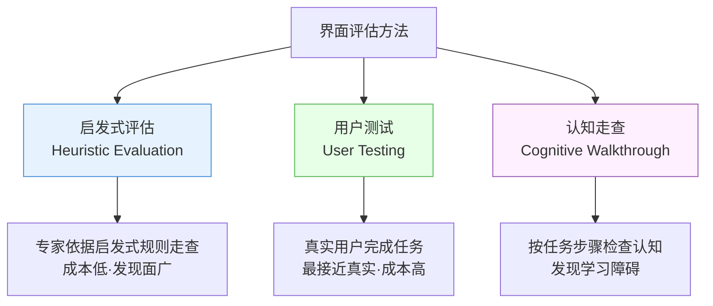
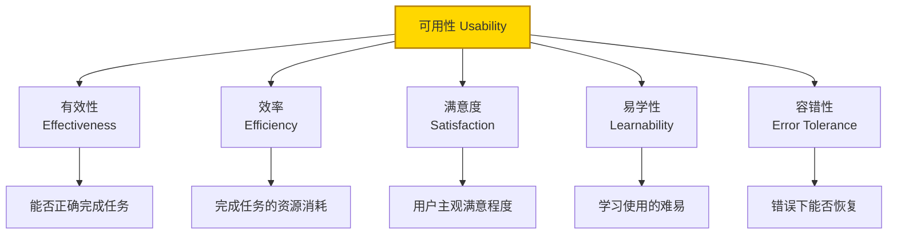
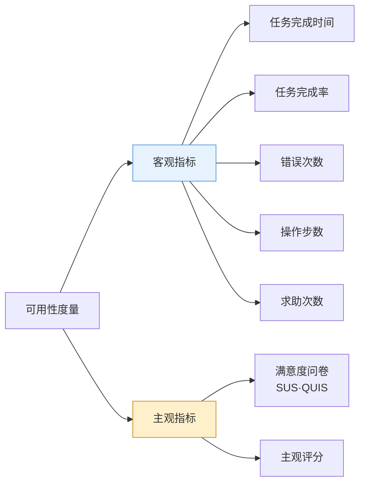
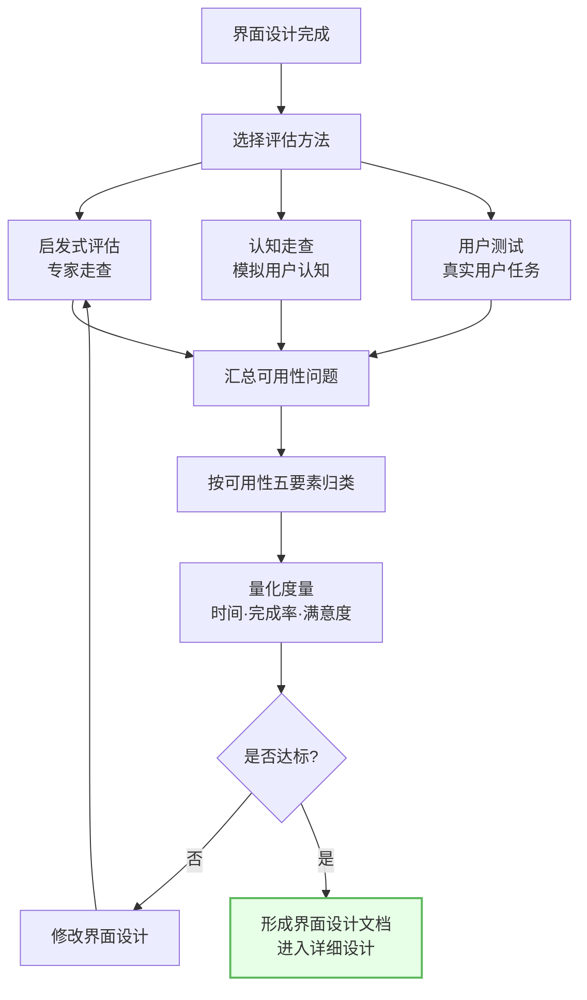

# 8.3 界面设计评估与可用性

在 [[8.2 界面类型与交互方式|界面设计]]完成后，需评估界面是否满足可用性要求。本节阐述界面评估的三种主要方法（启发式评估、用户测试、认知走查）、可用性的定义与度量指标、界面设计文档，是界面概要设计的质量保证环节。

## 界面评估方法

> [!definition] 界面评估
> 界面评估是通过系统化方法检验界面是否满足可用性要求、发现界面问题的过程。主要方法有启发式评估、用户测试与认知走查，三者常组合使用。

### 启发式评估

> [!definition] 启发式评估
> 启发式评估由少数可用性专家依据一组公认的启发式规则（如 Nielsen 十条可用性启发式）对界面进行走查，发现违反规则的界面问题。特点是专家驱动、成本低、发现面广。

Nielsen 十条可用性启发式：

| 序号 | 启发式 | 含义 |
| --- | --- | --- |
| 1 | 系统状态可见 | 让用户随时知道系统在做什么 |
| 2 | 贴近真实世界 | 用用户熟悉的语言与概念 |
| 3 | 用户控制与自由 | 提供撤销与退出路径 |
| 4 | 一致性与标准 | 相似操作用相似界面 |
| 5 | 防错 | 预防错误发生 |
| 6 | 识别而非回忆 | 选项可见、不依赖记忆 |
| 7 | 灵活与效率 | 提供快捷方式服务熟练用户 |
| 8 | 美观与简约 | 界面不堆砌无关信息 |
| 9 | 错误恢复 | 错误信息清晰、可恢复 |
| 10 | 帮助与文档 | 必要时提供帮助 |

> [!note] 启发式与八条法则的关系
> Nielsen 十条启发式与 [[8.1 人机界面设计原则与模型|Shneiderman 八条法则]]高度重叠，都强调一致性、反馈、用户控制、防错、减少记忆。启发式评估时专家逐条对照，记录违反项与位置。

### 用户测试

> [!definition] 用户测试
> 用户测试是邀请真实用户在受控条件下完成典型任务，观察并记录操作时间、错误率、求助次数与主观满意度，最直接反映界面在真实使用中的可用性。

| 度量指标 | 含义 | 反映 |
| --- | --- | --- |
| 任务完成时间 | 完成典型任务耗时 | 效率 |
| 任务完成率 | 成功完成任务比例 | 有效性 |
| 错误次数 | 操作错误次数 | 容错性 |
| 求助次数 | 查阅帮助次数 | 易学性 |
| 满意度评分 | 主观评分 | 满意度 |

### 认知走查

> [!definition] 认知走查
> 认知走查由评估者模拟用户认知过程，按任务步骤逐个检查用户能否理解当前界面、能否判断下一步操作、能否正确执行，专长于发现学习与探索障碍。

认知走查的四个核心问题（每一步骤）：

1. 用户能否判断正确操作的下一步？
2. 界面控件是否可见可识别？
3. 用户能否将意图映射到控件？
4. 用户能否从反馈判断操作是否正确？

> [!tip] 三方法组合
> 实践中常组合使用：**启发式评估**快速筛查明显问题（成本低、专家即可）；**认知走查**补充认知与学习障碍；**用户测试**验证关键任务在真实使用中的表现。三者互补覆盖不同问题类型。

## 可用性定义

> [!definition] 可用性
> 可用性（Usability）是特定用户在特定使用场景下，有效、高效、满意地达成特定目标的程度。可用性包含效率、有效性、满意度、易学性、容错性五个要素。

| 要素 | 定义 | 度量指标 |
| --- | --- | --- |
| 有效性 | 用户能否正确完成预定任务 | 任务完成率、完成正确率 |
| 效率 | 完成任务消耗的资源（时间、操作步数） | 任务完成时间、操作步数 |
| 满意度 | 用户对界面的主观满意程度 | 问卷评分、主观评价 |
| 易学性 | 用户学会使用所需时间与努力 | 学习时间、首次成功时间 |
| 容错性 | 出错时系统能否恢复、降低损失 | 错误恢复率、错误影响 |

> [!example] 可用性度量示例
> 评估图书查询界面：邀请 10 名用户完成"查找某本书并查看馆藏"任务。结果：完成率 90%（有效性）、平均耗时 45 秒（效率）、满意度评分 4.2/5（满意度）、首次成功平均 2 次（易学性）、误操作后 95% 可恢复（容错性）。

## 可用性度量指标

> [!note] SUS 问卷
> SUS（System Usability Scale，系统可用性量表）是常用的 10 题满意度问卷，总分 0-100，高于 68 分表示可用性高于平均水平。客观指标与主观指标结合，才能全面评估可用性。

## 界面设计文档

> [!definition] 界面设计文档
> 界面设计文档是记录界面设计决策与规格的文档，是概要设计文档的组成部分，包含界面布局、交互规范、界面原型与设计依据。

界面设计文档的主要内容：

| 组成部分 | 内容 | 作用 |
| --- | --- | --- |
| 界面设计说明 | 设计原则、用户类型、设计依据 | 说明设计理由 |
| 界面布局图 | 各界面区域划分与元素位置 | 直观呈现界面结构 |
| 交互规范 | 操作方式、反馈、错误处理 | 统一交互行为 |
| 界面原型 | 关键界面草图或原型 | 可评审可测试 |
| 评估结果 | 评估方法、问题与改进 | 记录质量保证 |

## 界面评估流程图

## 小结

界面评估通过启发式评估、用户测试、认知走查三种方法发现界面问题：启发式评估由专家依据 Nielsen 十条等启发式规则走查、成本低；用户测试由真实用户完成任务、最接近真实；认知走查模拟用户认知过程、发现学习障碍。可用性包含有效性、效率、满意度、易学性、容错性五要素，分别由任务完成率、完成时间、满意度评分、学习时间、错误恢复率度量。界面设计文档记录设计决策、布局、交互规范、原型与评估结果。评估达标后形成界面设计文档，进入详细设计阶段。

## 关联

- 上一级：[[MOC - 第8章]]
- 上一节：[[8.2 界面类型与交互方式]]
- 关联概念：[[8.1 人机界面设计原则与模型]]（设计原则是启发式评估依据）、[[6.3 设计评审与质量度量]]（界面评估与设计评审同属质量保证）、[[1.2 软件设计分层：概要设计与详细设计]]（评估通过后进入详细设计）
