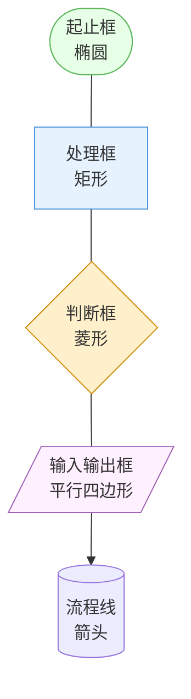
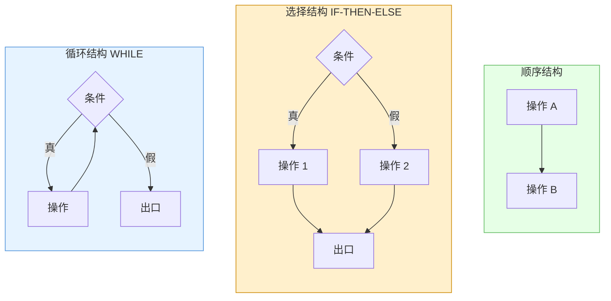
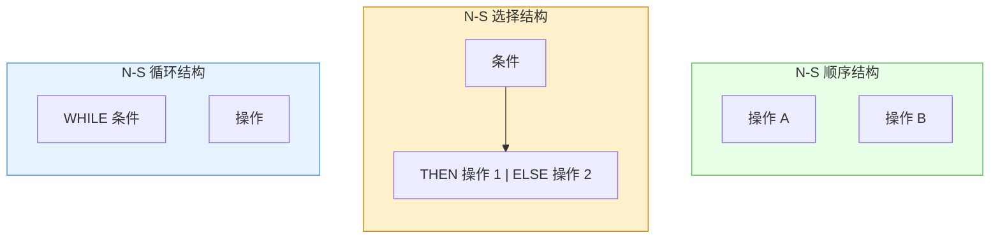
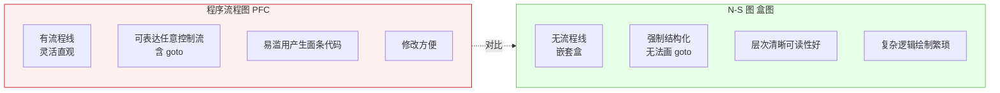
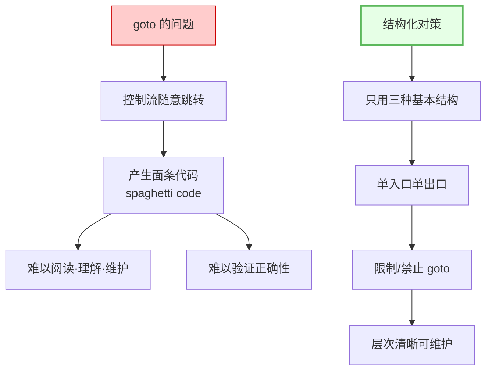
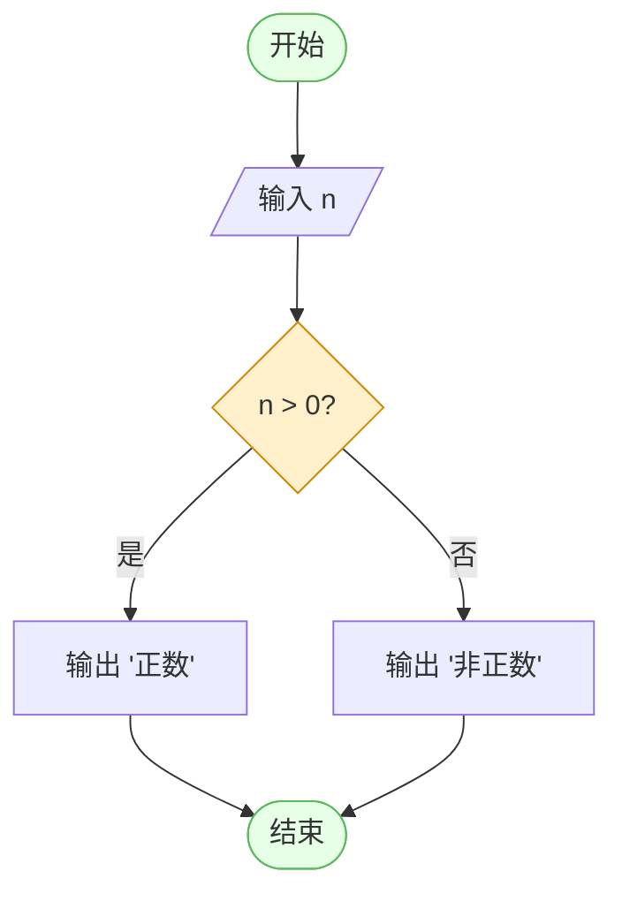

# 9.1 程序流程图与N-S图

详细设计阶段需把 [[MOC - 第6章|SC 结构图]]中每个模块的算法逻辑精确表达出来。本节阐述程序流程图（PFC）的基本符号与三种基本控制结构、N-S 图（盒图）的图形表示、二者对比，以及结构化设计对 goto 的限制，是详细设计最基础的表达工具。

## 程序流程图（PFC）

> [!definition] 程序流程图
> 程序流程图（Program Flow Chart, PFC）是用规定图形符号与流程线表示程序控制流向的图形工具，是详细设计中最经典的算法表达方式。

### 基本符号



| 符号 | 形状 | 含义 |
| --- | --- | --- |
| 起止框 | 椭圆 | 程序的开始与结束 |
| 处理框 | 矩形 | 一个或一组处理操作 |
| 判断框 | 菱形 | 条件判断，引出真/假两分支 |
| 输入输出框 | 平行四边形 | 数据的输入与输出 |
| 流程线 | 箭头 | 控制流向 |

## 三种基本控制结构

> [!definition] 基本控制结构
> 结构化程序设计由三种基本控制结构组合而成：顺序、选择、循环。三种结构都满足单入口、单出口原则，原则上不使用 goto。



| 控制结构 | 含义 | PFC 特征 |
| --- | --- | --- |
| 顺序 | 操作依次执行 | 流程线自上而下连接 |
| 选择（IF-THEN-ELSE） | 根据条件选择其一执行 | 判断框引出两分支后汇合 |
| 循环（WHILE/UNTIL） | 重复执行直到条件不满足 | 判断框与处理框形成回路 |

> [!note] WHILE 与 UNTIL 的区别
> **WHILE 型**（当型循环）先判断条件、为真才执行循环体，可能一次不执行；**UNTIL 型**（直到型循环）先执行循环体再判断条件、为假才继续，至少执行一次。两者可相互转换。

## N-S 图（盒图）

> [!definition] N-S 图
> N-S 图（盒图，Box Diagram）由 Nassi 和 Shneiderman 提出，用嵌套的矩形盒表示控制结构，**没有流程线**，从机制上强制结构化，无法表达随意的 goto 跳转。



| N-S 结构 | 表示方式 |
| --- | --- |
| 顺序 | 上下堆叠的矩形盒 |
| 选择 | 一个矩形分左右两格，上方标条件，左为 THEN 右为 ELSE |
| 循环 | 上方标 WHILE/UNTIL 条件，下方为循环体矩形 |

> [!tip] N-S 图的优势
> N-S 图无流程线，控制流只能通过盒的嵌套表达，从机制上保证单入口单出口的结构化。它使非法的 goto 跳转无法绘制，适合教学与严格结构化设计。缺点是嵌套层次多时图形较大、修改不便。

## 流程图与 N-S 图对比



| 对比维度 | 程序流程图 PFC | N-S 图（盒图） |
| --- | --- | --- |
| 流程线 | 有，灵活 | 无，强制结构化 |
| goto 表达 | 可以（但应避免） | 无法表达 |
| 结构化保证 | 依赖设计者自觉 | 机制上保证 |
| 可读性 | 控制流复杂时差 | 层次清晰较好 |
| 修改便利 | 方便 | 嵌套多时不便 |
| 适用场景 | 通用算法表达 | 严格结构化设计、教学 |

## 限制 goto 的结构化设计

> [!definition] 结构化设计原则
> 结构化设计主张程序只由顺序、选择、循环三种基本控制结构组合而成，每种结构单入口单出口，限制或禁止使用 goto 语句，以保证程序可读、可维护、可验证。



> [!note] goto 的合理使用
> 结构化设计并非绝对禁止 goto。在少数场景（如出错跳出多层嵌套循环、资源清理跳转）中，谨慎使用 goto 可简化代码。但日常设计应优先用基本结构表达，避免 goto 滥用。N-S 图通过无法绘制 goto 来强制遵守结构化原则。

## 流程图与 N-S 图示例

以"判断一个数是否为正数并输出结果"为例：



> [!example] N-S 图等价表示
> 对应的 N-S 图（用文字描述盒结构）：
> ```
> ┌─────────────────────┐
> │ 输入 n              │
> ├──────┬──────────────┤
> │ n>0? │              │
> ├──────┼──────────────┤
> │  T   │ 输出 '正数'  │
> ├──────┼──────────────┤
> │  F   │ 输出 '非正数'│
> └──────┴──────────────┘
> │ 结束                │
> └─────────────────────┘
> ```
> 可见 N-S 图无流程线，通过盒的嵌套与分格表达选择分支，结构强制清晰。

## 小结

程序流程图（PFC）用起止框、处理框、判断框、输入输出框与流程线表达控制流，灵活直观但易滥用 goto。结构化设计要求只用顺序、选择（IF-THEN-ELSE）、循环（WHILE/UNTIL）三种基本控制结构，每种单入口单出口，限制 goto 以避免面条代码。N-S 图（盒图）用嵌套矩形盒表达控制结构、无流程线，从机制上强制结构化，层次清晰但复杂逻辑绘制繁琐。二者都能表达三种基本结构，N-S 图通过去除流程线保证结构化，更适合严格结构化设计与教学。

## 关联

- 上一级：[[MOC - 第9章]]
- 下一节：[[9.2 PAD图与伪代码（PDL）]]
- 关联概念：[[1.2 软件设计分层：概要设计与详细设计]]（流程图属详细设计工具）、[[9.2 PAD图与伪代码（PDL）]]（PAD 图与 PDL 是另一种表达工具）
