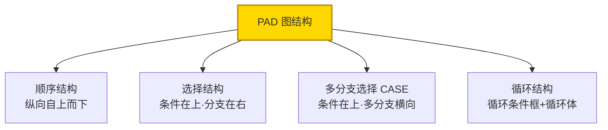
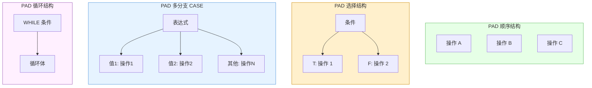
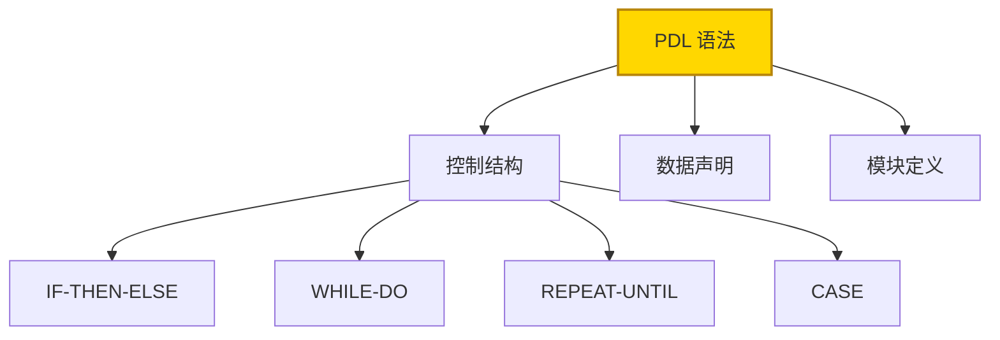
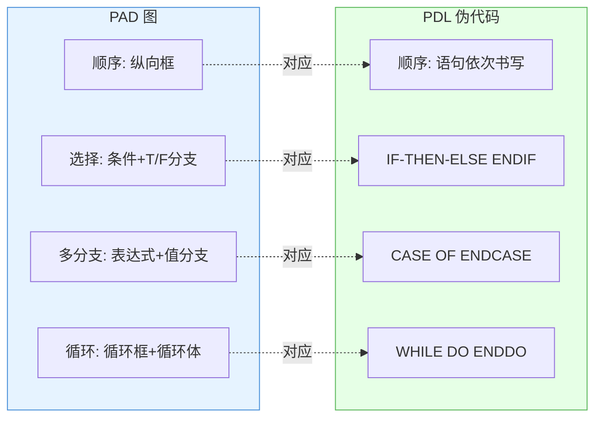
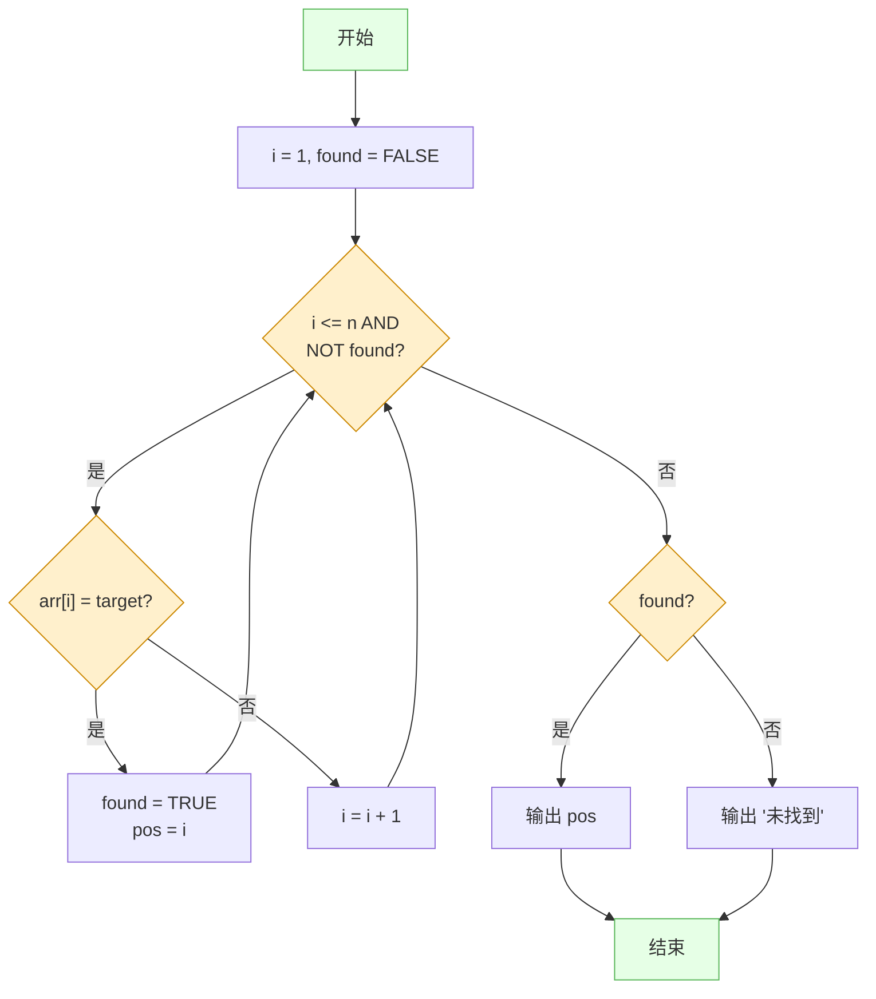

# 9.2 PAD图与伪代码（PDL）

除了 [[9.1 程序流程图与N-S图|流程图与 N-S 图]]，详细设计还常用 PAD 图（问题分析图）与 PDL（伪代码）。本节阐述 PAD 图的树形结构表示（顺序、选择、多分支、循环）、PDL 的语法规则（IF-THEN-ELSE、WHILE-DO、REPEAT-UNTIL、CASE、数据声明、模块定义），以及 PAD 图与 PDL 的对应关系。

## PAD 图（问题分析图）

> [!definition] PAD 图
> PAD 图（Problem Analysis Diagram，问题分析图）是日本日立公司提出的用树形结构表示程序逻辑的图形工具。顺序结构纵向展开，选择与循环结构横向分支，符合结构化与逐步求精思想，层次清晰、易于转换为代码。



### PAD 图的基本结构



| PAD 结构 | 图形特征 | 对应控制结构 |
| --- | --- | --- |
| 顺序结构 | 纵向自上而下排列的处理框 | 顺序执行 |
| 选择结构 | 上方判断框，右侧引出 T/F 两分支 | IF-THEN-ELSE |
| 多分支选择 | 上方表达式框，右侧引出多个值分支 | CASE |
| 循环结构 | 带双竖线的循环条件框包围循环体 | WHILE/UNTIL |

> [!tip] PAD 图的纵向与横向
> PAD 图的关键特征：**纵向**表示顺序执行（自上而下），**横向**表示分支选择（向右展开）。最左纵向主干是程序主线，向右的分支是各结构的子操作。这种二维展开使程序层次一目了然，符合从左到右、从上到下的阅读习惯。

## PDL（程序设计语言/伪代码）

> [!definition] PDL
> PDL（Program Design Language，程序设计语言），又称伪代码（Pseudocode），是用结构化自然语言与编程语言关键字混合描述算法的工具。它有严格的控制结构语法，但不受具体编程语言语法束缚，关注算法逻辑而非语法细节。

### PDL 语法规则



#### 控制结构语法

| 控制结构 | PDL 语法 | 说明 |
| --- | --- | --- |
| 选择 | `IF 条件 THEN 动作1 ELSE 动作2 ENDIF` | 条件为真执行动作1，否则动作2 |
| 当型循环 | `WHILE 条件 DO 动作 ENDDO` | 条件为真重复执行，可能零次 |
| 直到型循环 | `REPEAT 动作 UNTIL 条件` | 执行动作直到条件为真，至少一次 |
| 多分支 | `CASE 表达式 OF 值1: 动作1; 值2: 动作2; ELSE 动作N ENDCASE` | 按表达式值选择分支 |

> [!example] PDL 控制结构示例
> ```pdl
> // 选择结构：判断成绩等级
> IF score >= 90 THEN
>     grade = 'A'
> ELSE
>     IF score >= 60 THEN
>         grade = 'B'
>     ELSE
>         grade = 'C'
>     ENDIF
> ENDIF
>
> // 当型循环：累加 1 到 n
> sum = 0
> i = 1
> WHILE i <= n DO
>     sum = sum + i
>     i = i + 1
> ENDDO
>
> // 直到型循环：读入直到合法
> REPEAT
>     READ input
> UNTIL input IS VALID
>
> // 多分支：按操作码分发
> CASE opcode OF
>     1: CALL add_record
>     2: CALL delete_record
>     3: CALL query_record
>     ELSE: CALL show_error
> ENDCASE
> ```

#### 数据声明与模块定义

| 类别 | PDL 语法 | 说明 |
| --- | --- | --- |
| 数据声明 | `TYPE 类型名 IS ...` / `DATA 变量名: 类型` | 声明数据类型与变量 |
| 模块定义 | `PROCEDURE 模块名(参数表)` ... `END` | 定义模块（子程序） |
| 模块调用 | `CALL 模块名(参数)` | 调用模块 |

> [!example] 模块定义示例
> ```pdl
> PROCEDURE calculate_average(score_list, count)
>     sum = 0
>     FOR i = 1 TO count DO
>         sum = sum + score_list[i]
>     ENDFOR
>     average = sum / count
>     RETURN average
> END
> ```

## PAD 图与 PDL 对应关系

PAD 图与 PDL 一一对应，可相互转换：



| PAD 结构 | PDL 对应 | 转换要点 |
| --- | --- | --- |
| 顺序框（纵向） | 语句依次书写 | 自上而下转为自前而后 |
| 选择（条件+T/F） | IF-THEN-ELSE ENDIF | 条件框转 IF 条件，分支转 THEN/ELSE |
| 多分支（表达式+值） | CASE OF ENDCASE | 表达式转 CASE，值分支转 CASE 分支 |
| 循环（循环框+体） | WHILE-DO ENDDO | 循环条件转 WHILE 条件，循环体转 DO 体 |

> [!note] PAD 与 PDL 的互补
> PAD 图直观呈现程序层次结构，适合设计阶段交流与评审；PDL 用文本描述算法，易于编辑、修改与转换为代码。实践中常先用 PAD 图设计结构、再用 PDL 细化逻辑，二者互为补充。PAD 图可机械地转换为 PDL，反之亦然。

## PAD 图示例与 PDL 代码

以"在数组中查找指定值"为例：



> [!example] 对应的 PDL
> ```pdl
> PROCEDURE search(arr, n, target)
>     i = 1
>     found = FALSE
>     WHILE i <= n AND NOT found DO
>         IF arr[i] = target THEN
>             found = TRUE
>             pos = i
>         ELSE
>             i = i + 1
>         ENDIF
>     ENDDO
>     IF found THEN
>         OUTPUT pos
>     ELSE
>         OUTPUT '未找到'
>     ENDIF
> END
> ```

## 小结

PAD 图（问题分析图）用树形结构表达程序逻辑：顺序纵向自上而下、选择与多分支横向向右展开、循环用循环条件框包围循环体，层次清晰、符合结构化与逐步求精。PDL（伪代码）用结构化关键字（IF-THEN-ELSE、WHILE-DO、REPEAT-UNTIL、CASE）与自然语言描述算法，关注逻辑而非语法，含数据声明与模块定义。PAD 图与 PDL 一一对应、可相互转换：PAD 的顺序框对应语句序列、选择对应 IF-THEN-ELSE、多分支对应 CASE、循环对应 WHILE-DO。PAD 图适合结构设计与评审，PDL 适合细化与转码，二者互补使用。

## 关联

- 上一级：[[MOC - 第9章]]
- 上一节：[[9.1 程序流程图与N-S图]]
- 下一节：[[9.3 判定表与判定树]]
- 关联概念：[[9.1 程序流程图与N-S图]]（同为详细设计工具）、[[1.2 软件设计分层：概要设计与详细设计]]（PAD/PDL 属详细设计）
