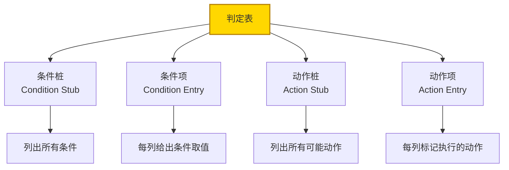
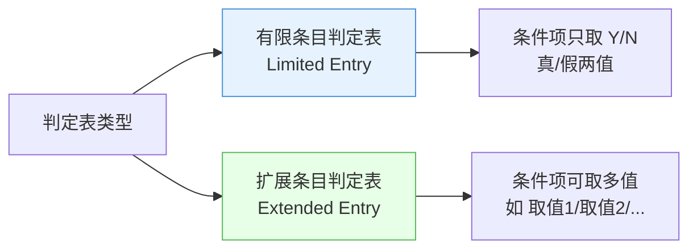
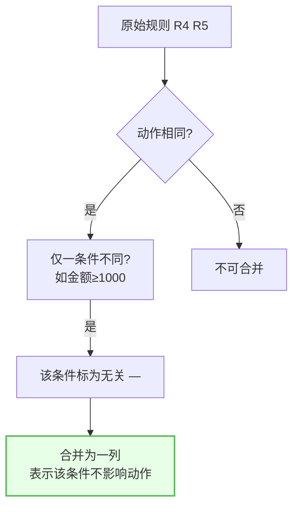
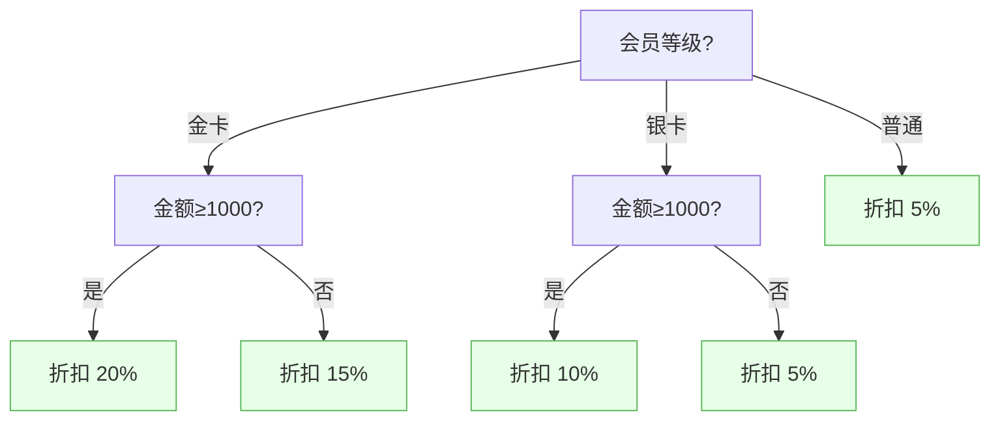
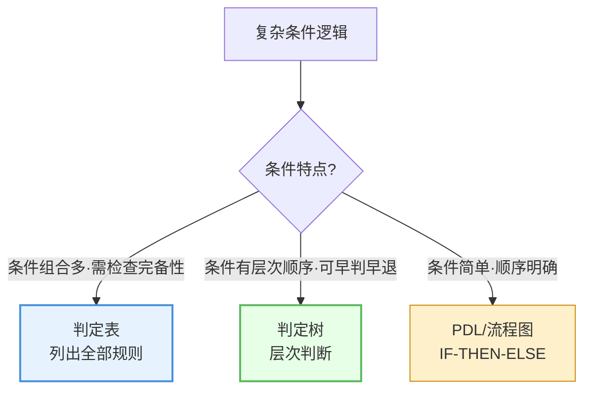

# 9.3 判定表与判定树

当模块逻辑涉及多条件组合时，[[9.2 PAD图与伪代码（PDL）|PDL]]与 [[9.1 程序流程图与N-S图|流程图]]会变得冗长难读。判定表与判定树是专门表达复杂条件逻辑的工具。本节阐述判定表的四个组成部分与两种类型、判定表化简方法、判定树的树形表示，以及二者的应用场景。

## 判定表

> [!definition] 判定表
> 判定表（Decision Table）是用表格表达多条件组合与对应动作的工具，适合条件组合复杂、动作分支多的逻辑。它由条件桩、条件项、动作桩、动作项四部分组成。

### 判定表的四个组成部分



| 组成部分 | 含义 | 位置 |
| --- | --- | --- |
| 条件桩 | 列出所有判断条件 | 左上 |
| 条件项 | 每列（每条规则）给出各条件的取值 | 右上 |
| 动作桩 | 列出所有可能的动作 | 左下 |
| 动作项 | 每列标记该条件下应执行的动作（√或×） | 右下 |

> [!note] 判定表的结构
> 判定表分为左右、上下四象限：左上为条件桩（条件列表），右上为条件项（各规则的条件取值），左下为动作桩（动作列表），右下为动作项（各规则的动作标记）。每一列称为一条"规则"，表示一组条件组合及其对应动作。

### 判定表类型



| 类型 | 条件项取值 | 特点 |
| --- | --- | --- |
| 有限条目判定表 | 只取 Y/N（真/假） | 条件简单二值，规则数随条件数指数增长 |
| 扩展条目判定表 | 可取多个具体值 | 条件可多值，表达更紧凑 |

### 判定表示例

以"订单折扣判定"为例：条件为会员等级（普通/银卡/金卡）与订单金额（≥1000/＜1000）。

```text
┌────────────────────┬─────┬─────┬─────┬─────┬─────┬─────┐
│ 条件桩             │ R1  │ R2  │ R3  │ R4  │ R5  │ R6  │
├────────────────────┼─────┼─────┼─────┼─────┼─────┼─────┤
│ 会员等级           │金卡 │金卡 │银卡 │银卡 │普通 │普通 │
│ 订单金额≥1000      │ Y   │ N   │ Y   │ N   │ Y   │ N   │
├────────────────────┼─────┼─────┼─────┼─────┼─────┼─────┤
│ 动作桩             │     │     │     │     │     │     │
├────────────────────┼─────┼─────┼─────┼─────┼─────┼─────┤
│ 折扣 20%           │ √   │     │     │     │     │     │
│ 折扣 15%           │     │ √   │     │     │     │     │
│ 折扣 10%           │     │     │ √   │     │     │     │
│ 折扣 5%            │     │     │     │ √   │ √   │     │
│ 无折扣             │     │     │     │     │     │ √   │
└────────────────────┴─────┴─────┴─────┴─────┴─────┴─────┘
```

## 判定表化简

> [!definition] 判定表化简
> 判定表化简是通过合并条件组合中"无关条件"相同的规则，减少规则数、简化判定表的过程。若两条规则仅某一条件取值不同而动作完全相同，则该条件为"无关"，用"—"表示，两规则合并为一条。



化简示例：上表中 R4（银卡/＜1000）与 R5（普通/≥1000）动作不同不可合并；但若普通会员无论金额都给 5%，则 R5（普通/≥1000）与 R6（普通/＜1000）动作相同（均 5%），金额条件无关，合并为：

```text
│ 会员等级           │金卡 │金卡 │银卡 │银卡 │普通      │
│ 订单金额≥1000      │ Y   │ N   │ Y   │ N   │ —        │  ← 无关
│ 折扣               │20%  │15%  │10%  │5%   │5%        │
```

> [!tip] 无关条件"—"的含义
> "—"表示该条件无论取何值，动作都相同，即该条件对动作无影响。合并后规则数减少，判定表更简洁。化简时需逐对比较规则，确保合并的规则动作完全一致。

## 判定树

> [!definition] 判定树
> 判定树（Decision Tree）是用树形结构表达条件与动作关系的工具。每个内部节点表示一个条件判断，分支表示条件取值，叶子节点表示对应动作。判定树按条件层次依次判断，适合条件有先后顺序的逻辑。



| 判定树元素 | 含义 |
| --- | --- |
| 根节点 | 第一个判断条件 |
| 内部节点 | 后续判断条件 |
| 分支 | 条件的取值（如 金卡/银卡/普通） |
| 叶子节点 | 对应的动作（如 折扣 20%） |

> [!note] 判定树与判定表的区别
> 判定表列出所有条件组合（无序），适合条件组合完整且需检查遗漏的情况；判定树按条件层次依次判断（有序），适合条件有先后顺序、可早判早退的逻辑。判定树更直观易读，判定表更完备易检查完整性。

## 判定表与判定树的应用场景



| 工具 | 适用场景 | 优点 | 缺点 |
| --- | --- | --- | --- |
| 判定表 | 条件组合多、需检查完备性与遗漏 | 完备、易检查遗漏、可化简 | 无序、不直观 |
| 判定树 | 条件有层次顺序、可早判早退 | 直观易读、层次清晰 | 难检查完备性 |
| PDL/流程图 | 条件简单、顺序明确 | 通用、易编码 | 条件多时冗长难读 |

> [!example] 应用场景示例
> - **订单折扣**（会员等级×金额，需检查所有组合）→ 判定表；
> - **故障诊断**（按症状层次逐步判断、早判早退）→ 判定树；
> - **简单成绩判定**（score≥90 为 A 否则 B）→ PDL 即可。

## 小结

判定表用表格表达多条件组合与对应动作，由条件桩、条件项、动作桩、动作项四部分组成，分有限条目（条件取 Y/N）与扩展条目（条件可多值）两种。判定表化简通过合并动作相同且仅一条件不同的规则（无关条件用"—"表示）减少规则数。判定树用树形结构按条件层次判断，叶子节点为动作，适合有先后顺序的逻辑。判定表适合条件组合多且需检查完备性，判定树适合条件有层次顺序可早判早退，PDL/流程图适合简单条件逻辑。

## 关联

- 上一级：[[MOC - 第9章]]
- 上一节：[[9.2 PAD图与伪代码（PDL）]]
- 关联概念：[[9.1 程序流程图与N-S图]]（同为详细设计工具）、[[9.2 PAD图与伪代码（PDL）]]（条件复杂时改用判定表/树）、[[1.2 软件设计分层：概要设计与详细设计]]（判定表/树属详细设计工具）
