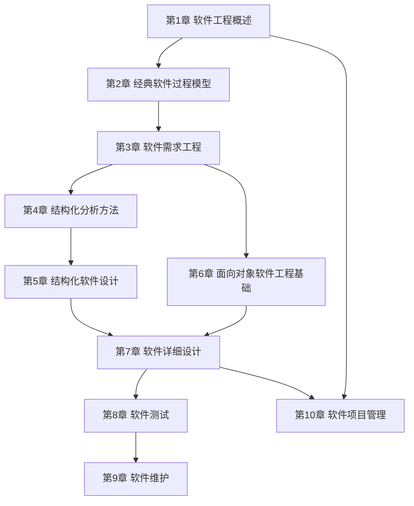

# MOC - 软件工程

> [!info] 课程定位
> 软件工程是计算机专业核心课程，研究用工程化方法构建和维护软件。它解决的核心问题是：**如何在有限成本与时间内，系统化、规范化地开发出满足用户需求、高质量、可维护的软件**。课程贯穿软件危机与软件工程起源、软件生命周期与过程模型、需求工程、结构化与面向对象分析设计、编码实现、软件测试、软件维护与项目管理，是从“会写程序”走向“能工程化交付软件”的关键桥梁。

## 课程摘要

本课程围绕“**基础概念 → 过程模型 → 分析设计 → 实现维护 → 项目管理**”五条主线展开。学生需要掌握：

1. 软件、软件危机与软件工程的基本概念，软件生命周期与软件过程，软件工程三要素与目标；
2. 经典软件过程模型（瀑布、快速原型、增量、螺旋、喷泉、敏捷）的原理、适用场景与优缺点；
3. 软件需求工程：需求获取、需求分析与建模（DFD、DD、ER、用例建模）、需求规格说明与需求验证管理；
4. 结构化分析与设计、面向对象分析与设计（UML 建模）的方法体系；
5. 软件编码规范、复审与实现，软件测试方法与测试阶段划分；
6. 软件维护的类型与过程，软件项目管理（进度、成本、质量、配置、风险与人员管理）。

## 章节结构与依赖关系

> [!note] 依赖说明
> 第1章奠定软件工程的基本概念与三要素；第2章给出过程模型，明确开发活动的组织方式；第3章从需求切入工程化开发的主线；第4–5章沿结构化路线完成分析与设计，第6章给出面向对象软件工程基础的另一条建模路线，二者在第7章汇聚到软件详细设计，为编码实现做准备；第8章关注质量验证，第9章关注交付后的维护；第10章将视角提升到项目级管理，贯穿全生命周期。

## 章节导航

| 章节 | 主题 | 阶段 | 入口 |
| --- | --- | --- | --- |
| 第1章 | 软件工程概述 | 基础概念 | [[MOC - 第1章]] |
| 第2章 | 经典软件过程模型 | 过程模型 | [[MOC - 第2章]] |
| 第3章 | 软件需求工程 | 分析设计 | [[MOC - 第3章]] |
| 第4章 | 结构化分析方法 | 分析设计 | [[MOC - 第4章]] |
| 第5章 | 结构化软件设计 | 分析设计 | [[MOC - 第5章]] |
| 第6章 | 面向对象软件工程基础 | 分析设计 | [[MOC - 第6章]] |
| 第7章 | 软件详细设计 | 分析设计 | [[MOC - 第7章]] |
| 第8章 | 软件测试 | 实现维护 | [[MOC - 第8章]] |
| 第9章 | 软件维护 | 实现维护 | [[MOC - 第9章]] |
| 第10章 | 软件项目管理 | 项目管理 | [[MOC - 第10章]] |

## 分阶段学习目标

> [!example] 基础概念阶段（第1章）
> 建立软件工程的心智模型。理解软件的定义与特征、软件危机的表现与成因、软件工程的诞生与定义；掌握软件生命周期与软件过程、软件工程三要素（方法、工具、过程）与软件工程目标，明确软件工程与计算机科学的关系。

> [!example] 过程模型阶段（第2章）
> 系统掌握经典软件过程模型。理解瀑布、快速原型、增量、螺旋、喷泉与敏捷开发模型的原理、阶段划分、文档驱动或风险驱动特征，能根据项目规模、需求明确程度与风险水平选择合适的过程模型。

> [!example] 分析设计阶段（第3–6章）
> 掌握需求工程全流程：需求获取方法、需求分类、结构化与面向对象需求建模、需求规格说明与需求验证管理。掌握结构化分析（DFD/DD/ER）与结构化设计（面向数据流设计）方法，以及面向对象分析设计的 UML 建模与设计原则。

> [!example] 实现维护阶段（第7–9章）
> 掌握编码规范、代码复审与程序设计语言选择；掌握软件测试的层级与方法、测试用例设计；掌握软件维护的四种类型（改正性、适应性、完善性、预防性）与维护过程，理解软件可维护性与文档的作用。

> [!example] 项目管理阶段（第10章）
> 理解软件项目管理的核心要素：进度与成本估算、质量保证、配置管理、风险管理、人员与团队组织。掌握典型估算方法（代码行、功能点、COCOMO）与配置管理基线、变更控制流程。

## 先修与关联课程

- [[MOC - 面向对象系统分析与建模|面向对象系统分析与建模]]：提供 UML 建模、用例建模、类图/时序图/状态图等系统建模方法，是本课程第6章面向对象分析与设计的方法论基础与深化。
- [[MOC - 软件测试技术|软件测试技术]]：在本课程第8章软件测试基础上展开，系统讲授黑盒/白盒测试方法、测试用例设计、缺陷管理与自动化测试，二者在质量保障层面相互衔接。
- 关联延伸：[[MOC - 数据结构|数据结构]]与[[MOC - 算法设计与分析|算法设计与分析]]（编码与设计的基础）、数据库原理（需求分析与数据建模中 ER 图的落地）、[[MOC - Java程序设计|Java程序设计]]/[[MOC - C语言程序设计A|C语言程序设计A]]（编码实现的实现载体）。

## 工具与方法推荐

| 工具 | 类型 | 用途 | 适用章节 | 说明 |
| --- | --- | --- | --- | --- |
| Visio / draw.io | 绘图工具 | 绘制数据流图(DFD)、流程图、ER 图 | 第3–5章 | draw.io 开源免费，支持导出多种格式；Visio 适合工程文档 |
| StarUML | UML 建模工具 | 绘制用例图、类图、时序图、状态图、组件图 | 第6章 | 支持多种 UML 图，可生成代码骨架与文档 |
| Git | 版本控制工具 | 源码版本管理、分支协作、配置管理 | 第7、10章 | 配合 GitHub/Gitee，是软件配置管理的工程标准 |
| MS Project | 项目管理工具 | 进度计划、甘特图、资源分配与成本估算 | 第10章 | 适合 WBS 分解与关键路径管理；轻量可选用 GanttProject |
| Enterprise Architect | 企业级建模 | 复杂系统架构建模与需求追踪 | 第3、6章 | 支持需求-设计-代码全链路追踪，适合大型项目 |
| Jira | 缺陷与任务管理 | 需求/缺陷/任务跟踪、敏捷看板 | 第8、10章 | 支持 Scrum/Kanban，串联需求与测试管理 |

> [!tip] 工具选型建议
> 课程练习推荐 **Visio 或 draw.io** 完成结构化分析的数据流图绘制、**StarUML** 完成面向对象 UML 建模、**Git** 进行编码与版本管理实践、**MS Project** 体验项目计划与甘特图编制。先用轻量工具掌握方法，再在综合项目中整合使用。

## 复习与查询入口

- 基础概念速查：[[1.1 软件、软件危机、软件工程概念]]、[[1.2 软件生命周期与软件过程]]、[[1.3 软件工程三要素、软件工程目标]]
- 过程模型速查：[[2.1 瀑布模型与快速原型模型]]、[[2.2 增量模型与螺旋模型]]、[[2.3 喷泉模型与敏捷开发模型]]
- 需求工程速查：[[3.1 需求工程概述与需求获取]]、[[3.2 需求分析与建模]]、[[3.3 需求规格说明与需求验证]]
- 结构化分析速查：[[4.1 数据流图（DFD）与数据字典]]、[[4.2 实体关系图与加工说明]]、[[4.3 结构化分析综合案例]]
- 结构化设计速查：[[5.1 结构化设计原理与结构图]]、[[5.2 模块内聚与耦合]]、[[5.3 变换分析与事务分析]]
- 面向对象基础速查：[[6.1 面向对象基本概念与特征]]、[[6.2 面向对象分析与设计（OOA-OOD）]]、[[6.3 统一建模语言（UML）在软件工程中的应用]]
- 详细设计速查：[[7.1 详细设计工具与方法]]、[[7.2 人机界面设计]]、[[7.3 详细设计文档与评审]]
