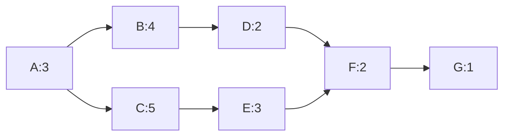

# 习题 - 第10章 软件项目管理

> [!info] 本章习题定位
> 第10章围绕软件项目管理展开，习题覆盖 WBS、甘特图、关键路径法、COCOMO 与功能点估算、配置管理（Git/SCM）、风险管理与 CMMI 五级。计算题要求完整计算关键路径、工期、COCOMO 人月与功能点，并展示完整步骤。

## 知识点覆盖表

| 题号 | 题型 | 考查知识点 | 对应笔记 |
| --- | --- | --- | --- |
| 10.1 | 单选 | WBS 工作分解结构 | [[10.1 项目计划与进度管理]] |
| 10.2 | 单选 | 甘特图特点 | [[10.1 项目计划与进度管理]] |
| 10.3 | 单选 | 关键路径定义 | [[10.1 项目计划与进度管理]] |
| 10.4 | 单选 | 关键路径时差 | [[10.1 项目计划与进度管理]] |
| 10.5 | 单选 | COCOMO 模型 | [[10.1 项目计划与进度管理]] |
| 10.6 | 单选 | 功能点分析 | [[10.1 项目计划与进度管理]] |
| 10.7 | 单选 | 配置管理 | [[10.2 软件配置管理与风险管理]] |
| 10.8 | 单选 | 风险管理 | [[10.2 软件配置管理与风险管理]] |
| 10.9 | 单选 | CMMI 五级 | [[10.3 软件质量保证与项目组织]] |
| 10.10 | 单选 | CMMI 级别判定 | [[10.3 软件质量保证与项目组织]] |
| 10.11 | 多选 | WBS 与甘特图 | [[10.1 项目计划与进度管理]] |
| 10.12 | 多选 | COCOMO 三级模型 | [[10.1 项目计划与进度管理]] |
| 10.13 | 多选 | 配置管理活动 | [[10.2 软件配置管理与风险管理]] |
| 10.14 | 多选 | 风险管理过程 | [[10.2 软件配置管理与风险管理]] |
| 10.15 | 多选 | CMMI 五级 | [[10.3 软件质量保证与项目组织]] |
| 10.16 | 判断 | 关键路径时差 | [[10.1 项目计划与进度管理]] |
| 10.17 | 判断 | COCOMO | [[10.1 项目计划与进度管理]] |
| 10.18 | 判断 | Git 配置管理 | [[10.2 软件配置管理与风险管理]] |
| 10.19 | 判断 | 风险暴露 | [[10.2 软件配置管理与风险管理]] |
| 10.20 | 判断 | CMMI | [[10.3 软件质量保证与项目组织]] |
| 10.21 | 简答 | WBS 与甘特图 | [[10.1 项目计划与进度管理]] |
| 10.22 | 简答 | 关键路径法 | [[10.1 项目计划与进度管理]] |
| 10.23 | 简答 | 配置管理 | [[10.2 软件配置管理与风险管理]] |
| 10.24 | 简答 | CMMI 五级 | [[10.3 软件质量保证与项目组织]] |
| 10.25 | 设计 | 关键路径计算 | [[10.1 项目计划与进度管理]] |
| 10.26 | 设计 | COCOMO 估算 | [[10.1 项目计划与进度管理]] |
| 10.27 | 设计 | 功能点估算 | [[10.1 项目计划与进度管理]] |
| 10.28 | 设计 | 风险管理设计 | [[10.2 软件配置管理与风险管理]] |
| 10.29 | 综合 | 关键路径与工期综合 | [[10.1 项目计划与进度管理]] |
| 10.30 | 综合 | 项目管理综合 | [[10.2 软件配置管理与风险管理]] |

## 一、单选题（每题 2 分，共 10 题）

**10.1** 把项目自顶向下逐层分解为可管理的工作包，这种技术称为？

A. 甘特图  
B. 关键路径法  
C. 工作分解结构（WBS）  
D. 功能点分析

**10.2** 甘特图（Gantt Chart）的主要作用是？

A. 计算项目成本  
B. 以横道形式直观展示各任务的时间安排与进度  
C. 识别项目风险  
D. 度量软件规模

**10.3** 在项目网络图中，从开始到结束耗时最长的路径称为？

A. 最短路径  
B. 关键路径  
C. 最优路径  
D. 冗余路径

**10.4** 关于关键路径上的活动，下列说法正确的是？

A. 总时差为 0  
B. 总时差最大  
C. 可以任意延迟  
D. 不影响项目工期

**10.5** COCOMO 模型用于估算？

A. 软件规模（功能点）  
B. 软件成本与工作量（人月）  
C. 项目风险  
D. 关键路径

**10.6** 功能点分析（FPA）通过下列哪组信息域度量软件规模？

A. 代码行数  
B. 外部输入、外部输出、外部查询、内部逻辑文件、外部接口文件  
C. 类、对象、方法  
D. 模块、调用、数据

**10.7** 软件配置管理（SCM）的核心活动不包括？

A. 配置标识  
B. 版本控制  
C. 变更控制  
D. 绩效考核

**10.8** 风险暴露（Risk Exposure）的计算公式是？

A. RE = P × L（风险发生概率 × 损失）  
B. RE = L / P  
C. RE = P + L  
D. RE = P - L

**10.9** CMMI 五级中，"组织已建立标准过程并可量化管理"对应第几级？

A. 第 1 级初始级  
B. 第 2 级已管理级  
C. 第 3 级已定义级  
D. 第 4 级量化管理级

**10.10** 某组织开发过程依赖个人英雄主义、无规范、结果不可预测，它处于 CMMI 的？

A. 第 1 级初始级  
B. 第 2 级已管理级  
C. 第 3 级已定义级  
D. 第 5 级优化级

## 二、多选题（每题 3 分，共 5 题）

**10.11** 关于 WBS 与甘特图，下列说法正确的有？（多选）

A. WBS 把项目自顶向下分解为工作包  
B. 甘特图直观展示任务的时间安排与进度  
C. WBS 反映任务间的依赖关系  
D. 甘特图能清晰展示关键路径  
E. WBS 的底层是可管理、可估算的工作包

**10.12** COCOMO 模型的三个层次包括？（多选）

A. 基本 COCOMO  
B. 中级 COCOMO  
C. 详细 COCOMO  
D. 敏捷 COCOMO  
E. 功能点 COCOMO

**10.13** 软件配置管理（SCM）的核心活动包括？（多选）

A. 配置标识  
B. 版本控制  
C. 变更控制  
D. 配置状态报告  
E. 配置审计

**10.14** 风险管理的过程包括？（多选）

A. 风险识别  
B. 风险分析（评估概率与影响）  
C. 风险规划（缓解策略）  
D. 风险监控  
E. 风险隐瞒

**10.15** CMMI 五级包括？（多选）

A. 初始级（1 级）  
B. 已管理级（2 级）  
C. 已定义级（3 级）  
D. 量化管理级（4 级）  
E. 优化级（5 级）

## 三、判断题（每题 2 分，共 5 题）

**10.16** 关键路径上活动的总时差为 0，任何关键活动延迟都会导致项目工期延长。

**10.17** COCOMO 基本模型公式为 PM = a × (KLOC)^b，其中 PM 为人月，KLOC 为千行代码数。

**10.18** Git 是集中式版本控制系统，所有操作都必须连接中央服务器。

**10.19** 风险暴露 RE = P × L，表示风险发生概率与潜在损失的乘积，用于量化风险大小。

**10.20** CMMI 第 5 级（优化级）强调持续改进，通过量化反馈不断优化过程。

## 四、简答题（每题 6 分，共 4 题）

**10.21** 说明 WBS 与甘特图各自的作用与区别。

**10.22** 说明关键路径法的定义、计算步骤及关键路径的意义。

**10.23** 简述软件配置管理（SCM）的核心活动及 Git 在版本控制中的作用。

**10.24** 列出 CMMI 五级并说明每级的特征。

## 五、设计题/分析题（每题 8 分，共 4 题）

**10.25** 某项目活动及依赖关系如下，请计算各活动的最早开始（ES）、最早结束（EF）、最晚开始（LS）、最晚结束（LF）、总时差，找出关键路径并计算项目工期。

| 活动 | 紧前活动 | 工期（天） |
| --- | --- | --- |
| A | — | 3 |
| B | A | 4 |
| C | A | 5 |
| D | B | 2 |
| E | C | 3 |
| F | D, E | 2 |
| G | F | 1 |

**10.26** 某有机型（Organic）项目估算规模为 50 KLOC，采用基本 COCOMO 模型估算工作量（人月）。已知有机型系数 a=2.4，b=1.05。请写出公式并计算结果（保留一位小数）。

**10.27** 某系统功能点信息域如下，请计算未调整功能点（UFP）与功能点（FP）。功能点权重表：EI 低3/中4/高6；EO 低4/中5/高7；EQ 低3/中4/高6；ILF 低7/中10/高15；EIF 低5/中7/高10。技术复杂度因子 TCF = 0.65 + 0.01 × ΣDi，ΣDi = 35。

| 信息域 | 数量 | 复杂度 |
| --- | --- | --- |
| 外部输入 EI | 5 | 低 |
| 外部输出 EO | 3 | 中 |
| 外部查询 EQ | 4 | 低 |
| 内部逻辑文件 ILF | 2 | 高 |
| 外部接口文件 EIF | 3 | 中 |

**10.28** 某项目识别出三项风险：①需求变更概率 40%，损失 20 人日；②关键技术不成熟概率 30%，损失 50 人日；③人员离职概率 20%，损失 30 人日。请计算各项风险暴露并按优先级排序，给出最高优先级风险的缓解策略。

## 六、综合题/案例题（每题 10 分，共 2 题）

**10.29** 某项目网络图如下，活动及工期：A(3)→B(4)、A(3)→C(5)；B→D(2)；C→E(3)；D、E→F(2)；F→G(1)。请完成：
1. 用 Mermaid 绘制项目网络图。
2. 正向计算 ES/EF，逆向计算 LS/LF，找出关键路径与项目工期。
3. 若活动 C 的工期从 5 天延长到 7 天，关键路径与工期是否变化？为什么？

**10.30** 某公司开发过程混乱、缺陷率高、项目经常延期，希望通过 CMMI 改进。请回答：
1. 判断该公司当前可能所处的 CMMI 级别。
2. 列出从当前级别提升到第 3 级（已定义级）应做的主要改进。
3. 说明在改进过程中配置管理与风险管理应如何配合，并简述 Git 在配置管理中的具体应用。

---

## 答案与解析

### 单选题答案

点击展开单选题答案与解析

**10.1 答案：C**
解析：WBS（工作分解结构）把项目自顶向下逐层分解为可管理的工作包。

**10.2 答案：B**
解析：甘特图以横道形式直观展示各任务的时间安排与进度。

**10.3 答案：B**
解析：关键路径是从开始到结束耗时最长的路径，决定项目最短工期。

**10.4 答案：A**
解析：关键路径上活动总时差为 0，任何延迟都会导致项目工期延长。

**10.5 答案：B**
解析：COCOMO 模型用于估算软件成本与工作量（人月）。

**10.6 答案：B**
解析：功能点分析通过 EI、EO、EQ、ILF、EIF 五个信息域度量软件规模。

**10.7 答案：D**
解析：配置管理核心活动为配置标识、版本控制、变更控制、配置状态报告、配置审计。绩效考核不属于配置管理。

**10.8 答案：A**
解析：风险暴露 RE = P × L（概率 × 损失）。

**10.9 答案：D**
解析：CMMI 第 4 级为量化管理级，组织已建立标准过程（第 3 级）并可量化管理。注意"已建立标准过程并可量化管理"是量化管理级（第 4 级）的特征，需有第 3 级基础。

**10.10 答案：A**
解析：依赖个人英雄主义、无规范、结果不可预测是第 1 级初始级的典型特征。

### 多选题答案

点击展开多选题答案与解析

**10.11 答案：A、B、E**
解析：WBS 把项目分解为工作包（A），甘特图展示时间安排（B），WBS 底层是可管理工作包（E）。C 错误，WBS 不直接反映依赖关系（依赖关系在网络图/甘特图中表示）；D 错误，甘特图不擅长展示关键路径（关键路径由网络图计算）。

**10.12 答案：A、B、C**
解析：COCOMO 三级为基本、中级、详细 COCOMO。敏捷 COCOMO、功能点 COCOMO 不存在。

**10.13 答案：A、B、C、D、E**
解析：配置管理核心活动为配置标识、版本控制、变更控制、配置状态报告、配置审计，五项均属于。

**10.14 答案：A、B、C、D**
解析：风险管理过程为风险识别、风险分析、风险规划、风险监控。E（风险隐瞒）是错误做法。

**10.15 答案：A、B、C、D、E**
解析：CMMI 五级为初始级、已管理级、已定义级、量化管理级、优化级，五项均属于。

### 判断题答案

点击展开判断题答案与解析

**10.16 答案：正确**
解析：关键路径活动总时差为 0，任何关键活动延迟都会延长项目工期。

**10.17 答案：正确**
解析：基本 COCOMO 公式为 PM = a × (KLOC)^b，PM 为人月，KLOC 为千行代码数。

**10.18 答案：错误**
解析：Git 是分布式版本控制系统，支持本地提交与离线操作，不是集中式。

**10.19 答案：正确**
解析：风险暴露 RE = P × L，量化风险大小。

**10.20 答案：正确**
解析：CMMI 第 5 级优化级强调持续改进，通过量化反馈优化过程。

### 简答题答案

点击展开简答题参考答案

**10.21 参考答案**
- WBS：把项目自顶向下逐层分解为可管理、可估算的工作包，作用是明确项目范围与任务分解，便于分工与估算。
- 甘特图：以横道形式直观展示各任务的时间安排、进度与并行关系，作用是进度可视化与跟踪。
- 区别：WBS 关注"做什么"（任务分解），甘特图关注"何时做"（时间安排）；WBS 不直接反映依赖，甘特图反映时间与并行关系。

**10.22 参考答案**
关键路径法：项目网络图中从开始到结束耗时最长的路径为关键路径，决定项目最短工期。
计算步骤：
1. 正向计算各活动最早开始 ES 与最早结束 EF（ES = 紧前活动 EF 的最大值，EF = ES + 工期）。
2. 逆向计算各活动最晚开始 LS 与最晚结束 LF（LF = 紧后活动 LS 的最小值，LS = LF - 工期）。
3. 计算总时差 = LS - ES（或 LF - EF）。
4. 总时差为 0 的活动构成关键路径。
意义：关键路径决定项目工期，关键活动延迟会延长工期，是进度管理的重点。

**10.23 参考答案**
SCM 核心活动：①配置标识（标识配置项与基线）；②版本控制（管理配置项版本演进）；③变更控制（审批与跟踪变更）；④配置状态报告（记录配置状态）；⑤配置审计（验证配置完整性一致性）。
Git 在版本控制中的作用：Git 是分布式版本控制系统，支持分支/合并、本地提交、离线操作、历史追溯，用于管理源代码与文档的版本、协同开发、变更追溯与回滚，是 SCM 的核心工具。

**10.24 参考答案**
CMMI 五级：
1. 初始级（1 级）：过程无序，依赖个人英雄主义，结果不可预测。
2. 已管理级（2 级）：建立基本项目管理，过程可重复，需求与目标可实现。
3. 已定义级（3 级）：建立组织级标准过程并裁剪应用到项目，过程一致可理解。
4. 量化管理级（4 级）：用量化度量与统计技术管理过程，质量与性能可预测。
5. 优化级（5 级）：通过量化反馈持续改进过程，不断优化。

### 设计题答案

点击展开设计题参考答案

**10.25 参考答案**
正向计算（ES/EF）：
- A: ES=0, EF=3
- B: ES=3, EF=7
- C: ES=3, EF=8
- D: ES=7, EF=9
- E: ES=8, EF=11
- F: ES=max(9, 11)=11, EF=13
- G: ES=13, EF=14
项目工期 = 14 天。

逆向计算（LS/LF）：
- G: LF=14, LS=13
- F: LF=13, LS=11
- D: LF=11, LS=9
- E: LF=11, LS=8
- B: LF=9, LS=5
- C: LF=8, LS=3
- A: LF=3, LS=0

总时差（LS - ES）：
- A: 0-0=0
- B: 5-3=2
- C: 3-3=0
- D: 9-7=2
- E: 8-8=0
- F: 11-11=0
- G: 13-13=0
关键路径（时差为 0）：A → C → E → F → G，工期 = 3+5+3+2+1 = 14 天。

**10.26 参考答案**
基本 COCOMO 公式：PM = a × (KLOC)^b
代入：PM = 2.4 × 50^1.05
计算步骤：
1. 50^1.05 = e^(1.05 × ln50) = e^(1.05 × 3.9120) = e^4.1076 ≈ 60.8
2. PM = 2.4 × 60.8 ≈ 145.9
结果：工作量约为 145.9 人月。

**10.27 参考答案**
UFP 计算：
| 信息域 | 数量 | 复杂度权重 | 小计 |
| --- | --- | --- | --- |
| EI | 5 | 3（低） | 15 |
| EO | 3 | 5（中） | 15 |
| EQ | 4 | 3（低） | 12 |
| ILF | 2 | 15（高） | 30 |
| EIF | 3 | 7（中） | 21 |
UFP = 15 + 15 + 12 + 30 + 21 = 93
TCF = 0.65 + 0.01 × 35 = 0.65 + 0.35 = 1.0
FP = UFP × TCF = 93 × 1.0 = 93
结果：未调整功能点 UFP = 93，功能点 FP = 93。

**10.28 参考答案**
风险暴露计算：
- ①需求变更：RE = 0.4 × 20 = 8 人日
- ②关键技术不成熟：RE = 0.3 × 50 = 15 人日
- ③人员离职：RE = 0.2 × 30 = 6 人日
按 RE 优先级排序：②（15）> ①（8）> ③（6）。
最高优先级风险（关键技术不成熟）缓解策略：①提前做技术验证 PoC；②引入有经验的技术顾问；③准备备选技术方案；④预留风险缓冲时间与资源。

### 综合题答案

点击展开综合题参考答案

**10.29 参考答案**
1. 项目网络图（Mermaid）：

2. 正向 ES/EF：
- A: ES=0, EF=3
- B: ES=3, EF=7
- C: ES=3, EF=8
- D: ES=7, EF=9
- E: ES=8, EF=11
- F: ES=11, EF=13
- G: ES=13, EF=14
逆向 LS/LF：
- G: LF=14, LS=13
- F: LF=13, LS=11
- D: LF=11, LS=9
- E: LF=11, LS=8
- B: LF=9, LS=5
- C: LF=8, LS=3
- A: LF=3, LS=0
时差：A=0, B=2, C=0, D=2, E=0, F=0, G=0。
关键路径：A→C→E→F→G，工期 14 天。
3. 若 C 从 5 天延长到 7 天：
- C: EF=3+7=10；E: ES=10, EF=13；F: ES=max(D EF=9, E EF=13)=13, EF=15；G: EF=16。
- 关键路径仍为 A→C→E→F→G，工期变为 16 天。
- 关键路径不变化（C 本就在关键路径上），但工期延长 2 天至 16 天。因为 C 在关键路径上，其延迟直接导致工期延长。

**10.30 参考答案**
1. 当前级别：第 1 级初始级。开发过程混乱、依赖个人、缺陷率高、项目延期、结果不可预测，符合初始级特征。
2. 提升到第 3 级（已定义级）的改进：
   - 从 1 级到 2 级（已管理级）：建立基本项目管理（需求管理、项目计划与跟踪、配置管理、质量保证），使过程可重复。
   - 从 2 级到 3 级（已定义级）：建立组织级标准过程库，制定裁剪指南，项目按标准过程裁剪执行，统一培训，过程一致可理解。
3. 配置管理与风险管理的配合：
   - 配置管理：建立配置标识与版本控制，对需求、设计、代码、测试用例做基线管理，变更走变更控制流程，定期配置审计，保证工件一致可追溯。
   - 风险管理：识别过程改进与项目风险，量化评估，制定缓解策略并监控。
   - Git 的具体应用：用分支管理（如 main/develop/feature 分支）隔离变更，用提交与标签管理版本与基线，用合并请求做变更评审，用历史记录实现追溯与回滚，支持团队协同开发与配置审计。

## 考点统计表

| 考查维度 | 题量 | 分值占比 | 难度 |
| --- | --- | --- | --- |
| WBS 与甘特图 | 4 | 约 15% | 中 |
| 关键路径法 | 6 | 约 22% | 高 |
| COCOMO 估算 | 4 | 约 15% | 中高 |
| 功能点估算 | 3 | 约 11% | 中高 |
| 配置管理（Git/SCM） | 4 | 约 15% | 中 |
| 风险管理 | 4 | 约 15% | 中 |
| CMMI 五级 | 4 | 约 12% | 中 |
| **合计** | **30** | **100%** | — |

## 关联

- 上一级：[[MOC - 软件工程]]
- 本章知识点：[[MOC - 第10章]]
- 上一章习题：[[习题-第9章-软件维护]]
