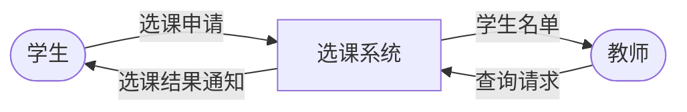
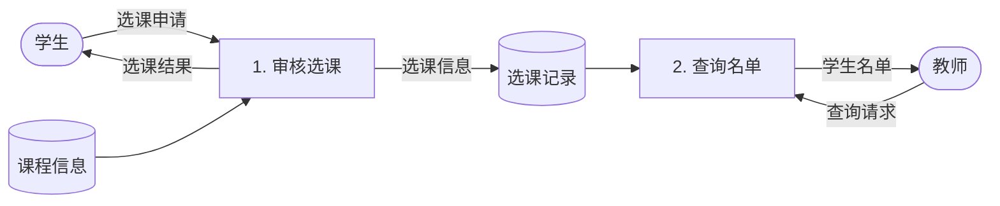
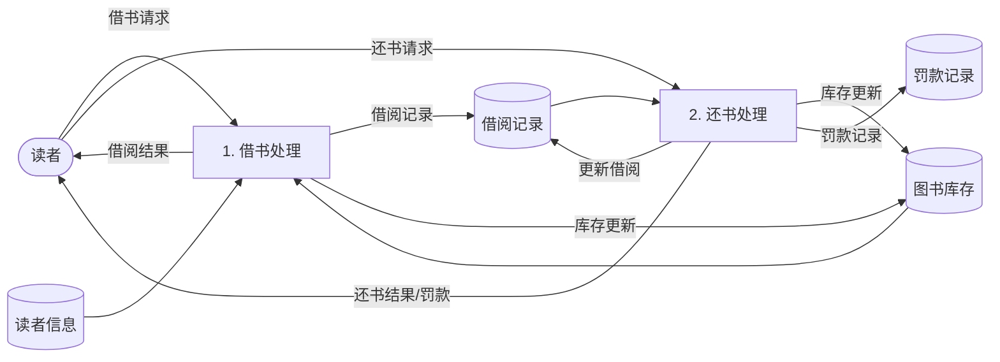
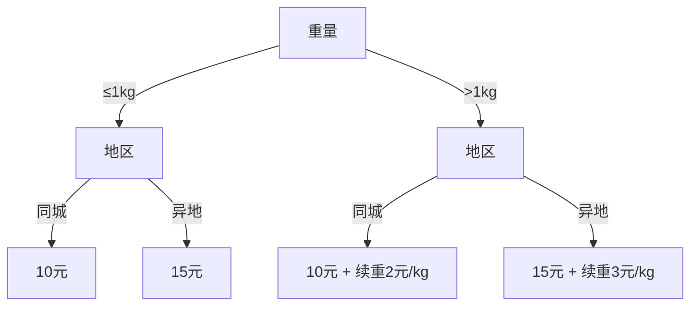
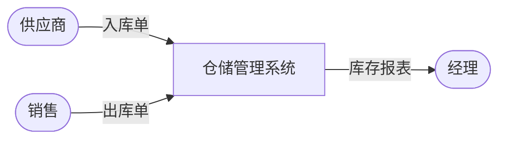
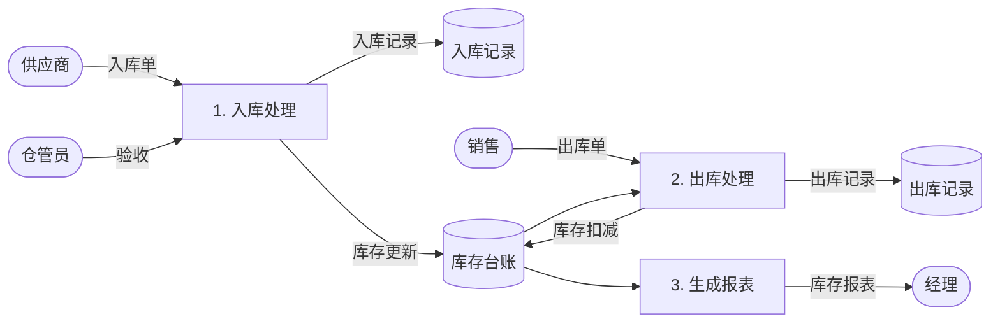

# 习题 - 第4章 结构化分析

> [!info] 本章习题定位
> 第4章围绕结构化分析方法（SA）展开，习题覆盖数据流图（DFD）四元素与分层、数据字典符号、ER 图以及加工说明三种工具（结构化语言/判定表/判定树）。设计题要求绘制完整 DFD（选课系统、图书借阅系统），并配 Mermaid 图示。

## 知识点覆盖表

| 题号 | 题型 | 考查知识点 | 对应笔记 |
| --- | --- | --- | --- |
| 4.1 | 单选 | DFD 四元素 | [[4.1 数据流图（DFD）与数据字典]] |
| 4.2 | 单选 | DFD 加工符号 | [[4.1 数据流图（DFD）与数据字典]] |
| 4.3 | 单选 | DFD 分层 | [[4.1 数据流图（DFD）与数据字典]] |
| 4.4 | 单选 | 父子图平衡 | [[4.1 数据流图（DFD）与数据字典]] |
| 4.5 | 单选 | 数据字典符号 | [[4.1 数据流图（DFD）与数据字典]] |
| 4.6 | 单选 | 数据字典重复符号 | [[4.1 数据流图（DFD）与数据字典]] |
| 4.7 | 单选 | ER 图元素 | [[4.2 实体关系图与加工说明]] |
| 4.8 | 单选 | ER 联系类型 | [[4.2 实体关系图与加工说明]] |
| 4.9 | 单选 | 加工说明工具 | [[4.2 实体关系图与加工说明]] |
| 4.10 | 单选 | 判定表组成 | [[4.2 实体关系图与加工说明]] |
| 4.11 | 多选 | DFD 四元素 | [[4.1 数据流图（DFD）与数据字典]] |
| 4.12 | 多选 | 数据字典符号 | [[4.1 数据流图（DFD）与数据字典]] |
| 4.13 | 多选 | ER 图组成 | [[4.2 实体关系图与加工说明]] |
| 4.14 | 多选 | 加工说明工具 | [[4.2 实体关系图与加工说明]] |
| 4.15 | 多选 | DFD 绘制原则 | [[4.1 数据流图（DFD）与数据字典]] |
| 4.16 | 判断 | 数据流方向 | [[4.1 数据流图（DFD）与数据字典]] |
| 4.17 | 判断 | 数据字典作用 | [[4.1 数据流图（DFD）与数据字典]] |
| 4.18 | 判断 | ER 联系类型 | [[4.2 实体关系图与加工说明]] |
| 4.19 | 判断 | 判定表适用 | [[4.2 实体关系图与加工说明]] |
| 4.20 | 判断 | 分层数量 | [[4.1 数据流图（DFD）与数据字典]] |
| 4.21 | 简答 | DFD 四元素与分层 | [[4.1 数据流图（DFD）与数据字典]] |
| 4.22 | 简答 | 数据字典符号 | [[4.1 数据流图（DFD）与数据字典]] |
| 4.23 | 简答 | 加工说明三种工具 | [[4.2 实体关系图与加工说明]] |
| 4.24 | 简答 | ER 图与联系类型 | [[4.2 实体关系图与加工说明]] |
| 4.25 | 设计 | 选课系统 DFD | [[4.3 结构化分析综合案例]] |
| 4.26 | 设计 | 图书借阅系统 DFD | [[4.3 结构化分析综合案例]] |
| 4.27 | 设计 | 判定表/判定树 | [[4.2 实体关系图与加工说明]] |
| 4.28 | 设计 | 数据字典编写 | [[4.1 数据流图（DFD）与数据字典]] |
| 4.29 | 综合 | 结构化分析综合 | [[4.3 结构化分析综合案例]] |
| 4.30 | 综合 | DFD 分层与平衡 | [[4.1 数据流图（DFD）与数据字典]] |

## 一、单选题（每题 2 分，共 10 题）

**4.1** 数据流图（DFD）的四个基本元素是？

A. 外部实体、加工、数据存储、数据流  
B. 实体、属性、联系、主键  
C. 输入、处理、输出、控制  
D. 模块、调用、数据、控制

**4.2** 在 DFD 中，加工（处理）通常用哪种图形表示？

A. 矩形  
B. 圆形（或圆角矩形）  
C. 双横线  
D. 菱形

**4.3** DFD 分层时，最高层（只含一个加工代表整个系统）的图称为？

A. 1 层图  
B. 0 层图（顶层图/上下文图）  
C. 2 层图  
D. 底层图

**4.4** DFD 分层时，子图的外部输入/输出数据流必须与父图中对应加工的输入/输出数据流一致，这称为？

A. 数据守恒  
B. 父子图平衡（平衡原则）  
C. 无间隙原则  
D. 单向流动原则

**4.5** 数据字典中，符号"="表示？

A. 或  
B. 由……组成（定义）  
C. 重复  
D. 可选

**4.6** 数据字典中，表示"重复"的符号是？

A. `+`  
B. `[ | ]`  
C. `{ }`  
D. `( )`

**4.7** ER 图中，实体用哪种图形表示？

A. 矩形  
B. 椭圆  
C. 菱形  
D. 圆形

**4.8** 一个学生可选多门课程，一门课程可被多个学生选，学生与课程之间的联系类型是？

A. 一对一（1:1）  
B. 一对多（1:n）  
C. 多对多  
D. 零对一

**4.9** 下列哪一项不是加工说明（加工逻辑描述）的工具？

A. 结构化语言  
B. 判定表  
C. 判定树  
D. 数据流图

**4.10** 判定表由四部分组成，下列不属于其组成部分的是？

A. 条件定义（条件桩）  
B. 条件取值（条件条目）  
C. 动作定义（动作桩）与动作取值（动作条目）  
D. 数据存储

## 二、多选题（每题 3 分，共 5 题）

**4.11** DFD 的四个基本元素包括？（多选）

A. 外部实体  
B. 加工（处理）  
C. 数据存储  
D. 数据流  
E. 控制流

**4.12** 数据字典中常用的符号有？（多选）

A. `=`（由……组成）  
B. `+`（与/和）  
C. `[ | ]`（或）  
D. `{ }`（重复）  
E. `( )`（可选）

**4.13** ER 图的基本组成元素包括？（多选）

A. 实体（矩形）  
B. 属性（椭圆）  
C. 联系（菱形）  
D. 主键  
E. 联系类型（1:1、1:n、m:n）

**4.14** 加工说明（描述加工逻辑）的常用工具有？（多选）

A. 结构化语言  
B. 判定表  
C. 判定树  
D. 数据流图  
E. 流程图（部分教材纳入）

**4.15** 绘制 DFD 应遵循的原则包括？（多选）

A. 数据流必须经过加工  
B. 加工必须有输入也有输出  
C. 分层时父图与子图保持平衡  
D. 每层加工数控制在 7±2 个  
E. 数据存储一般不画在顶层图

## 三、判断题（每题 2 分，共 5 题）

**4.16** 数据流图中的数据流可以从外部实体直接流向数据存储，不经过加工。

**4.17** 数据字典是对数据流图中出现的数据项、数据流、数据存储和加工进行严格定义的补充说明。

**4.18** 在 ER 图中，"学生—课程"为多对多联系时，必须引入一个联系实体（如"选课"）将其转化为两个一对多联系。

**4.19** 当加工逻辑中条件组合较多、用结构化语言描述冗长时，使用判定表更清晰。

**4.20** DFD 分层时，每一层的加工数量越多越好，以便一次分解到位。

## 四、简答题（每题 6 分，共 4 题）

**4.21** 简述数据流图的四个基本元素及其图形符号，并说明 DFD 分层的基本思想。

**4.22** 说明数据字典的作用，并列出 `=`、`+`、`[ | ]`、`{ }`、`( )` 五种符号的含义。

**4.23** 简述加工说明的三种工具（结构化语言、判定表、判定树）及其适用场景。

**4.24** 说明 ER 图中实体、属性、联系的表示方法，以及三种联系类型（1:1、1:n、m:n）的含义并各举一例。

## 五、设计题/分析题（每题 8 分，共 4 题）

**4.25** 某选课系统：学生提交选课申请，系统根据课程容量与选课规则审核，审核通过则记录选课信息并返回选课成功通知，否则返回失败原因；教师可查询自己课程的学生名单。请绘制该系统的顶层 DFD 与 0 层 DFD（用 Mermaid 表示）。

**4.26** 某图书借阅系统：读者借书时系统校验读者状态与图书库存，可借则登记借阅记录并更新库存；还书时更新借阅记录与库存，超期则计算罚款。请绘制该系统的顶层 DFD（用 Mermaid 表示），并列出主要数据流与数据存储。

**4.27** 某快递计费规则：① 重量 ≤1kg 且同城：10 元；② 重量 ≤1kg 且异地：15 元；③ 重量 >1kg 且同城：首重 10 元 + 续重 2 元/kg；④ 重量 >1kg 且异地：首重 15 元 + 续重 3 元/kg。请分别用判定表与判定树描述该计费逻辑。

**4.28** 某系统数据流"订单 = 订单号 + 客户名 + {商品项} + 下单日期"，其中"商品项 = 商品编号 + 数量 + 单价"。请用数据字典符号规范化定义"订单"与"商品项"，并说明 `{ }` 的含义。

## 六、综合题/案例题（每题 10 分，共 2 题）

**4.29** 某仓储管理系统：供应商发货产生入库单，仓库管理员验收后登记入库更新库存；销售产生出库单，出库时校验库存并扣减库存；系统定期生成库存报表供经理查阅。请完成：
1. 指出外部实体、主要数据流与数据存储。
2. 绘制顶层 DFD 与 0 层 DFD（用 Mermaid 表示）。
3. 为"出库"加工编写一段结构化语言说明。

**4.30** 某同学绘制了一张 DFD，其中加工 P1 有输入数据流 A、B 和输出数据流 C；在其子图（1 层图）中 P1 被分解为 P1.1、P1.2，子图有输入 A、B、X 和输出 C、Y。请分析：
1. 该子图是否满足父子图平衡？为什么？
2. 多出的 X 与 Y 意味着什么？应如何处理？
3. 若子图中 P1.1 只有输出没有输入，违反了哪条 DFD 绘制原则？

---

## 答案与解析

### 单选题答案

<details>
<summary>点击展开单选题答案与解析</summary>

**4.1 答案：A**
解析：DFD 四元素为外部实体、加工（处理）、数据存储、数据流。

**4.2 答案：B**
解析：DFD 中加工（处理）用圆形（Yourdon 记法）或圆角矩形（Gane-Sarson 记法）表示。矩形表示外部实体，双横线表示数据存储，菱形用于 ER 图联系。

**4.3 答案：B**
解析：DFD 最高层为 0 层图（顶层图/上下文图），只含一个代表整个系统的加工及外部实体。

**4.4 答案：B**
解析：父图中某加工的输入/输出数据流必须与其子图的外部输入/输出数据流一致，称为父子图平衡（平衡原则）。

**4.5 答案：B**
解析：数据字典中 `=` 表示"由……组成"（定义）。`[ | ]` 表示或，`{ }` 表示重复，`( )` 表示可选，`+` 表示与。

**4.6 答案：C**
解析：`{ }` 表示重复。`+` 表示与，`[ | ]` 表示或，`( )` 表示可选。

**4.7 答案：A**
解析：ER 图中实体用矩形表示，属性用椭圆，联系用菱形。

**4.8 答案：C**
解析：一个学生可选多门课程，一门课程可被多个学生选，为多对多（m:n）联系。

**4.9 答案：D**
解析：加工说明工具为结构化语言、判定表、判定树。数据流图是分析建模工具，不是加工说明工具。

**4.10 答案：D**
解析：判定表由条件桩、条件条目、动作桩、动作条目四部分组成。数据存储不属于判定表。

</details>

### 多选题答案

<details>
<summary>点击展开多选题答案与解析</summary>

**4.11 答案：A、B、C、D**
解析：DFD 四元素为外部实体、加工、数据存储、数据流。控制流不属于 DFD 基本元素。

**4.12 答案：A、B、C、D、E**
解析：数据字典常用符号为 `=`（组成）、`+`（与）、`[ | ]`（或）、`{ }`（重复）、`( )`（可选），五项均属于。

**4.13 答案：A、B、C、E**
解析：ER 图由实体（矩形）、属性（椭圆）、联系（菱形）及联系类型（1:1、1:n、m:n）组成。主键是属性的子集，不是 ER 图的独立图形元素。

**4.14 答案：A、B、C**
解析：加工说明工具为结构化语言、判定表、判定树。数据流图与流程图是建模/设计工具，不是加工说明工具（部分教材将流程图纳入详细设计工具）。

**4.15 答案：A、B、C、D、E**
解析：DFD 绘制原则：数据流必须经过加工、加工必须有输入也有输出（数据守恒）、父子图平衡、每层加工数控制在 7±2、数据存储一般不画在顶层图，五项均属于。

</details>

### 判断题答案

<details>
<summary>点击展开判断题答案与解析</summary>

**4.16 答案：错误**
解析：数据流不能直接从外部实体流向数据存储，必须经过加工，否则违反"数据流必须经过加工"原则。

**4.17 答案：正确**
解析：数据字典对 DFD 中的数据项、数据流、数据存储、加工进行严格定义，是 DFD 的补充说明。

**4.18 答案：正确**
解析：多对多联系在关系模型实现时需引入联系实体（如"选课"）转化为两个一对多联系，便于建表。

**4.19 答案：正确**
解析：条件组合多时，判定表能清晰列出所有条件组合与对应动作，比结构化语言更直观。

**4.20 答案：错误**
解析：每层加工数应控制在 7±2 个，过多会降低可读性，应逐层分解而非一次分解到位。

</details>

### 简答题答案

<details>
<summary>点击展开简答题参考答案</summary>

**4.21 参考答案**
DFD 四元素及符号：
- 外部实体：矩形，表示系统外数据来源/去向（如用户、外部系统）。
- 加工（处理）：圆形或圆角矩形，表示对数据的变换处理。
- 数据存储：双横线或开口矩形，表示保存的数据。
- 数据流：带箭头的线，表示数据流动方向。
分层思想：自顶向下逐层分解。顶层图把整个系统视为一个加工，描述与外部实体的边界；0 层图分解出主要加工；再逐层细化为 1 层、2 层图，每层加工数控制在 7±2，父图与子图保持平衡。

**4.22 参考答案**
数据字典作用：对 DFD 中的数据项、数据流、数据存储、加工进行严格定义，补充 DFD 无法表达的细节，使需求完整可追溯。
符号含义：
- `=`：由……组成（定义）
- `+`：与（和）
- `[ | ]`：或（选择）
- `{ }`：重复
- `( )`：可选

**4.23 参考答案**
- 结构化语言：介于自然语言与形式语言之间，用顺序、选择（IF/CASE）、重复（WHILE）描述加工逻辑。适用：顺序为主、条件较少的简单加工。
- 判定表：用表格列出所有条件组合及对应动作。适用：条件较多、组合复杂、需穷举的加工。
- 判定树：用树形图直观展示条件分支与动作。适用：条件层次清晰、便于用户阅读的加工。

**4.24 参考答案**
- 实体：矩形表示；属性：椭圆表示，与实体相连；联系：菱形表示，连接相关实体，菱形上标注联系类型。
- 联系类型：
  - 1:1（一对一）：如"班级—班长"，一个班一个班长。
  - 1:n（一对多）：如"班级—学生"，一个班多个学生。
  - m:n（多对多）：如"学生—课程"，一个学生多门课，一门课多个学生。

</details>

### 设计题答案

<details>
<summary>点击展开设计题参考答案</summary>

**4.25 参考答案**
顶层 DFD（选课系统）：



0 层 DFD（选课系统）：



说明：外部实体为学生、教师；数据存储为选课记录、课程信息；加工为"审核选课""查询名单"。

**4.26 参考答案**
顶层 DFD（图书借阅系统）：


主要数据流：借书请求、还书请求、借阅结果、罚款通知、库存更新、借阅记录。
主要数据存储：读者信息、图书库存、借阅记录、罚款记录。



**4.27 参考答案**
判定表：

| 条件 | 规则1 | 规则2 | 规则3 | 规则4 |
| --- | --- | --- | --- | --- |
| 重量 ≤1kg | Y | Y | N | N |
| 同城 | Y | N | Y | N |
| 动作 | | | | |
| 10 元 | √ | | | |
| 15 元 | | √ | | |
| 10 元 + 续重 2 元/kg | | | √ | |
| 15 元 + 续重 3 元/kg | | | | √ |

判定树：



**4.28 参考答案**
规范化定义：
- 订单 = 订单号 + 客户名 + {商品项} + 下单日期
- 商品项 = 商品编号 + 数量 + 单价
`{ }` 表示"重复"，即订单中可包含一个或多个商品项。

</details>

### 综合题答案

<details>
<summary>点击展开综合题参考答案</summary>

**4.29 参考答案**
1. 外部实体：供应商、仓库管理员、销售（或客户）、经理。主要数据流：入库单、出库单、库存报表、库存查询。主要数据存储：库存台账、入库记录、出库记录。
2. 顶层 DFD：



0 层 DFD：



3. "出库"加工结构化语言说明：
```
读取出库单
查询库存台账
IF 库存量 >= 出库数量 THEN
    扣减库存
    登记出库记录
    返回出库成功
ELSE
    返回库存不足
ENDIF
```

**4.30 参考答案**
1. 不满足父子图平衡。父图 P1 的输入为 A、B，输出为 C；子图输入为 A、B、X，输出为 C、Y。X 与 Y 在父图中没有对应，违反平衡原则。
2. 多出的 X 与 Y 意味着子图引入了父图未体现的数据流。处理方式：要么 X、Y 是子图内部加工之间的数据流（不应作为子图边界），应去掉；要么是遗漏，需在父图 P1 上补充对应的输入 X 与输出 Y，使父子图平衡。
3. P1.1 只有输出没有输入，违反了"加工必须有输入也有输出"（数据守恒）原则——数据不能凭空产生。

</details>

## 考点统计表

| 考查维度 | 题量 | 分值占比 | 难度 |
| --- | --- | --- | --- |
| DFD 四元素与分层 | 8 | 约 28% | 中高 |
| 数据字典符号 | 5 | 约 18% | 中 |
| ER 图与联系类型 | 4 | 约 15% | 中 |
| 加工说明（结构化语言/判定表/判定树） | 6 | 约 22% | 中高 |
| DFD 绘制（设计题） | 4 | 约 17% | 高 |
| **合计** | **30** | **100%** | — |

## 关联

- 上一级：[[MOC - 软件工程]]
- 本章知识点：[[MOC - 第4章]]
- 上一章习题：[[习题-第3章-需求工程]]
- 下一章习题：[[习题-第5章-结构化设计]]
