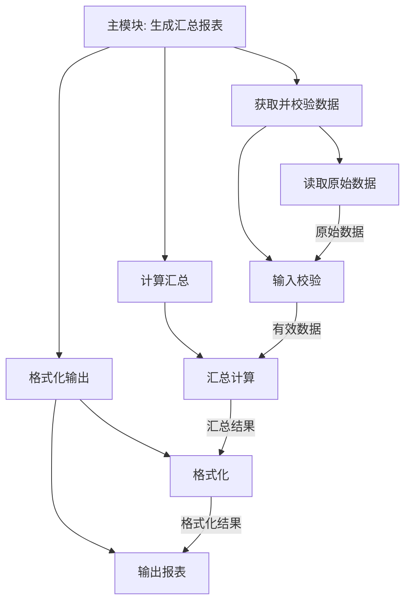
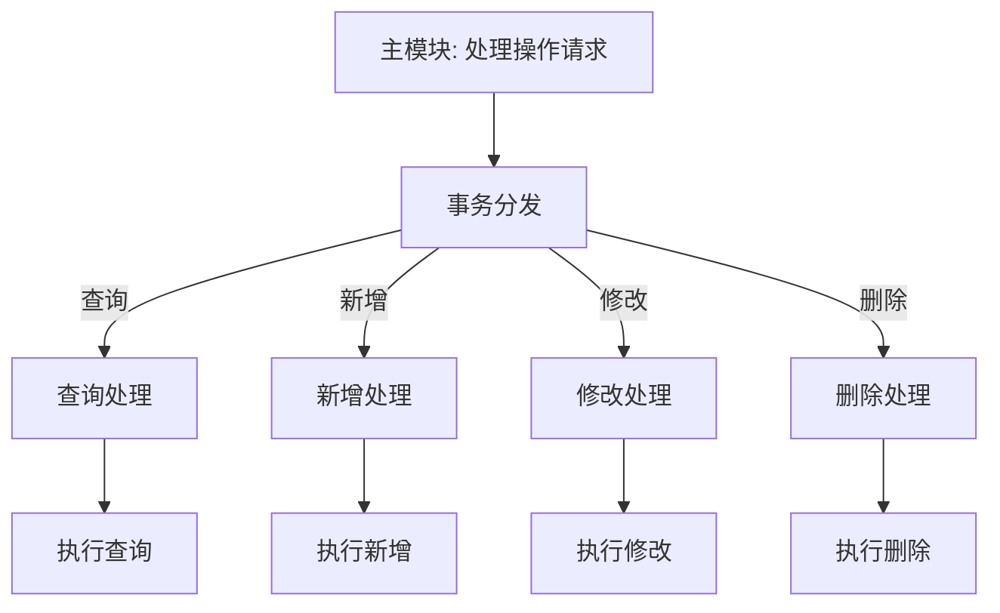
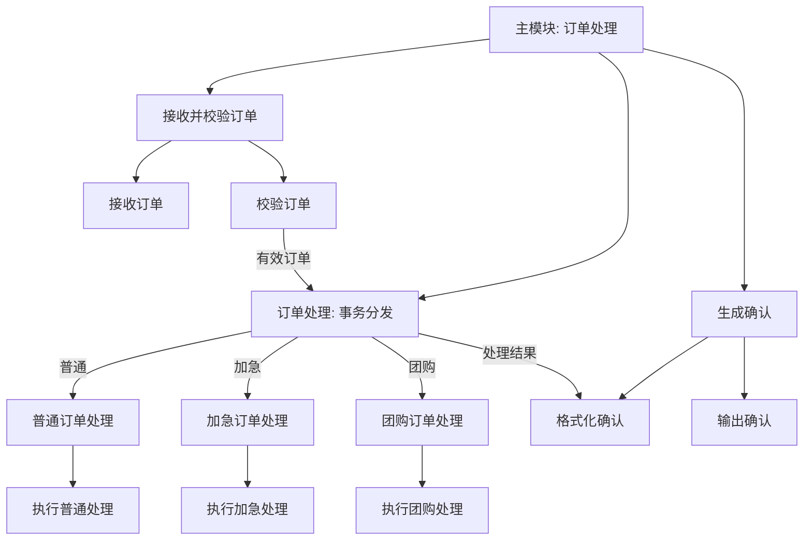

# 习题 - 第5章 结构化设计

> [!info] 本章习题定位
> 第5章围绕结构化设计（SD）展开，习题覆盖结构图元素、模块内聚七类型与耦合七类型（按优劣排序与判定）、变换分析与事务分析步骤。设计题要求将 DFD 转换为结构图，并配 Mermaid 图示。

## 知识点覆盖表

| 题号 | 题型 | 考查知识点 | 对应笔记 |
| --- | --- | --- | --- |
| 5.1 | 单选 | 结构图元素 | [[5.1 结构化设计原理与结构图]] |
| 5.2 | 单选 | 结构图中数据传递符号 | [[5.1 结构化设计原理与结构图]] |
| 5.3 | 单选 | 内聚最高类型 | [[5.2 模块内聚与耦合]] |
| 5.4 | 单选 | 内聚最低类型 | [[5.2 模块内聚与耦合]] |
| 5.5 | 单选 | 耦合最低类型 | [[5.2 模块内聚与耦合]] |
| 5.6 | 单选 | 耦合最高类型 | [[5.2 模块内聚与耦合]] |
| 5.7 | 单选 | 控制耦合 | [[5.2 模块内聚与耦合]] |
| 5.8 | 单选 | 标记耦合 | [[5.2 模块内聚与耦合]] |
| 5.9 | 单选 | 变换分析适用 | [[5.3 变换分析与事务分析]] |
| 5.10 | 单选 | 事务分析步骤 | [[5.3 变换分析与事务分析]] |
| 5.11 | 多选 | 内聚类型排序 | [[5.2 模块内聚与耦合]] |
| 5.12 | 多选 | 耦合类型排序 | [[5.2 模块内聚与耦合]] |
| 5.13 | 多选 | 结构图元素 | [[5.1 结构化设计原理与结构图]] |
| 5.14 | 多选 | 高内聚类型 | [[5.2 模块内聚与耦合]] |
| 5.15 | 多选 | 低耦合类型 | [[5.2 模块内聚与耦合]] |
| 5.16 | 判断 | 功能内聚最优 | [[5.2 模块内聚与耦合]] |
| 5.17 | 判断 | 内容耦合 | [[5.2 模块内聚与耦合]] |
| 5.18 | 判断 | 数据耦合 | [[5.2 模块内聚与耦合]] |
| 5.19 | 判断 | 变换分析 | [[5.3 变换分析与事务分析]] |
| 5.20 | 判断 | 事务中心 | [[5.3 变换分析与事务分析]] |
| 5.21 | 简答 | 内聚七类型排序 | [[5.2 模块内聚与耦合]] |
| 5.22 | 简答 | 耦合七类型排序 | [[5.2 模块内聚与耦合]] |
| 5.23 | 简答 | 结构图元素 | [[5.1 结构化设计原理与结构图]] |
| 5.24 | 简答 | 变换分析与事务分析步骤 | [[5.3 变换分析与事务分析]] |
| 5.25 | 设计 | 内聚类型判定 | [[5.2 模块内聚与耦合]] |
| 5.26 | 设计 | 耦合类型判定 | [[5.2 模块内聚与耦合]] |
| 5.27 | 设计 | DFD 转结构图（变换型） | [[5.3 变换分析与事务分析]] |
| 5.28 | 设计 | DFD 转结构图（事务型） | [[5.3 变换分析与事务分析]] |
| 5.29 | 综合 | 模块设计质量评价 | [[5.2 模块内聚与耦合]] |
| 5.30 | 综合 | 变换+事务综合设计 | [[5.3 变换分析与事务分析]] |

## 一、单选题（每题 2 分，共 10 题）

**5.1** 结构图（Structure Chart）中，表示模块的图形是？

A. 圆形  
B. 矩形  
C. 椭圆  
D. 菱形

**5.2** 在结构图中，表示模块间传递数据的符号是？

A. 带空心圆的箭头  
B. 带实心圆的箭头  
C. 普通箭头  
D. 虚线

**5.3** 内聚七类型中，内聚程度最高的是？

A. 逻辑内聚  
B. 通信内聚  
C. 顺序内聚  
D. 功能内聚

**5.4** 内聚七类型中，内聚程度最低的是？

A. 偶然内聚  
B. 逻辑内聚  
C. 时间内聚  
D. 过程内聚

**5.5** 耦合七类型中，耦合程度最低（最优）的是？

A. 数据耦合  
B. 非直接耦合  
C. 标记耦合  
D. 控制耦合

**5.6** 耦合七类型中，耦合程度最高（最差）的是？

A. 公共耦合  
B. 外部耦合  
C. 控制耦合  
D. 内容耦合

**5.7** 模块间传递一个"开关标志"决定另一模块执行哪个分支，这种耦合属于？

A. 数据耦合  
B. 标记耦合  
C. 控制耦合  
D. 公共耦合

**5.8** 模块间传递一个完整的数据结构（如整个记录）作为参数，这种耦合属于？

A. 数据耦合  
B. 标记耦合（特征耦合）  
C. 控制耦合  
D. 内容耦合

**5.9** 变换分析适用于哪种类型的数据流图？

A. 事务型 DFD（一个输入分多个并行处理路径）  
B. 变换型 DFD（输入→变换中心→输出）  
C. 控制型 DFD  
D. 任意 DFD

**5.10** 事务分析的第一步是？

A. 设计输出模块  
B. 确定事务中心（分发路径的加工）  
C. 划分输入分支  
D. 设计底层模块

## 二、多选题（每题 3 分，共 5 题）

**5.11** 内聚七类型按程度从低到高排列，下列排列正确的有？（多选，选包含项）

A. 偶然内聚 < 逻辑内聚 < 时间内聚  
B. 过程内聚 < 通信内聚 < 顺序内聚  
C. 通信内聚 < 顺序内聚 < 功能内聚  
D. 功能内聚 < 偶然内聚  
E. 时间内聚 < 过程内聚 < 通信内聚

**5.12** 耦合七类型按程度从低到高排列，下列排列正确的有？（多选，选包含项）

A. 非直接耦合 < 数据耦合 < 标记耦合  
B. 标记耦合 < 控制耦合 < 外部耦合  
C. 外部耦合 < 公共耦合 < 内容耦合  
D. 内容耦合 < 数据耦合  
E. 数据耦合 < 控制耦合 < 公共耦合

**5.13** 结构图的基本元素包括？（多选）

A. 模块（矩形）  
B. 调用（箭头）  
C. 数据（带空心圆的箭头）  
D. 控制信息（带实心圆的箭头）  
E. 数据存储

**5.14** 下列属于高内聚（应提倡）的有？（多选）

A. 功能内聚  
B. 顺序内聚  
C. 通信内聚  
D. 偶然内聚  
E. 逻辑内聚

**5.15** 下列属于低耦合（应提倡）的有？（多选）

A. 非直接耦合  
B. 数据耦合  
C. 标记耦合  
D. 内容耦合  
E. 公共耦合

## 三、判断题（每题 2 分，共 5 题）

**5.16** 功能内聚是最强的内聚，模块内所有元素共同完成一个单一功能，是设计时应追求的目标。

**5.17** 内容耦合指一个模块直接访问另一个模块的内部数据或代码，是最差的耦合，应绝对避免。

**5.18** 数据耦合指模块间通过传递数据参数进行交互，是耦合度最高的方式，应尽量避免。

**5.19** 变换分析的核心是把变换型 DFD 分为输入、变换中心、输出三部分，并为每部分设计相应模块。

**5.20** 事务分析中，事务中心负责根据事务类型把控制分发给对应的处理模块。

## 四、简答题（每题 6 分，共 4 题）

**5.21** 列出模块内聚的七种类型，按内聚程度从低到高排序，并简述每种类型的含义。

**5.22** 列出模块耦合的七种类型，按耦合程度从低到高排序，并简述每种类型的含义。

**5.23** 简述结构图的四个基本元素及其表示方法。

**5.24** 说明变换分析与事务分析各自适用的 DFD 类型及主要步骤。

## 五、设计题/分析题（每题 8 分，共 4 题）

**5.25** 判断下列模块分别属于哪种内聚类型。

| 模块描述 | 内聚类型 |
| --- | --- |
| (1) 模块内代码只是因为凑巧放在一起，无实质关系 | ? |
| (2) 模块根据传入的"类型"参数选择执行不同的打印功能 | ? |
| (3) 模块完成"读取数据→校验→计算→输出"一条龙，前一步输出是后一步输入 | ? |
| (4) 模块只完成"计算月利息"这一单一功能 | ? |

**5.26** 判断下列模块对分别属于哪种耦合类型。

| 模块间交互描述 | 耦合类型 |
| --- | --- |
| (1) 模块 A 调用模块 B，传递一个整数 | ? |
| (2) 模块 A 传递整个"学生记录"给模块 B | ? |
| (3) 模块 A 传递一个"标志位"控制模块 B 执行哪段代码 | ? |
| (4) 模块 A 和模块 B 都读写同一个全局变量 | ? |
| (5) 模块 A 直接读取模块 B 的内部变量 | ? |

**5.27** 某变换型 DFD：原始数据经"输入校验"加工变为有效数据，再经"变换中心：计算汇总"加工产生汇总结果，最后经"格式化输出"加工输出报表。请用变换分析将其转换为结构图（用 Mermaid 表示）。

**5.28** 某事务型 DFD：系统接收一个操作请求，根据请求类型分发到"查询""新增""修改""删除"四条处理路径。请用事务分析将其转换为结构图（用 Mermaid 表示）。

## 六、综合题/案例题（每题 10 分，共 2 题）

**5.29** 某系统有两个模块设计如下，请评价其设计质量并给出改进方案：
- 模块 A "处理所有报表"：根据传入的 type 参数（1=日报/2=月报/3=年报）选择执行完全不同的逻辑，并读写全局变量 g_config。
- 模块 B 直接修改模块 C 的内部数组 data[3]。

**5.30** 某系统 DFD 同时包含变换型与事务型两部分：主流程为"接收订单→校验→处理→生成确认"（变换型）；其中"处理"根据订单类型（普通/加急/团购）分发到三条不同处理路径（事务型）。请综合使用变换分析与事务分析，绘制该系统的结构图（用 Mermaid 表示），并说明设计思路。

---

## 答案与解析

### 单选题答案

点击展开单选题答案与解析

**5.1 答案：B**
解析：结构图中模块用矩形表示。圆形用于 DFD 加工，椭圆用于 ER 属性，菱形用于 ER 联系。

**5.2 答案：A**
解析：结构图中带空心圆的箭头表示数据传递，带实心圆的箭头表示控制信息传递。

**5.3 答案：D**
解析：内聚七类型从低到高为偶然、逻辑、时间、过程、通信、顺序、功能，功能内聚最高。

**5.4 答案：A**
解析：偶然内聚最低，模块内各部分无关系，仅偶然放在一起。

**5.5 答案：B**
解析：耦合从低到高为非直接、数据、标记、控制、外部、公共、内容，非直接耦合最低（最优）。

**5.6 答案：D**
解析：内容耦合最高（最差），一个模块直接访问另一模块内部。

**5.7 答案：C**
解析：传递开关/标志决定另一模块执行分支，是控制耦合。

**5.8 答案：B**
解析：传递整个数据结构（记录）作为参数，是标记耦合（特征耦合）。传递简单数据参数才是数据耦合。

**5.9 答案：B**
解析：变换分析适用于变换型 DFD（输入→变换中心→输出）。

**5.10 答案：B**
解析：事务分析第一步是确定事务中心（根据输入类型分发到多条处理路径的加工）。

### 多选题答案

点击展开多选题答案与解析

**5.11 答案：A、B、C、E**
解析：内聚从低到高：偶然 < 逻辑 < 时间 < 过程 < 通信 < 顺序 < 功能。A、B、C、E 排列正确。D 错误（功能内聚最高，不是最低）。

**5.12 答案：A、B、C、E**
解析：耦合从低到高：非直接 < 数据 < 标记 < 控制 < 外部 < 公共 < 内容。A、B、C、E 排列正确。D 错误（内容耦合最高，不是低于数据耦合）。

**5.13 答案：A、B、C、D**
解析：结构图四元素为模块（矩形）、调用（箭头）、数据（带空心圆的箭头）、控制信息（带实心圆的箭头）。数据存储属于 DFD 元素，不属于结构图。

**5.14 答案：A、B、C**
解析：高内聚应提倡功能内聚、顺序内聚、通信内聚。偶然内聚、逻辑内聚属于低内聚，应避免。

**5.15 答案：A、B、C**
解析：低耦合应提倡非直接耦合、数据耦合、标记耦合。内容耦合、公共耦合属于高耦合，应避免。

### 判断题答案

点击展开判断题答案与解析

**5.16 答案：正确**
解析：功能内聚是最强内聚，所有元素共同完成单一功能，是设计追求的目标。

**5.17 答案：正确**
解析：内容耦合是最差耦合，一个模块直接访问另一模块内部，应绝对避免。

**5.18 答案：错误**
解析：数据耦合是耦合度较低的方式（传递数据参数），是可接受的耦合，并非最高。耦合最高的是内容耦合。

**5.19 答案：正确**
解析：变换分析把变换型 DFD 分为输入、变换中心、输出三部分，分别为每部分设计模块。

**5.20 答案：正确**
解析：事务中心根据事务类型把控制分发给对应处理模块，是事务分析的核心。

### 简答题答案

点击展开简答题参考答案

**5.21 参考答案**
内聚七类型从低到高：
1. 偶然内聚：模块内各部分无关系，仅偶然放在一起。
2. 逻辑内聚：完成逻辑相关的一组任务，由参数选择执行。
3. 时间内聚：同一时间内执行的任务（如初始化）。
4. 过程内聚：按特定顺序执行的任务。
5. 通信内聚：使用相同输入/输出数据的操作。
6. 顺序内聚：一个元素的输出是另一元素的输入，串行处理。
7. 功能内聚：所有元素共同完成一个单一功能（最高，应追求）。

**5.22 参考答案**
耦合七类型从低到高：
1. 非直接耦合：模块间无直接关系（通过主控间接联系）。
2. 数据耦合：传递简单数据参数。
3. 标记耦合（特征耦合）：传递数据结构（记录）。
4. 控制耦合：传递控制信息（开关、标志）。
5. 外部耦合：访问同一外部设备/协议/格式。
6. 公共耦合：共享全局数据/公共数据区。
7. 内容耦合：直接访问另一模块内部数据或代码（最高，应避免）。

**5.23 参考答案**
结构图四元素：
- 模块：矩形表示，代表一个可调用的程序单元。
- 调用：箭头表示，从调用模块指向被调用模块。
- 数据：带空心圆的箭头表示，表示模块间传递的数据。
- 控制信息：带实心圆的箭头表示，表示传递的控制信号（如标志、状态）。

**5.24 参考答案**
- 变换分析：适用于变换型 DFD（输入→变换中心→输出）。步骤：①重画 DFD 并复审；②区分输入分支、变换中心、输出分支；③设计顶层主模块；④为输入分支设计输入模块；⑤为变换中心设计变换模块；⑥为输出分支设计输出模块；⑦细化中下层模块。
- 事务分析：适用于事务型 DFD（一个输入经事务中心分发到多条并行处理路径）。步骤：①确定事务中心；②设计主模块与事务分发模块；③为每类事务设计处理模块；④细化各处理路径的子模块。

### 设计题答案

点击展开设计题参考答案

**5.25 参考答案**

| 模块描述 | 内聚类型 |
| --- | --- |
| (1) 凑巧放一起无关系 | 偶然内聚 |
| (2) 按 type 选择不同打印功能 | 逻辑内聚 |
| (3) 读取→校验→计算→输出串行，前输出是后输入 | 顺序内聚 |
| (4) 只完成计算月利息 | 功能内聚 |

**5.26 参考答案**

| 模块间交互描述 | 耦合类型 |
| --- | --- |
| (1) 传递一个整数 | 数据耦合 |
| (2) 传递整个学生记录 | 标记耦合（特征耦合） |
| (3) 传递标志位控制执行分支 | 控制耦合 |
| (4) 读写同一全局变量 | 公共耦合 |
| (5) 直接读取模块 B 内部变量 | 内容耦合 |

**5.27 参考答案**
变换型 DFD：原始数据 → 输入校验（输入分支）→ 计算汇总（变换中心）→ 格式化输出（输出分支）。结构图：

说明：主模块调度三个分支模块，输入分支负责获取并校验数据，变换中心负责汇总计算，输出分支负责格式化输出。

**5.28 参考答案**
事务型 DFD：操作请求 → 事务中心 → 查询/新增/修改/删除四条路径。结构图：

说明：事务中心（分发模块）根据请求类型分发到四条处理路径，每条路径再细化执行模块。

### 综合题答案

点击展开综合题参考答案

**5.29 参考答案**
- 模块 A"处理所有报表"：
  - 内聚问题：根据 type 选择完全不同逻辑，属于逻辑内聚（低内聚），且读写全局变量 g_config 属于公共耦合。
  - 改进：拆分为"日报处理""月报处理""年报处理"三个功能内聚模块；用参数传递配置代替全局变量，将公共耦合降为数据耦合。
- 模块 B 直接修改模块 C 的内部数组 data[3]：
  - 这是内容耦合（最差），破坏了封装，C 的内部变化会直接影响 B。
  - 改进：为 C 提供公开的访问接口（如 setData/getData 方法），B 通过接口操作数据，将内容耦合降为数据耦合。

**5.30 参考答案**
设计思路：整体按变换分析处理主流程（接收订单→校验→处理→生成确认），其中"处理"加工按事务分析分解为按订单类型分发的三条路径。
结构图：

说明：主模块按变换分析调度输入（接收校验）、变换（订单处理）、输出（生成确认）三部分；其中"订单处理"按事务分析，根据订单类型分发到普通/加急/团购三条处理路径。

## 考点统计表

| 考查维度 | 题量 | 分值占比 | 难度 |
| --- | --- | --- | --- |
| 结构图元素 | 4 | 约 15% | 中 |
| 内聚七类型 | 7 | 约 25% | 中高 |
| 耦合七类型 | 7 | 约 25% | 中高 |
| 变换分析 | 4 | 约 15% | 中高 |
| 事务分析 | 4 | 约 15% | 中高 |
| DFD 转结构图（设计题） | 4 | 约 17% | 高 |
| **合计** | **30** | **100%** | — |

## 关联

- 上一级：[[MOC - 软件工程]]
- 本章知识点：[[MOC - 第5章]]
- 上一章习题：[[习题-第4章-结构化分析]]
- 下一章习题：[[习题-第6章-面向对象软件工程]]
