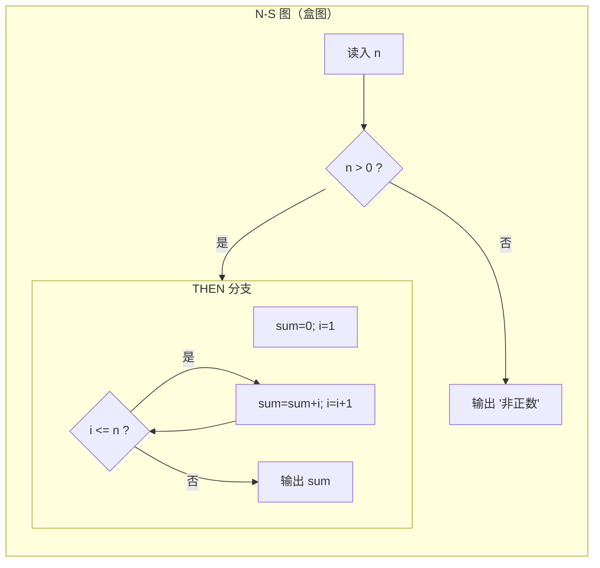
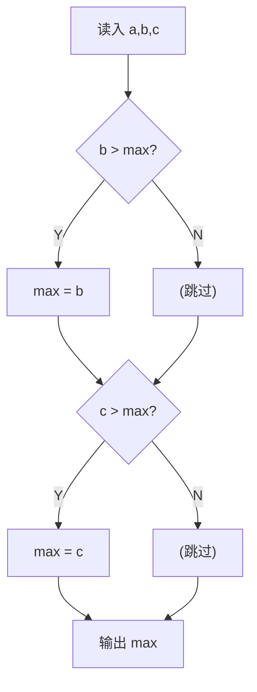
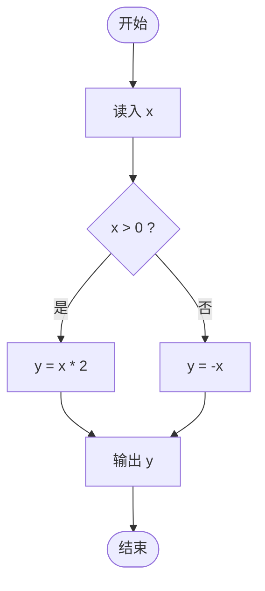
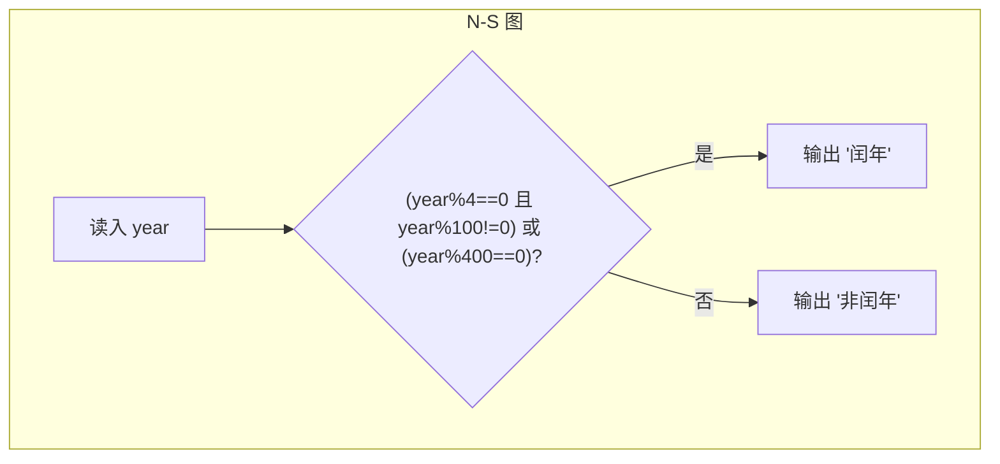
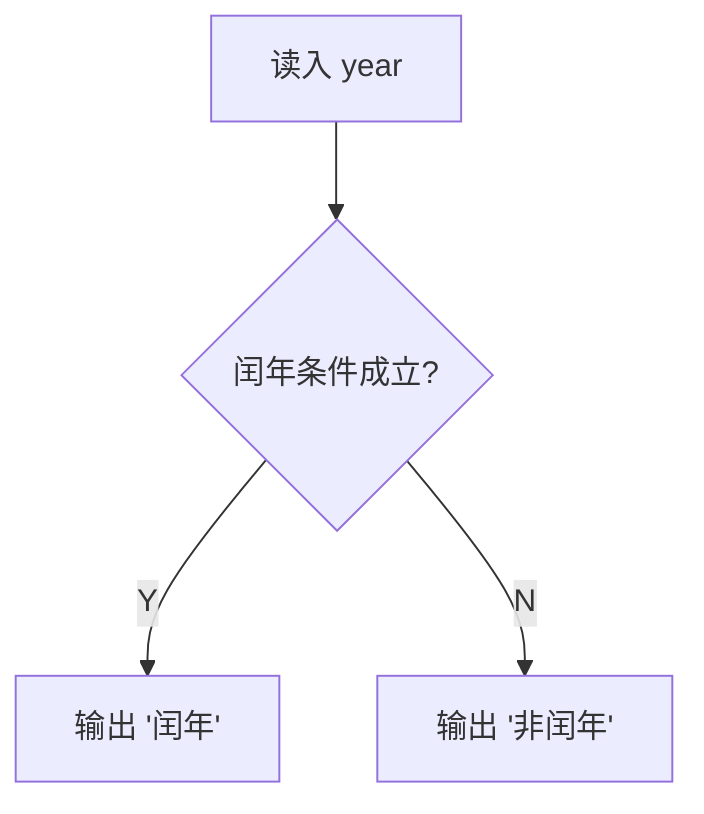

# 习题 - 第7章 软件详细设计

> [!info] 本章习题定位
> 第7章围绕详细设计展开，习题覆盖程序流程图、N-S 图（盒图）、PAD 图、PDL（伪代码）四种工具的对比，三种基本控制结构（顺序/选择/循环），人机界面设计原则与详细设计文档结构。设计题要求用 N-S 图与 PAD 图表示算法。

## 知识点覆盖表

| 题号 | 题型 | 考查知识点 | 对应笔记 |
| --- | --- | --- | --- |
| 7.1 | 单选 | 详细设计工具 | [[7.1 详细设计工具与方法]] |
| 7.2 | 单选 | N-S 图特点 | [[7.1 详细设计工具与方法]] |
| 7.3 | 单选 | PAD 图特点 | [[7.1 详细设计工具与方法]] |
| 7.4 | 单选 | PDL 伪代码 | [[7.1 详细设计工具与方法]] |
| 7.5 | 单选 | 三种基本控制结构 | [[7.1 详细设计工具与方法]] |
| 7.6 | 单选 | 程序流程图缺点 | [[7.1 详细设计工具与方法]] |
| 7.7 | 单选 | 程序流程图符号 | [[7.1 详细设计工具与方法]] |
| 7.8 | 单选 | 界面设计原则——一致性 | [[7.2 人机界面设计]] |
| 7.9 | 单选 | 界面设计原则——反馈 | [[7.2 人机界面设计]] |
| 7.10 | 单选 | 详细设计文档内容 | [[7.3 详细设计文档与评审]] |
| 7.11 | 多选 | 详细设计工具 | [[7.1 详细设计工具与方法]] |
| 7.12 | 多选 | 三种基本控制结构 | [[7.1 详细设计工具与方法]] |
| 7.13 | 多选 | N-S 图优点 | [[7.1 详细设计工具与方法]] |
| 7.14 | 多选 | 界面设计原则 | [[7.2 人机界面设计]] |
| 7.15 | 多选 | 详细设计文档内容 | [[7.3 详细设计文档与评审]] |
| 7.16 | 判断 | N-S 图无箭头 | [[7.1 详细设计工具与方法]] |
| 7.17 | 判断 | PAD 图树形 | [[7.1 详细设计工具与方法]] |
| 7.18 | 判断 | 流程图强制结构化 | [[7.1 详细设计工具与方法]] |
| 7.19 | 判断 | 界面防错 | [[7.2 人机界面设计]] |
| 7.20 | 判断 | 详细设计粒度 | [[7.3 详细设计文档与评审]] |
| 7.21 | 简答 | 四种工具对比 | [[7.1 详细设计工具与方法]] |
| 7.22 | 简答 | 三种基本控制结构 | [[7.1 详细设计工具与方法]] |
| 7.23 | 简答 | 界面设计原则 | [[7.2 人机界面设计]] |
| 7.24 | 简答 | 详细设计文档结构 | [[7.3 详细设计文档与评审]] |
| 7.25 | 设计 | N-S 图表示算法 | [[7.1 详细设计工具与方法]] |
| 7.26 | 设计 | PAD 图表示算法 | [[7.1 详细设计工具与方法]] |
| 7.27 | 设计 | 界面设计改进 | [[7.2 人机界面设计]] |
| 7.28 | 设计 | PDL 转流程图 | [[7.1 详细设计工具与方法]] |
| 7.29 | 综合 | 详细设计综合 | [[7.3 详细设计文档与评审]] |
| 7.30 | 综合 | 界面设计综合评价 | [[7.2 人机界面设计]] |

## 一、单选题（每题 2 分，共 10 题）

**7.1** 下列不属于详细设计工具的是？

A. 程序流程图  
B. N-S 图  
C. 数据流图  
D. PDL（伪代码）

**7.2** N-S 图（盒图）最显著的特点是？

A. 用箭头表示控制流  
B. 取消了流程线，强制结构化，无法表示非结构化的 goto  
C. 用树形结构表示算法  
D. 用自然语言描述

**7.3** PAD 图（问题分析图）的特点是？

A. 用嵌套盒子表示，无箭头  
B. 用二维树形结构表示算法，顺序从上到下、层次从左到右  
C. 用菱形表示判断  
D. 只能表示顺序结构

**7.4** PDL（过程设计语言）是指？

A. 一种程序设计语言  
B. 伪代码，用类自然语言描述处理逻辑  
C. 一种数据库语言  
D. 一种建模语言

**7.5** 结构化程序设计的三种基本控制结构是？

A. 顺序、选择、循环  
B. 顺序、跳转、循环  
C. 顺序、选择、goto  
D. 输入、处理、输出

**7.6** 程序流程图的主要缺点是？

A. 不能表示控制流  
B. 箭头随意指向，容易诱导使用非结构化的 goto，不强制结构化  
C. 不能表示循环  
D. 必须用图形，无法文字描述

**7.7** 程序流程图中，菱形表示？

A. 起止  
B. 处理  
C. 判断  
D. 输入输出

**7.8** "相同功能用相同操作方式，相同术语贯穿全程"体现的界面设计原则是？

A. 反馈原则  
B. 一致性原则  
C. 防错原则  
D. 用户控制原则

**7.9** "用户每一步操作都应得到明确的视觉或文字响应"体现的界面设计原则是？

A. 一致性原则  
B. 反馈原则  
C. 减少记忆原则  
D. 容错原则

**7.10** 详细设计说明书（详细设计文档）通常不包含？

A. 模块的算法描述  
B. 数据结构设计  
C. 接口设计  
D. 项目甘特图

## 二、多选题（每题 3 分，共 5 题）

**7.11** 常用的详细设计工具有？（多选）

A. 程序流程图  
B. N-S 图（盒图）  
C. PAD 图  
D. PDL（伪代码）  
E. 判定表

**7.12** 结构化程序设计的三种基本控制结构包括？（多选）

A. 顺序结构  
B. 选择（分支）结构  
C. 循环（重复）结构  
D. goto 跳转结构  
E. 递归结构

**7.13** N-S 图（盒图）的优点包括？（多选）

A. 强制结构化，无法表示 goto  
B. 功能域清晰，嵌套层次一目了然  
C. 容易表示嵌套与模块层次  
D. 可以任意画箭头转移  
E. 接近最终代码结构

**7.14** 人机界面设计的原则包括？（多选）

A. 一致性  
B. 反馈  
C. 防错与容错（撤销）  
D. 减少用户记忆负担  
E. 用户控制

**7.15** 详细设计文档通常包含的内容有？（多选）

A. 模块的算法描述（流程图/PDL）  
B. 数据结构设计  
C. 接口设计  
D. 模块间调用关系  
E. 项目进度甘特图

## 三、判断题（每题 2 分，共 5 题）

**7.16** N-S 图取消了流程线（箭头），用嵌套盒子表示控制结构，因此无法表示非结构化的 goto。

**7.17** PAD 图用二维树形结构表示算法，顺序从上到下展开，控制结构的层次从左到右展开。

**7.18** 程序流程图强制要求结构化，不允许使用 goto。

**7.19** 界面设计应提供撤销（Undo）功能，允许用户从错误中恢复，这体现防错与容错原则。

**7.20** 详细设计的粒度应达到可直接据此编写代码的程度，即每个模块的算法步骤都应明确。

## 四、简答题（每题 6 分，共 4 题）

**7.21** 对比程序流程图、N-S 图、PAD 图、PDL 四种详细设计工具的优缺点。

**7.22** 说明结构化程序设计的三种基本控制结构及其含义，并说明为什么结构化编程主张不用 goto。

**7.23** 列举五条人机界面设计原则并简要解释。

**7.24** 简述详细设计说明书的主要章节内容。

## 五、设计题/分析题（每题 8 分，共 4 题）

**7.25** 用 N-S 图（盒图）表示以下算法：输入一个整数 n，若 n 为正数则计算 1 到 n 的累加和并输出，否则输出"非正数"。请用 Mermaid 子图模拟 N-S 图结构，并写出对应 PDL。

**7.26** 用 PAD 图表示以下算法：输入三个数 a、b、c，找出其中最大值并输出。请用 Mermaid 树形图模拟 PAD 图结构，并写出对应 PDL。

**7.27** 某登录界面存在以下问题：① 错误提示只在控制台打印，用户看不到；② 部分按钮用"确定"部分用"OK"；③ 密码输错 3 次直接锁定且无法恢复；④ 必须记住系统代码才能登录。请指出每个问题违反的界面设计原则，并给出改进建议。

**7.28** 将以下 PDL 转换为程序流程图（用 Mermaid 表示）：
```
读入 x
IF x > 0 THEN
    y = x * 2
ELSE
    y = -x
ENDIF
输出 y
```

## 六、综合题/案例题（每题 10 分，共 2 题）

**7.29** 某模块需实现"判断某年份是否为闰年"：能被 4 整除但不能被 100 整除，或能被 400 整除的是闰年。请完成：
1. 写出 PDL 描述。
2. 用 N-S 图（Mermaid 子图模拟）表示。
3. 用 PAD 图（Mermaid 树形模拟）表示。
4. 说明三种表示各自的优势。

**7.30** 某购票 App 的界面被用户抱怨"难用"。经观察：① 操作无任何加载与成功提示；② 不同页面返回按钮位置不一致；③ 一旦提交订单无法取消；④ 需要用户记住复杂的站点代码。请结合界面设计原则全面分析问题并给出改进方案，最后说明详细设计阶段应如何描述改进后的界面交互逻辑。

---

## 答案与解析

### 单选题答案

<details>
<summary>点击展开单选题答案与解析</summary>

**7.1 答案：C**
解析：详细设计工具包括程序流程图、N-S 图、PAD 图、PDL。数据流图是分析阶段的工具，不属于详细设计工具。

**7.2 答案：B**
解析：N-S 图取消了流程线（箭头），用嵌套盒子表示控制结构，强制结构化，无法表示非结构化的 goto。

**7.3 答案：B**
解析：PAD 图用二维树形结构表示算法，顺序从上到下展开，控制结构层次从左到右展开。

**7.4 答案：B**
解析：PDL 是伪代码（过程设计语言），用类自然语言描述处理逻辑，不是真正的程序设计语言。

**7.5 答案：A**
解析：三种基本控制结构为顺序、选择（分支）、循环（重复）。

**7.6 答案：B**
解析：程序流程图箭头随意指向，容易诱导使用非结构化的 goto，不强制结构化，是其主要缺点。

**7.7 答案：C**
解析：菱形表示判断。椭圆表示起止，矩形表示处理，平行四边形表示输入输出。

**7.8 答案：B**
解析：相同功能用相同操作、相同术语贯穿全程，体现一致性原则。

**7.9 答案：B**
解析：用户每一步操作都应得到明确响应，体现反馈原则。

**7.10 答案：D**
解析：详细设计文档包含模块算法描述、数据结构、接口、调用关系等。项目甘特图属于项目管理文档，不属于详细设计文档。

</details>

### 多选题答案

<details>
<summary>点击展开多选题答案与解析</summary>

**7.11 答案：A、B、C、D、E**
解析：详细设计工具包括程序流程图、N-S 图、PAD 图、PDL，判定表也可用于描述加工逻辑（部分教材纳入），五项均属于。

**7.12 答案：A、B、C**
解析：三种基本控制结构为顺序、选择、循环。goto 跳转不是基本控制结构，递归也不是。

**7.13 答案：A、B、C、E**
解析：N-S 图优点：强制结构化、功能域清晰、嵌套层次一目了然、接近最终代码结构。D 错误，N-S 图取消了流程线，不能任意画箭头。

**7.14 答案：A、B、C、D、E**
解析：界面设计原则包括一致性、反馈、防错与容错（撤销）、减少记忆负担、用户控制，五项均属于。

**7.15 答案：A、B、C、D**
解析：详细设计文档包含模块算法描述、数据结构设计、接口设计、模块调用关系。项目甘特图属于项目管理文档。

</details>

### 判断题答案

<details>
<summary>点击展开判断题答案与解析</summary>

**7.16 答案：正确**
解析：N-S 图取消流程线，用嵌套盒子表示，无法表示非结构化的 goto，强制结构化。

**7.17 答案：正确**
解析：PAD 图用二维树形结构，顺序从上到下，控制层次从左到右展开。

**7.18 答案：错误**
解析：程序流程图不强制结构化，箭头随意指向，容易诱导使用 goto。强制结构化的是 N-S 图。

**7.19 答案：正确**
解析：提供撤销功能让用户从错误中恢复，体现防错与容错原则。

**7.20 答案：正确**
解析：详细设计粒度应达到可直接编写代码的程度，每个模块的算法步骤都应明确。

</details>

### 简答题答案

<details>
<summary>点击展开简答题参考答案</summary>

**7.21 参考答案**
- 程序流程图：优点——直观、灵活、易学；缺点——箭头随意指向，易诱导 goto，不强制结构化。
- N-S 图（盒图）：优点——强制结构化、功能域清晰、嵌套层次一目了然、接近代码结构；缺点——嵌套深时图形较大、修改不便。
- PAD 图：优点——树形结构清晰、层次分明、易转换为代码、可表示递归；缺点——对复杂逻辑图形较大。
- PDL（伪代码）：优点——用类语言描述、便于书写与修改、接近代码；缺点——不如图形直观、无统一标准。

**7.22 参考答案**
三种基本控制结构：
- 顺序结构：按先后顺序依次执行各步骤。
- 选择（分支）结构：根据条件选择执行某一分支（IF-THEN-ELSE、CASE）。
- 循环（重复）结构：在条件满足时重复执行某段代码（WHILE、FOR）。
不用 goto 的原因：goto 使控制流随意跳转，破坏单入口单出口的结构化原则，导致程序难以阅读、理解、测试与维护（"面条代码"）。结构化编程主张用三种基本结构嵌套组合，保证控制流清晰。

**7.23 参考答案**
1. 一致性：相同功能用相同操作方式，术语与风格统一。
2. 反馈：用户每步操作都应得到明确响应（加载、成功、错误提示）。
3. 防错与容错：预防用户出错，提供撤销与从错误恢复的能力。
4. 减少记忆负担：提供可见选项与提示，不让用户记忆复杂代码。
5. 用户控制：用户能主动控制流程，随时可取消、返回。

**7.24 参考答案**
详细设计说明书主要章节：①引言（目的、范围）；②模块设计（每个模块的功能、接口、算法描述）；③数据结构设计；④接口设计（模块间、人机、外部接口）；⑤运行设计；⑥出错处理；⑦附录。核心是每个模块的算法描述（用流程图/N-S/PAD/PDL）与接口定义。

</details>

### 设计题答案

<details>
<summary>点击展开设计题参考答案</summary>

**7.25 参考答案**
PDL：
```
读入 n
IF n > 0 THEN
    sum = 0
    i = 1
    WHILE i <= n DO
        sum = sum + i
        i = i + 1
    ENDWHILE
    输出 sum
ELSE
    输出 "非正数"
ENDIF
```
N-S 图（用 Mermaid 子图模拟嵌套盒子）：



**7.26 参考答案**
PDL：
```
读入 a, b, c
max = a
IF b > max THEN max = b ENDIF
IF c > max THEN max = c ENDIF
输出 max
```
PAD 图（用 Mermaid 树形模拟，顺序自上而下、条件向右展开）：


说明：max 初值为 a，依次与 b、c 比较取较大者。

**7.27 参考答案**

| 问题 | 违反的原则 | 改进建议 |
| --- | --- | --- |
| ① 错误提示只在控制台 | 反馈原则 | 在界面显著位置显示明确的错误提示 |
| ② "确定"/"OK"混用 | 一致性原则 | 全部统一为同一术语与风格 |
| ③ 输错 3 次锁定无法恢复 | 防错与容错原则 | 提供解锁机制（如验证码、管理员解锁），允许恢复 |
| ④ 必须记住系统代码 | 减少记忆负担 | 提供下拉选择或搜索，不让用户记忆代码 |

**7.28 参考答案**
程序流程图：



</details>

### 综合题答案

<details>
<summary>点击展开综合题参考答案</summary>

**7.29 参考答案**
1. PDL：
```
读入 year
IF (year mod 4 == 0 AND year mod 100 != 0) OR (year mod 400 == 0) THEN
    输出 "闰年"
ELSE
    输出 "非闰年"
ENDIF
```
2. N-S 图（Mermaid 子图模拟）：



3. PAD 图（Mermaid 树形模拟）：



4. 三种表示各自优势：PDL 书写方便、便于修改、接近代码；N-S 图强制结构化、嵌套层次清晰；PAD 图树形结构直观、层次分明、易转换为代码。

**7.30 参考答案**
问题分析与改进：

| 问题 | 违反原则 | 改进方案 |
| --- | --- | --- |
| ① 无加载与成功提示 | 反馈原则 | 增加加载动画与提交成功提示 |
| ② 返回按钮位置不一致 | 一致性原则 | 统一返回按钮位置与样式 |
| ③ 提交订单无法取消 | 防错与容错/用户控制 | 提供订单取消与撤销机制 |
| ④ 需记住站点代码 | 减少记忆负担 | 提供站点搜索与下拉选择 |

详细设计阶段应描述改进后的界面交互逻辑：用界面原型与交互流程图描述每个界面的元素布局、操作反馈、状态流转（如"提交订单→加载→成功提示→可取消"），并用 PDL 或活动图描述交互流程，确保开发人员可据此实现。

</details>

## 考点统计表

| 考查维度 | 题量 | 分值占比 | 难度 |
| --- | --- | --- | --- |
| 详细设计工具对比 | 8 | 约 28% | 中高 |
| 三种基本控制结构 | 4 | 约 15% | 中 |
| N-S 图与 PAD 图绘制 | 4 | 约 17% | 高 |
| 人机界面设计原则 | 7 | 约 25% | 中 |
| 详细设计文档 | 4 | 约 15% | 中 |
| **合计** | **30** | **100%** | — |

## 关联

- 上一级：[[MOC - 软件工程]]
- 本章知识点：[[MOC - 第7章]]
- 上一章习题：[[习题-第6章-面向对象软件工程]]
- 下一章习题：[[习题-第8章-软件实现编码]]
