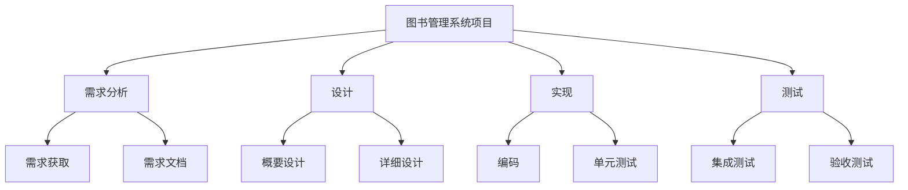
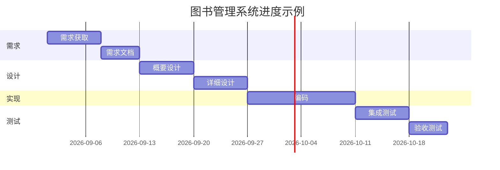
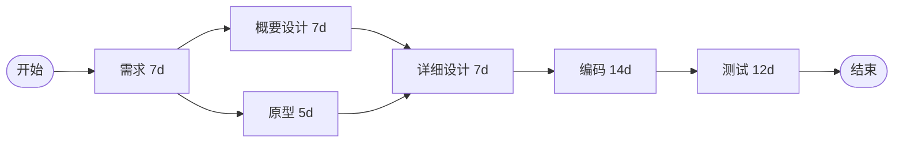

# 10.1 项目计划与进度管理

软件项目常因范围蔓延、估算失准与进度失控而失败。本节阐明软件项目管理的定义、项目计划内容、工作分解结构(WBS)、进度管理工具（甘特图、CPM、PERT）与估算方法（代码行、功能点、COCOMO），为[[10.2 软件配置管理与风险管理]]与[[10.3 软件质量保证与项目组织]]提供计划与控制基础。

## 软件项目管理定义

> [!definition] 软件项目管理
> > 软件项目管理(Software Project Management)是为完成软件项目目标，对项目进行**计划、组织、人员配备、指导与控制**的一系列活动。其核心是在有限时间、成本与资源约束下，交付满足质量要求的软件产品。

## 项目计划内容

项目计划是项目管理的纲领，通常涵盖：

| 维度 | 内容 |
| --- | --- |
| 范围 | 项目目标、交付物、边界与验收标准 |
| 进度 | 里程碑、任务分解、时间安排 |
| 成本 | 资源估算、预算与成本控制 |
| 质量 | 质量目标、评审与测试计划（[[10.3 软件质量保证与项目组织]]） |
| 风险 | 风险识别与应对（[[10.2 软件配置管理与风险管理]]） |
| 人员 | 团队组织、角色与职责 |

## 工作分解结构(WBS)

> [!definition] 工作分解结构
> > 工作分解结构(Work Breakdown Structure, WBS)是把项目可交付成果与项目工作逐层分解为更小、更易管理的组成部分的层次结构。WBS 的叶子节点是可估算、可分配、可跟踪的工作包。

> [!note] WBS 的作用
> > WBS 把模糊的项目拆解为可估算、可分配、可跟踪的工作包，是进度估算、成本预算、责任分配与进度跟踪的基础。分解应遵循“相互独立、完全穷尽”(MECE)原则，避免工作包重叠或遗漏。

## 进度管理

### 甘特图(Gantt Chart)

> [!definition] 甘特图
> > 甘特图是用横条表示任务在时间轴上起止时间的进度图，直观展示任务安排、并行关系与进度，是项目进度可视化最常用的工具。

### 关键路径法(CPM)

> [!definition] 关键路径法
> > 关键路径法(Critical Path Method, CPM)通过项目网络图找出耗时最长的路径（关键路径），关键路径的长度决定项目最短完工工期。关键活动总时差为零，任何延迟都影响总工期。

> [!note] 关键路径与工期优化
> > 上图存在两条路径：开始→需求→概要设计→详细设计→编码→测试→结束（7+7+7+14+12=47 天）与开始→需求→原型→详细设计→…（7+5+7+14+12=45 天）。关键路径为较长者（47 天）。压缩关键路径（如并行化、增配人力）才能缩短总工期；非关键路径活动可利用时差灵活调度。

### PERT 图

> [!definition] PERT
> > PERT(Program Evaluation and Review Technique)是带有活动工期概率估计的网络计划技术，对每个活动给出乐观($t_o$)、最可能($t_m$)、悲观($t_p$)三个估计，期望工期 $t_e = \dfrac{t_o + 4t_m + t_p}{6}$。

> [!tip] CPM 与 PERT 的区别
> > CPM 用单一确定工期，适用于工期较确定的项目；PERT 用三点估计处理工期不确定性，适用于研发型、不确定的项目。二者都基于网络图与关键路径，常结合使用。

## 估算方法

### 代码行估算(LOC)

以预计的源代码行数为依据，结合历史生产率数据估算工作量：

$$\text{工作量(人月)} = \frac{\text{预计代码行数}}{\text{每人月代码行生产率}}$$

> [!warning] 代码行估算的局限
> > 代码行数受语言、编码风格、复用程度影响大；需求早期难以准确估计代码行数。它适用于有历史数据且语言统一的组织内部估算。

### 功能点估算(FP)

> [!definition] 功能点
> > 功能点(Function Point, FP)以系统功能复杂度度量软件规模，与实现语言无关，由 Albrecht 提出。功能点基于五类信息域：外部输入(EI)、外部输出(EO)、外部查询(EQ)、内部逻辑文件(ILF)、外部接口文件(EIF)，加权调整后得到功能点数。

$$FP = UFP \times TCF$$

其中 $UFP$ 为未调整功能点，$TCF$ 为技术复杂度因子。

> [!note] 功能点估算的优势
> > 功能点与语言无关，适合在需求早期、代码尚未编写时估算规模，因而比代码行估算更适合早期。但功能点计数需要经验，复杂度调整主观性较强。

### COCOMO 模型

> [!definition] COCOMO
> > COCOMO(Constructive Cost Model)是 Boehm 提出的构造性成本模型，以代码行数(KLOC)为输入，按项目模式估算工作量(人月)。基本形式为：

$$E = a \times (KLOC)^b$$

其中 $E$ 为人月工作量，$a$、$b$ 为模式系数。

| 模式 | 适用 | a | b |
| --- | --- | --- | --- |
| 有机(Organic) | 小型、熟悉项目 | 2.4 | 1.05 |
| 半分离(Semi-detached) | 中型、部分熟悉 | 3.0 | 1.12 |
| 嵌入(Embedded) | 大型、强约束 | 3.6 | 1.20 |

> [!note] COCOMO II
> > COCOMO II 是对原模型的扩展，考虑复用、成熟度、团队、产品、平台等多组修正因子，适用于现代软件（含组件复用与演化）的估算。组织应根据自身历史数据校准模型系数以提高准确性。

## 小结

软件项目管理通过计划、组织、人员配备、指导与控制实现项目目标。项目计划涵盖范围、进度、成本、质量、风险与人员。WBS 把项目分解为可估算可跟踪的工作包，是估算与计划的基础。甘特图直观展示进度，关键路径法(CPM)用网络图找出决定工期的关键路径，PERT 用三点估计处理工期不确定性。估算方法中代码行估算依赖历史数据且语言相关，功能点估算与语言无关适合早期，COCOMO 用代码行与项目模式估算工作量并可扩展修正因子。

## 关联

- 上一级：[[MOC - 第10章]]
- 下一节：[[10.2 软件配置管理与风险管理]]
- 关联概念：[[2.1 瀑布模型与快速原型模型]]（过程模型决定进度安排方式）、[[MOC - 第7章]]（详细设计是工作量估算的输入）
