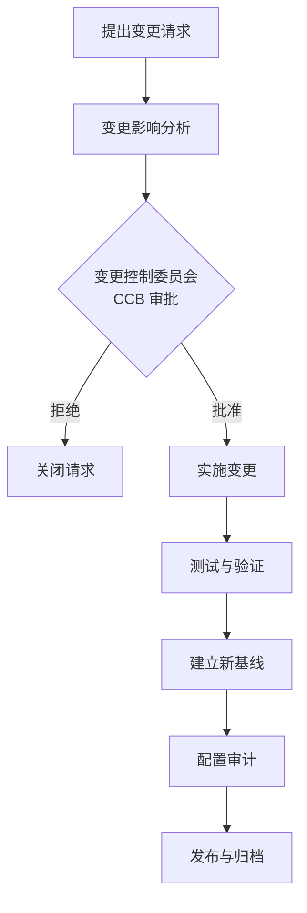
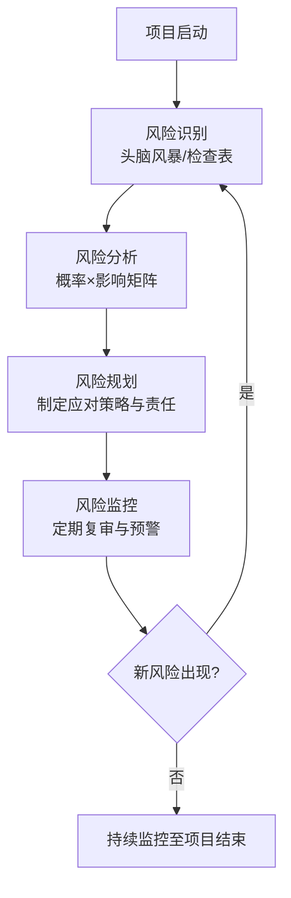

# 10.2 软件配置管理与风险管理

项目计划（[[10.1 项目计划与进度管理]]）制定后，需要两套机制保障其执行：配置管理控制变更与版本，风险管理应对不确定性。本节阐明软件配置管理(SCM)的三大活动与版本控制工具、风险管理的四个活动与风险类型及应对策略。

## 软件配置管理(SCM)

> [!definition] 软件配置管理
> > 软件配置管理(Software Configuration Management, SCM)是一组跟踪与控制软件演化变更的活动，目的是在软件整个生命周期中标识、控制、状态报告与审计配置项，保证软件产品的完整性、一致性与可追溯性。

### 配置项与基线

- **配置项(CI)**：受配置管理的工件，如源码、文档、需求、测试用例、编译脚本等。
- **基线(Baseline)**：在某一时间点经正式评审通过的配置项集合，作为后续开发的稳定参照。变更基线需经变更控制流程。

### SCM 的三大核心活动

| 活动 | 含义 | 目的 |
| --- | --- | --- |
| 版本控制(Version Control) | 对配置项的每次变更标识版本并存储 | 支持回退、分支、并行开发 |
| 变更控制(Change Control) | 对变更请求评估、审批、实施、验证 | 防止随意修改，保证变更可控 |
| 配置审计(Configuration Audit) | 检查配置项完整性与一致性 | 验证实际配置与基线一致 |

### 配置管理流程

> [!note] 变更控制委员会(CCB)
> > 变更控制委员会(Change Control Board, CCB)是评估与批准变更请求的组织，通常由项目经理、技术负责人、质量负责人、用户代表组成。CCB 确保每个变更都经过影响分析与成本评估，避免范围蔓延与失控修改。

### 版本控制工具

| 工具 | 模型 | 特点 |
| --- | --- | --- |
| Git | 分布式 | 离线工作、分支轻量、合并强大，事实标准 |
| SVN | 集中式 | 集中服务器、权限清晰、二进制友好 |
| CVS | 集中式 | 早期工具，已基本被替代 |

> [!tip] Git 在软件工程中的地位
> > Git 已成为现代软件配置管理的事实标准，配合 GitHub/Gitee 支持分支协作、Pull Request 审查与持续集成。课程实践推荐用 Git 管理代码与文档，体验分支、合并、标签与基线管理。

## 风险管理

> [!definition] 风险管理
> > 风险管理(Risk Management)是识别、分析、规划与监控项目中潜在不确定因素的活动，目的是在风险发生前降低其发生概率或影响，提升项目可控性。

### 风险管理的四个活动

| 活动 | 内容 |
| --- | --- |
| 风险识别 | 系统列出可能影响项目的风险，建立风险清单 |
| 风险分析 | 评估每个风险的发生概率与影响，排定优先级 |
| 风险规划 | 为高优先级风险制定应对策略与责任 |
| 风险监控 | 跟踪风险状态，识别新风险，调整应对 |

### 风险类型

| 类型 | 含义 | 示例 |
| --- | --- | --- |
| 项目风险(Project Risk) | 影响进度、成本、人员的风险 | 人员离职、进度延误、预算超支 |
| 技术风险(Technical Risk) | 设计、实现、技术选型的风险 | 架构不当、新技术不成熟、性能不达标 |
| 商业风险(Business Risk) | 影响产品商业价值的风险 | 市场变化、竞争对手、法规变更 |

### 风险应对策略

| 策略 | 含义 | 示例 |
| --- | --- | --- |
| 规避(Avoid) | 消除风险源，改变计划 | 放弃高风险技术方案，改用成熟方案 |
| 转移(Transfer) | 将风险影响转给第三方 | 购买保险、外包、合同条款 |
| 减轻(Mitigate) | 降低发生概率或影响 | 增加测试、备份方案、培训人员 |
| 接受(Accept) | 不主动处理，准备应急 | 低优先级风险设应急储备 |

### 风险管理流程

> [!warning] 风险管理的持续性
> > 风险管理不是一次性活动，而应贯穿项目始终。新风险会随时出现，已识别风险的状态也会变化。项目应建立风险登记册(Risk Register)，定期复审风险优先级与应对效果，将风险管理纳入日常项目管理。

## 小结

软件配置管理通过版本控制、变更控制与配置审计三大活动，标识与控制配置项变更，保证软件产品的完整性、一致性与可追溯性，基线与变更控制委员会(CCB)是核心机制，Git 已成为版本控制事实标准。风险管理通过风险识别、分析、规划与监控四个活动应对不确定性，风险分为项目、技术、商业三类，应对策略包括规避、转移、减轻与接受，且应贯穿项目始终、持续监控。

## 关联

- 上一级：[[MOC - 第10章]]
- 上一节：[[10.1 项目计划与进度管理]]
- 下一节：[[10.3 软件质量保证与项目组织]]
- 关联概念：[[9.1 软件维护类型与维护过程]]（维护修改需配置管理与回归测试）、[[8.2 编码规范与代码质量]]（代码审查与配置管理配合）
