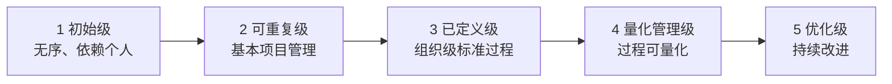
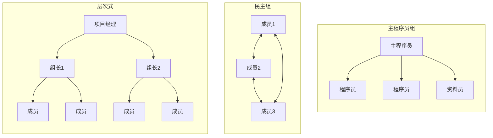

# 10.3 软件质量保证与项目组织

项目计划（[[10.1 项目计划与进度管理]]）与配置风险管理（[[10.2 软件配置管理与风险管理]]）解决“按计划交付”，本节解决“按质量交付”与“由谁交付”。本节阐明软件质量保证(SQA)、软件能力成熟度模型(CMM/CMMI)、项目组织结构与软件度量。

## 软件质量保证(SQA)

> [!definition] 软件质量保证
> > 软件质量保证(Software Quality Assurance, SQA)是一组有计划、有系统的活动，旨在为软件产品符合规定质量要求提供充分信心。SQA 侧重过程与规范的保证，区别于测试侧重发现缺陷。

### SQA 的主要活动

| 活动 | 内容 |
| --- | --- |
| 质量计划 | 制定软件质量保证计划(SQAP)，明确质量目标、标准、评审与审计安排 |
| 标准与规范 | 选定并推行适用的标准（编码规范、设计规范、文档标准） |
| 评审与审查 | 组织设计评审、代码审查（[[8.2 编码规范与代码质量]]）、里程碑评审 |
| 审计 | 审计过程是否符合规范、配置项是否完整（[[10.2 软件配置管理与风险管理]]） |
| 度量与报告 | 收集质量度量数据，向管理层报告质量状态 |

> [!note] SQA 与测试的区别
> > SQA 关注“过程是否正确”，通过计划、标准、评审与审计预防缺陷；测试（[[MOC - 软件测试技术]]）关注“产品是否有缺陷”，通过执行发现缺陷。二者互补：SQA 是质量的过程保障，测试是质量的产品验证。

## 软件能力成熟度模型(CMM/CMMI)

> [!definition] CMM/CMMI
> > 能力成熟度模型(Capability Maturity Model, CMM)及其集成版本 CMMI(Capability Maturity Model Integration)是评估组织软件过程成熟度的框架，由 SEI 提出，分五个等级，描述组织过程能力从无序到持续优化的演进路径。

### CMM/CMMI 五级模型

| 等级 | 名称 | 特征 |
| --- | --- | --- |
| 1 | 初始级(Initial) | 过程无序，成功依赖个人英雄主义，难以重复 |
| 2 | 可重复级(Repeatable) | 建立基本项目管理，能重复早期成功经验 |
| 3 | 已定义级(Defined) | 组织级标准过程已文档化，项目裁剪使用 |
| 4 | 量化管理级(Managed) | 过程与产品质量可量化度量与预测 |
| 5 | 优化级(Optimizing) | 关注过程持续改进与技术革新 |

> [!tip] CMMI 的工程意义
> > CMMI 等级越高，过程越成熟、可预测、可改进，项目失败率与缺陷率越低。组织通常以 2→3 级为常见目标，4→5 级需投入量化度量与持续改进体系。CMMI 提供过程改进的路线图，但实施需结合组织实际，避免“为评级而评级”。

## 项目组织结构

软件项目常用三种团队组织结构：

| 结构 | 特点 | 适用 |
| --- | --- | --- |
| 主程序员组(Chief Programmer Team) | 由主程序员主导决策，其他成员辅助，集中负责制 | 任务明确、主程序员能力强的中小项目 |
| 民主组(Democratic Team) | 成员平等、共同决策、知识共享 | 研究型、创新型、成员水平接近的项目 |
| 层次式(Hierarchical) | 树状分层管理，项目经理—组长—成员 | 大型项目、明确分工 |

### 项目组织结构图

> [!note] 人员管理要点
> > 人员管理包括团队组建、激励与沟通。团队组建需考虑成员技能互补与角色匹配；激励需结合物质与精神激励，认可成就、提供成长；沟通需建立有效机制（站会、评审、文档），减少信息损耗。人员问题（如关键成员离职）是项目风险的重要来源（[[10.2 软件配置管理与风险管理]]）。

## 软件度量

> [!definition] 软件度量
> > 软件度量(Software Measurement)是对软件过程与产品进行量化度量的活动，为项目管理与质量改进提供数据依据。度量分过程度量与产品度量。

| 度量类别 | 指标 | 说明 |
| --- | --- | --- |
| 生产率度量 | 代码行/人月、功能点/人月 | 单位工作量产出 |
| 质量度量 | 缺陷密度(缺陷数/KLOC)、缺陷发现率 | 产品质量水平 |
| 过程度量 | 评审覆盖率、测试覆盖率、修复时间 | 过程执行情况 |
| 规模度量 | 代码行数、功能点数 | 系统规模 |

> [!tip] 度量的工程纪律
> > 度量应服务于管理与改进目标，而非为度量而度量。指标定义需稳定可重复，采集需自动化以降低成本，结果应反馈给团队驱动改进。典型的“目标—问题—指标”(GQM)方法从目标出发推导问题与指标，保证度量与目标一致。

## 小结

软件质量保证通过质量计划、标准推行、评审与审计、度量报告为产品质量提供过程保障，区别于测试的产品验证。CMM/CMMI 五级模型描述组织过程成熟度从初始、可重复、已定义、量化管理到优化的演进路径，是过程改进的路线图。项目组织结构分主程序员组、民主组、层次式，分别适用不同规模与特点的项目。软件度量用生产率、质量、过程、规模等指标量化过程与产品，为管理与改进提供数据依据。

## 关联

- 上一级：[[MOC - 第10章]]
- 上一节：[[10.2 软件配置管理与风险管理]]
- 关联概念：[[MOC - 软件测试技术]]（SQA 与测试在质量保障层面相互衔接）、[[8.2 编码规范与代码质量]]（代码审查是 SQA 的评审活动）、[[9.2 软件可维护性与维护策略]]（质量保证影响可维护性）
