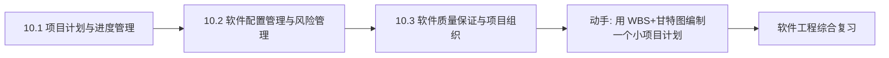

# MOC - 第10章 软件项目管理

> [!info] 本章定位
> 第10章将视角从技术与生命周期提升到项目级管理。本章解决的核心问题是：**如何在有限的时间、成本与资源约束下，系统化地组织、计划与控制软件项目，使其按时、按质、按预算交付**。本章覆盖项目计划与进度管理、配置管理与风险管理、质量保证与项目组织，是从“能开发软件”走向“能交付软件项目”的管理基础，贯穿全生命周期。

## 学习路线图

## 知识点导航

| 节 | 主题 | 核心要点 | 入口 |
| --- | --- | --- | --- |
| 10.1 | 项目计划与进度管理 | 项目管理定义、WBS、甘特图、CPM/PERT、估算方法 | [[10.1 项目计划与进度管理]] |
| 10.2 | 软件配置管理与风险管理 | SCM、版本控制、风险识别与应对 | [[10.2 软件配置管理与风险管理]] |
| 10.3 | 软件质量保证与项目组织 | SQA、CMM/CMMI、组织结构、软件度量 | [[10.3 软件质量保证与项目组织]] |

## 核心考点

> [!warning] 重点掌握
> 1. 软件项目管理的定义：计划、组织、人员配备、指导、控制。
> 2. 工作分解结构(WBS)的概念与作用。
> 3. 进度管理工具：甘特图、关键路径法(CPM)、PERT 图。
> 4. 软件估算方法：代码行估算、功能点估算、COCOMO 模型。
> 5. 软件配置管理(SCM)：版本控制、变更控制、配置审计。
> 6. 风险管理的四个活动：风险识别、分析、规划、监控；风险应对策略。
> 7. 软件能力成熟度模型(CMM/CMMI)五个等级。
> 8. 项目组织结构：主程序员组、民主组、层次式。

## 自测题

> [!question] 题1
> 说明关键路径法(CPM)中关键路径的含义及其对项目工期的影响。
> > [!check]- 参考答案
> > 关键路径(Critical Path)是项目网络图中从起点到终点耗时最长的路径，由关键活动（总时差为零的活动）组成。关键路径的长度决定了项目的最短完工工期：关键路径上任何活动延迟都会直接导致项目工期延长；而非关键活动在其时差范围内延误不影响总工期。因此项目经理应重点监控关键路径活动，通过赶工(Crashing)或快速跟进(Fast Tracking)压缩关键路径以缩短工期。关键路径可能因资源调整而变化，需动态更新。

> [!question] 题2
> 比较代码行估算、功能点估算与 COCOMO 模型三种软件估算方法。
> > [!check]- 参考答案
> > ①代码行估算(LOC)：以预计的源代码行数为依据估算工作量，直观但依赖经验数据，且代码行数受语言与风格影响大；②功能点估算(FP)：以输入、输出、查询、内部文件、外部接口五类功能的加权和度量系统规模，与语言无关，适合需求早期估算；③COCOMO 模型：Boehm 提出的构造性成本模型，用代码行数与项目模式（有机/半分离/嵌入）计算人月工作量，COCOMO II 还考虑复用、成熟度等修正因子。三者中 LOC 最直接但对早期不适用，FP 适合早期且语言无关，COCOMO 提供较完整的多因素模型但需校准。

> [!question] 题3
> 简述软件配置管理(SCM)的三个核心活动。
> > [!check]- 参考答案
> > ①版本控制(Version Control)：对配置项（源码、文档、测试数据等）的每次变更进行版本标识与存储，支持回退与分支管理，典型工具为 Git/SVN；②变更控制(Change Control)：对变更请求进行评估、审批、实施与验证，确保变更经过流程而非随意修改；③配置审计(Configuration Audit)：定期检查配置项的完整性与一致性，验证实际配置与基线一致。三者共同保证软件产品在演化过程中的可追溯性、一致性与可重现性。

> [!question] 题4
> 列举 CMM/CMMI 的五个成熟度等级。
> > [!check]- 参考答案
> > CMM/CMMI 五个等级：①初始级(Initial)——过程无序，成功依赖个人英雄主义；②可重复级(Repeatable)——建立了基本项目管理，能重复早期成功；③已定义级(Defined)——组织级标准过程已文档化并裁剪使用；④量化管理级(Managed)——过程与产品质量可量化度量与预测；⑤优化级(Optimizing)——关注过程持续改进与技术革新。等级越高，过程越成熟、可预测、可改进，组织能力越强。

## 章节导航

- 上一级：[[MOC - 软件工程]]
- 上一章：[[MOC - 第9章]]
- 关联：[[MOC - 软件测试技术]]（质量保证层面的衔接）
