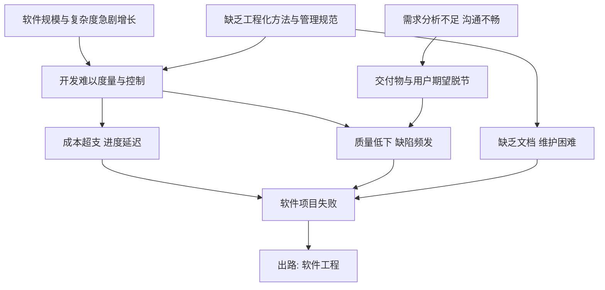

# 1.1 软件、软件危机、软件工程概念

要理解为什么需要“软件工程”，必须先回答三个问题：软件究竟是什么、软件开发为什么会陷入危机、以及用什么样的学科来化解危机。本节从软件的定义与特征出发，剖析软件危机的表现与成因，并引出软件工程的定义与诞生背景，为后续生命周期与过程模型的学习提供动机。

## 软件的定义

> [!definition] 软件
> 软件（Software）是计算机程序、数据及其相关文档的完整集合。即：**软件 = 程序 + 数据 + 文档**。

- **程序（Program）**：计算机可执行的指令序列，是软件的功能载体。
- **数据（Data）**：程序处理的对象与处理所需的参数，包括配置、数据库、初始数据等。
- **文档（Documentation）**：与程序开发、运行、维护相关的说明性资料，如需求规格说明书、设计文档、用户手册等。

> [!note] 文档为何属于软件
> > 文档不直接执行，但它记录了开发意图、设计决策与使用方式，是软件可维护、可管理、可复用的前提。把软件等同于“程序”会忽视维护阶段最依赖的文档资产——这正是早期软件危机的重要诱因。

## 软件的特征

与硬件相比，软件具有以下显著特征：

| 特征 | 含义 | 工程含义 |
| --- | --- | --- |
| 逻辑实体而非物理实体 | 软件由逻辑符号构成，看不见摸不着 | 开发过程是设计与思考的过程，难以用物理计量度量进度 |
| 不会磨损但会退化 | 软件不会因运行而物理损耗，但会随反复修改而结构腐化 | 需要预防性维护与重构，退化曲线呈“浴缸曲线”右段上升 |
| 复杂度高 | 软件状态空间庞大，逻辑分支与交互极多 | 是软件危机的核心根源，需要分解、抽象与工程化方法 |
| 开发与运行依赖智力活动 | 主要成本是人力智力投入 | 人员能力与协作管理对质量影响巨大 |
| 不可见性 | 软件结构难以直观呈现 | 需要建模与可视化（如 DFD、UML）辅助理解 |

> [!warning] 软件退化与磨损的区别
> > 硬件故障率随时间呈“浴缸曲线”：初期高（制造缺陷）、中期低且稳定、末期因磨损升高。软件没有物理磨损，但其故障率会因持续变更而逐步上升——每次修改都可能引入新缺陷、破坏设计一致性。软件的“退化”只能通过 disciplined 的维护与重构延缓，无法通过更换零件解决。

## 软件危机

> [!definition] 软件危机
> > 软件危机（Software Crisis）指在计算机软件的开发和维护过程中所遇到的一系列严重问题，表现为开发成本与进度失控、软件质量低下、维护困难，最终导致软件项目大量失败的现象。20世纪60年代随着软件规模急剧扩大而凸显。

### 软件危机的表现

1. **成本超支**：实际开发成本远超预算，资金难以控制。
2. **进度延迟**：开发周期大幅拖延，无法按时交付。
3. **质量低下**：软件缺陷多、可靠性差、难以满足用户需求。
4. **维护困难**：缺乏文档与规范，维护成本高昂，甚至无法维护。
5. **用户不满**：开发人员与用户沟通不足，交付物与用户期望脱节。
6. **不可管理**：软件开发过程难以度量、难以计划、难以控制。

### 软件危机的成因

- **软件本身**：规模与复杂度急剧增长；逻辑实体不可见，难以度量与管理。
- **开发管理**：缺乏工程化方法与规范；需求分析不充分；忽视文档与测试；缺乏有效的项目管理与质量保证；开发人员与用户缺乏有效沟通。

### 软件危机的因果

> [!tip] 解决途径
> > 化解软件危机的根本途径是：用工程化、规范化、可管理的方法组织软件开发与维护——即建立并应用“软件工程”。具体包括：采用科学的开发方法与过程模型、加强需求分析与文档管理、引入项目管理与质量保证、使用工具提升效率、培养专业化开发队伍。

## 软件工程的定义与诞生

> [!definition] 软件工程
> > 软件工程（Software Engineering）是用工程化方法构建和维护软件的学科，它将系统化、规范化、可度量的方法应用于软件的开发、运行与维护，即将工程化的原则与方法引入软件生命周期全过程。

### NATO 会议与软件工程的诞生

1968 年，北大西洋公约组织（NATO）在德国加米施（Garmisch）召开了一次具有里程碑意义的学术会议，会议名称首次正式使用了“软件工程（Software Engineering）”一词，旨在应对日益严重的软件危机。这次会议被普遍认为是软件工程作为一门独立学科诞生的标志。

> [!note] 历史意义
> > NATO 1968 会议的召开背景是软件危机已威胁到大型军事与航天系统的交付。会议提出“应当像对待其他工程学科一样对待软件开发”，确立了软件工程的工程化定位，推动了过程模型、方法学与工具的后续发展。

软件工程的核心思想：把软件开发从“个人技艺”提升为“工程实践”，通过方法、工具与过程的协同，实现低成本、按时交付、高质量与可维护的目标（详见 [[1.3 软件工程三要素、软件工程目标]]）。

## 小结

软件是程序、数据与文档的完整集合，具有逻辑性、非磨损性、高复杂度与不可见性等特征。随着软件规模膨胀，缺乏工程化方法导致软件危机，表现为成本、进度、质量与维护的全面失控。1968 年 NATO 会议正式提出“软件工程”，主张用工程化方法构建与维护软件，由此奠定了整门学科的基础。

## 关联

- 上一级：[[MOC - 第1章]]
- 下一节：[[1.2 软件生命周期与软件过程]]
- 关联概念：[[1.3 软件工程三要素、软件工程目标]]（软件工程三要素是对工程化方法的结构化展开）
