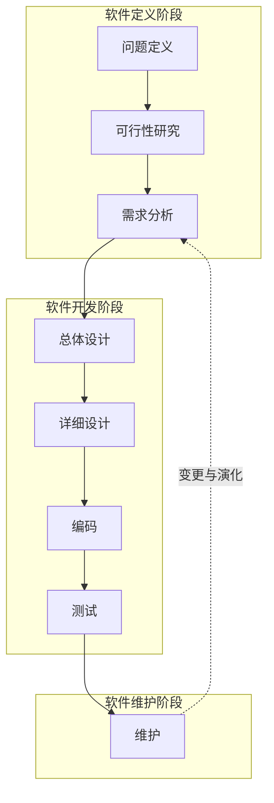

# 1.2 软件生命周期与软件过程

软件工程需要一种时间维度的框架来组织开发活动——软件生命周期回答“软件从无到有再到废弃经历哪些阶段”，软件过程则回答“这些活动如何被组织、管理与执行”。本节给出软件生命周期的阶段划分与各阶段产物，并引入 ISO/IEC 12207 软件过程标准，为后续过程模型（第2章）的学习奠定基础。

## 软件生命周期

> [!definition] 软件生命周期
> > 软件生命周期（Software Life Cycle）是软件从产生、发展到废弃的整个过程，通常划分为**软件定义、软件开发、软件维护**三大阶段，每个大阶段再细分为若干子阶段。

### 三大阶段

| 大阶段 | 目的 | 关键问题 |
| --- | --- | --- |
| 软件定义 | 确定要做什么、是否可行 | 要解决的问题是什么？可行吗？需求是什么？ |
| 软件开发 | 设计并实现软件 | 如何设计？如何编码？如何验证？ |
| 软件维护 | 持续运行与演化 | 如何修复、适应与改进？ |

### 细化的子阶段

将三大阶段进一步细化，软件生命周期可表达为以下八个有顺序的子阶段：

1. **问题定义**：明确“要解决的问题是什么”，产出问题定义报告。
2. **可行性研究**：从技术、经济、操作等角度评估是否值得做，产出可行性研究报告。
3. **需求分析**：准确刻画用户需求，产出需求规格说明书（SRS）。
4. **总体设计**：确定系统总体架构与模块划分，又称概要设计。
5. **详细设计**：给出每个模块的详细算法与数据结构。
6. **编码**：将设计翻译为可执行程序。
7. **测试**：发现并纠正缺陷，确保软件满足需求。
8. **维护**：通过改正性、适应性、完善性、预防性维护使软件持续可用。

> [!note] 阶段顺序与过程模型
> > 上述顺序是逻辑上的依赖顺序，并非规定必须严格按瀑布执行。不同过程模型会对这些阶段进行不同的组织——瀑布模型严格顺序执行，增量模型分批迭代，螺旋模型围绕风险反复迭代（详见 [[2.1 瀑布模型与快速原型模型]]、[[2.2 增量模型与螺旋模型]]）。

### 软件生命周期流程图

> [!tip] 阶段产物
> > 每个阶段都有明确的输入与输出产物：问题定义报告、可行性研究报告、需求规格说明书、总体设计说明书、详细设计说明书、源程序、测试报告、维护记录。这些文档是阶段评审与维护的依据，也是软件工程“文档驱动”特征的体现。

## 软件过程

> [!definition] 软件过程
> > 软件过程（Software Process）是为获得高质量软件所需要完成的一系列任务框架，它规定了软件开发与维护活动的组织方式、各活动的输入输出、各活动之间的顺序与约束，以及里程碑与质量保证要求。

软件过程是软件生命周期的“工程化实现”：生命周期描述“有哪些阶段”，软件过程则规定“这些阶段如何被组织、执行、管理与改进”。过程关注的是活动的可重复性与可管理性，是软件工程三要素中“过程”的具体化（详见 [[1.3 软件工程三要素、软件工程目标]]）。

### ISO/IEC 12207 软件生命周期过程标准

**ISO/IEC 12207** 是关于软件生命周期过程的国际标准，它为软件的获取、供应、开发、运行和维护提供了一个通用过程框架，是软件工程领域最重要的过程标准之一。

该标准将软件过程分为三大类：

| 过程类别 | 含义 | 典型过程 |
| --- | --- | --- |
| 基本过程 | 直接与软件生产相关 | 获取过程、供应过程、开发过程、运行过程、维护过程 |
| 支持过程 | 为基本过程提供支撑 | 文档编制、配置管理、质量保证、验证、确认、联合评审、审计、问题解决 |
| 组织过程 | 为组织提供基础能力 | 管理、基础设施、改进、培训 |

> [!note] 标准的地位
> > ISO/IEC 12207 不规定具体采用哪种模型（瀑布、增量或敏捷），而是提供一组可裁剪的过程构件，供组织根据项目特点选择与组合。它体现了软件工程“过程可裁剪、可改进”的思想，是过程改进（如 CMMI）的基础参考。

## 生命周期与过程的关系

- **生命周期**回答“软件有哪些阶段”——是一种时间维度上的阶段划分。
- **过程模型**回答“这些阶段如何组织”——如瀑布、增量、螺旋等是对生命周期的不同编排（详见第2章）。
- **软件过程**回答“活动如何被管理与执行”——强调可重复、可度量、可改进。
- **ISO/IEC 12207** 提供了过程的标准框架与构件库，使组织能系统化地裁剪与改进过程。

## 小结

软件生命周期将软件从产生到废弃划分为定义、开发、维护三大阶段，进一步细化为问题定义、可行性研究、需求分析、总体设计、详细设计、编码、测试、维护八个子阶段。软件过程为这些活动提供可管理、可重复的框架，ISO/IEC 12207 则给出了国际通用的过程构件标准。理解生命周期与过程，是选择与评价过程模型的前提。

## 关联

- 上一级：[[MOC - 第1章]]
- 上一节：[[1.1 软件、软件危机、软件工程概念]]
- 下一节：[[1.3 软件工程三要素、软件工程目标]]
- 关联概念：[[2.1 瀑布模型与快速原型模型]]（过程模型是对生命周期阶段的不同编排）
