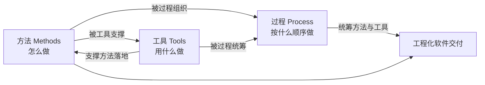

# 1.3 软件工程三要素、软件工程目标

软件工程不是单一技术，而是一个由方法、工具与过程协同构成的体系。本节阐明软件工程三要素各自的含义与相互关系，明确软件工程要达成的目标，介绍 B.W. Boehm 提出的七条基本原理，并辨析软件工程与计算机科学的关系，为后续各章方法与过程的学习提供整体坐标。

## 软件工程三要素

> [!definition] 软件工程三要素
> > 软件工程由**方法（Methods）、工具（Tools）、过程（Process）**三个要素构成，分别回答“怎么做”“用什么做”“按什么顺序做”。

| 要素 | 回答的问题 | 含义 | 典型示例 |
| --- | --- | --- | --- |
| 方法 | 怎么做 | 构造软件的系统化技术方法，提供开发各阶段的规则与步骤 | 面向数据流分析、面向对象设计、结构化设计 |
| 工具 | 用什么做 | 为方法提供自动或半自动支撑的软件环境 | StarUML、Visio、Git、编译器、IDE |
| 过程 | 按什么顺序做 | 把方法与工具组织成合理的活动序列，定义阶段、产物与里程碑 | 瀑布过程、增量过程、螺旋过程、敏捷过程 |

### 三要素关系

> [!note] 三要素的相互依存
> > 方法是核心，提供技术原理；工具是方法的放大器，使方法高效可执行；过程是组织者，把方法与工具编排为可管理、可重复的开发流程。三者缺一不可：仅有方法而无工具则效率低下；仅有工具而无过程则各自为政；仅有过程而无方法则空洞无物。过程将三者整合为真正的工程实践。

## 软件工程目标

软件工程的根本目标是克服软件危机，用工程化方法交付软件。具体目标包括：

1. **降低成本**：在预算内完成开发，控制人力与资源投入。
2. **按时交付**：按计划进度完成各阶段并交付，避免进度失控。
3. **高质量**：软件满足需求、缺陷少、可靠、易用且可维护。
4. **可维护**：软件易于修改、扩展与移植，降低全生命周期成本。

> [!tip] 目标之间的权衡
> > 成本、进度、质量三者构成经典的“软件项目管理铁三角”，相互制约：压低成本可能牺牲质量，赶进度可能引入缺陷。软件工程方法与过程的价值，正在于在约束下系统性地平衡这三者，而不是单纯追求某一项。

## 软件工程基本原理

B.W. Boehm 在总结软件工程实践的基础上，提出了软件工程的七条基本原理，被认为是软件工程的经验性公理：

| 序号 | 原理 | 含义 |
| --- | --- | --- |
| 1 | 用分阶段的生命周期计划严格管理 | 将软件生命周期划分为阶段，每阶段都有计划与评审 |
| 2 | 坚持进行阶段评审 | 在每个阶段结束时评审，尽早发现缺陷，避免缺陷流入下游 |
| 3 | 实行严格的产品控制 | 对需求与设计变更进行配置管理与变更控制 |
| 4 | 采用现代程序设计技术 | 采用结构化、面向对象等先进方法与技术 |
| 5 | 结果应能清楚地审查 | 每阶段产物可度量、可审查，明确里程碑 |
| 6 | 开发小组的人员应该少而精 | 团队规模适度、能力匹配，避免沟通成本过大 |
| 7 | 承认不断改进软件工程实践的必要性 | 持续改进过程、方法与工具 |

> [!warning] 阶段评审与尽早测试
> > 原理2“坚持阶段评审”强调缺陷越早发现修复成本越低——这与软件测试中“尽早测试”原则一脉相承（参见 [[MOC - 软件测试技术|软件测试技术]]）。需求阶段的一个误解若到验收才发现，修复成本可能呈指数级上升。

## 软件工程与计算机科学的关系

软件工程与计算机科学既密切相关又有本质区别：

| 维度 | 计算机科学 | 软件工程 |
| --- | --- | --- |
| 研究对象 | 计算、算法、信息处理的理论基础 | 软件的工程化构造与维护 |
| 核心关注 | 什么是可计算的、如何高效计算 | 如何在约束下高质量地交付软件 |
| 性质 | 理论科学 | 工程学科 |
| 评价标准 | 正确性、复杂度、完备性 | 成本、进度、质量、可维护性 |
| 方法论 | 形式化、数学证明 | 工程化方法、过程管理、团队协作 |

> [!note] 关系辨析
> > 计算机科学为软件工程提供理论基础（算法、数据结构、可计算性）；软件工程把这些理论转化为可管理、可交付的工程实践。前者关心“什么是可能的与最优的”，后者关心“如何在现实约束下把软件造出来并维护好”。二者互补，不可替代。

## 小结

软件工程由方法、工具、过程三要素构成，分别解决“怎么做、用什么做、按什么顺序做”，过程将三者整合为可管理的工程实践。软件工程以降低成本、按时交付、高质量、可维护为目标，遵循 Boehm 七条原理。它与计算机科学分别代表工程与理论两条路径，共同支撑软件的构建与发展。

## 关联

- 上一级：[[MOC - 第1章]]
- 上一节：[[1.2 软件生命周期与软件过程]]
- 关联概念：[[2.1 瀑布模型与快速原型模型]]（过程模型是“过程”要素的具体化）、[[MOC - 软件测试技术|软件测试技术]]（阶段评审与尽早测试原则的呼应）
