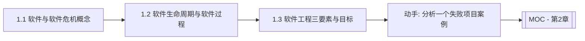

# MOC - 第1章 软件工程概述

> [!info] 本章定位
> 第1章是整门课程的地基。它回答三个问题：软件“是什么、有何特征”、软件危机“表现为何、原因何在、如何化解”、软件工程“是什么、由何构成、目标何在”。掌握本章后，才能理解后续过程模型（第2章）为何如此组织、需求工程（第3章）为何强调规范化，以及软件工程方法、工具与过程如何贯穿生命周期。

## 学习路线图

## 知识点导航

| 节 | 主题 | 核心要点 | 入口 |
| --- | --- | --- | --- |
| 1.1 | 软件、软件危机、软件工程概念 | 软件定义与特征、软件危机表现与成因、软件工程诞生（NATO 1968） | [[1.1 软件、软件危机、软件工程概念]] |
| 1.2 | 软件生命周期与软件过程 | 生命周期三大阶段与八个子阶段、软件过程定义与 ISO/IEC 12207 | [[1.2 软件生命周期与软件过程]] |
| 1.3 | 软件工程三要素、软件工程目标 | 方法/工具/过程三要素、软件工程目标、Boehm 七条原理、与计算机科学的关系 | [[1.3 软件工程三要素、软件工程目标]] |

## 核心考点

> [!warning] 重点掌握
> 1. 软件的定义（程序+数据+文档）与三大特征（逻辑实体、不磨损但退化、复杂度高）。
> 2. 软件危机的主要表现（成本超支、进度延迟、质量低下、维护困难）与根本原因。
> 3. 软件工程的定义与诞生背景（1968 年 NATO 会议）。
> 4. 软件生命周期三大阶段（定义、开发、维护）及八个子阶段的顺序与产物。
> 5. 软件过程的概念与 ISO/IEC 12207 标准的地位。
> 6. 软件工程三要素（方法、工具、过程）的含义与相互关系。
> 7. 软件工程的目标与 B.W. Boehm 七条基本原理。

## 自测题

> [!question] 题1
> 简述软件的定义，并说明“软件不会磨损但会退化”这一特征的含义及原因。
> > [!check]- 参考答案
> > 软件是计算机程序、数据及其相关文档的完整集合，即“程序+数据+文档”。软件是逻辑实体而非物理实体，因此在运行过程中不会因物理磨损而损坏。但软件会随环境变化、需求演进、反复修改而“退化”：不断的变更会引入新的缺陷、破坏原有结构、使设计腐化，最终导致维护成本急剧上升，这种退化被称为软件老化（Software Aging），需要通过重构与预防性维护加以控制。

> [!question] 题2
> 列举软件危机的四种典型表现，并从软件本身与开发管理两个角度分析其成因。
> > [!check]- 参考答案
> > 典型表现：①开发成本严重超支；②进度大幅延迟；③软件质量低下、缺陷频发；④维护困难、维护成本高昂。成因：软件自身方面——软件规模与复杂度急剧增长、逻辑实体不可见导致难以度量与管理；开发管理方面——缺乏工程化方法与规范、需求分析不充分、缺乏有效的项目管理与质量保证、忽视文档与维护。根本出路是用工程化方法组织软件开发，即软件工程。

> [!question] 题3
> 说明软件工程三要素（方法、工具、过程）各自的含义及其相互关系。
> > [!check]- 参考答案
> > 方法（Methods）回答“怎么做”，提供构造软件的系统化技术，如需求分析、设计、编码、测试等方法；工具（Tools）回答“用什么做”，为方法提供自动化或半自动化的支撑，如建模工具、编译器、版本控制工具；过程（Process）回答“按什么顺序做”，把方法和工具组织成合理的开发活动序列，定义各阶段的任务、产物与里程碑。三者相互依存：方法是核心，工具支撑方法，过程统筹方法与工具的协作；过程将三者整合为可管理、可重复的工程实践。

> [!question] 题4
> 列出软件生命周期的三大阶段，并写出开发阶段细化后的五个子阶段。
> > [!check]- 参考答案
> > 三大阶段：软件定义、软件开发、软件维护（运行维护）。开发阶段细化的五个子阶段为：需求分析 → 总体设计 → 详细设计 → 编码 → 测试。若把定义阶段也展开，完整顺序为：问题定义 → 可行性研究 → 需求分析 → 总体设计 → 详细设计 → 编码 → 测试 → 维护。

## 章节导航

- 上一级：[[MOC - 软件工程]]
- 下一章：[[MOC - 第2章]]
