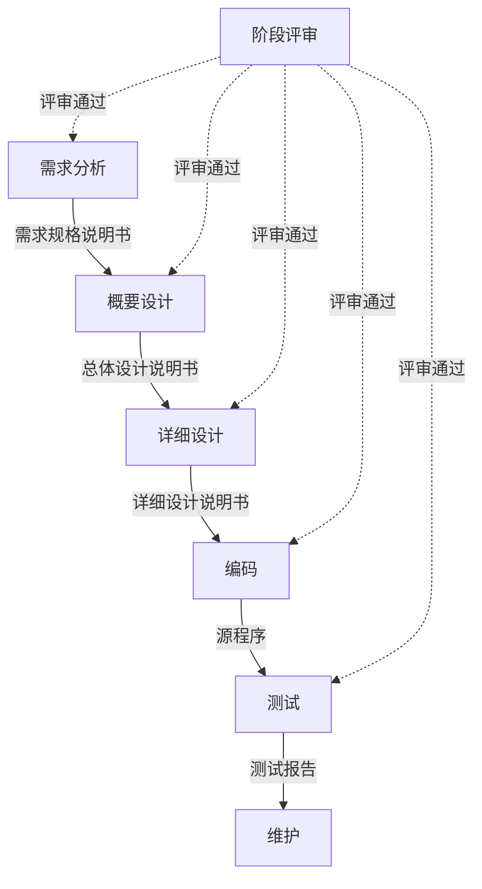
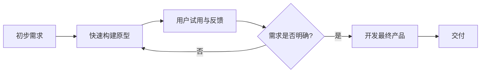
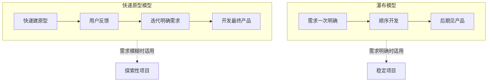

# 2.1 瀑布模型与快速原型模型

软件过程模型规定开发活动的组织方式。瀑布模型是最经典、最基础的模型，它以严格的阶段顺序与文档驱动刻画了“工程化”的纪律；快速原型模型则针对瀑布模型“需求难以一次明确”的缺陷，通过构建原型来获取与验证需求。本节对比二者的原理、流程与适用场景。

## 瀑布模型

> [!definition] 瀑布模型
> > 瀑布模型（Waterfall Model）将软件生命周期严格划分为顺序的阶段，各阶段自上而下如瀑布般流淌，上一阶段完成并通过评审后才能进入下一阶段，每阶段都有明确的文档产物，是一种**文档驱动**的过程模型。

### 阶段顺序

瀑布模型的典型阶段为：需求分析 → 概要设计 → 详细设计 → 编码 → 测试 → 维护。

### 瀑布模型流程图

> [!note] 文档驱动与严格评审
> > 瀑布模型的两个核心特征是“文档驱动”与“严格评审”：每阶段以文档为产物与下一阶段的输入，阶段结束时必须通过评审才能推进。这使得开发过程可见、可审查、可追溯，但也带来了灵活性不足的代价。

### 优点

- 部署简单，阶段清晰，便于里程碑管理与进度控制。
- 每阶段有明确文档，有利于团队协作与交接。
- 强调评审，能较早发现阶段性问题。

### 缺点

- 要求需求一开始就完全明确，难以适应需求变化。
- 用户要到后期才能看到可运行产品，风险延迟暴露。
- 缺乏灵活性，后期返工成本高。
- 文档工作量庞大。

> [!tip] 适用场景
> > 瀑布模型适用于需求非常明确且稳定、技术成熟、项目规模较大的场景，如嵌入式固件、安全关键系统、合同约定严格的政府项目。对需求易变或探索性项目则不适用。

## 快速原型模型

> [!definition] 快速原型模型
> > 快速原型模型（Rapid Prototype Model）通过快速构建一个反映软件主要特征的**原型（Prototype）**，让用户试用并反馈，再根据反馈修改原型，逐步明确需求，最终开发出满足用户需求的产品。

### 工作流程

构建原型 → 用户试用并反馈 → 修改/完善原型 →（反复迭代）→ 明确需求后开发最终产品。

### 原型类型

| 类型 | 含义 | 特点 | 适用场景 |
| --- | --- | --- | --- |
| 抛弃型原型 | 原型仅用于澄清需求，实现后丢弃，不作为正式产品 | 关注快速验证需求，不计较代码质量 | 需求不明确、需探索验证 |
| 演化型原型 | 原型不丢弃，通过持续修改与扩充演化为最终产品 | 增量式交付，需关注可维护性 | 需求易变、希望尽早交付可用版本 |

> [!warning] 原型的质量陷阱
> > 抛弃型原型往往为了速度牺牲质量（如省略测试、忽视结构），若误将其当作演化型原型直接演进，会埋下严重的技术债务。必须明确原型的定位：抛弃型原型绝不能进入正式维护，演化型原型从一开始就要考虑可维护性与架构。

## 瀑布模型与快速原型模型对比

| 维度 | 瀑布模型 | 快速原型模型 |
| --- | --- | --- |
| 需求假设 | 需求一次明确 | 需求逐步明确 |
| 驱动方式 | 文档驱动 | 反馈驱动 |
| 用户参与 | 主要在需求阶段 | 贯穿原型迭代 |
| 见到产品 | 后期 | 早期（原型） |
| 风险暴露 | 后期 | 早期 |

## 小结

瀑布模型以严格的阶段顺序、文档驱动与评审为特征，适合需求明确稳定的项目，但灵活性差。快速原型模型通过构建原型获取用户反馈，弥补了瀑布模型需求难明确的缺陷，分为抛弃型与演化型两种。两者是后续增量、螺旋等模型的基础——增量模型在原型思想上发展分批交付，螺旋模型把原型与风险分析结合（详见 [[2.2 增量模型与螺旋模型]]）。

## 关联

- 上一级：[[MOC - 第2章]]
- 下一节：[[2.2 增量模型与螺旋模型]]
- 关联概念：[[1.2 软件生命周期与软件过程]]（瀑布模型是对生命周期阶段的严格顺序编排）、[[2.3 喷泉模型与敏捷开发模型]]（敏捷模型对反馈驱动思想的进一步发展）
