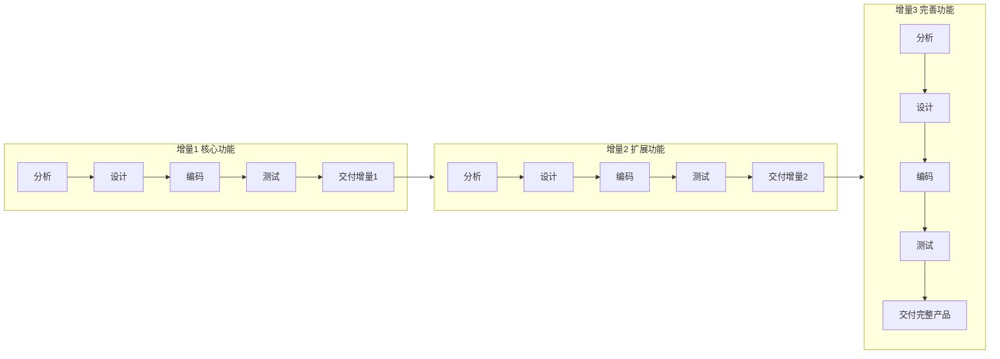
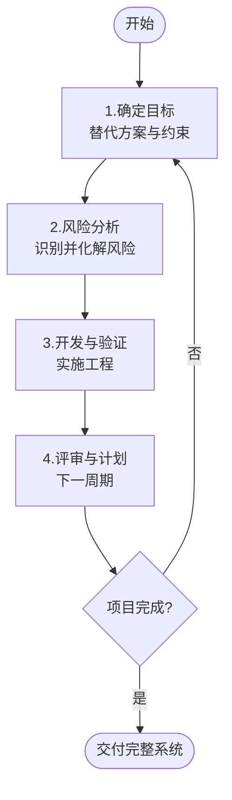

# 2.2 增量模型与螺旋模型

瀑布模型要求需求一次明确，快速原型模型解决了需求探索问题，但二者都未直接解决“如何尽早交付可用产品”与“如何系统化控制风险”。增量模型通过分批交付实现尽早可用，螺旋模型通过风险分析实现风险可控。本节阐述二者的原理、流程与适用场景。

## 增量模型

> [!definition] 增量模型
> > 增量模型（Incremental Model）将软件分解为若干个**增量**，每个增量是一个可运行的产品，按优先级分批次地进行分析、设计、编码、测试与交付，每个增量在前一个增量基础上增加新功能，最终累积成完整产品。

### 基本思想

把一个大型软件拆成多个小型可交付的增量，每个增量实现部分核心功能。第一个增量通常是实现最核心功能的最小可用产品（MVP），后续增量逐步扩展功能。

### 增量模型图

### 优点

- 能在较短时间内向用户交付可运行的核心功能，尽早创造价值。
- 用户可在使用增量过程中提出反馈，逐步明确后续需求。
- 风险分摊到各增量，避免一次性暴露。

### 缺点

- 要求软件能被合理分解为相对独立的增量，且增量间接口稳定。
- 增量间集成可能引入新的集成缺陷。
- 后续增量可能影响已交付增量的架构，需要良好的架构规划。

> [!tip] 适用场景
> > 增量模型适用于需要尽早交付核心功能、需求可分批明确、功能可独立划分的项目，如产品型软件、互联网应用。它与敏捷开发中的迭代交付思想一脉相承（详见 [[2.3 喷泉模型与敏捷开发模型]]）。

## 螺旋模型

> [!definition] 螺旋模型
> > 螺旋模型（Spiral Model）由 Boehm 提出，是一种**风险驱动**的过程模型。它将瀑布模型与快速原型结合，并引入显式的风险分析，开发过程沿螺旋线推进，每一轮螺旋包含四个活动，每完成一轮就向完整系统前进一步。

### 四个活动

螺旋模型每一轮螺旋包含以下四个活动（象限）：

1. **确定目标、替代方案与约束**（确定目标）：明确该轮的目标、可能的实现方案与约束条件。
2. **风险分析与风险化解**（风险分析）：识别并评估该轮的主要风险，通过原型、仿真等手段化解风险。
3. **开发与验证**（开发与验证）：在风险化解后实施工程开发，进行设计与编码验证。
4. **评审与计划下一周期**（评审计划）：评审本轮成果，制定下一轮螺旋计划。

### 螺旋模型图

> [!note] 风险驱动的本质
> > 螺旋模型与其他模型的本质区别在于把“风险分析”作为每一轮的强制活动。在进入开发前，先识别技术风险、进度风险、需求风险等，并通过原型验证风险是否可控，再决定是否推进。这使得大型、高风险项目能分阶段、可控地演进，是航天、军工、大型企业系统常用的模型。

### 优点

- 风险显式管理，适合大型高风险项目。
- 结合了瀑布的系统性与原型的灵活性。
- 每轮都有评审，问题能及时暴露。

### 缺点

- 风险分析需要丰富的经验与专业知识，难度大。
- 过程较复杂，管理与协调成本高。
- 若风险分析流于形式，可能退化为瀑布或演化模型，失去意义。

> [!warning] 螺旋模型的适用前提
> > 螺旋模型的成功高度依赖风险分析能力。若团队缺乏风险评估经验，或项目风险本身较低，强行使用螺旋模型会增加不必要的成本。它最适合大规模、高风险、需求不完全确定的项目。

## 增量模型与螺旋模型对比

| 维度 | 增量模型 | 螺旋模型 |
| --- | --- | --- |
| 核心驱动 | 功能分批交付 | 风险分析与化解 |
| 提出 | — | Boehm |
| 迭代单位 | 增量（功能块） | 螺旋轮（含风险分析） |
| 用户反馈 | 每个增量交付后 | 每轮评审 |
| 风险管理 | 隐式（分摊） | 显式（强制分析） |
| 适用 | 需尽早交付、功能可分 | 大型高风险项目 |

## 小结

增量模型把软件分解为多个可运行的增量分批交付，能尽早提供价值并分摊风险，适合功能可独立划分的项目。螺旋模型由 Boehm 提出，以风险分析为核心驱动，每轮包含确定目标、风险分析、开发验证、评审计划四个活动，适合大型高风险项目。二者在瀑布与原型的基础上，分别从“交付节奏”与“风险控制”两个方向丰富了过程模型的选择。

## 关联

- 上一级：[[MOC - 第2章]]
- 上一节：[[2.1 瀑布模型与快速原型模型]]
- 下一节：[[2.3 喷泉模型与敏捷开发模型]]
- 关联概念：[[1.3 软件工程三要素、软件工程目标]]（过程模型是“过程”要素的具体体现）
