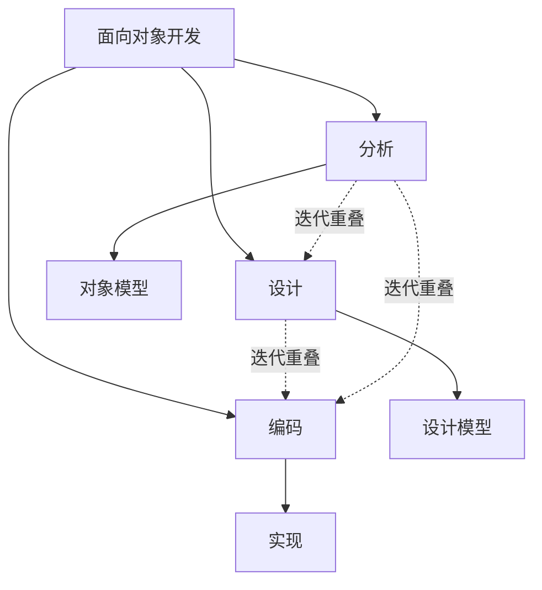
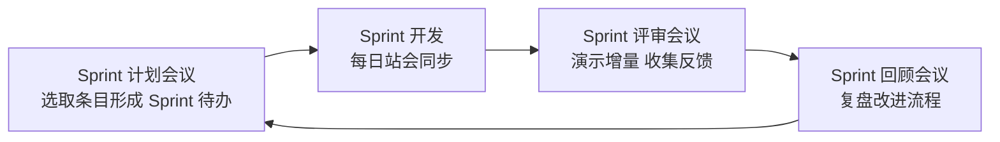

# 2.3 喷泉模型与敏捷开发模型

随着面向对象技术与互联网时代的到来，过程模型进一步演化：喷泉模型为面向对象开发量身刻画了“迭代无间隙”的特征；敏捷开发则从价值观层面重新定义了软件开发，强调个体、可工作软件、客户合作与响应变化。本节介绍喷泉模型与敏捷开发（含 Scrum 与 XP）的原理与实践。

## 喷泉模型

> [!definition] 喷泉模型
> > 喷泉模型（Fountain Model）是一种以面向对象开发为背景的过程模型。它认为分析与设计等活动之间没有明显的边界，开发过程如喷泉般自下而上涌动，活动可交替重叠、反复迭代，强调迭代、无间隙与并行。

### 特点

| 特点 | 含义 |
| --- | --- |
| 迭代 | 分析、设计、编码等活动反复进行，逐步完善系统 |
| 无间隙 | 各活动之间无明显边界，可重叠交替（如分析与设计可同时进行） |
| 并行 | 不同子系统的开发活动可并行推进 |

### 喷泉模型图

> [!note] 为何“无间隙”
> > 面向对象方法以“对象”贯穿分析、设计与实现——分析阶段识别的对象在设计阶段被细化、在实现阶段被编码，三者使用统一的概念体系，因此不存在瀑布模型那种阶段间的硬边界。活动可以交叉重叠、迭代推进，这正是“喷泉”意象的来源。

### 优缺点

- 优点：与面向对象方法契合，支持迭代与并行，开发效率高。
- 缺点：过程无明显阶段边界，难以管理与度量；对团队水平要求高；文档与里程碑不易界定。

## 敏捷开发

> [!definition] 敏捷开发
> > 敏捷开发（Agile Development）是一组以人为核心、迭代增量、快速响应变化的软件开发方法的总称。它以 2001 年发布的《敏捷宣言》为纲领，强调可工作软件、客户协作与响应变化。

### 敏捷宣言四大价值观

2001 年，17 位软件实践者共同发布《敏捷宣言》（Agile Manifesto），提出四大价值观：

1. **个体与互动** 高于 流程与工具
2. **可工作的软件** 高于 详尽的文档
3. **客户合作** 高于 合同谈判
4. **响应变化** 高于 遵循计划

> [!note] 价值观的解读
> > 宣言强调“右项虽有价值，但更重视左项”。它并不否定文档、计划与工具，而是反对把它们凌驾于人的互动、可工作软件与响应变化之上。敏捷的核心是把“交付价值”置于“遵循流程”之上。

### 敏捷十二原则

敏捷宣言还包含十二条原则，核心包括：尽早持续交付可工作软件、欢迎需求变化、频繁交付、业务与开发每日协作、以有动机的个体为核心、面对面沟通、可工作软件是进度的首要度量、保持可持续步调、持续追求技术卓越与良好设计、简洁为本、自组织团队、定期反思与调整。

## Scrum 框架

Scrum 是最流行的敏捷过程框架，以迭代增量的方式组织开发。

### 角色

| 角色 | 职责 |
| --- | --- |
| 产品负责人（Product Owner） | 管理产品待办列表，确定需求优先级，代表用户价值 |
| Scrum Master | 保障 Scrum 流程执行，消除障碍，服务团队（非传统管理者） |
| 开发团队（Development Team） | 自组织、跨职能，负责在 Sprint 内交付可工作增量 |

### 工件

- **产品待办列表（Product Backlog）**：整个产品需求的有序列表，由产品负责人维护。
- **Sprint 待办列表（Sprint Backlog）**：本 Sprint 选定的条目与实现计划。
- **可工作增量（Increment）**：每个 Sprint 交付的、可用的产品增量。

### Sprint 流程

一个 Sprint（迭代，通常 2–4 周）的典型流程：

> [!tip] 每日站会
> > 每日站会（Daily Scrum）是 15 分钟左右的同步会议，团队成员回答三个问题：昨天做了什么、今天打算做什么、遇到什么障碍。它的目的是同步与发现障碍，而非汇报进度。

## XP 极限编程

XP（eXtreme Programming）是 Kent Beck 提出的敏捷方法，强调工程实践与质量。核心实践包括：

| 实践 | 含义 |
| --- | --- |
| 结对编程（Pair Programming） | 两人共用一台电脑协作编码，一人编码一人审查，实时切换 |
| 测试驱动开发（TDD） | 先写测试再写实现，红-绿-重构循环 |
| 持续集成（CI） | 频繁集成代码到主干，每次集成都自动构建与测试 |
| 简单设计 | 只满足当前需求的最简设计，避免过度设计 |
| 重构 | 持续改进代码结构而不改变外部行为 |
| 集体代码所有权 | 团队成员都可改进任何代码，无个人领地 |
| 小型发布 | 频繁发布小版本，尽早获取反馈 |

> [!warning] TDD 的红绿重构
> > TDD 的循环是：①写一个会失败的测试（红）；②写最少的代码让测试通过（绿）；③重构改进代码结构（重构）。它通过测试驱动设计，确保代码始终有测试覆盖，是 XP 提升质量的核心实践。

## 喷泉模型与敏捷开发对比

| 维度 | 喷泉模型 | 敏捷开发 |
| --- | --- | --- |
| 背景 | 面向对象开发 | 互联网时代、需求多变 |
| 核心特征 | 迭代、无间隙、并行 | 价值观驱动、迭代增量、响应变化 |
| 关注点 | 活动的无缝衔接 | 人、可工作软件、客户协作 |
| 代表实践 | 面向对象分析与设计的交替 | Scrum、XP 等具体框架 |

## 小结

喷泉模型为面向对象开发刻画了迭代、无间隙、并行的特征，活动可交替重叠。敏捷开发以《敏捷宣言》四大价值观与十二原则为纲，通过 Scrum 的 Sprint 迭代与 XP 的工程实践（结对编程、TDD、持续集成）实现快速响应变化与持续交付价值。二者都突破了瀑布的严格顺序，从不同角度丰富了过程模型体系。

## 关联

- 上一级：[[MOC - 第2章]]
- 上一节：[[2.2 增量模型与螺旋模型]]
- 关联概念：[[MOC - 面向对象系统分析与建模|面向对象系统分析与建模]]（喷泉模型与面向对象方法的契合）、[[MOC - 软件测试技术|软件测试技术]]（TDD 与持续集成中的测试实践）
