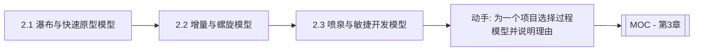

# MOC - 第2章 经典软件过程模型

> [!info] 本章定位
> 第2章在第1章软件生命周期与过程概念的基础上，回答“开发活动如何被组织成可执行的流程”。本章系统介绍六种经典软件过程模型：瀑布、快速原型、增量、螺旋、喷泉与敏捷开发。掌握各模型的阶段结构、驱动方式（文档驱动/风险驱动/价值驱动）与适用场景，是针对具体项目选择过程模型、组织开发活动的前提。

## 学习路线图

## 知识点导航

| 节 | 主题 | 核心要点 | 入口 |
| --- | --- | --- | --- |
| 2.1 | 瀑布模型与快速原型模型 | 瀑布的阶段顺序与文档驱动、快速原型的构建-反馈-改进、抛弃型与演化型原型 | [[2.1 瀑布模型与快速原型模型]] |
| 2.2 | 增量模型与螺旋模型 | 增量模型分批交付、螺旋模型风险驱动与四活动、Boehm 提出 | [[2.2 增量模型与螺旋模型]] |
| 2.3 | 喷泉模型与敏捷开发模型 | 喷泉模型迭代无间隙、敏捷宣言与原则、Scrum 与 XP 实践 | [[2.3 喷泉模型与敏捷开发模型]] |

## 核心考点

> [!warning] 重点掌握
> 1. 瀑布模型的阶段顺序、文档驱动特征、优缺点与适用场景。
> 2. 快速原型模型的工作流程，抛弃型原型与演化型原型的区别。
> 3. 增量模型分批交付的思想与优缺点。
> 4. 螺旋模型的四个活动（确定目标、风险分析、开发与验证、评审计划）及其风险驱动本质，提出者 Boehm。
> 5. 喷泉模型面向对象、迭代、无间隙、并行的特点。
> 6. 敏捷宣言四大价值观与 Scrum 框架（Sprint、角色、工件）、XP 核心实践。

## 自测题

> [!question] 题1
> 简述瀑布模型的基本思想，并说明其主要缺点。
> > [!check]- 参考答案
> > 瀑布模型将软件生命周期划分为需求分析、设计、编码、测试、维护等阶段，各阶段严格按顺序自上而下进行，上一阶段完成并通过评审后才进入下一阶段，每阶段都有明确的文档产物，是一种文档驱动模型。主要缺点：①要求一开始就明确所有需求，难以适应需求变化；②用户要到后期才能看到可运行产品，风险延迟暴露；③缺乏灵活性，返工成本高。适用于需求非常明确且稳定的项目。

> [!question] 题2
> 比较抛弃型原型与演化型原型的区别。
> > [!check]- 参考答案
> > 抛弃型原型（Throwaway Prototype）：构建原型仅为澄清与验证需求，原型实现后丢弃，不作为最终产品的一部分，正式系统另行开发，适用于需求不明确时快速探索。演化型原型（Evolutionary Prototype）：原型构建后不丢弃，而是通过持续修改与扩充逐步演化为最终产品，适用于需求会不断变化且希望尽早交付可用版本的项目。前者关注“明确需求”，后者关注“渐进式交付”，二者在质量要求与维护成本上有显著差异。

> [!question] 题3
> 说明螺旋模型的四个活动，并解释为何称其为“风险驱动”模型。
> > [!check]- 参考答案
> > 螺旋模型的四个活动为：①确定目标、替代方案与约束；②风险分析与风险化解；③开发与验证（实施工程）；④评审与计划下一周期。称其为风险驱动，是因为每一轮螺旋都以风险分析为核心：在进入开发前先识别并化解该轮的主要风险（如技术风险、进度风险、需求风险），通过原型或仿真验证风险后再推进。风险分析贯穿始终，使高风险项目能分阶段、可控地推进，是大型高风险项目的重要选择。

> [!question] 题4
> 列举敏捷宣言的四大价值观，并简述 Scrum 中一个 Sprint 的典型流程。
> > [!check]- 参考答案
> > 敏捷宣言四大价值观：①个体与互动高于流程与工具；②可工作的软件高于详尽的文档；③客户合作高于合同谈判；④响应变化高于遵循计划（右项虽有价值，但更重视左项）。Scrum 中一个 Sprint（迭代，通常2–4周）的典型流程：Sprint 计划会议从产品待办列表中选取条目形成 Sprint 待办列表 → 团队在 Sprint 内自组织开发，每日举行每日站会同步进展 → Sprint 结束时交付可工作的增量，举行 Sprint 评审会议向利益相关者演示 → 举行 Sprint 回顾会议复盘改进流程，进入下一 Sprint。

## 章节导航

- 上一级：[[MOC - 软件工程]]
- 上一章：[[MOC - 第1章]]
- 下一章：[[MOC - 第3章]]
