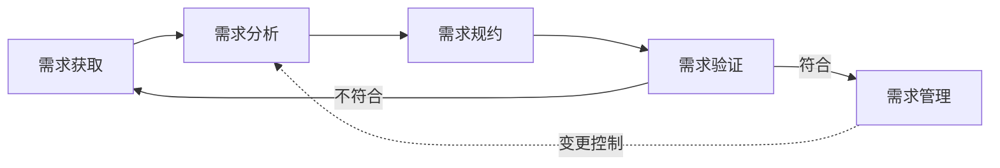

# 3.1 需求工程概述与需求获取

需求是软件开发的出发点，需求错误是项目失败的首要原因。本节阐明需求工程的定义与组成活动，区分功能性需求与非功能性需求，介绍需求获取的主要方法及其困难，为后续需求分析与建模（[[3.2 需求分析与建模]]）提供输入。

## 需求工程概述

> [!definition] 需求工程
> > 需求工程（Requirements Engineering）是应用已证实有效的原理、方法与工具，对系统需求进行系统的**获取、分析、规约（规约=规格说明）与验证，并对需求进行管理**的工程化过程。它覆盖软件需求从产生到变更的全生命周期。

需求工程包含五类核心活动：

| 活动 | 含义 | 产物 |
| --- | --- | --- |
| 需求获取 | 从用户、文档、环境中收集需求 | 用户需求陈述 |
| 需求分析 | 对需求进行提炼、建模、消除冲突 | 分析模型 |
| 需求规约 | 将需求书写为规范的需求规格说明书 | SRS |
| 需求验证 | 评审与确认需求是否正确完整 | 评审记录 |
| 需求管理 | 基线、变更控制、追踪 | 需求基线、追踪矩阵 |

> [!note] 需求工程为何重要
> > 需求阶段的错误会传递到设计、编码与测试，越晚发现修复成本越高（详见 [[1.1 软件、软件危机、软件工程概念]]）。需求工程的本质是用工程化方法把“用户想要什么”转化为“开发团队能理解并验证什么”，从源头降低项目风险。

## 需求分类

### 功能性需求

> [!definition] 功能性需求
> > 功能性需求（Functional Requirement）描述软件系统“应该做什么”，即系统应提供的功能、行为与操作。

例如：用户可用邮箱注册账户、系统支持订单导出、管理员可审核内容。

### 非功能性需求

> [!definition] 非功能性需求
> > 非功能性需求（Non-functional Requirement）描述软件系统“做得怎么样”，即对功能实现的质量属性约束与限制。

| 类别 | 含义 | 示例 |
| --- | --- | --- |
| 性能需求 | 响应时间、吞吐量、并发量 | 登录响应不超过 2 秒，支持 1000 并发 |
| 安全需求 | 认证、授权、加密、审计 | 密码加密存储，敏感操作需二次验证 |
| 可用性需求 | 系统可用率、故障恢复 | 年可用率 ≥ 99.9%，故障 5 分钟内恢复 |
| 易用性需求 | 界面友好度、学习成本 | 关键操作不超过 3 步 |
| 可靠性需求 | 平均无故障时间、容错 | MTBF ≥ 1000 小时 |
| 可维护性需求 | 可修改性、可扩展性 | 模块化设计，支持插件扩展 |
| 可移植性需求 | 跨平台、跨环境 | 同时支持 Windows 与 Linux |

> [!warning] 非功能性需求易被忽视
> > 非功能性需求往往跨多个功能且对架构影响巨大——例如“支持 1000 并发”会从根本上影响架构选型。许多项目失败并非功能没实现，而是非功能性需求（性能、安全、可用性）未达标。需求获取时必须显式追问非功能性需求。

此外还有**约束性需求**（如必须使用某数据库、必须遵循某法规）与**接口需求**（外部接口、硬件接口、通信接口）。

## 需求获取方法

| 方法 | 含义 | 适用场景 | 优点/局限 |
| --- | --- | --- | --- |
| 访谈 | 与用户一对一或小组交谈，结构化或非结构化 | 早期了解背景与期望 | 深入灵活 / 受主观影响，需分析 |
| 问卷 | 发放结构化问卷收集需求 | 用户多且分散 | 覆盖广、可量化 / 难深入 |
| 观察 | 到工作现场观察用户实际操作 | 业务流程复杂、用户难表达 | 发现隐性需求 / 耗时 |
| 原型 | 构建原型让用户试用并反馈 | 需求模糊、用户难以描述 | 直观、反馈快 / 见 [[2.1 瀑布模型与快速原型模型]] |
| 头脑风暴 | 团队自由讨论产生创意与需求 | 创新型、需求探索期 | 激发创意 / 需收敛 |
| 文档分析 | 分析现有文档、表单、规章 | 有遗留系统或规范文档 | 客观 / 受文档时效限制 |
| JAD 联合需求开发 | 用户与开发方联合工作坊 | 大型项目需求集中梳理 | 高效达成共识 / 组织成本高 |

> [!tip] 方法组合
> > 实际项目很少只用一种方法。典型组合：先用访谈了解背景，再用观察发现隐性流程，用原型验证模糊需求，用问卷在大范围确认。方法的选择取决于项目规模、用户特点与需求明确程度。

## 需求获取中的困难与应对

1. **用户说不清需求**：用户熟悉业务但不擅长表达 → 用原型与场景引导，观察实际操作。
2. **需求冲突**：不同用户群体需求矛盾 → 分析冲突根源，由产品负责人/利益相关方协商权衡。
3. **需求易变**：随项目推进需求不断变化 → 采用增量/敏捷过程，建立变更控制机制（详见 [[3.3 需求规格说明与需求验证]]）。
4. **沟通障碍**：开发方与用户术语不同 → 建立术语表，使用用户能理解的语言。
5. **隐性需求**：用户默认但未说出的期望 → 通过观察与原型挖掘，主动追问非功能性需求。

## 小结

需求工程是覆盖需求获取、分析、规约、验证与管理的工程化过程。需求分为功能性需求与非功能性需求，后者对架构影响巨大却易被忽视。需求获取方法包括访谈、问卷、观察、原型、头脑风暴等，需根据场景组合使用。需求获取的困难主要源于用户表达、需求冲突、需求变化与沟通障碍，需要原型、变更控制与术语管理等手段应对。

## 关联

- 上一级：[[MOC - 第3章]]
- 下一节：[[3.2 需求分析与建模]]
- 关联概念：[[2.1 瀑布模型与快速原型模型]]（原型是重要的需求获取手段）、[[1.1 软件、软件危机、软件工程概念]]（需求错误是软件危机的重要表现）
