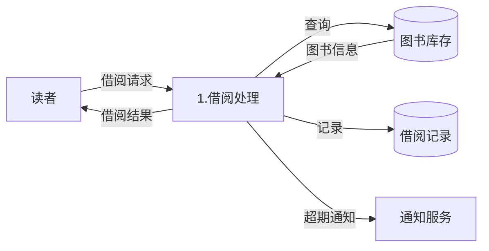

# 3.2 需求分析与建模

需求获取得到的是零散的用户陈述，需要通过需求分析提炼为系统化的模型。本节阐明需求分析的定义与建模层次，重点介绍结构化需求分析的三种模型（DFD、DD、ER）与面向对象需求分析的用例建模，为编写需求规格说明书（[[3.3 需求规格说明与需求验证]]）提供模型依据。

## 需求分析定义

> [!definition] 需求分析
> > 需求分析（Requirements Analysis）是将用户需求提炼、转化为系统需求的过程，通过建立模型对需求进行结构化、可视化表达，消除需求中的歧义、冲突与不完整，形成清晰、一致、可验证的需求模型。

### 需求建模的层次

需求建模遵循“当前系统 → 抽象模型 → 目标系统”的层次：

- **当前系统**：理解用户当前的现实业务流程（可能手工或旧系统）。
- **抽象模型**：去除物理细节，抽象出业务的逻辑模型（数据流、实体、用例）。
- **目标系统**：将逻辑模型映射为待开发软件系统的需求模型。

## 结构化需求分析

结构化需求分析是一种面向数据流的需求分析方法，以数据流图(DFD)、数据字典(DD)与实体关系图(ER)为核心模型。

### 数据流图（DFD）

> [!definition] 数据流图
> > 数据流图（Data Flow Diagram, DFD）是一种图形化工具，用于描述系统中数据的流动、加工与存储，刻画系统“做什么”的逻辑功能，而不关心“怎么做”。

DFD 的四种基本成分：

| 成分 | 符号 | 含义 |
| --- | --- | --- |
| 外部实体 | 矩形 | 数据的源点或终点（人、外部系统） |
| 加工/处理 | 圆/圆角矩形 | 对数据的变换处理 |
| 数据流 | 带箭头的线 | 数据的流动方向 |
| 数据存储 | 双横线/开口矩形 | 数据的留存位置 |

#### DFD 的分层

DFD 采用自顶向下分层绘制：

- **顶层 DFD**：把整个系统作为一个加工，展示系统与外部实体之间的数据流。
- **0 层 DFD**：把顶层加工分解为若干主要加工。
- **1 层、2 层……**：对 0 层加工继续细化。

> [!warning] 父子图平衡
> > 子图的输入/输出数据流必须与父图中对应加工的输入/输出数据流一致（数量与方向平衡），这称为父子图平衡（平衡原则）。这是检验 DFD 分层正确性的关键准则。

#### DFD 示例（图书借阅系统）

> [!note] 图示说明
> > 上图展示图书借阅系统的部分 DFD：读者（外部实体）发起借阅请求，借阅处理（加工）查询图书库存（数据存储）并记录到借阅记录（数据存储），返回借阅结果给读者，并向通知服务（外部实体）发送超期通知。实际项目需按顶层→0层→1层逐步细化。

### 数据字典（DD）

> [!definition] 数据字典
> > 数据字典（Data Dictionary, DD）是对 DFD 中所有数据流、数据项、数据存储与加工进行精确定义的集合，是 DFD 的文字补充，使图形中的每个元素都有无歧义的说明。

数据字典通常用定义式描述数据项的组成，常用符号：

| 符号 | 含义 | 示例 |
| --- | --- | --- |
| `=` | 定义为 | 订单 = 订单号 + 客户 + 订单项 |
| `+` | 与（顺序连接） | 客户 = 客户ID + 姓名 |
| `[...|...]` | 或（选择） | 支付方式 = [微信\|支付宝\|银行卡] |
| `{ }` | 重复 | 订单项 = {商品 + 数量 + 单价} |
| `( )` | 可选 | 优惠 = (优惠券) |

### 实体关系图（ER）

> [!definition] 实体关系图
> > 实体关系图（Entity-Relationship Diagram, ER 图）用于描述系统中的数据实体及其关系，是数据建模的工具，为数据库设计提供概念模型。

ER 图的三要素：

- **实体**：客观存在并可相互区分的事物（如读者、图书），用矩形表示。
- **属性**：实体的特征（如读者的姓名、编号），用椭圆表示。
- **关系**：实体间的联系（如借阅），用菱形表示，并标注联系类型（1:1、1:N、M:N）。

> [!tip] DFD 与 ER 的分工
> > DFD 刻画系统的“功能与数据流”（过程视角），ER 刻画系统的“数据结构”（数据视角），DD 对二者中的数据元素进行精确定义。三者共同构成结构化分析的需求模型，相互补充、不可替代。

## 面向对象需求分析

面向对象需求分析以**用例建模**为核心，从用户视角描述系统功能。

> [!definition] 用例建模
> > 用例建模（Use Case Modeling）通过识别系统参与者（Actor）与用例（Use Case），描述参与者与系统之间的交互，刻画系统对外提供的功能。其核心产物是用例图与用例描述。

用例图的元素：

| 元素 | 含义 |
| --- | --- |
| 参与者（Actor） | 与系统交互的外部角色（人或外部系统），用小人表示 |
| 用例（Use Case） | 系统提供的、对参与者有价值的功能，用椭圆表示 |
| 关联 | 参与者与用例之间的连线 |
| 关系 | 用例间的关系：包含(include)、扩展(extend)、泛化 |

> [!note] 结构化与面向对象的区别
> > 结构化分析以“数据流”为核心，适合功能驱动的传统系统；面向对象分析以“对象与用例”为核心，适合复杂业务与面向对象实现。二者可互补，详见 [[MOC - 面向对象系统分析与建模|面向对象系统分析与建模]]。

## 小结

需求分析将用户需求转化为系统需求，建模遵循“当前系统→抽象模型→目标系统”的层次。结构化需求分析以 DFD（功能与数据流）、DD（数据定义）、ER（数据结构）为核心模型；面向对象需求分析以用例建模描述参与者与用例的交互。这些模型为编写需求规格说明书提供了系统化、可验证的依据。

## 关联

- 上一级：[[MOC - 第3章]]
- 上一节：[[3.1 需求工程概述与需求获取]]
- 下一节：[[3.3 需求规格说明与需求验证]]
- 关联概念：[[MOC - 面向对象系统分析与建模|面向对象系统分析与建模]]（用例建模的深化）、数据库原理（ER 图的概念模型落地为数据库设计）
