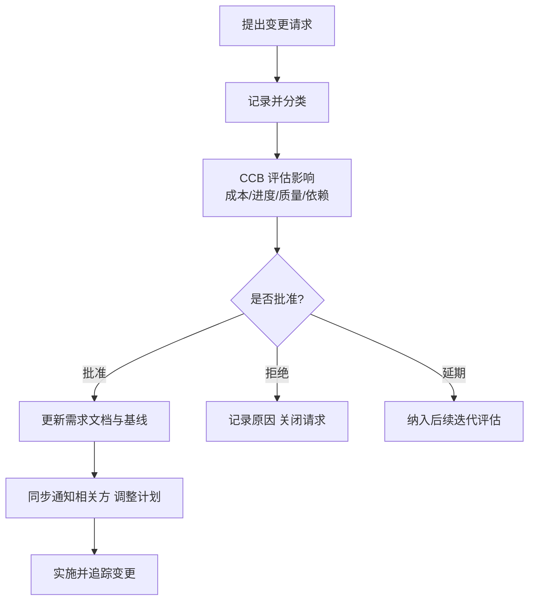

# 3.3 需求规格说明与需求验证

需求分析与建模（[[3.2 需求分析与建模]]）的结果需要被固化为正式文档并进行验证。本节阐述需求规格说明书(SRS)的内容结构与 IEEE 830 标准，介绍需求验证方法，并说明需求管理（基线、变更控制、追踪）如何保障需求在项目演进中的稳定性与可追溯性。

## 需求规格说明书（SRS）

> [!definition] 需求规格说明书
> > 需求规格说明书（Software Requirements Specification, SRS）是需求工程的最终文档产物，系统、完整、精确地描述软件系统的功能需求、非功能需求与接口需求，是设计、编码、测试与验收的依据。

### IEEE 830 标准

**IEEE 830** 是关于 SRS 编写的推荐实践标准，规定了 SRS 应具备的质量特性：

| 质量特性 | 含义 |
| --- | --- |
| 正确性 | 准确反映用户需求 |
| 无歧义性 | 每条需求只有一种解释 |
| 完整性 | 覆盖所有需求，无遗漏 |
| 一致性 | 各需求之间不矛盾 |
| 可验证性 | 每条需求都可通过测试或检查验证 |
| 可修改性 | 结构清晰，便于修改与维护 |
| 可追踪性 | 每条需求可追溯到来源与设计/测试 |

> [!note] IEEE 830 的地位
> > IEEE 830 为 SRS 的编写提供了统一规范，使需求文档具备可评审、可验证、可追踪的工程属性。它不规定具体写法，而是规定质量准则，是需求评审的检查清单。

### SRS 内容结构

按照 IEEE 830 的推荐，SRS 通常包含以下结构：

1. **引言**：目的、范围、定义与缩略语、参考文献、概述。
2. **总体描述**：产品视角、产品功能、用户特征、约束、假设与依赖。
3. **具体需求**：功能需求、性能需求、接口需求、设计约束、质量属性等的详细描述。
4. **附录**：分析模型（DFD、ER、用例图）、待定问题、术语表等。

> [!tip] 具体需求的描述
> > 具体需求是 SRS 的核心，每条需求应编号、独立、可验证，并标注优先级与来源。功能需求常用“输入-处理-输出”或用例描述刻画；非功能需求应给出可度量的指标（如“响应时间 ≤ 2 秒”而非“响应快”）。

## 需求规格说明文档模板

以下是一个简化的 SRS 文档骨架，可作为编写起点：

```markdown
# 需求规格说明书（SRS）— <系统名称>

## 1. 引言
### 1.1 目的
### 1.2 范围
### 1.3 定义与缩略语
### 1.4 参考文献
### 1.5 概述

## 2. 总体描述
### 2.1 产品视角
### 2.2 产品功能
### 2.3 用户特征
### 2.4 约束
### 2.5 假设与依赖

## 3. 具体需求
### 3.1 功能需求（编号：FR-01, FR-02 …）
### 3.2 性能需求
### 3.3 接口需求（用户接口、硬件接口、软件接口、通信接口）
### 3.4 设计约束
### 3.5 质量属性（安全、可用性、可靠性、可维护性）

## 4. 附录
### 4.1 分析模型（DFD / ER / 用例图）
### 4.2 待定问题
### 4.3 术语表
```

> [!warning] 文档仅为起点
> > 上述模板是结构骨架，实际编写必须根据项目特点填充具体、可验证的需求条目。模板本身不保证质量——SRS 的价值在于其内容的正确性、无歧义性与可验证性。

## 需求验证

> [!definition] 需求验证
> > 需求验证（Requirements Validation）是通过评审、原型验证或形式化验证等手段，确认 SRS 是否正确、完整、一致地反映了用户真实需求的过程，目的是在进入设计前发现并纠正需求缺陷。

### 需求验证方法

| 方法 | 含义 | 适用场景 |
| --- | --- | --- |
| 需求评审 | 由开发方、用户、专家共同审查 SRS | 通用，几乎所有项目 |
| 原型验证 | 构建原型让用户试用，验证需求是否正确 | 需求模糊、交互复杂 |
| 形式化验证 | 用数学化/形式化语言描述需求并自动验证一致性 | 安全关键、高可靠系统 |
| 测试用例生成 | 为需求设计测试用例，反向检查需求是否可验证 | 需求可验证性检查 |
| 模拟与仿真 | 用模型模拟系统行为验证需求 | 实时系统、复杂动态行为 |

> [!tip] 评审的重点
> > 需求评审应重点检查：是否有歧义、是否完整、是否一致、是否可验证、是否可追踪、是否与用户真实期望一致。评审记录应作为需求基线的一部分留存。

## 需求管理

需求管理贯穿需求确立之后的全生命周期，确保需求在变更中保持可控与可追溯。

### 需求基线

> [!definition] 需求基线
> > 需求基线（Requirements Baseline）是经过评审与批准、作为后续开发依据的需求快照。基线建立后，任何对需求的修改都必须经过正式的变更控制流程。

### 变更控制

需求变更控制确保基线需求的变更被系统化评估与审批，避免范围蔓延。



> [!note] CCB
> > 变更控制委员会（Change Control Board, CCB）是负责评审与批准变更的组织，通常由项目经理、产品负责人、技术负责人、测试代表等组成。CCB 的作用是平衡变更价值与变更成本，防止随意变更破坏项目稳定性。

### 需求追踪

> [!definition] 需求追踪
> > 需求追踪（Requirements Traceability）通过需求追踪矩阵（Traceability Matrix）建立需求与来源、设计、代码、测试用例之间的双向对应关系，确保每个需求都被实现与验证，每个实现都可追溯到需求。

| 需求编号 | 需求描述 | 来源 | 设计模块 | 代码模块 | 测试用例 | 状态 |
| --- | --- | --- | --- | --- | --- | --- |
| FR-01 | 用户邮箱注册 | 用户访谈 | 注册模块 | UserService | TC-001 | 已实现 |
| FR-02 | 订单导出 Excel | 业务方 | 订单模块 | ExportService | TC-015 | 已实现 |
| NFR-01 | 登录响应 ≤2s | 性能约束 | 架构设计 | — | TC-030 | 待核实 |

> [!warning] 追踪的价值
> > 需求追踪矩阵是变更影响分析的基础——当某需求变更时，可通过矩阵快速定位受影响的设计、代码与测试用例。它也是验收时确认“所有需求都已实现并验证”的客观依据。

## 小结

需求规格说明书(SRS)是需求工程的文档产物，IEEE 830 规定了其正确性、无歧义性、完整性、一致性、可验证性、可修改性与可追踪性等质量特性，典型结构包括引言、总体描述、具体需求与附录。需求验证通过评审、原型、形式化等方法在进入设计前发现缺陷。需求管理通过基线、变更控制与需求追踪，保障需求在项目演进中的稳定性与可追溯性。

## 关联

- 上一级：[[MOC - 第3章]]
- 上一节：[[3.2 需求分析与建模]]
- 关联概念：[[MOC - 软件测试技术|软件测试技术]]（需求追踪矩阵是验收测试与回归测试的依据）、[[1.3 软件工程三要素、软件工程目标]]（文档与配置管理是软件工程原理的体现）
