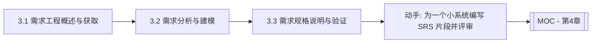

# MOC - 第3章 软件需求工程

> [!info] 本章定位
> 第3章进入工程化开发的主线。需求工程解决的核心问题是：**如何准确获取、清晰表达、严格验证并有效管理用户对软件的期望**。需求错误是软件项目失败的首要原因，且修复成本随阶段推进呈指数级上升。本章覆盖需求获取、需求分析与建模、需求规格说明与需求验证管理，是连接用户与开发团队的关键环节，也是后续结构化分析与面向对象分析的方法学入口。

## 学习路线图

## 知识点导航

| 节 | 主题 | 核心要点 | 入口 |
| --- | --- | --- | --- |
| 3.1 | 需求工程概述与需求获取 | 需求工程定义、功能/非功能需求分类、获取方法与困难 | [[3.1 需求工程概述与需求获取]] |
| 3.2 | 需求分析与建模 | 结构化分析(DFD/DD/ER)、面向对象用例建模、建模层次 | [[3.2 需求分析与建模]] |
| 3.3 | 需求规格说明与需求验证 | SRS 与 IEEE 830、验证方法、需求管理与变更控制 | [[3.3 需求规格说明与需求验证]] |

## 核心考点

> [!warning] 重点掌握
> 1. 需求工程的定义及其包含的活动（获取、分析、规约、验证、管理）。
> 2. 功能性需求与非功能性需求的区分（性能、安全、可用性等）。
> 3. 需求获取的主要方法：访谈、问卷、观察、原型、头脑风暴及各自适用场景。
> 4. 结构化需求分析的三种模型：数据流图(DFD)、数据字典(DD)、实体关系图(ER)。
> 5. DFD 的层次（顶层、0层、1层……）与绘制要点。
> 6. 面向对象需求分析的用例建模。
> 7. 需求规格说明书(SRS)的内容结构与 IEEE 830 标准。
> 8. 需求验证方法与需求管理（基线、变更控制、需求追踪）。

## 自测题

> [!question] 题1
> 区分功能性需求与非功能性需求，并各举两例。
> > [!check]- 参考答案
> > 功能性需求描述软件“应该做什么”，即系统应提供的功能与行为，如“用户可用邮箱注册账户”“系统支持订单导出为 Excel”。非功能性需求描述软件“做得怎么样”，即对功能实现的约束与质量属性，如“登录响应时间不超过 2 秒（性能）”“用户密码必须加密存储（安全）”。前者定义行为，后者定义质量约束；非功能性需求往往跨多个功能，且对架构影响更大。

> [!question] 题2
> 说明数据流图(DFD)的四种基本成分，并简述分层绘制的基本原则。
> > [!check]- 参考答案
> > DFD 的四种基本成分为：①外部实体（数据的源/汇，用矩形表示）；②加工/处理（对数据的变换，用圆或圆角矩形表示）；③数据流（数据的流动，用带箭头的线表示）；④数据存储（数据的留存，用双横线或开口矩形表示）。分层原则：自顶向下、逐步细化——先画顶层 DFD（系统作为一个加工，展示与外部实体的数据流），再展开为 0 层、1 层等更详细的 DFD；各层之间数据流必须平衡（父子图平衡），即子图的输入输出与父图对应加工的输入输出一致。

> [!question] 题3
> 简述需求规格说明书(SRS)的主要内容结构，并说明 IEEE 830 标准对其的规范作用。
> > [!check]- 参考答案
> > SRS 的主要结构包括：①引言（目的、范围、定义、参考文献、概述）；②总体描述（产品视角、产品功能、用户特征、约束、假设与依赖）；③具体需求（功能需求、非功能需求、接口需求等的详细描述）；④附录（分析模型、待定问题等）。IEEE 830 是关于 SRS 编写的推荐标准，规定了 SRS 应具备的正确性、无歧义性、完整性、一致性、可验证性、可修改性、可追踪性等质量特性，为需求文档的规范化提供了统一依据。

> [!question] 题4
> 说明需求变更控制流程的目的与典型步骤。
> > [!check]- 参考答案
> > 需求变更控制的目的在于：在需求基线建立后，对所有变更请求进行系统化评估与审批，避免随意变更导致范围蔓延与质量失控。典型步骤：①提出变更请求；②变更控制委员会(CCB)评估变更的影响（成本、进度、质量、依赖）；③根据评估结果决定接受、拒绝或延期；④若接受，更新需求文档与基线，同步通知相关方并调整计划；⑤追踪变更实施直至完成。整个流程通过需求追踪矩阵确保变更不遗漏受影响的需求与设计。

## 章节导航

- 上一级：[[MOC - 软件工程]]
- 上一章：[[MOC - 第2章]]
- 下一章：[[MOC - 第4章]]
