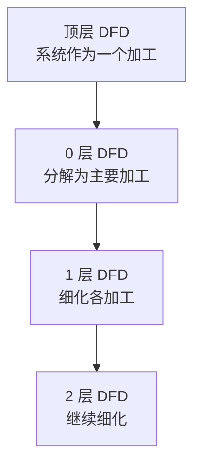
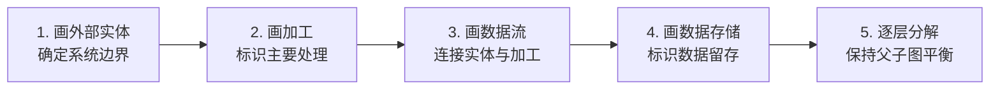
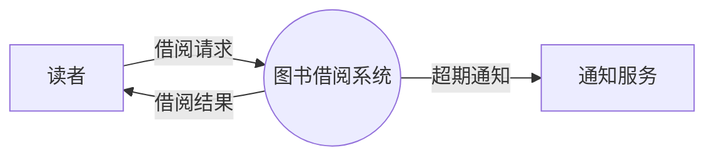
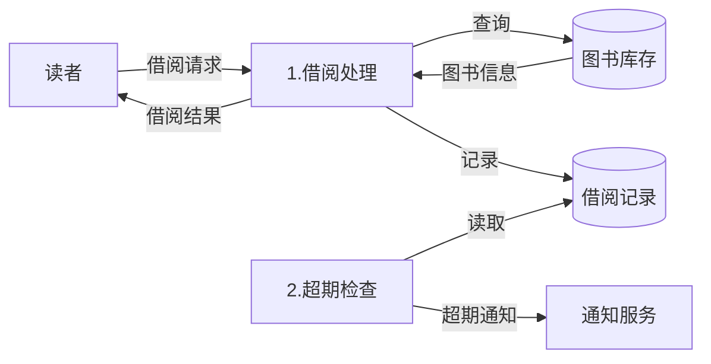

# 4.1 数据流图（DFD）与数据字典

数据流图(DFD)是结构化分析的核心图形工具，解决“如何用图形清晰表达系统做什么”的问题。它面向数据流，自顶向下逐层分解，刻画系统的逻辑功能而不涉及物理实现。但 DFD 只描述“数据流与加工”的轮廓，每个元素的确切含义需要数据字典(DD)以文字精确定义。本节阐明 DFD 的基本元素、分层方法与绘制步骤，并介绍数据字典的条目类型与符号体系，为[[4.2 实体关系图与加工说明]]和[[4.3 结构化分析综合案例]]奠定基础。

## 数据流图概述

> [!definition] 数据流图
> > 数据流图（Data Flow Diagram, DFD）是一种图形化工具，用于描述系统中数据的流动、加工与存储，刻画系统“做什么”的逻辑功能，而不关心“怎么做”的物理实现细节。

DFD 属于结构化分析（Structured Analysis, SA）方法的核心模型，其指导思想是**面向数据流、自顶向下、逐层分解**。它只描述逻辑功能，不涉及物理实现，因此是需求分析阶段最常用的建模工具。

## DFD 的四种基本元素

DFD 由四种基本成分构成：

| 成分 | 英文 | 图形符号 | 含义 |
| --- | --- | --- | --- |
| 外部实体 | External Entity | 方框（矩形） | 数据的源点或终点，通常是人或外部系统 |
| 加工 | Process | 圆/圆角框（或圆圈） | 对数据的变换处理，又称处理或函数 |
| 数据存储 | Data Store | 双横线（开口矩形） | 数据的留存位置，如文件、数据库表 |
| 数据流 | Data Flow | 带箭头的线 | 数据的流动方向，箭头指向数据接收方 |

> [!note] 符号约定说明
> > DFD 符号在不同教材中有两套主流表示法：Yourdon/DeMarco 法（圆圈表示加工、双横线表示数据存储）与 Gane/Sarson 法（圆角矩形表示加工、开口矩形表示数据存储）。二者含义一致，本库统一采用圆/圆角框表示加工、双横线表示数据存储。Mermaid 无法直接绘制 DFD 专用符号，下面用 `flowchart` 近似表达数据流关系。

> [!warning] 数据流的命名
> > 每条数据流必须有明确的名字（名词或名词短语，如“订单”“查询结果”），不能使用“数据”“信息”等模糊词。加工通常编号（如 1、2、1.1、1.2）以便分层引用。数据存储也应命名并编号（如 D1、D2）。

## DFD 的分层

DFD 采用自顶向下分层绘制，从抽象到具体逐步细化：



| 层次 | 内容 | 作用 |
| --- | --- | --- |
| 顶层 DFD | 把整个系统作为一个加工，展示系统与外部实体之间的数据流 | 确定系统边界与外部交互 |
| 0 层 DFD | 把顶层加工分解为若干主要加工 | 展示系统主要功能与数据流 |
| 1 层 DFD | 对 0 层中的每个加工继续细化 | 展示加工内部的数据流细节 |
| 2 层 DFD | 对 1 层加工进一步细化 | 直到每个加工足够简单、可编写加工说明 |

> [!warning] 父子图平衡原则
> > 子图的输入/输出数据流必须与父图中对应加工的输入/输出数据流一致（数量与方向平衡），这称为**父子图平衡**（Balance Principle）。这是检验 DFD 分层正确性的关键准则。若子图新增了父图中没有的数据流，必须确认该数据流是否来自内部存储或被分解的复合数据流。

### 数据流的分解与合并

父图中的一条数据流，在子图中可能被分解为多条数据流（复合数据流的分解）；反之子图的多条数据流也可能在父图中合并为一条。只要子图边界上的净输入/输出与父图一致，即满足平衡。

## DFD 的绘制步骤

绘制 DFD 应遵循“先全局后局部、先外部后内部”的顺序：



1. **画外部实体**：确定系统的源点与终点，明确系统边界。
2. **画加工**：标识系统的主要处理功能，编号。
3. **画数据流**：用带箭头的线连接外部实体与加工、加工与加工之间。
4. **画数据存储**：标识需要留存的数据，连接到相关加工。
5. **逐层分解**：对复杂的加工继续分层细化，每层保持父子图平衡。

> [!tip] 绘制要点
> > - 顶层 DFD 只有一个加工（代表整个系统），且只画外部实体与系统间的数据流。
> > - 数据流必须经过加工才能从外部实体到达数据存储（或反之），外部实体不能直接与数据存储相连。
> > - 加工至少有一个输入数据流和一个输出数据流。
> > - 分层到每个加工的功能足够简单、可单独编写加工说明时停止。

## DFD 示例（图书借阅系统）

以图书借阅系统为例，展示分层 DFD。

### 顶层 DFD



### 0 层 DFD



> [!note] 图示说明
> > 顶层 DFD 把系统作为一个加工，展示读者（外部实体）与系统、系统与通知服务（外部实体）的数据流。0 层 DFD 把系统分解为“借阅处理”与“超期检查”两个加工，并引入“图书库存”与“借阅记录”两个数据存储。0 层的输入（借阅请求）与输出（借阅结果、超期通知）与顶层一致，满足父子图平衡。

## 数据字典（DD）

> [!definition] 数据字典
> > 数据字典（Data Dictionary, DD）是对 DFD 中所有数据流、数据项、数据存储与加工进行精确定义的集合，是 DFD 的文字补充，使图形中的每个元素都有无歧义的说明。

DFD 给出了系统的图形轮廓，但其中的数据名、数据存储和加工都只是名字，缺乏精确含义。数据字典的作用就是为这些元素提供严格定义，消除歧义。

### 数据字典的条目类型

数据字典通常包含四类条目：

| 条目类型 | 描述内容 | 示例 |
| --- | --- | --- |
| 数据项 | 数据的最小单位，定义名称、类型、取值范围 | 学号 = {数字}，长度 10 |
| 数据结构 | 由数据项组合而成的复合数据 | 学生 = 学号 + 姓名 + 性别 |
| 数据流 | DFD 中流动的数据，定义其组成 | 借阅请求 = 读者证号 + 图书编号 |
| 数据存储 | DFD 中留存的数据，定义其结构与组织 | 借阅记录 = {读者证号 + 图书编号 + 借出日期 + 归还日期} |

部分教材将**加工逻辑**（加工说明）也纳入数据字典，但加工说明通常作为独立产物（详见[[4.2 实体关系图与加工说明]]）。

### 数据字典的符号

数据字典用定义式描述数据的组成，常用符号如下：

| 符号 | 含义 | 示例 |
| --- | --- | --- |
| `=` | 定义为 | 订单 = 订单号 + 客户 + 订单项 |
| `+` | 与（顺序连接） | 客户 = 客户ID + 姓名 |
| `[a|b|c]` | 或（选择其一） | 支付方式 = [微信\|支付宝\|银行卡] |
| `{ }` | 重复（0 次或多次） | 订单项 = {商品 + 数量 + 单价} |
| `( )` | 可选（0 次或 1 次） | 优惠 = (优惠券) |

> [!note] 重复符号的限定
> > 重复符号 `{ }` 可加上下限，如 `{ }^n` 表示重复 n 次，`{ }^m_n` 表示重复 m 到 n 次。部分教材用 `{ }^+` 表示至少一次。具体写法以教材约定为准。

### 数据字典编写示例

以图书借阅系统为例：

```
数据流条目：
  借阅请求 = 读者证号 + 图书编号
  借阅结果 = [借阅成功 | 借阅失败] + (失败原因)

数据存储条目：
  图书库存 = {图书编号 + 书名 + 作者 + 馆藏数 + 可借数}
  借阅记录 = {读者证号 + 图书编号 + 借出日期 + 归还日期 + 状态}

数据项条目：
  读者证号 = {数字}    // 长度 8
  图书编号 = {字母} + {数字}  // 如 A123456
```

## 小结

数据流图(DFD)以外部实体、加工、数据存储与数据流四种基本元素，面向数据流地刻画系统的逻辑功能；它采用顶层→0层→1层→2层的分层方法逐步细化，并以父子图平衡原则保证分层的正确性。数据字典(DD)用 `=`、`+`、`|`、`{}`、`()` 等符号精确定义 DFD 中的数据项、数据结构、数据流与数据存储，消除图形中的歧义。二者相辅相成，共同构成结构化分析的核心模型。

## 关联

- 上一级：[[MOC - 第4章]]
- 下一节：[[4.2 实体关系图与加工说明]]
- 关联概念：[[3.2 需求分析与建模]]（DFD/DD/ER 概念引入）、[[5.1 结构化设计原理与结构图]]（DFD 是结构化设计的输入）
