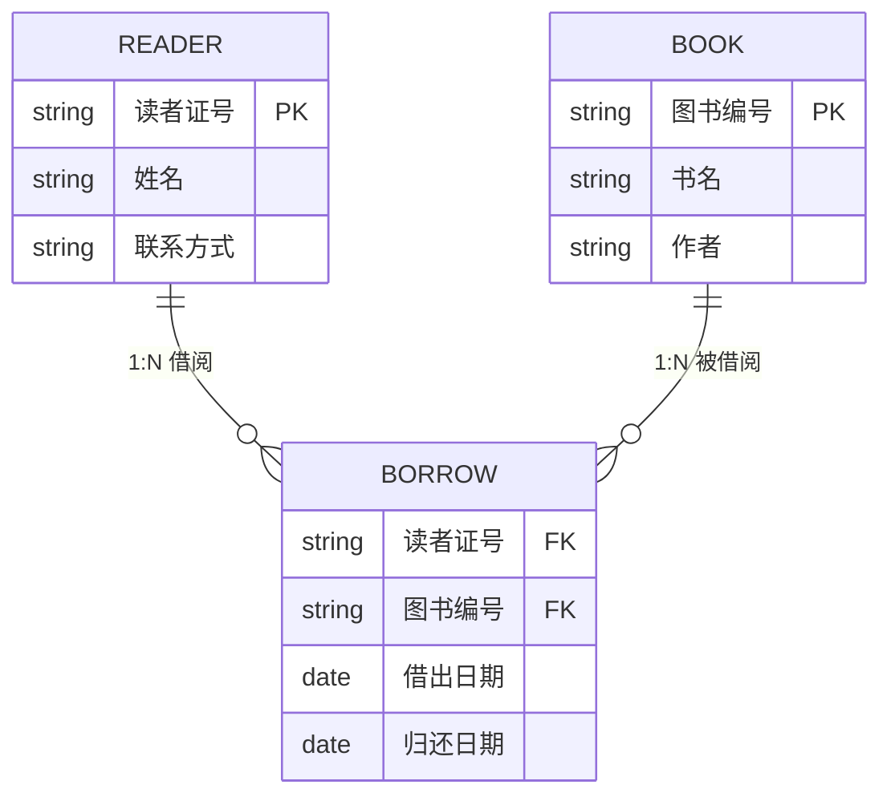
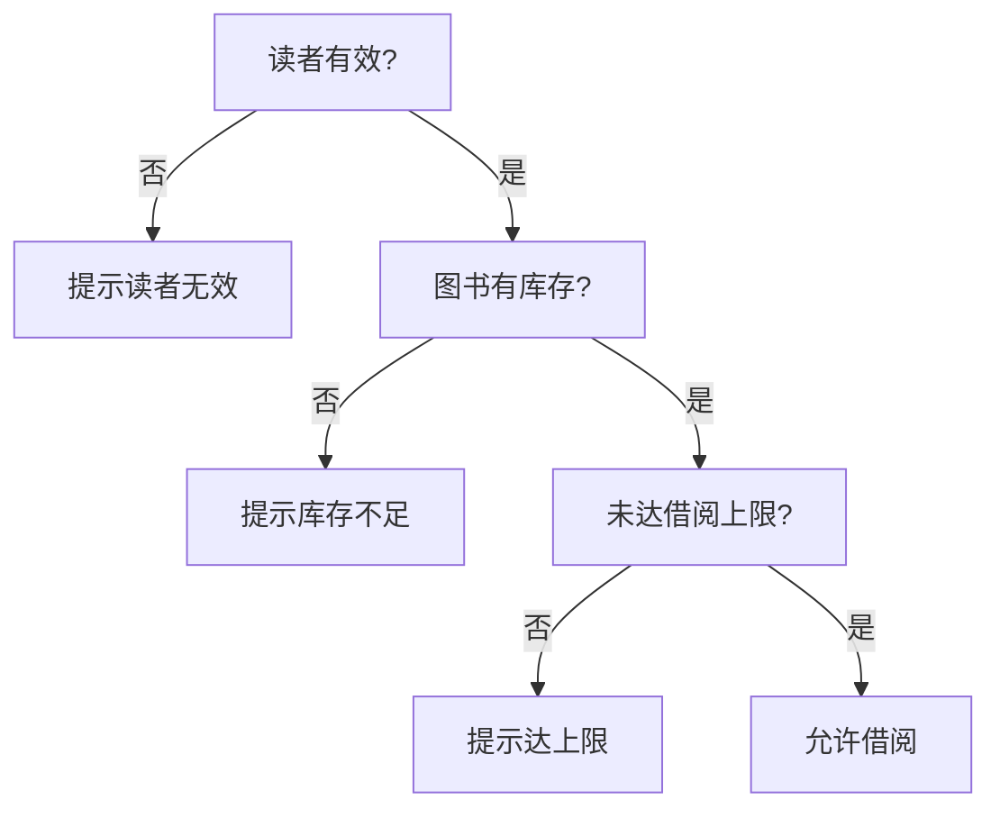

# 4.2 实体关系图与加工说明

数据流图（[[4.1 数据流图（DFD）与数据字典]]）刻画了系统的“功能与数据流”，但缺乏对“数据结构”与“加工内部逻辑”的精细描述。实体关系图(ER 图)补足数据视角，描述系统中的数据实体及其关系；加工说明补足逻辑视角，描述每个加工的内部处理规则。本节介绍 ER 图的三要素与关系基数，以及加工说明的三种工具（结构化语言、判定表、判定树），与 DFD、DD 共同构成结构化分析的完整模型。

## 实体关系图（ER 图）

> [!definition] 实体关系图
> > 实体关系图（Entity-Relationship Diagram, ER 图）用于描述系统中的数据实体及其相互关系，是数据建模的工具，为数据库设计提供概念模型。

### ER 图的三要素

ER 图由实体、属性、关系三要素构成：

| 要素 | 含义 | 图形符号 |
| --- | --- | --- |
| 实体 | 客观存在并可相互区分的事物（如读者、图书） | 矩形 |
| 属性 | 实体的特征（如读者的姓名、编号） | 椭圆 |
| 关系 | 实体间的联系（如借阅） | 菱形 |

属性通过线连接到所属实体；关系通过线连接到相关实体，并在连线上标注关系基数。

### 关系基数

关系基数描述一个实体与另一个实体关联的数量关系，有三种基本类型：

| 关系基数 | 含义 | 示例 |
| --- | --- | --- |
| 1:1 | 一对一 | 一个部门对应一个经理 |
| 1:N | 一对多 | 一个读者可借多本图书 |
| M:N | 多对多 | 学生与课程（一个学生选多门课，一门课被多名学生选） |

> [!note] M:N 关系的处理
> > 在数据库实现阶段，M:N 关系通常需要引入一个中间实体（关联实体）将其分解为两个 1:N 关系。例如“学生选课”可引入“选课记录”实体，学生与选课记录为 1:N，课程与选课记录为 1:N。

### ER 图示例（图书借阅系统）



> [!note] 图示说明
> > 上图用 Mermaid 的 `erDiagram` 表示图书借阅系统的 ER 模型：读者与图书为 M:N 关系，通过借阅记录（关联实体）实现。一个读者可对应多条借阅记录（1:N），一本图书也可对应多条借阅记录（1:N）。Mermaid 用 Crow's Foot 表示法，`||--o{` 表示“一端强制、多端可选”。

> [!tip] DFD 与 ER 的分工
> > DFD 刻画系统的“功能与数据流”（过程视角），ER 刻画系统的“数据结构”（数据视角），DD 对二者中的数据元素进行精确定义。三者共同构成结构化分析的需求模型，相互补充、不可替代。

## 加工说明

> [!definition] 加工说明
> > 加工说明是对 DFD 中每个加工的内部逻辑进行精确描述的文档，说明该加工如何把输入数据变换为输出数据。它是 DFD 的必要补充——DFD 只显示加工的输入输出，不显示内部处理规则。

加工说明也称为“小说明”（Process Specification）。当 DFD 分层到最底层（叶子加工）时，每个加工都需要编写加工说明。常用的加工说明工具有三种：结构化语言、判定表、判定树。

### 结构化语言

结构化语言是介于自然语言与程序设计语言之间的描述语言，使用顺序、选择、循环三种基本控制结构描述加工逻辑。

> [!definition] 结构化语言
> > 结构化语言（Structured Language/Pseudocode）用顺序、选择（IF-THEN-ELSE、CASE）、循环（WHILE、FOR）结构描述加工逻辑，语言简明、无歧义，便于理解与转化为程序。

示例（借阅处理加工）：

```text
加工 1：借阅处理
输入：借阅请求 = 读者证号 + 图书编号
输出：借阅结果

BEGIN
    读取读者证号，验证读者身份
    IF 读者不存在 THEN
        输出 "借阅失败：读者不存在"
    ELSE
        读取图书编号，查询图书库存
        IF 可借数 > 0 THEN
            可借数 = 可借数 - 1
            写入借阅记录（读者证号, 图书编号, 借出日期, 待核实归还日期）
            输出 "借阅成功"
        ELSE
            输出 "借阅失败：库存不足"
        END IF
    END IF
END
```

### 判定表

判定表用表格列出所有条件组合与对应动作，适合条件较多、组合关系复杂的加工，能有效避免逻辑遗漏。

> [!definition] 判定表
> > 判定表（Decision Table）由条件、条件取值、动作与规则四部分组成，用矩阵形式穷举条件组合与对应动作，确保所有可能情况都被覆盖。

判定表的结构：

| 部位 | 含义 |
| --- | --- |
| 条件桩 | 列出所有条件 |
| 条件项 | 每个条件的取值（Y/N 或具体值） |
| 动作桩 | 列出所有可能的动作 |
| 动作项 | 在对应条件组合下应执行的动作（√ 或 X） |

示例（图书借阅判定表）：

| 条件 | 规则1 | 规则2 | 规则3 | 规则4 |
| --- | --- | --- | --- | --- |
| 读者有效？ | Y | Y | Y | N |
| 图书有库存？ | Y | N | Y | — |
| 未达借阅上限？ | Y | Y | N | — |
| **动作** | | | | |
| 允许借阅 | √ | | | |
| 提示库存不足 | | √ | | |
| 提示达上限 | | | √ | |
| 提示读者无效 | | | | √ |

> [!tip] 判定表的优势
> > 当条件较多时，判定表能穷举所有组合，避免遗漏。例如 3 个条件各有 Y/N 取值，则有 $2^3=8$ 种组合。部分组合若动作相同可合并（如上表中读者无效时，其他条件用“—”表示无关）。

### 判定树

判定树用树形图直观展示条件判断与动作分支，可读性强，适合条件层次较清晰、分支适中的加工。

> [!definition] 判定树
> > 判定树（Decision Tree）以树形结构表达条件判断过程，根节点为初始判断条件，内部节点为条件分支，叶子节点为对应动作。

示例（图书借阅判定树）：



### 三种工具的比较

| 工具 | 优点 | 缺点 | 适用场景 |
| --- | --- | --- | --- |
| 结构化语言 | 表达灵活，可读性好，易转化为程序 | 条件多时易遗漏组合 | 逻辑简单、顺序/分支为主的加工 |
| 判定表 | 穷举所有组合，不易遗漏，规范性强 | 不够直观，条件多时表格庞大 | 条件多、组合关系复杂的加工 |
| 判定树 | 直观易懂，层次清晰 | 条件多时树过深，不易维护 | 条件层次清晰、分支适中的加工 |

> [!warning] 工具选择
> > 三种工具可表达相同的逻辑，选择取决于加工特点：简单顺序逻辑用结构化语言；条件组合复杂、需保证完整性用判定表；强调可读性、条件层次清晰用判定树。同一加工选用一种工具即可，不必同时使用。

## 小结

实体关系图(ER 图)以实体（矩形）、属性（椭圆）、关系（菱形）三要素描述系统的数据结构，关系基数有 1:1、1:N、M:N 三种类型。加工说明用结构化语言、判定表、判定树三种工具描述 DFD 中每个加工的内部逻辑：结构化语言适合简单逻辑，判定表适合复杂条件组合，判定树适合直观展示判断层次。ER 图补足数据视角，加工说明补足逻辑视角，与 DFD、DD 共同构成结构化分析的完整需求模型。

## 关联

- 上一级：[[MOC - 第4章]]
- 上一节：[[4.1 数据流图（DFD）与数据字典]]
- 下一节：[[4.3 结构化分析综合案例]]
- 关联概念：数据库原理（ER 图是数据库概念设计的核心工具）、[[3.2 需求分析与建模]]（DFD/DD/ER 概念引入）
