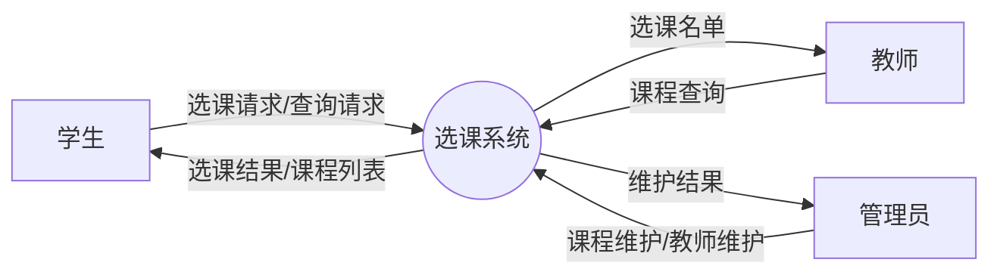
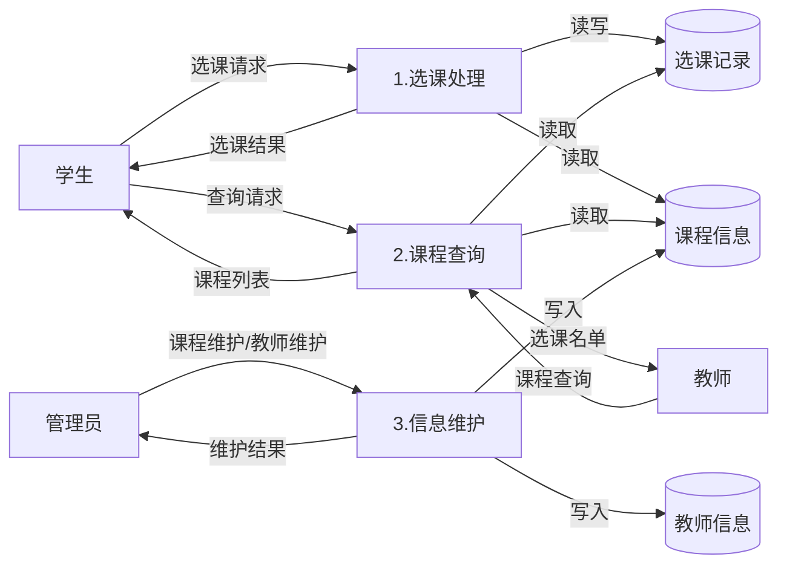
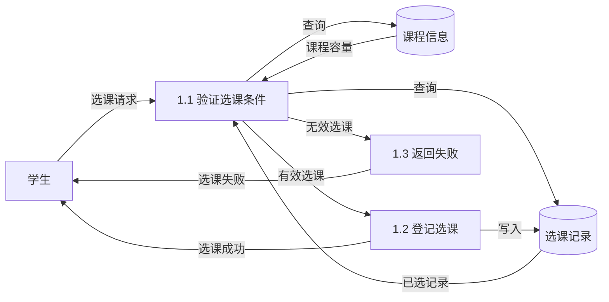
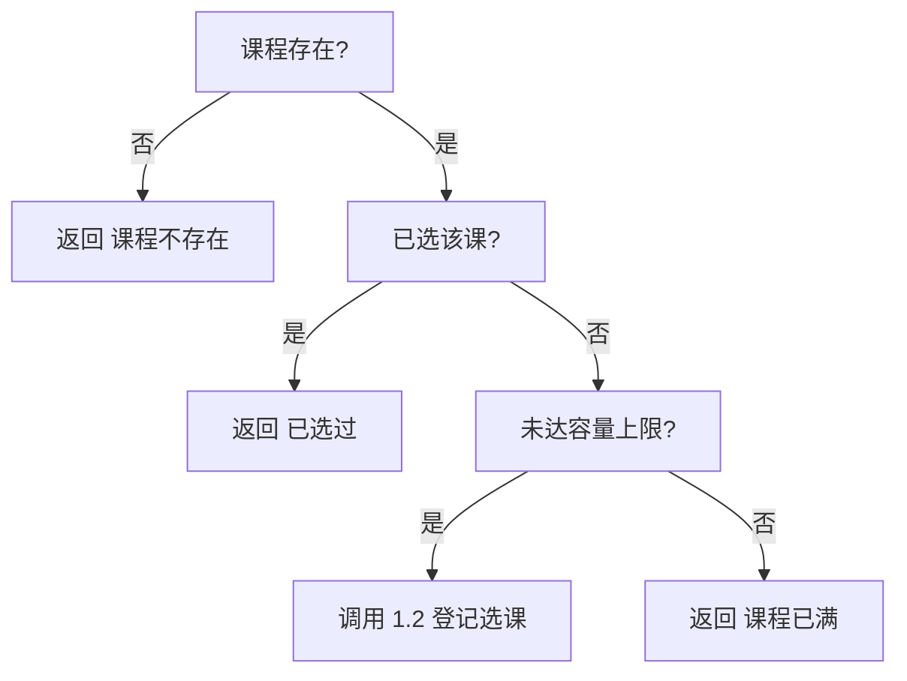
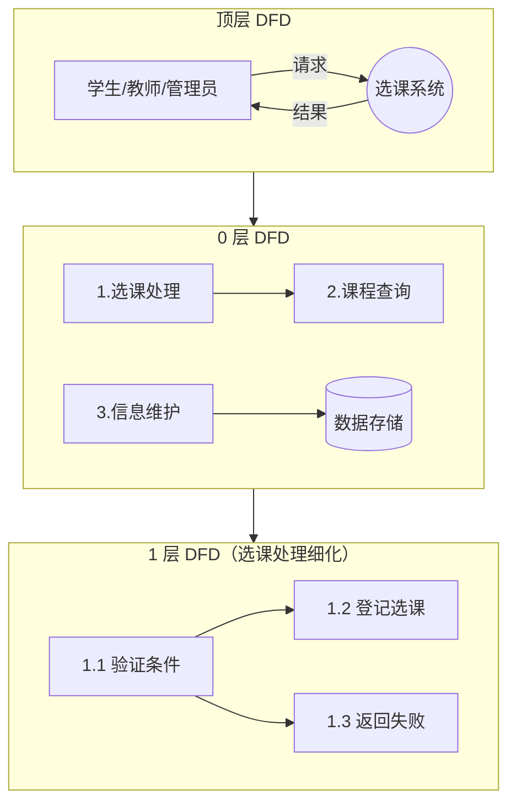

# 4.3 结构化分析综合案例

本节通过一个完整案例——选课系统——综合运用[[4.1 数据流图（DFD）与数据字典]]与[[4.2 实体关系图与加工说明]]的方法，演示结构化分析(SA)从顶层 DFD 到分层细化、数据字典编写、加工说明编写的完整流程。案例旨在将分散的知识点串联为可操作的建模能力。

## 案例背景：学生选课系统

> [!example] 系统需求
> > 某高校需要开发学生选课系统，主要功能如下：
> > 1. 学生登录系统后可查询可选课程，提交选课请求，系统校验选课条件（是否已选、是否满员）并返回选课结果。
> > 2. 教师可查询自己开设的课程及选课名单。
> > 3. 管理员负责维护课程信息（增删改）与教师信息。
> > 4. 系统需持久化存储学生、教师、课程与选课记录信息。

外部实体：学生、教师、管理员。
主要数据存储：学生信息、教师信息、课程信息、选课记录。

## 第一步：顶层 DFD

把整个选课系统作为一个加工，展示系统与三个外部实体之间的数据流。



> [!note] 顶层 DFD 说明
> > 顶层 DFD 确定了系统边界：学生提交选课/查询请求，接收选课结果/课程列表；教师查询课程，接收选课名单；管理员维护课程与教师信息，接收维护结果。系统作为一个加工（圆圈）与三个外部实体交互。

## 第二步：0 层 DFD

把顶层加工分解为三个主要加工：选课处理、课程查询、信息维护。



> [!note] 0 层 DFD 平衡检查
> > 0 层 DFD 的边界数据流与顶层一致：学生↔系统的选课请求/结果与查询请求/课程列表；教师↔系统的课程查询/选课名单；管理员↔系统的维护请求/维护结果。满足父子图平衡。新增了内部数据存储：选课记录(D1)、课程信息(D2)、教师信息(D3)。

## 第三步：1 层 DFD

对 0 层中最复杂的加工“1.选课处理”进行细化。



> [!note] 1 层 DFD 平衡检查
> > 加工“1.选课处理”在 0 层的输入是“选课请求”（来自学生），输出是“选课结果”（返回学生）。1 层 DFD 中，输入仍为“选课请求”，输出为“选课成功”或“选课失败”（合称选课结果），满足平衡。1 层把选课处理分解为“验证选课条件”“登记选课”“返回失败”三个子加工。

## 第四步：数据字典编写

```
数据项条目：
  学号 = {数字}              // 长度 10
  课程号 = {字母} + {数字}    // 如 CS101
  教师工号 = {数字}           // 长度 8

数据结构条目：
  学生 = 学号 + 姓名 + 年级 + 专业
  教师 = 教师工号 + 姓名 + 院系
  课程 = 课程号 + 课程名 + 学分 + 教师工号 + 容量 + 已选人数

数据流条目：
  选课请求 = 学号 + 课程号
  选课结果 = [选课成功 | 选课失败] + (失败原因)
  查询请求 = 学号 + (查询条件)
  课程列表 = {课程号 + 课程名 + 学分 + 教师 + 容量 + 已选人数}
  选课名单 = 课程号 + {学号 + 姓名}

数据存储条目：
  选课记录 = {学号 + 课程号 + 选课时间 + 状态}
  课程信息 = {课程}
  教师信息 = {教师}
```

> [!tip] 数据字典的完整性
> > 数据字典应覆盖 DFD 中出现的所有数据流、数据存储及其组成数据项与数据结构。每个名字都必须有定义，避免“悬空”的数据名。上例展示了从数据项到数据存储的层次化定义。

## 第五步：加工说明编写

为 1 层 DFD 中的叶子加工编写加工说明。以“1.1 验证选课条件”为例，该加工涉及多个条件判断，使用判定表较合适。

### 加工 1.1 验证选课条件 —— 判定表

| 条件 | 规则1 | 规则2 | 规则3 | 规则4 |
| --- | --- | --- | --- | --- |
| 课程存在？ | Y | Y | Y | N |
| 已选该课？ | N | Y | N | — |
| 未达容量上限？ | Y | — | N | — |
| **动作** | | | | |
| 调用 1.2 登记选课 | √ | | | |
| 返回“已选过” | | √ | | |
| 返回“课程已满” | | | √ | |
| 返回“课程不存在” | | | | √ |

### 加工 1.2 登记选课 —— 结构化语言

```text
加工 1.2：登记选课
输入：有效选课 = 学号 + 课程号
输出：选课成功

BEGIN
    在选课记录中插入 (学号, 课程号, 当前时间, 已选)
    课程信息.已选人数 = 课程信息.已选人数 + 1
    输出 "选课成功"
END
```

### 加工 1.1 验证选课条件 —— 判定树（等价表达）



> [!note] 加工说明的工具选择
> > “验证选课条件”有 3 个条件，组合后共 4 种有效情况（部分组合因条件互斥而合并），判定表与判定树均可清晰表达，二者等价。“登记选课”是顺序逻辑，结构化语言更简洁。实际中为同一加工选择一种最合适的工具即可。

## 完整 DFD 图集汇总



## 小结

本案例以学生选课系统为例，完整演示了结构化分析的流程：先画顶层 DFD 确定系统边界与外部实体，再分解为 0 层 DFD 展示主要加工与数据存储，对复杂加工继续细化为 1 层 DFD，每层保持父子图平衡；随后为所有数据元素编写数据字典，为叶子加工编写加工说明（根据加工特点选择结构化语言、判定表或判定树）。这一流程体现了结构化分析“面向数据流、自顶向下、逐层分解”的核心思想，是连接需求与设计的关键桥梁。

## 关联

- 上一级：[[MOC - 第4章]]
- 上一节：[[4.2 实体关系图与加工说明]]
- 关联概念：[[5.1 结构化设计原理与结构图]]（分析模型将作为结构化设计的输入）、[[3.3 需求规格说明与需求验证]]（分析模型纳入 SRS 附录）
