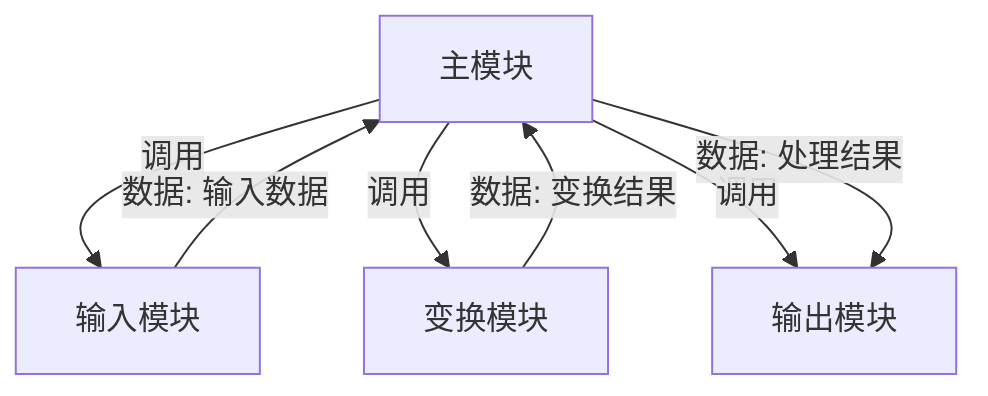
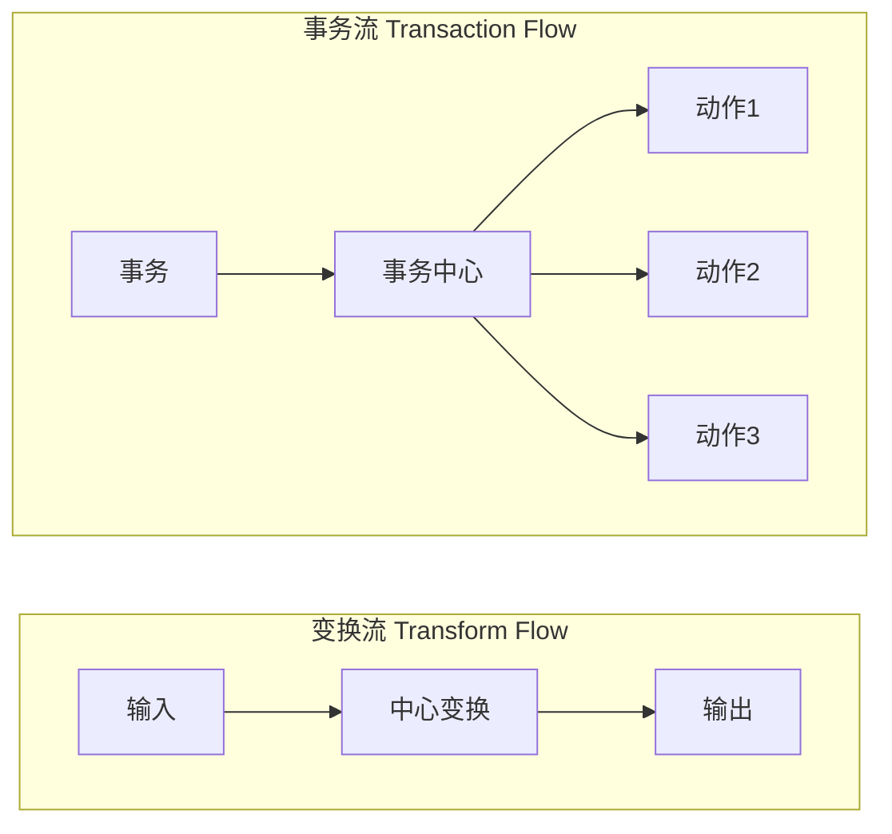

# 5.1 结构化设计原理与结构图

结构化设计(SD)是结构化分析(SA)的后续阶段，解决“如何把分析阶段的数据流图转化为程序的模块结构”的问题。本节阐明结构化设计的核心任务、结构图(SC)的元素与绘制、模块化设计原则，以及 DFD 与结构图的关系（变换流与事务流），为[[5.2 模块内聚与耦合]]和[[5.3 变换分析与事务分析]]奠定基础。

## 结构化设计概述

> [!definition] 结构化设计
> > 结构化设计（Structured Design, SD）是一种面向数据流的设计方法，以分析阶段得到的数据流图(DFD)为基础，将其映射为程序的模块结构图(SC)，核心任务是确定系统由哪些模块组成、模块间如何调用与传递数据。

结构化分析与结构化设计的关系：

> [!note] SA 与 SD 的衔接
> > SA 产生 DFD，刻画系统“做什么”；SD 以 DFD 为输入，导出结构图(SC)，刻画系统“怎么做”的模块结构。DFD 是连接分析与设计的桥梁。SD 不重新分析需求，而是把需求模型转化为设计模型。

## 结构图（SC）

> [!definition] 结构图
> > 结构图（Structure Chart, SC）是描述程序模块结构的图形工具，展示系统的模块组成、模块间的调用关系以及模块间传递的数据与控制信息。

### 结构图的基本元素

| 元素 | 图形符号 | 含义 |
| --- | --- | --- |
| 模块 | 矩形 | 程序的可命名单元，矩形内标注模块名 |
| 调用 | 箭头（从调用者指向被调用者） | 模块间的调用关系 |
| 数据 | 带空心圆的箭头 | 模块间传递的数据信息 |
| 控制 | 带实心圆的箭头 | 模块间传递的控制信息（如标志、状态） |

> [!warning] 数据与控制的区分
> > 结构图中的“数据”用空心圆箭头表示，是被处理的对象（如订单、查询结果）；“控制”用实心圆箭头表示，是影响另一模块执行逻辑的信号（如“结束标志”“错误码”）。传递控制信息意味着模块间存在控制依赖，应尽量减少（详见[[5.2 模块内聚与耦合]]的控制耦合）。

### 结构图示例

> [!note] 图示说明
> > 上图展示一个典型的变换型结构图：主模块协调输入、变换、输出三个下层模块。Mermaid 用 `flowchart` 近似表达模块调用关系；实际结构图中，调用用普通箭头，数据用空心圆箭头，控制用实心圆箭头。

## 模块化设计

> [!definition] 模块化
> > 模块化（Modularity）是把一个复杂系统分解为若干相对独立、可分别编写和测试的模块的设计方法。每个模块完成一个明确的子功能，模块间通过明确的接口交互。

模块化的核心目标是**模块独立性**——每个模块尽量独立完成单一功能，模块间依赖尽量少。模块独立性由两个维度度量：

- **内聚（Cohesion）**：模块内部各成分之间的关联程度，越高越好。
- **耦合（Coupling）**：模块之间的依赖程度，越低越好。

内聚与耦合的详细分类见[[5.2 模块内聚与耦合]]。

> [!tip] 模块化的依据
> > 模块化基于“分而治之”思想：把复杂问题分解为多个简单子问题分别解决。但模块并非越小越好——模块过多会增加模块间接口的复杂度。合理的模块规模与独立性需要在内聚与耦合之间权衡。

### 模块独立性的意义

- **可理解性**：高内聚模块功能单一，易于理解。
- **可测试性**：独立模块可单独测试。
- **可维护性**：修改一个模块不易影响其他模块。
- **可复用性**：功能独立的模块更易在不同系统中复用。

## 结构图与 DFD 的关系

结构图由 DFD 映射而来。DFD 中的数据流有两种典型形态，对应两种设计策略：

| 数据流类型 | 特征 | 设计方法 | 对应章节 |
| --- | --- | --- | --- |
| 变换流 | 数据沿输入路径进入，经中心变换后沿输出路径输出 | 变换分析 | [[5.3 变换分析与事务分析]] |
| 事务流 | 一个事务进入后，根据类型分派到不同处理路径 | 事务分析 | [[5.3 变换分析与事务分析]] |

> [!note] 两种流的判别
> > 若 DFD 的数据流呈“输入→处理→输出”的线性流水线形态，且存在明显的中心变换，则为变换流。若 DFD 中存在一个加工，它根据输入数据的类型将数据分派到多个不同的处理路径，则该加工为事务中心，对应事务流。一个系统的 DFD 可能同时包含两种流，需对不同部分分别采用相应的设计方法。

## 小结

结构化设计(SD)以数据流图(DFD)为输入，导出结构图(SC)，刻画系统的模块结构。结构图由模块（矩形）、调用（箭头）、数据（空心圆箭头）、控制（实心圆箭头）四种元素构成。模块化设计以模块独立性为目标，通过高内聚低耦合提升可理解性、可测试性、可维护性与可复用性。DFD 中的数据流分为变换流与事务流两类，分别对应变换分析与事务分析两种设计策略。

## 关联

- 上一级：[[MOC - 第5章]]
- 下一节：[[5.2 模块内聚与耦合]]
- 关联概念：[[4.1 数据流图（DFD）与数据字典]]（DFD 是 SD 的输入）、[[5.3 变换分析与事务分析]]（DFD 到 SC 的映射方法）
