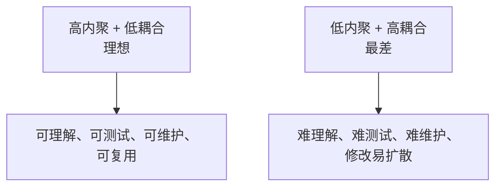

# 5.2 模块内聚与耦合

模块独立性是结构化设计（[[5.1 结构化设计原理与结构图]]）追求的核心目标，由内聚与耦合两个维度度量。内聚衡量模块内部各成分的关联程度，耦合衡量模块之间的依赖程度。本节系统介绍内聚的七种类型与耦合的七种类型，阐明“高内聚低耦合”设计原则，并提供判定方法，为评估与改进模块结构提供依据。

## 模块独立性

> [!definition] 模块独立性
> > 模块独立性（Module Independence）指每个模块完成一个相对独立的功能，且与其他模块的接口简单、依赖最少。它由内聚与耦合两个维度共同度量：内聚越高、耦合越低，模块独立性越好。

## 内聚

> [!definition] 内聚
> > 内聚（Cohesion）是模块内部各成分（语句、处理）之间关联程度的度量，反映模块功能的单一性。内聚越高，模块功能越集中，独立性越好。

内聚按由弱到强分为七种类型：

| 类型 | 内聚程度 | 含义 | 示例 |
| --- | --- | --- | --- |
| 偶然内聚 | 最弱 | 各成分无实质关联，仅为方便放在一起 | 把几段无关代码放入同一模块 |
| 逻辑内聚 | 弱 | 完成逻辑上相似的功能，由调用方传入标志选择执行 | 一个模块处理所有类型的报表打印 |
| 时间内聚 | 较弱 | 各成分在同一时间段内执行（如初始化） | 初始化模块：打开文件、初始化变量、加载配置 |
| 过程内聚 | 中 | 各成分按特定过程顺序执行 | 按业务流程顺序执行的步骤集合 |
| 通信内聚 | 较强 | 各成分对同一数据区操作 | 对同一缓冲区进行读、写、清空 |
| 顺序内聚 | 强 | 一个成分的输出是另一成分的输入 | 读数据→处理数据→写数据，前后衔接 |
| 功能内聚 | 最强 | 所有成分共同完成单一明确功能 | 计算 sin(x) 的模块 |

> [!note] 内聚类型说明
> > 上图按由弱到强排列内聚类型。前三种（偶然、逻辑、时间）为低内聚，应避免；中间两种（过程、通信）为中内聚，可接受；后两种（顺序、功能）为高内聚，是设计目标。功能内聚是最理想的状态——模块只做一件事。

## 耦合

> [!definition] 耦合
> > 耦合（Coupling）是模块之间依赖程度的度量，反映模块间接口的复杂性与相互影响。耦合越低，模块独立性越好。

耦合按由强到弱分为七种类型：

| 类型 | 耦合程度 | 含义 | 示例 |
| --- | --- | --- | --- |
| 内容耦合 | 最强 | 一个模块直接访问另一模块的内部数据或代码 | 模块 A 直接修改模块 B 的内部变量 |
| 公共耦合 | 强 | 多个模块共享全局数据区 | 多个模块读写同一全局变量 |
| 外部耦合 | 较强 | 模块与外部环境（如外部文件、协议）耦合 | 多个模块都依赖某一外部文件格式 |
| 控制耦合 | 中 | 模块间传递控制信息（标志、开关） | 模块 A 传入标志决定模块 B 的执行分支 |
| 标记耦合 | 较弱 | 模块间传递数据结构（记录）的引用 | 模块 A 把整个学生记录传给模块 B，B 只用其中部分 |
| 数据耦合 | 弱 | 模块间仅通过参数传递数据 | 模块 A 调用模块 B 时传入具体数据值 |
| 非直接耦合 | 最弱 | 模块间无直接联系，各自独立运行 | 两个互不调用的独立模块 |

> [!note] 耦合类型说明
> > 上图按由强到弱排列耦合类型。前三种（内容、公共、外部）为强耦合，应避免；控制耦合为中耦合，应尽量消除；后三种（标记、数据、非直接）为弱耦合，是设计目标。数据耦合是最常见、可接受的耦合方式。

## 高内聚低耦合原则

> [!warning] 设计原则
> > 结构化设计的核心原则是**高内聚、低耦合**：模块内部应高度内聚（尽量达到功能内聚），模块之间应低度耦合（尽量采用数据耦合）。高内聚保证模块功能单一、易理解、易复用；低耦合保证模块间依赖少，修改一个模块不易波及其他模块。

### 内聚与耦合的关系

内聚与耦合通常是相关的：高内聚的模块往往自然形成低耦合，因为功能单一的模块不需要过多外部交互。但二者并非完全等价——一个高内聚模块仍可能因接口设计不当而产生较强耦合。

## 内聚耦合判定表

实际设计中，可通过以下问题快速判定内聚与耦合类型：

| 判定问题 | 内聚判定 |
| --- | --- |
| 模块内各成分是否为同一功能服务？ | 是→功能内聚；否→继续 |
| 一个成分的输出是否为下一成分的输入？ | 是→顺序内聚；否→继续 |
| 各成分是否操作同一数据区？ | 是→通信内聚；否→继续 |
| 各成分是否按固定顺序执行？ | 是→过程内聚；否→继续 |
| 各成分是否在同一时间执行？ | 是→时间内聚；否→继续 |
| 是否通过标志选择执行某段？ | 是→逻辑内聚；否→偶然内聚 |

| 判定问题 | 耦合判定 |
| --- | --- |
| 是否直接访问另一模块内部？ | 是→内容耦合；否→继续 |
| 是否共享全局数据？ | 是→公共耦合；否→继续 |
| 是否传递控制信息（标志/开关）？ | 是→控制耦合；否→继续 |
| 是否传递整个数据结构但只用部分？ | 是→标记耦合；否→继续 |
| 是否仅通过参数传递数据？ | 是→数据耦合；否→非直接耦合 |

> [!tip] 改进方向
> > 当发现低内聚或高耦合时，改进方向：①拆分低内聚模块为多个功能内聚模块；②把公共数据封装为模块内部数据，通过接口访问（消除公共耦合）；③把控制标志转化为数据参数（消除控制耦合）；④只传递模块实际需要的数据而非整个数据结构（消除标记耦合）。

## 小结

模块独立性由内聚与耦合度量。内聚按由弱到强分为偶然、逻辑、时间、过程、通信、顺序、功能七种，功能内聚最优；耦合按由强到弱分为内容、公共、外部、控制、标记、数据、非直接七种，数据耦合最常见且可接受。结构化设计的核心原则是高内聚低耦合：高内聚保证模块功能单一、易复用，低耦合保证模块间依赖少、易维护。通过判定表可快速评估模块的内聚与耦合水平，并据此改进设计。

## 关联

- 上一级：[[MOC - 第5章]]
- 上一节：[[5.1 结构化设计原理与结构图]]
- 下一节：[[5.3 变换分析与事务分析]]
- 关联概念：面向对象设计原则（封装、单一职责是高内聚低耦合在 OO 中的体现，见[[MOC - 面向对象系统分析与建模|面向对象系统分析与建模]]）
