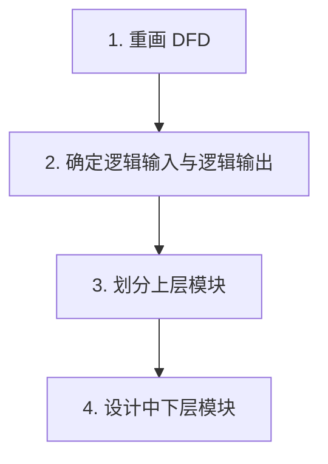
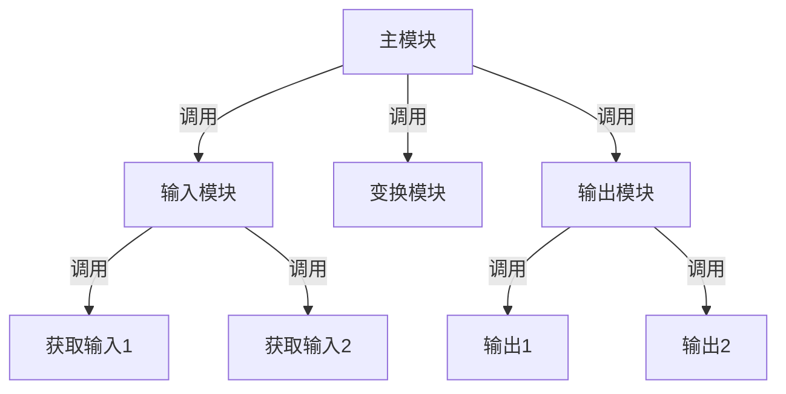
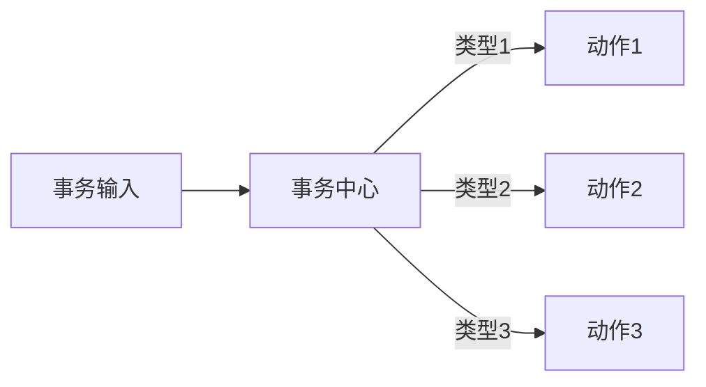
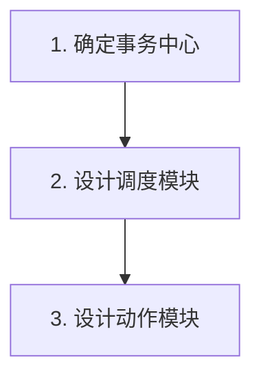
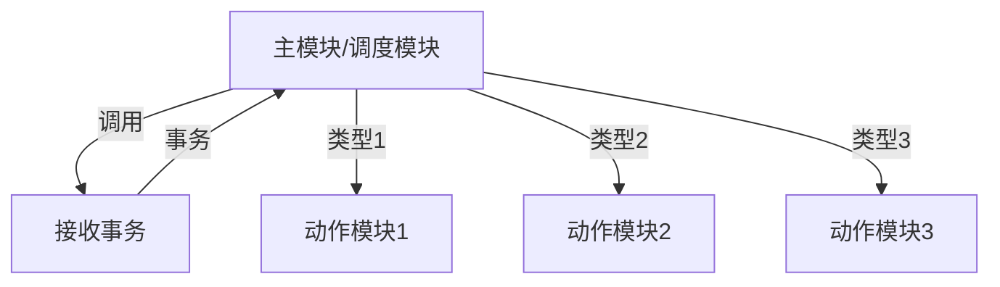
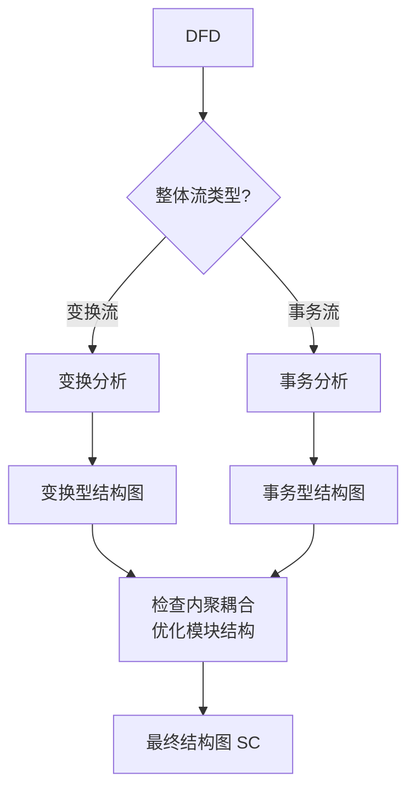

# 5.3 变换分析与事务分析

变换分析与事务分析是结构化设计（[[5.1 结构化设计原理与结构图]]）中将数据流图(DFD)映射为结构图(SC)的两种核心方法。变换分析处理“输入→处理→输出”的变换流，事务分析处理“分类→调度”的事务流。本节阐明两种分析的步骤、产出的结构图形态及其区别，是结构化设计的方法学落点。

## 变换分析

> [!definition] 变换分析
> > 变换分析（Transform Analysis）是把变换型数据流图映射为变换型结构图的设计方法。变换流的特点是数据沿输入路径进入系统，经中心变换处理后沿输出路径输出。

### 变换流的特征

变换流分为三段：传入路径（物理输入→逻辑输入）、中心变换（逻辑输入→逻辑输出）、传出路径（逻辑输出→物理输出）。

### 变换分析的步骤

> [!note] 变换分析四步法
> > **第一步：重画 DFD**——理清数据流，确保 DFD 完整、正确。
> > **第二步：确定逻辑输入和逻辑输出**——沿输入流从外部向内逆向追踪，直到不能明确判断为“纯输入”的位置，该处为逻辑输入（变换中心边界）；沿输出流从内部向外正向追踪，直到不能明确判断为“纯输出”的位置，该处为逻辑输出。逻辑输入与逻辑输出之间即为中心变换。
> > **第三步：划分上层模块**——顶层设计一个主模块负责协调；主模块下分三类：输入模块（获取逻辑输入）、变换模块（中心变换，把逻辑输入转为逻辑输出）、输出模块（输出逻辑输出）。
> > **第四步：设计中下层模块**——对传入路径、中心变换、传出路径分别细化，为每个加工设计下层模块，形成层次结构，直到每个模块功能足够简单。

### 变换型结构图

> [!note] 图示说明
> > 变换型结构图呈三叉树形：主模块在顶部协调，下分输入、变换、输出三个分支。输入分支逐层获取数据直到逻辑输入，变换分支完成核心处理，输出分支逐层输出直到物理输出。这种结构清晰地反映了“输入-处理-输出”的数据流。

## 事务分析

> [!definition] 事务分析
> > 事务分析（Transaction Analysis）是把事务型数据流图映射为事务型结构图的设计方法。事务流的特点是一个事务进入系统后，由事务中心根据事务类型分派到不同的处理路径。

### 事务流的特征

事务流有一个事务中心，它接收事务，根据事务类型选择并调度到对应的动作模块。

### 事务分析的步骤

> [!note] 事务分析三步法
> > **第一步：确定事务中心**——在 DFD 中找到那个根据输入类型分派数据流的加工，即为事务中心。
> > **第二步：设计调度模块**——事务中心对应一个调度模块（或主模块兼任），负责接收事务、判断类型、调用对应动作模块。
> > **第三步：设计动作模块**——为每种事务类型设计一个动作模块，处理对应的事务。动作模块可进一步细化。

### 事务型结构图

> [!note] 图示说明
> > 事务型结构图呈扇形：调度模块在顶部，下接多个并列的动作模块。调度模块接收事务后根据类型调用对应动作模块，各动作模块相互独立。这种结构清晰地反映了“分类-调度”的分派机制。

## 变换型与事务型的比较

| 比较维度 | 变换型 | 事务型 |
| --- | --- | --- |
| 数据流特征 | 输入→处理→输出的线性流水线 | 一进多出的分派结构 |
| 核心加工 | 中心变换 | 事务中心 |
| 结构图形态 | 三叉树（输入-变换-输出分支） | 扇形（调度-多动作） |
| 设计重点 | 划分逻辑输入/输出边界 | 识别事务类型与调度 |
| 典型系统 | 数据处理系统（统计、转换） | 交互系统、菜单系统、命令处理 |

> [!warning] 混合流的情况
> > 实际系统的 DFD 往往同时包含变换流与事务流。设计时应先识别整体形态：若整体为变换流，则用变换分析建立主框架，对其中的事务流局部用事务分析细化；若整体为事务流，则用事务分析建立主框架，对其中的变换流局部用变换分析细化。

## 综合流程

> [!tip] 设计优化
> > 从 DFD 映射得到的初始结构图通常需要优化：合并或拆分模块以提高内聚、降低耦合（详见[[5.2 模块内聚与耦合]]）；消除不必要的控制耦合；保证每个模块达到功能内聚或顺序内聚。映射是起点而非终点，工程师的判断与优化不可省略。

## 小结

变换分析与事务分析是将 DFD 映射为结构图的两种方法。变换分析处理变换流（输入→处理→输出），通过确定逻辑输入/输出边界、划分输入-变换-输出上层模块、设计中下层模块，得到三叉树形结构图。事务分析处理事务流（分类→调度），通过确定事务中心、设计调度模块与动作模块，得到扇形结构图。变换型强调流水线式数据变换，事务型强调分派式分支调度。实际系统常混合两种流，需对不同部分分别采用相应方法，并对初始结构图进行内聚耦合优化。

## 关联

- 上一级：[[MOC - 第5章]]
- 上一节：[[5.2 模块内聚与耦合]]
- 关联概念：[[4.1 数据流图（DFD）与数据字典]]（DFD 是变换/事务分析的输入）、[[4.3 结构化分析综合案例]]（综合案例的 DFD 可作为练习输入）
