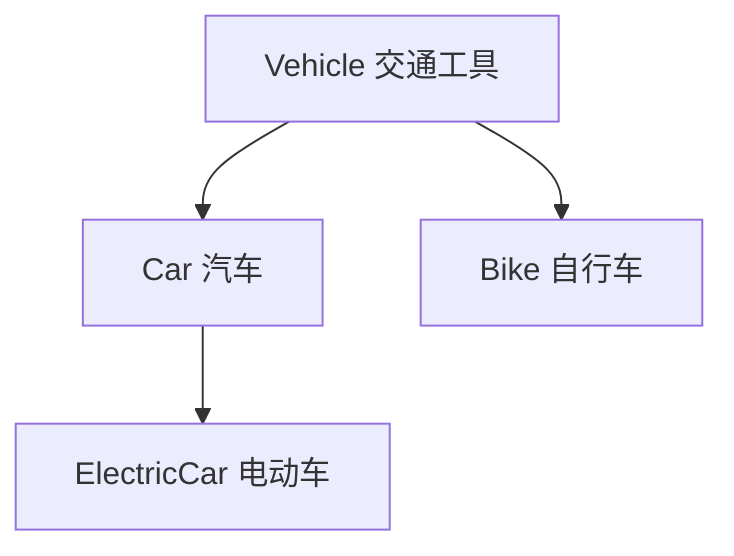
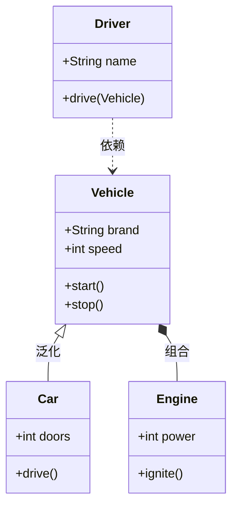

# 6.1 面向对象基本概念与特征

面向对象(Object-Oriented)是现代软件工程的主流方法学基础。它通过对象、类、封装、继承、多态等概念，将现实世界中的实体及其关系直接映射到软件结构中，使软件更易理解、复用与维护。本节阐明面向对象的基本概念、对象三要素、类间关系与三大特征，并与面向过程方法对比，为[[6.2 面向对象分析与设计（OOA-OOD）]]奠定概念基础。

## 面向对象基本概念

### 对象

> [!definition] 对象
> > 对象（Object）是系统中用来描述客观事物的一个实体，是属性（数据）和操作（方法）的封装体。每个对象都有唯一的标识，能接收消息、处理数据并与其他对象交互。

#### 对象三要素

| 要素 | 含义 | 示例 |
| --- | --- | --- |
| 属性 | 对象的状态与特征数据 | 学生对象的学号、姓名、年级 |
| 方法 | 对象的行为与操作 | 学生对象的选课、查询成绩 |
| 对象标识 | 唯一区分对象的标识，独立于属性值 | 两个学号相同的学生对象仍是不同对象（若存在） |

> [!note] 对象标识的独立性
> > 对象标识（Object Identity）是对象的内在属性，即使两个对象的所有属性值都相同，它们仍是两个不同的对象。这与关系数据库中靠主键区分记录类似，但在 OO 中标识是隐式的、由系统保证的。

### 类

> [!definition] 类
> > 类（Class）是具有相同属性和方法的对象的抽象，是创建对象的模板（蓝图）。对象是类的实例（Instance）。

类定义了属性的结构与方法的实现，对象则持有具体的属性值。一个类可以创建多个对象实例。

### 消息

> [!definition] 消息
> > 消息（Message）是对象之间通信的载体。一个对象通过向另一对象发送消息来请求其执行某个方法。消息一般包含接收对象、方法名和参数。

> [!tip] 消息与方法
> > 消息是“请求”，方法是“响应”。对象收到消息后，根据消息中的方法名找到对应的方法并执行，返回结果。消息传递是面向对象系统中对象协作的基本机制。

## 面向对象三大特征

### 封装

> [!definition] 封装
> > 封装（Encapsulation）是把对象的属性和操作结合为一个整体，并隐藏内部实现细节，只通过公开的接口与外部交互。封装实现信息隐藏，保护数据完整性，降低模块间耦合。

### 继承

> [!definition] 继承
> > 继承（Inheritance）是子类自动获得父类的属性和方法，并可在其基础上扩展新成员或修改（重写）已有方法的机制。继承支持代码复用并建立类之间的层次关系（泛化关系）。

### 多态

> [!definition] 多态
> > 多态（Polymorphism）是同一消息发送给不同对象时产生不同行为的能力。多态通常通过方法重写（子类重写父类方法）与接口实现实现，使调用方无需关心对象的具体类型。

> [!example] 多态示例
> > 定义父类“图形”有方法 `draw()`，子类“圆形”“矩形”“三角形”各自重写 `draw()`。调用方只需对“图形”对象发送 `draw()` 消息，运行时根据对象实际类型执行对应的绘制逻辑——这就是多态。

## 类之间的关系

类之间有五种主要关系，按耦合强度由强到弱：

| 关系 | 含义 | UML 表示 | 耦合强度 |
| --- | --- | --- | --- |
| 泛化(Generalization) | 继承关系，子类继承父类 | 实线带空心三角箭头 | 最强 |
| 组合(Composition) | 强整体-部分，部分与整体同生共死 | 实线带实心菱形 | 强 |
| 聚合(Aggregation) | 弱整体-部分，部分可独立存在 | 实线带空心菱形 | 中 |
| 关联(Association) | 类间的结构性联系 | 实线 | 较弱 |
| 依赖(Dependency) | 一个类使用另一个类（局部变量/参数） | 虚线带箭头 | 最弱 |

### 类图基本元素示例

> [!note] 图示说明
> > 上图用 Mermaid `classDiagram` 展示类间关系：`Car` 继承 `Vehicle`（泛化，`<|--`）；`Vehicle` 与 `Engine` 是组合关系（`*--`，发动机随交通工具创建销毁）；`Driver` 依赖 `Vehicle`（`..>`，驾驶方法用到交通工具）。Mermaid 中空心菱形聚合用 `o--`，实心菱形组合用 `*--`，泛化用 `<|--`，关联用 `--`，依赖用 `..>`。

## 面向对象 vs 面向过程

| 比较维度 | 面向过程 | 面向对象 |
| --- | --- | --- |
| 核心思想 | 以函数/过程为中心，数据与操作分离 | 以对象为中心，数据与操作封装为一体 |
| 分解方式 | 功能分解（自顶向下） | 对象识别（识别实体与职责） |
| 复用单位 | 函数/过程 | 类/对象 |
| 适应变化 | 功能变化影响面大 | 通过继承与多态局部化变化影响 |
| 适用场景 | 小型、计算密集、需求稳定 | 大型、复杂业务、需求易变 |

> [!note] 二者并非对立
> > 面向对象并未抛弃过程——对象的方法内部仍是过程式逻辑。OO 的优势在于通过封装、继承、多态更好地组织复杂系统、应对需求变化。对于小型、稳定、计算密集的程序，面向过程可能更直接高效。详见[[MOC - 第1章|1.1]]结构化与面向对象方法的对比。

## 小结

面向对象以对象（属性+方法的封装体）和类（对象模板）为基本构造块，通过消息实现对象协作。三大特征——封装（信息隐藏）、继承（代码复用与层次化）、多态（同一接口多种实现）——共同支撑了软件的可理解性、可复用性与可扩展性。类间关系按耦合强度分为泛化、组合、聚合、关联、依赖五种。与面向过程相比，面向对象更适合大型、复杂、易变系统的开发。

## 关联

- 上一级：[[MOC - 第6章]]
- 下一节：[[6.2 面向对象分析与设计（OOA-OOD）]]
- 关联概念：[[3.2 需求分析与建模]]（面向对象需求分析以用例建模为核心）、[[MOC - 面向对象系统分析与建模|面向对象系统分析与建模]]（OO 概念与 UML 建模的深化课程）
