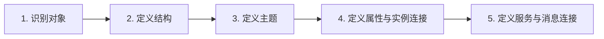
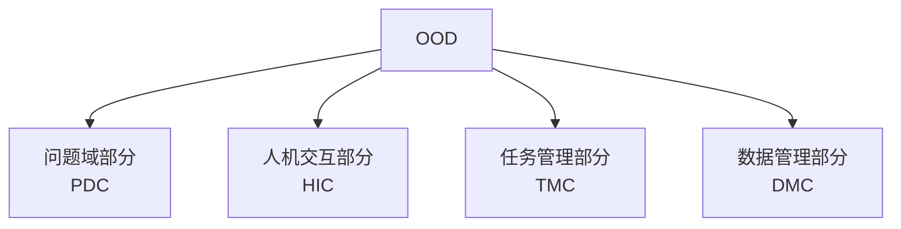
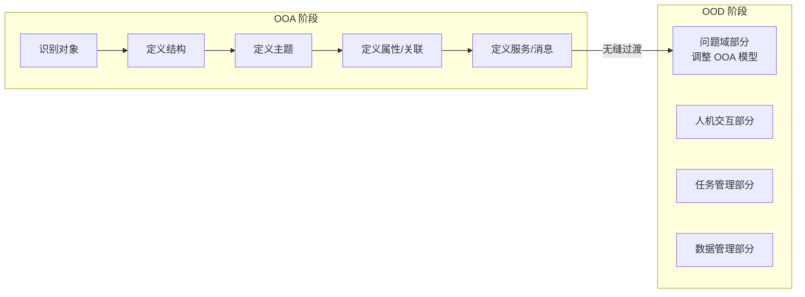
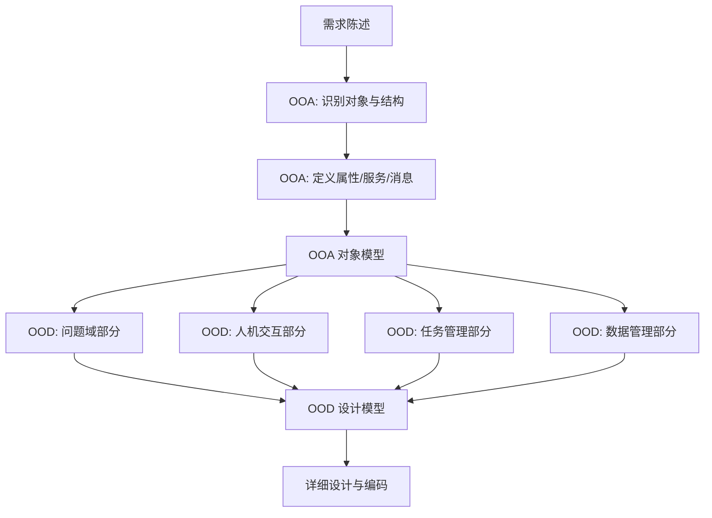

# 6.2 面向对象分析与设计（OOA/OOD）

面向对象分析(OOA)与面向对象设计(OOD)是面向对象软件工程的核心方法。OOA 解决“系统需要哪些对象及其关系”的问题，OOD 解决“如何组织这些对象以实现系统”的问题。本节以 Coad/Yourdon 方法为主线，介绍 OOA 的五个活动与 OOD 的四个组成部分，阐明从分析到设计的过渡，为[[6.3 统一建模语言（UML）在软件工程中的应用]]提供方法学语境。

## 面向对象分析（OOA）

> [!definition] 面向对象分析
> > 面向对象分析（Object-Oriented Analysis, OOA）是从问题域中识别对象、定义对象间的结构与关系、确定对象属性与服务的分析过程，目的是建立直接反映问题域的对象模型，而不考虑实现细节。

### Coad/Yourdon 方法的 OOA 五个活动

| 活动 | 任务 | 说明 |
| --- | --- | --- |
| 识别对象 | 从问题域中找出候选对象 | 常用名词法：从需求文本中提取名词作为候选对象，筛选后确定类 |
| 定义结构 | 建立对象间的分类结构与组装结构 | 分类结构即泛化（继承）；组装结构即聚合/组合 |
| 定义主题 | 把相关对象归组为主题 | 主题（Subject）用于组织大型模型，降低模型复杂度 |
| 定义属性和实例连接 | 为对象添加属性，建立对象间关联 | 属性描述对象状态；实例连接即关联关系 |
| 定义服务和消息连接 | 为对象添加操作，建立对象间消息传递 | 服务即方法；消息连接描述对象间协作 |

> [!tip] 名词法识别对象
> > 识别对象的常用方法是“名词法”：阅读需求陈述，标记所有名词作为候选对象，标记动词作为候选方法或关联；然后筛选——去掉冗余、属性、外部系统、实现细节，保留反映问题域核心概念的对象。这是 OOA 的起点。

### OOA 的产物

OOA 的主要产物是**对象模型**（类图），描述系统中的对象/类、属性、方法及其结构关系。Coad/Yourdon 方法的 OOA 也可结合用例（Use Case）描述系统行为，但行为建模主要在 UML 阶段系统化（详见[[6.3 统一建模语言（UML）在软件工程中的应用]]）。

## 面向对象设计（OOD）

> [!definition] 面向对象设计
> > 面向对象设计（Object-Oriented Design, OOD）是在 OOA 对象模型基础上，结合实现环境（硬件、操作系统、数据库、网络等）进行设计，把分析模型转化为可实现的软件结构。OOD 不重新设计对象，而是补充实现细节并组织为四个设计部分。

### Coad/Yourdon 方法的 OOD 四个部分

| 部分 | 全称 | 任务 |
| --- | --- | --- |
| 问题域部分 | Problem Domain Component | 把 OOA 的对象模型直接带入设计，按实现需求调整与补充 |
| 人机交互部分 | Human Interaction Component | 设计用户界面，包括界面对象、布局、交互方式 |
| 任务管理部分 | Task Management Component | 设计并发任务（进程/线程）的组织与调度 |
| 数据管理部分 | Data Management Component | 设计数据持久化方案（文件、数据库） |

> [!note] OOD 四部分的关系
> > 问题域部分是 OOD 的核心，直接来自 OOA 的对象模型，体现“分析-设计无缝过渡”——OOD 不抛弃分析结果，而是在其上叠加实现。人机交互、任务管理、数据管理三部分是问题域部分与外部环境（用户、并发、存储）的接口，各自独立设计但服务于问题域部分。

## OOA 到 OOD 的过渡

> [!warning] 无缝过渡的含义
> > 面向对象方法的一大优势是 OOA 到 OOD 的“无缝过渡”：OOA 建立的对象模型在 OOD 中被直接采用为问题域部分，不需要像结构化方法那样从 DFD“翻译”为结构图。OOD 主要是在 OOA 模型上补充实现细节并增加人机交互、任务管理、数据管理三个部分。这种过渡减少了分析与设计之间的语义鸿沟。

> [!note] OOA 模型在 OOD 中的调整
> > 虽然问题域部分直接来自 OOA，但在 OOD 中可能需要调整：①合并或拆分类以适应实现语言；②增加实现所需的属性与方法；③调整继承层次以符合语言限制（如不支持多继承时）；④应用设计模式优化结构。调整应尽量保持 OOA 模型的问题域语义。

## OOA/OOD 流程总览

## 小结

面向对象分析(OOA)以 Coad/Yourdon 方法的五个活动（识别对象、定义结构、定义主题、定义属性与实例连接、定义服务与消息连接）建立反映问题域的对象模型。面向对象设计(OOD)在该模型基础上组织为四个部分：问题域部分（直接来自 OOA）、人机交互部分、任务管理部分、数据管理部分。OOA 到 OOD 的过渡是“无缝”的——分析阶段的对象模型被设计阶段直接采用，体现了面向对象方法减少分析-设计语义鸿沟的优势。

## 关联

- 上一级：[[MOC - 第6章]]
- 上一节：[[6.1 面向对象基本概念与特征]]
- 下一节：[[6.3 统一建模语言（UML）在软件工程中的应用]]
- 关联概念：[[MOC - 面向对象系统分析与建模|面向对象系统分析与建模]]（OOA/OOD 与 UML 建模的系统深化）、[[5.1 结构化设计原理与结构图]]（结构化设计需 DFD→SC 翻译，对比 OO 无缝过渡）
