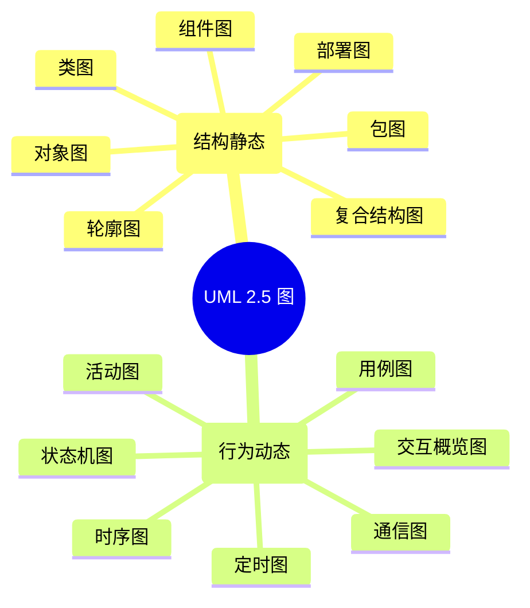
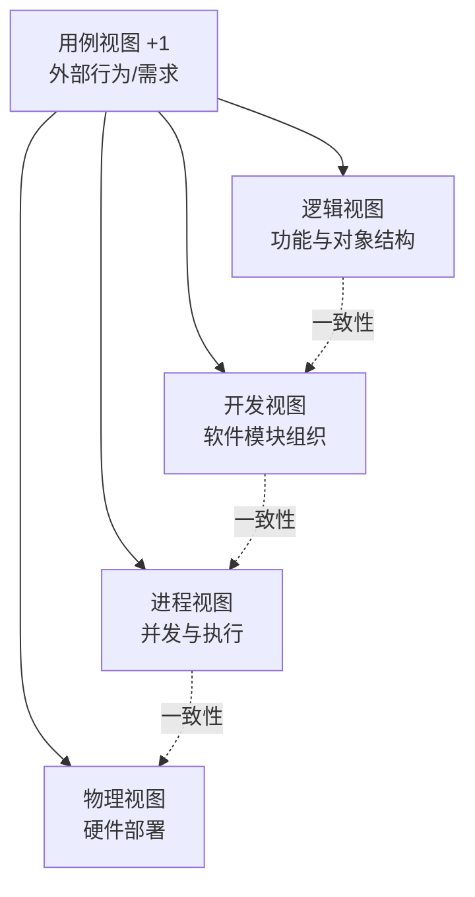

# 6.3 统一建模语言（UML）在软件工程中的应用

统一建模语言(UML)是面向对象软件工程（[[6.2 面向对象分析与设计（OOA-OOD）]]）的标准化建模语言，解决“如何用统一的图形语言表达面向对象分析与设计结果”的问题。本节介绍 UML 的发展与版本、图的分类体系、4+1 视图模型及其在软件工程各阶段的应用，作为面向对象建模的概览入口。UML 各图的深入绘制方法见[[MOC - 面向对象系统分析与建模|面向对象系统分析与建模]]课程。

## UML 概述

> [!definition] UML
> > 统一建模语言（Unified Modeling Language, UML）是对象管理组织(OMG)制定的面向对象建模的标准化语言，用一组图形符号描述软件系统的结构与行为，是面向对象分析与设计的主流表达工具。

### UML 发展历史

UML 由 Grady Booch、James Rumbaugh、Ivar Jacobson（“三友”）在 1990 年代整合各自方法（Booch 方法、OMT、OOSE）而成。主要版本演进：UML 1.0(1997) → UML 1.x → UML 2.0(2005) → UML 2.5(2015/2017)。UML 2.5 是当前广泛采用的版本，整合了语义与表示法。

> [!note] UML 2.5 的地位
> > UML 2.5 是 OMG 于 2015 年发布、2017 年更新的规范版本，将之前分散的规范整合为单一文档，明确了语义与表示法。本库以 UML 2.5 为准。UML 是建模语言而非方法——它规定“怎么画图”，不规定“怎么建模”，建模方法（如用例驱动、面向对象方法）需另行选择。

## UML 图的分类

UML 2.5 定义了 14 种图，分为结构图与行为图两大类：

### 结构图（7种）

结构图描述系统的静态结构：

| 图 | 描述 | 典型用途 |
| --- | --- | --- |
| 类图 | 类、属性、方法及类间关系 | 系统静态结构建模（最常用） |
| 对象图 | 某一时刻对象及关系的快照 | 验证类图、展示实例 |
| 组件图 | 组件及其依赖关系 | 系统模块组织 |
| 部署图 | 软件到硬件节点的部署 | 系统部署与物理架构 |
| 包图 | 包及其依赖关系 | 模块划分与层次组织 |
| 复合结构图 | 类内部的协作结构 | 复杂类的内部建模 |
| 轮廓图 | UML 扩展机制 | 特定领域建模定制 |

### 行为图（7种）

行为图描述系统的动态行为：

| 图 | 描述 | 典型用途 |
| --- | --- | --- |
| 用例图 | 参与者与用例的交互 | 需求建模、功能视图 |
| 活动图 | 活动流程与并发控制 | 业务流程、算法流程建模 |
| 状态机图 | 对象状态变迁 | 对象生命周期建模 |
| 时序图 | 对象间按时间顺序的消息交互 | 交互场景建模 |
| 通信图 | 对象间消息交互（强调结构） | 协作结构建模 |
| 定时图 | 对象状态随时间变化 | 实时系统时序约束 |
| 交互概览图 | 交互图概览 | 复杂交互组织 |

> [!note] 交互图
> > 时序图、通信图、定时图、交互概览图统称为交互图（Interaction Diagram），均描述对象间的交互，只是侧重点不同：时序图强调时间顺序，通信图强调结构关系，定时图强调时间约束，交互概览图用于组织多个交互。本课程主要使用时序图。

## 4+1 视图模型

> [!definition] 4+1 视图模型
> > 4+1 视图模型由 Philippe Kruchten 提出，从五个视角描述软件架构：逻辑视图、开发视图、进程视图、物理视图，以及驱动这四个视图的用例视图（“+1”），为不同利益相关方提供各自关心的架构视图。

| 视图 | 描述 | 面向角色 | 主要 UML 图 |
| --- | --- | --- | --- |
| 逻辑视图 | 系统的功能与对象结构 | 最终用户/分析师 | 类图、对象图 |
| 开发视图 | 软件模块的组织与依赖 | 程序员 | 组件图、包图 |
| 进程视图 | 并发任务与执行结构 | 系统集成者 | 活动图、时序图 |
| 物理视图 | 软件到硬件的部署 | 系统工程师 | 部署图 |
| 用例视图 | 系统外部行为与需求 | 用户/分析师 | 用例图 |

> [!note] “+1”的含义
> > 用例视图是“+1”视图，它描述系统对外的功能与行为，是其他四个视图的驱动源：逻辑视图实现用例的功能，开发视图组织实现用例的模块，进程视图处理用例的并发执行，物理视图部署承载用例的硬件。用例视图为四个视图提供一致性验证——所有视图最终都应支撑用例的实现。

## UML 在软件工程各阶段的应用

| 软件工程阶段 | UML 应用 | 主要图 |
| --- | --- | --- |
| 需求分析 | 描述参与者与系统功能 | 用例图、活动图 |
| 面向对象分析(OOA) | 建立问题域对象模型 | 类图、对象图 |
| 面向对象设计(OOD) | 细化设计模型、描述交互与状态 | 类图、时序图、状态机图、组件图 |
| 实现 | 指导编码 | 类图、组件图 |
| 测试 | 验证功能与交互 | 用例图、时序图 |
| 部署 | 描述部署方案 | 部署图 |

> [!tip] 阶段与图的对应
> > 用例图贯穿需求与测试阶段；类图贯穿分析与设计阶段；时序图与状态机图用于设计与测试阶段；组件图与部署图用于设计后期与部署阶段。并非每个项目都需绘制全部 14 种图，应根据项目特点选择核心图集——通常用例图、类图、时序图是必备的最小集。

## 与结构化方法的对比

| 维度 | 结构化方法 | UML 面向对象方法 |
| --- | --- | --- |
| 核心模型 | DFD/DD/ER、结构图 | 用例图、类图、时序图等 |
| 视角 | 面向数据流与功能 | 面向对象与交互 |
| 分析-设计过渡 | DFD→SC 需翻译 | OOA→OOD 无缝过渡 |
| 适用场景 | 功能驱动的数据处理系统 | 复杂业务、交互密集系统 |

> [!warning] 工具的选择
> > UML 是强大的建模工具，但建模的目的是沟通与理解，而非绘图本身。应选择能清晰表达设计意图的图，避免为“完整”而绘制低价值图。UML 与结构化方法并非互斥——在需求分析阶段可用 DFD 刻画数据流，在设计中用 UML 刻画对象结构。

## 小结

统一建模语言(UML)是面向对象建模的标准化语言，当前主流版本为 UML 2.5，定义了 14 种图，分为结构图（类、对象、组件、部署、包、复合结构、轮廓，共 7 种）与行为图（用例、活动、状态机、时序、通信、定时、交互概览，共 7 种）。4+1 视图模型从逻辑、开发、进程、物理四个视角加用例视角描述软件架构，为不同角色提供关心视图。UML 在软件工程的需求、分析、设计、实现、测试、部署各阶段各有侧重应用，是面向对象软件工程的核心表达工具。

## 关联

- 上一级：[[MOC - 第6章]]
- 上一节：[[6.2 面向对象分析与设计（OOA-OOD）]]
- 深化课程：[[MOC - 面向对象系统分析与建模|面向对象系统分析与建模]]（UML 各图的系统绘制方法与实践）
- 关联概念：[[3.2 需求分析与建模]]（用例建模是需求分析的核心）、[[5.1 结构化设计原理与结构图]]（结构化方法的 DFD/SC 对比）
