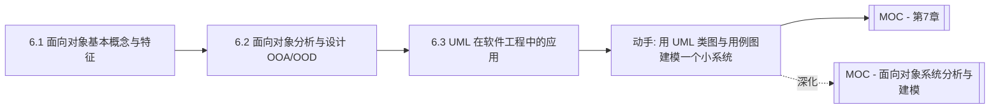

# MOC - 第6章 面向对象软件工程基础

> [!info] 本章定位
> 第6章介绍面向对象软件工程的基础方法体系，与第4-5章的结构化路线并列。面向对象方法解决的核心问题是：**如何用对象、类及其关系来建模现实世界，使软件结构与问题域结构一致，从而提升软件的可理解性、可复用性与可维护性**。本章覆盖面向对象基本概念与特征、面向对象分析与设计(OOA/OOD)方法、统一建模语言(UML)在软件工程中的应用，是连接[[3.2 需求分析与建模]]中用例建模与[[MOC - 面向对象系统分析与建模|面向对象系统分析与建模]]深化课程的桥梁。

## 学习路线图

## 知识点导航

| 节 | 主题 | 核心要点 | 入口 |
| --- | --- | --- | --- |
| 6.1 | 面向对象基本概念与特征 | 对象、类、封装、继承、多态、消息；类间关系 | [[6.1 面向对象基本概念与特征]] |
| 6.2 | 面向对象分析与设计(OOA/OOD) | OOA 五步骤、OOD 四部分、Coad/Yourdon 方法 | [[6.2 面向对象分析与设计（OOA-OOD）]] |
| 6.3 | UML 在软件工程中的应用 | UML 2.5 图分类、4+1 视图模型、各阶段应用 | [[6.3 统一建模语言（UML）在软件工程中的应用]] |

## 核心考点

> [!warning] 重点掌握
> 1. 面向对象的基本概念：对象、类、封装、继承、多态、消息。
> 2. 对象三要素：属性、方法、对象标识。
> 3. 类之间的五种关系：泛化、关联、聚合、组合、依赖，及其强弱。
> 4. 面向对象三大特征（封装、继承、多态）的含义与作用。
> 5. OOA 的五个活动与 OOD 的四个部分（Coad/Yourdon 方法）。
> 6. UML 的图分类：结构图（7种）与行为图（7种）。
> 7. 4+1 视图模型（逻辑、开发、进程、物理、用例视图）。
> 8. 面向对象方法与结构化方法的区别。

## 自测题

> [!question] 题1
> 说明封装、继承、多态的含义及其作用。
> > [!check]- 参考答案
> > 封装（Encapsulation）是把对象的属性和操作结合为一个整体，并隐藏内部实现细节，只通过公开接口与外部交互，作用是降低耦合、保护数据完整性。继承（Inheritance）是子类自动获得父类的属性和方法，并可在其基础上扩展或修改，作用是支持代码复用与建立类层次。多态（Polymorphism）是同一消息发送给不同对象时产生不同行为，通常通过方法重写与接口实现实现，作用是提高灵活性与可扩展性——新增子类不需修改调用方代码。

> [!question] 题2
> 区分聚合与组合这两种类间关系。
> > [!check]- 参考答案
> > 聚合（Aggregation）表示“整体-部分”的弱关系：部分可以脱离整体独立存在，整体不负责部分的生命周期。例如“班级”与“学生”——学生可以先于班级存在，也可以不属于任何班级。组合（Composition）表示“整体-部分”的强关系：部分与整体同生共死，整体负责部分的创建与销毁。例如“窗口”与“按钮”——按钮随窗口创建而创建、销毁而销毁，不能脱离窗口独立存在。组合是更强的聚合，生命周期耦合更紧。

> [!question] 题3
> 简述 Coad/Yourdon 方法中 OOA 的五个活动。
> > [!check]- 参考答案
> > Coad/Yourdon 方法的 OOA 包含五个活动：①识别对象——从问题域中找出候选对象（名词法）；②定义结构——建立对象间的分类结构（泛化）与组装结构（聚合/组合）；③定义主题——把相关对象归组为主题，便于组织大型模型；④定义属性和实例连接——为对象添加属性，并建立对象间的关联；⑤定义服务和消息连接——为对象添加操作（服务），并建立对象间的消息传递关系。这五步从对象识别到结构、属性、服务的逐步细化，形成完整的分析模型。

> [!question] 题4
> 说明 UML 的 4+1 视图模型。
> > [!check]- 参考答案
> > 4+1 视图模型从五个视角描述软件架构：①逻辑视图——描述系统的功能与对象结构，面向最终用户，用类图/对象图；②开发视图——描述软件模块的组织与依赖，面向程序员，用组件图/包图；③进程视图——描述并发与执行结构，面向系统集成者，用活动图/时序图；④物理视图——描述软件到硬件的部署，面向系统工程师，用部署图；⑤用例视图——描述系统外部行为与需求，面向用户与分析师，用用例图。“+1”指用例视图，它驱动其他四个视图并为它们提供一致性验证。

## 章节导航

- 上一级：[[MOC - 软件工程]]
- 上一章：[[MOC - 第5章]]
- 下一章：[[MOC - 第7章]]
- 深化课程：[[MOC - 面向对象系统分析与建模]]
