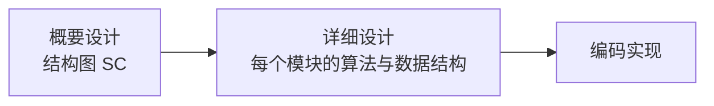
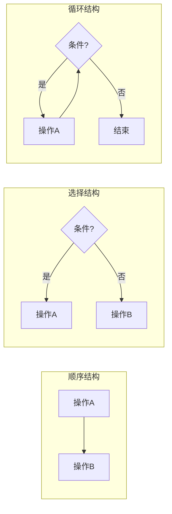
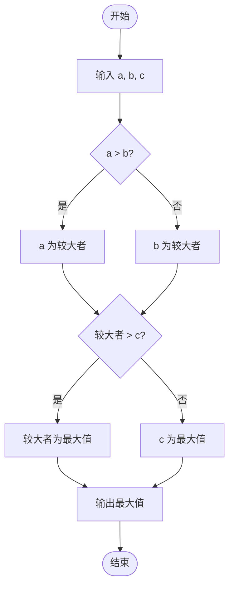
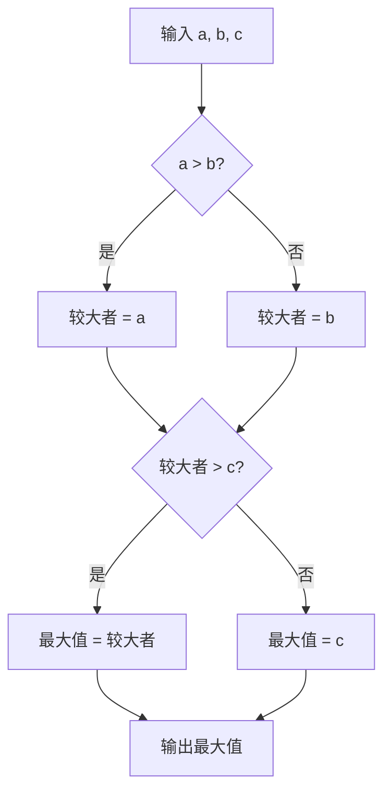

# 7.1 详细设计工具与方法

详细设计是结构化设计（[[5.1 结构化设计原理与结构图]]）之后、编码之前的阶段，解决“每个模块内部具体怎么实现”的问题。本节阐明详细设计的任务、三种基本控制结构，以及四种主要设计工具（程序流程图、N-S 图、PAD 图、伪代码）的符号规范与优劣对比，为编写详细设计文档（[[7.3 详细设计文档与评审]]）提供工具基础。

## 详细设计任务

> [!definition] 详细设计
> > 详细设计（Detailed Design）是在概要设计确定了模块结构后，为每个模块设计具体的算法和数据结构，并用规范的方式详细描述，使程序员能直接据此编码实现。详细设计的产物是详细设计说明书。



> [!note] 概要设计与详细设计的分工
> > 概要设计（[[5.1 结构化设计原理与结构图|结构化设计]]）确定系统由哪些模块组成、模块间如何调用——回答“系统怎么分”。详细设计确定每个模块内部怎么做——回答“模块内部怎么实现”。前者是模块级，后者是算法级。详细设计不是重新设计模块结构，而是在已有模块内设计算法与数据结构。

## 三种基本控制结构

结构化程序设计基于三种基本控制结构，任意算法都可用它们组合表达：

| 控制结构 | 含义 | 特点 |
| --- | --- | --- |
| 顺序结构 | 按先后顺序依次执行各操作 | 最基本的结构 |
| 选择结构 | 根据条件判断选择执行某一分支 | IF-THEN-ELSE 或 CASE |
| 循环结构 | 在条件满足时重复执行某操作 | WHILE 或 UNTIL |



> [!warning] 单入口单出口原则
> > 三种基本控制结构都满足“一个入口、一个出口”的原则。结构化程序设计禁止使用 goto 随意跳转，保证程序的控制流清晰可读。Bohm-Jacopini 定理已证明：任意复杂程序都可用顺序、选择、循环三种结构表达，无需 goto。

## 详细设计工具

### 程序流程图（PFC）

> [!definition] 程序流程图
> > 程序流程图（Program Flow Chart, PFC）用图形符号表示程序的操作步骤与控制流，是最常用的详细设计工具。

#### 流程图符号规范

| 符号 | 形状 | 含义 |
| --- | --- | --- |
| 矩形 | ▭ | 处理/操作 |
| 菱形 | ◇ | 判断/条件 |
| 椭圆 | ○ | 起止 |
| 平行四边形 | ▱ | 输入/输出 |
| 箭头 | → | 控制流方向 |

> [!warning] 流程图的局限
> > 程序流程图灵活但过于自由，画法上允许箭头任意跳转，容易违背结构化原则（如用 goto 连接远处的框）。使用流程图时应自觉遵循三种基本控制结构，避免随意跳转。

### N-S 图（盒图）

> [!definition] N-S 图
> > N-S 图（Nassi-Shneiderman Chart，盒图）是一种强制结构化的详细设计工具，用嵌套的盒子表示三种基本控制结构，不允许随意跳转。

N-S 图的基本元素：

| 结构 | N-S 图表示 |
| --- | --- |
| 顺序 | 上下堆叠的矩形盒 |
| 选择 | 条件盒内分左右两栏 |
| 循环 | 条件框包围重复执行盒 |

> [!note] N-S 图的优势
> > N-S 图强制使用三种基本控制结构，无法表示 goto 跳转，从工具层面保证了结构化。嵌套层次一目了然，便于检查嵌套深度。缺点是修改不便（需重画整个盒子），且图过大时难以阅读。

### PAD 图

> [!definition] PAD 图
> > PAD 图（Problem Analysis Diagram，问题分析图）用树形结构表示程序逻辑，支持逐步求精，易转化为代码。

PAD 图的基本元素：

| 结构 | PAD 图表示 |
| --- | --- |
| 顺序 | 纵向顺序的方框 |
| 选择 | 条件下方分出选择分支 |
| 循环 | 循环条件框包围重复体 |

> [!tip] PAD 图的优势
> > PAD 图是树形结构，从上到下、从左到右展开，最符合“逐步求精”的设计思路，且易转化为程序代码（按树遍历即可）。它是三种图形工具中最受推荐的一种。

### 伪代码（PDL）

> [!definition] 伪代码
> > 伪代码（Program Design Language, PDL，过程设计语言）用类似自然语言的描述表达算法逻辑，使用顺序、选择、循环结构，介于自然语言与程序设计语言之间。

```text
PDL 示例（借阅处理）:
PROCEDURE 借阅处理(借阅请求)
    读取读者证号，验证读者身份
    IF 读者不存在 THEN
        输出 "借阅失败：读者不存在"
    ELSE
        读取图书编号，查询图书库存
        IF 可借数 > 0 THEN
            可借数 = 可借数 - 1
            写入借阅记录
            输出 "借阅成功"
        ELSE
            输出 "借阅失败：库存不足"
        END IF
    END IF
END PROCEDURE
```

> [!note] PDL 的特点
> > PDL 用文字而非图形表达算法，编写快、易修改、易转化为代码，适合描述较复杂的逻辑。缺点是不如图形直观，嵌套层次不如 N-S/PAD 图清晰。PDL 常与图形工具配合使用——图形给概览，PDL 给细节。

## 四种工具的对比

| 工具 | 优点 | 缺点 | 适用场景 |
| --- | --- | --- | --- |
| 程序流程图(PFC) | 直观、灵活、易画 | 控制流随意，易违背结构化 | 简单流程、教学演示 |
| N-S 图(盒图) | 强制结构化，嵌套清晰 | 修改不便，大图难读 | 强调结构化的模块设计 |
| PAD 图 | 支持逐步求精，易转代码 | 不如流程图直观 | 复杂算法、逐步求精设计 |
| 伪代码(PDL) | 编写快、易修改、易转代码 | 不直观，嵌套不直观 | 复杂逻辑、文档化算法 |

## 三种工具对比示例（求最大值）

以“从三个数中找最大值”为例，对比三种图形工具的等价表达：

### 程序流程图



### PAD 图（近似表达）



> [!note] 图示说明
> > 上述流程图与 PAD 图表达相同的“求最大值”算法。N-S 图无法直接用 Mermaid 绘制，但其逻辑等价——用嵌套的判断盒表示。三种工具可互相转换，选择取决于团队习惯与模块特点。

## 小结

详细设计的任务是为每个模块设计算法与数据结构并规范记录，使程序员可据此编码。结构化程序设计基于顺序、选择、循环三种基本控制结构，满足单入口单出口原则。四种主要设计工具各有优劣：程序流程图直观但易违背结构化，N-S 图强制结构化但修改不便，PAD 图支持逐步求精且易转代码，伪代码编写快但不直观。实际中常根据模块特点组合使用。

## 关联

- 上一级：[[MOC - 第7章]]
- 下一节：[[7.2 人机界面设计]]
- 关联概念：[[5.1 结构化设计原理与结构图]]（概要设计确定模块结构，详细设计填充模块内部）、[[7.3 详细设计文档与评审]]（详细设计工具的产物纳入设计说明书）
