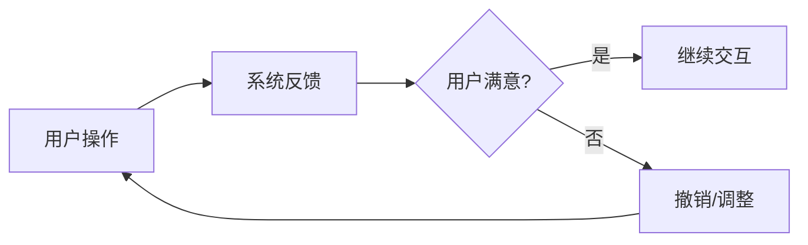
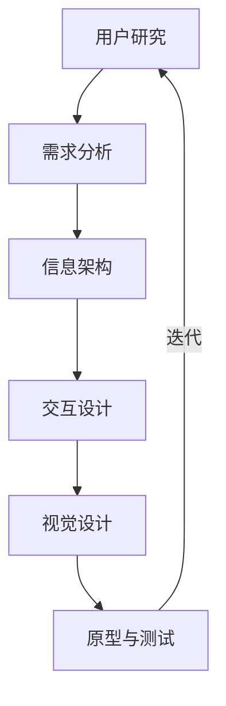

# 7.2 人机界面设计

人机界面（用户界面）是用户与软件交互的桥梁。一个功能正确但界面难用的软件仍会被用户拒绝。本节阐明人机界面设计的原则、界面类型、评估方法与用户体验(UX)基础，为[[7.3 详细设计文档与评审]]中的界面设计部分提供指导。

## 人机界面设计原则

> [!definition] 人机界面设计
> > 人机界面设计（Human-Computer Interface Design）是设计软件与用户交互的方式与外观，目标是让用户高效、有效、满意地使用软件完成目标任务。

人机界面设计的核心原则：

| 原则 | 含义 | 示例 |
| --- | --- | --- |
| 一致性 | 相似操作有相似交互方式，降低学习成本 | 所有表单的“保存”按钮都在右下角 |
| 反馈 | 用户操作后系统及时给出反馈 | 点击按钮后显示加载状态 |
| 撤销 | 提供撤销机制，允许纠正误操作 | 删除后可从回收站恢复 |
| 简化 | 减少不必要的步骤与信息 | 一键登录而非反复输入 |
| 用户控制 | 用户主动控制交互节奏，可中断/取消 | 长时间操作可随时取消 |

> [!warning] 易被忽视的原则
> > 一致性与反馈是最常被违反的原则：不同页面的按钮位置不一致让用户困惑；操作后无反馈让用户以为系统无响应。撤销机制能显著降低用户操作焦虑，是“宽容性”设计的体现。用户控制原则要求系统不强迫用户——例如不自动跳转、不阻止用户退出。

## 界面设计类型

| 类型 | 特点 | 适用场景 |
| --- | --- | --- |
| 菜单界面 | 列出可选功能供用户选择 | 功能较多的应用系统 |
| 表单界面 | 用输入框、选择框收集用户数据 | 数据录入、信息提交 |
| 命令行界面 | 用户输入文本命令 | 开发工具、运维操作 |
| 对话框界面 | 弹出窗口提示或收集信息 | 确认、提示、设置 |

> [!note] 界面类型的选择
> > 界面类型应根据用户特点与任务选择：菜单适合功能探索，表单适合结构化数据录入，命令行适合专业用户高效操作，对话框适合临时交互。现代系统通常组合多种界面类型——主界面用菜单导航，数据录入用表单，关键操作用对话框确认。

## 界面设计评估方法

> [!definition] 界面评估
> > 界面评估（Interface Evaluation）是通过系统化方法检查界面设计的可用性，发现可用性问题并改进。评估贯穿设计过程，而非仅在完成后进行。

| 方法 | 含义 | 适用阶段 |
| --- | --- | --- |
| 启发式评估 | 专家依据可用性原则检查界面 | 设计早期、原型阶段 |
| 认知走查 | 模拟用户完成任务的过程检查障碍 | 设计中期 |
| 用户测试 | 邀请真实用户使用界面并观察 | 设计后期、原型可交互时 |
| 问卷调查 | 收集用户主观评价与反馈 | 上线后、迭代改进 |

> [!tip] 尼尔森十大可用性启发
> > 启发式评估常用 Jakob Nielsen 的十大可用性原则：系统状态可见性、系统与现实世界匹配、用户控制与自由、一致性与标准、防错、识别而非回忆、灵活与高效、美学与极简设计、错误恢复、帮助与文档。这些原则是界面评审的检查清单。

## 用户体验(UX)设计基础

> [!definition] 用户体验
> > 用户体验（User Experience, UX）是用户在使用产品过程中建立的主观感受与整体体验，涵盖可用性、功能性、情感等多个维度。用户体验设计(UX Design)以用户为中心，综合考量用户需求、行为与情境来设计产品。

> [!note] UI 与 UX 的关系
> > UI（用户界面）关注界面的外观与交互细节；UX（用户体验）关注用户使用产品的整体感受，范围更广——包含 UI 但不限于 UI。UX 设计从用户研究开始，经过信息架构、交互设计、视觉设计、原型测试的迭代，确保产品既好用又令人满意。

## 小结

人机界面设计遵循一致性、反馈、撤销、简化、用户控制五项原则，目标是让用户高效、有效、满意地使用软件。界面类型包括菜单、表单、命令行、对话框，应根据用户特点与任务组合使用。界面评估方法有启发式评估、认知走查、用户测试与问卷调查，应贯穿设计过程。用户体验(UX)设计以用户为中心，涵盖从用户研究到视觉设计的迭代过程，是界面设计的更高层次框架。

## 关联

- 上一级：[[MOC - 第7章]]
- 上一节：[[7.1 详细设计工具与方法]]
- 下一节：[[7.3 详细设计文档与评审]]
- 关联概念：[[6.2 面向对象分析与设计（OOA-OOD）]]（OOD 的人机交互部分 HIC）、[[MOC - 面向对象系统分析与建模|面向对象系统分析与建模]]（用例建模驱动界面设计的需求）
