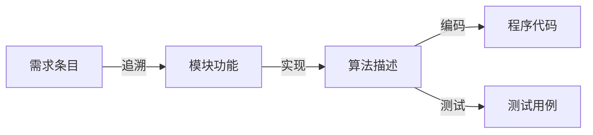
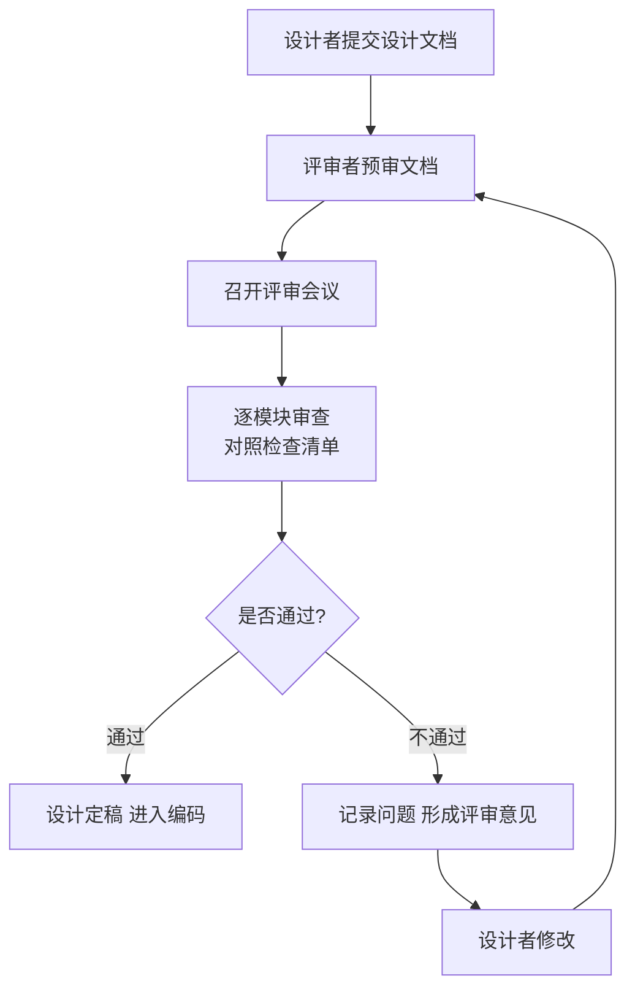

# 7.3 详细设计文档与评审

详细设计工具（[[7.1 详细设计工具与方法]]）产出的算法与数据结构需要固化为正式文档并进行评审，才能作为编码的可靠依据。本节阐明详细设计说明书的内容结构、接口/数据/算法的描述规范、设计评审的检查清单与流程，为从设计到编码的过渡提供文档与质量保障。

## 详细设计说明书

> [!definition] 详细设计说明书
> > 详细设计说明书（Detailed Design Document, SDD）是详细设计阶段的文档产物，详细描述每个模块的算法、数据结构与接口，是程序员编码实现的直接依据。

### 详细设计说明书内容结构

```markdown
# 详细设计说明书 — <系统名称>

## 1. 引言
### 1.1 编写目的
### 1.2 范围
### 1.3 定义与缩略语
### 1.4 参考文献

## 2. 程序系统的组织结构
### 2.1 模块层次结构（结构图）
### 2.2 模块调用关系
### 2.3 模块清单

## 3. 模块设计说明（每个模块）
### 3.x 模块 <模块名>
#### 3.x.1 模块功能
#### 3.x.2 接口描述（输入/输出参数、调用关系）
#### 3.x.3 数据结构设计
#### 3.x.4 算法描述（流程图/PDL）
#### 3.x.5 数据存取方式

## 4. 接口设计描述
### 4.1 模块间接口
### 4.2 外部接口（用户接口、硬件接口、软件接口）

## 5. 数据结构设计
### 5.1 全局数据结构
### 5.2 局部数据结构

## 6. 附录
```

> [!note] 文档结构说明
> > 上述结构以“模块设计说明”为核心——每个模块单独描述其功能、接口、数据结构与算法。第2章的组织结构来自概要设计的结构图（[[5.1 结构化设计原理与结构图|SC]]），第3章填充每个模块的内部设计。接口与数据结构可在模块说明中体现，也可单独成章汇总。

## 接口设计描述

> [!definition] 接口设计
> > 接口设计描述模块之间、系统与外部之间的交互方式，包括输入输出参数、调用关系、数据格式与通信协议。

接口描述应包含：

| 要素 | 说明 | 示例 |
| --- | --- | --- |
| 接口名 | 接口的标识 | 借阅处理接口 |
| 调用方/被调用方 | 谁调用谁 | 主模块调用借阅处理模块 |
| 输入参数 | 参数名、类型、含义 | 读者证号(String), 图书编号(String) |
| 输出参数/返回值 | 返回值类型与含义 | 借阅结果(String) |
| 异常/错误码 | 可能的错误及含义 | E001=读者不存在 |

> [!warning] 接口描述的完整性
> > 接口是模块协作的契约，描述必须完整、无歧义。每个参数应注明类型、取值范围与含义；返回值应覆盖所有可能情况（含错误码）。不完整的接口描述是编码阶段返工的主要原因之一。

## 数据结构设计

数据结构设计分为全局与局部两个层次：

| 层次 | 范围 | 说明 |
| --- | --- | --- |
| 全局数据结构 | 多个模块共享 | 如全局配置、共享缓存，需明确访问控制 |
| 局部数据结构 | 单个模块内部 | 如模块内部的临时变量、栈、队列 |

> [!tip] 数据结构设计要点
> > 数据结构设计应与算法描述配合——算法的操作对象就是数据结构。每个模块的局部数据结构应在模块设计说明中描述；全局数据结构应单独汇总，并说明哪些模块访问它。数据结构的选择影响算法效率，需结合算法复杂度权衡。

## 算法描述规范

算法描述是详细设计的核心，应满足：

- **确定性**：每一步操作明确无歧义。
- **完整性**：覆盖所有输入情况（含边界与异常）。
- **可读性**：便于程序员理解与转化。
- **可追踪性**：算法应能追溯到需求与设计决策。



> [!note] 算法描述工具的选择
> > 算法描述可用流程图、N-S 图、PAD 图或伪代码（详见[[7.1 详细设计工具与方法]]）。文档中常以伪代码(PDL)为主、辅以关键流程图——PDL 便于书写与修改，流程图提供直观概览。无论用哪种工具，都应保证逻辑完整、可被程序员直接实现。

## 设计评审

> [!definition] 设计评审
> > 设计评审（Design Review）是由开发团队、设计者与相关方共同对详细设计进行正式审查的活动，目的是在编码前发现设计缺陷，确保设计质量。

### 设计评审检查清单

| 评审项 | 检查内容 |
| --- | --- |
| 正确性 | 算法是否正确实现模块功能？是否覆盖所有情况？ |
| 接口完整性 | 接口参数、返回值、错误码是否完整描述？ |
| 数据结构 | 数据结构是否合理？是否与算法匹配？ |
| 结构化 | 是否遵循三种基本控制结构？有无随意跳转？ |
| 模块独立性 | 模块内聚是否高？耦合是否低？（见[[5.2 模块内聚与耦合]]） |
| 可读性 | 算法描述是否清晰易懂？命名是否规范？ |
| 可追踪性 | 每个设计是否能追溯到需求？ |
| 性能 | 算法复杂度是否满足性能需求？ |
| 异常处理 | 是否处理边界与异常情况？ |

### 设计评审流程



> [!tip] 评审的价值
> > 设计评审在编码前发现缺陷，修复成本远低于编码后甚至测试后发现。评审应聚焦设计质量而非风格争论，由独立于设计者的评审者参与以获得客观视角。评审记录应作为项目文档留存，用于追踪设计决策与改进。

## 小结

详细设计说明书是详细设计阶段的文档产物，核心是每个模块的设计说明（功能、接口、数据结构、算法）。接口描述需完整说明参数、返回值与错误码；数据结构设计分全局与局部两层；算法描述需满足确定性、完整性、可读性与可追踪性。设计评审通过检查清单系统审查正确性、接口、结构化、独立性等维度，在编码前发现缺陷，是质量保障的关键环节。

## 关联

- 上一级：[[MOC - 第7章]]
- 上一节：[[7.2 人机界面设计]]
- 关联概念：[[7.1 详细设计工具与方法]]（算法描述工具的详细对比）、[[3.3 需求规格说明与需求验证]]（SRS 是详细设计的输入依据）、[[5.2 模块内聚与耦合]]（评审模块独立性的依据）
